# Yuruicamp 資料庫 ER 圖與欄位說明

> 來源：依目前 `data/`、`booking/data/`、`admin/data/` JSON mock data 推導。  
> 說明：目前專案不是 SQL 資料庫，JSON 內嵌陣列在此文件中以正規化資料表呈現，方便後續轉成關聯式資料庫。

## ER 圖

```mermaid
erDiagram
  USERS ||--o{ ORDERS : places
  ORDERS ||--o{ ORDER_ITEMS : contains
  PRODUCTS ||--o{ ORDER_ITEMS : sold_as
  USERS ||--o{ RENTAL_ORDERS : places
  RENTAL_ORDERS ||--o{ RENTAL_ORDER_ITEMS : contains
  RENTAL_EQUIPMENT ||--o{ RENTAL_ORDER_ITEMS : rented_as
  USERS ||--o{ USER_COUPONS : owns
  USERS ||--o{ USER_NOTIFICATIONS : receives
  ARTICLES ||--o{ ARTICLE_CONTENT_BLOCKS : contains
  ARTICLES ||--o{ ARTICLE_RELATED_PRODUCTS : recommends
  PRODUCTS ||--o{ ARTICLE_RELATED_PRODUCTS : appears_in
  BRANCHES ||--o{ BRANCH_FEATURES : has

  CAMPGROUNDS ||--o{ CAMPGROUND_ZONES : has
  CAMPGROUNDS ||--o{ BOOKING_RENTALS : offers
  CUSTOMERS ||--o{ BOOKINGS : creates
  CAMPGROUNDS ||--o{ BOOKINGS : booked_for
  BOOKINGS ||--o{ BOOKING_SELECTED_ZONES : reserves
  CAMPGROUND_ZONES ||--o{ BOOKING_SELECTED_ZONES : reserved_as
  BOOKINGS ||--o{ BOOKING_SELECTED_RENTALS : rents
  BOOKING_RENTALS ||--o{ BOOKING_SELECTED_RENTALS : selected_as

  ADMIN_PRODUCTS ||--o{ ADMIN_PRODUCT_BRANCH_STOCKS : stocked_at
  ADMIN_RENTALS ||--o{ ADMIN_RENTAL_CAMP_STOCKS : stocked_at
  ADMIN_PRODUCTS ||--o{ ADMIN_MIN_STOCKS : controls
  ADMIN_RENTALS ||--o{ ADMIN_MIN_STOCKS : controls
  ADMIN_ORDERS ||--o{ ADMIN_ORDER_ITEMS : contains
  ADMIN_ORDERS ||--o{ ADMIN_ORDER_HISTORY : tracks
  ADMIN_MOVEMENTS ||--o{ ADMIN_MOVEMENT_ITEMS : contains
  ADMIN_PRODUCTS ||--o{ ADMIN_REVIEWS : reviewed_by_name
```

## 前台商城

### USERS
來源：`data/users.json`。

| 欄位 | Key | 意義 |
| --- | --- | --- |
| 使用者 ID | `id` | **PK**。會員唯一識別碼，例如 `user-001`。 |
| 姓名 | `name` | 顯示在會員中心與登入狀態的會員名稱。 |
| Email | `email` | 登入與通知識別用信箱；應設唯一索引。 |
| 密碼 | `password` | mock 登入用；正式 DB 應改存雜湊。 |
| 電話 | `phone` | 結帳與會員資料聯絡電話。 |
| 地址 | `address` | 預設配送地址。 |
| 頭像 | `avatar` | 會員頭像 URL 或空值。 |
| 等級代碼 | `tier` | 會員等級程式代碼。 |
| 等級名稱 | `tierName` | 會員等級顯示文字。 |
| 累積消費 | `totalSpend` | 會員累積消費金額。 |
| 下一級門檻 | `nextTierSpend` | 計算升等進度用金額。 |
| 加入日期 | `joinDate` | 會員建立日期。 |
| 點數 | `points` | 會員回饋點數餘額。 |
| 偏好 | `preferences` | 會員風格與裝備偏好；正規化時可拆成 user_preferences。 |

PK：`USERS.id`。  
FK：被 `ORDERS.userId`、`RENTAL_ORDERS.userId`、`USER_COUPONS.userId`、`USER_NOTIFICATIONS.userId` 參照。

### USER_COUPONS
來源：`data/users.json > coupons[]`。

| 欄位 | Key | 意義 |
| --- | --- | --- |
| 折價券 ID | `id` | **PK**。會員持有折價券唯一識別碼。 |
| 使用者 ID | `userId` | **FK → USERS.id**。表示折價券屬於哪位會員。 |
| 折扣碼 | `code` | 結帳輸入與套用的 coupon code。 |
| 折扣值 | `discount` | 固定金額或百分比數值。 |
| 折扣類型 | `type` | `fixed` 表固定金額，`percent` 表百分比。 |
| 低消 | `minOrder` | 可使用此券的最低訂單金額。 |
| 到期日 | `expiry` | 折價券有效期限。 |
| 是否使用 | `used` | 判斷折價券是否已使用或失效。 |

PK：`USER_COUPONS.id`。  
FK：`USER_COUPONS.userId` 連到 `USERS.id`。

### USER_NOTIFICATIONS
來源：`data/users.json > notifications[]`。

| 欄位 | Key | 意義 |
| --- | --- | --- |
| 通知 ID | `id` | **PK**。通知唯一識別碼。 |
| 使用者 ID | `userId` | **FK → USERS.id**。表示通知接收者。 |
| 類型 | `type` | 通知類別，例如 order、promo、system。 |
| 圖示 | `icon` | 前端顯示用 icon。 |
| 標題 | `title` | 通知標題。 |
| 內容 | `message` | 通知正文。 |
| 時間 | `time` | 通知建立或顯示時間。 |
| 已讀 | `read` | 控制未讀數與通知樣式。 |

PK：`USER_NOTIFICATIONS.id`。  
FK：`USER_NOTIFICATIONS.userId` 連到 `USERS.id`。

### PRODUCTS
來源：`data/products.json`。

| 欄位 | Key | 意義 |
| --- | --- | --- |
| 商品 ID | `id` | **PK**。商品唯一識別碼，例如 `prod-001`。 |
| 名稱 | `name` | 商品顯示名稱。 |
| 分類 | `category` | 商品分類篩選依據。 |
| 興趣標籤 | `interest_tags` | 與個人化問卷偏好對應。 |
| 品牌 | `brand` | 商品品牌。 |
| 售價 | `price` | 商品實售價格。 |
| 原價 | `originalPrice` | 顯示折扣與刪除線用原價。 |
| 主圖 | `image` | 商品列表主要圖片。 |
| 圖片組 | `images` | 商品詳情 gallery 圖片。 |
| 描述 | `description` | 商品詳細說明。 |
| 規格 | `specifications` | 商品規格 key-value；可拆 `PRODUCT_SPECIFICATIONS`。 |
| 顏色 | `colors` | 可選顏色。 |
| 庫存 | `stock` | 前台商品庫存數。 |
| 評分 | `rating` | 商品平均評分。 |
| 評論數 | `reviews` | 商品評論總數。 |
| 新品 | `isNew` | 首頁新品區判斷。 |
| 熱賣 | `isBestSeller` | 首頁熱賣區判斷。 |
| 標籤 | `tags` | 商品特色與文章推薦顯示用標籤。 |

PK：`PRODUCTS.id`。  
FK：被 `ORDER_ITEMS.productId`、`ARTICLE_RELATED_PRODUCTS.productId` 參照。

### ORDERS
來源：`data/orders.json`。

| 欄位 | Key | 意義 |
| --- | --- | --- |
| 訂單 ID | `id` | **PK**。訂單內部唯一識別碼。 |
| 使用者 ID | `userId` | **FK → USERS.id**。表示下單會員。 |
| 訂單編號 | `orderNumber` | 給會員與通知顯示的人類可讀編號。 |
| 商品小計 | `subtotal` | 未含運費、折扣前商品金額。 |
| 回饋點數 | `points` | 此訂單產生點數。 |
| 運費 | `shippingFee` | 訂單運費。 |
| 折扣 | `discount` | 訂單折抵金額。 |
| 總金額 | `total` | 最終付款金額。 |
| 訂單狀態 | `status` | delivered、shipped、returned 等流程狀態。 |
| 付款狀態 | `paymentStatus` | paid、unpaid 等付款狀態。 |
| 配送方式 | `shippingMethod` | delivery、pickup 等配送方式。 |
| 配送地址 | `shippingAddress` | 宅配地址。 |
| 付款方式 | `payment` | credit-card、line-pay、cod 等。 |
| 備註 | `userNote` | 買家備註。 |
| 建立時間 | `createdAt` | 訂單建立日期。 |
| 送達時間 | `deliveredAt` | 送達日期，可空。 |
| 物流號碼 | `trackingNumber` | 物流追蹤碼。 |
| 可評論 | `canReview` | 控制會員是否可留下評論。 |
| 已評論 | `reviewed` | 控制評論按鈕狀態。 |

PK：`ORDERS.id`。  
FK：`ORDERS.userId` 連到 `USERS.id`。

### ORDER_ITEMS
來源：`data/orders.json > items[]`。

| 欄位 | Key | 意義 |
| --- | --- | --- |
| 訂單明細 ID | `id` | **PK**。建議由 `orderId + productId + sequence` 產生。 |
| 訂單 ID | `orderId` | **FK → ORDERS.id**。表示明細屬於哪張訂單。 |
| 商品 ID | `productId` | **FK → PRODUCTS.id**。表示購買哪個商品。 |
| 商品名稱快照 | `name` | 下單當下商品名稱快照。 |
| 單價快照 | `price` | 下單當下售價。 |
| 數量 | `quantity` | 購買數量。 |
| 圖片快照 | `image` | 下單當下商品圖。 |

PK：`ORDER_ITEMS.id`。  
FK：`ORDER_ITEMS.orderId` 連到 `ORDERS.id`；`ORDER_ITEMS.productId` 連到 `PRODUCTS.id`。

### RENTAL_ORDERS
來源：`data/rentalOrders.json`。

| 欄位 | Key | 意義 |
| --- | --- | --- |
| 租借訂單 ID | `id` | **PK**。租借訂單唯一識別碼。 |
| 使用者 ID | `userId` | **FK → USERS.id**。表示租借會員。 |
| 訂單編號 | `orderNumber` | 顯示用租借訂單編號。 |
| 小計 | `subtotal` | 租借品項小計。 |
| 押金 | `deposit` | 租借押金。 |
| 總金額 | `total` | 小計加押金後金額。 |
| 狀態 | `status` | completed、pending、cancelled 等。 |
| 付款狀態 | `paymentStatus` | paid、refunded 等。 |
| 建立日期 | `createdAt` | 租借訂單建立時間。 |
| 租借開始 | `rentalStart` | 租借開始日期。 |
| 租借結束 | `rentalEnd` | 租借歸還日期。 |
| 取貨店 | `pickupStore` | 取貨門市。 |
| 歸還店 | `returnStore` | 歸還門市。 |
| 付款方式 | `payment` | 租借付款方式。 |

PK：`RENTAL_ORDERS.id`。  
FK：`RENTAL_ORDERS.userId` 連到 `USERS.id`。

### RENTAL_ORDER_ITEMS
來源：`data/rentalOrders.json > items[]`。

| 欄位 | Key | 意義 |
| --- | --- | --- |
| 租借明細 ID | `id` | **PK**。建議由 `rentalOrderId + productId + sequence` 產生。 |
| 租借訂單 ID | `rentalOrderId` | **FK → RENTAL_ORDERS.id**。 |
| 租借商品 ID | `productId` | **FK → RENTAL_EQUIPMENT.equipment_id / ADMIN_RENTALS.id**。目前 mock 使用 `rent-001`，需與租借品主檔統一。 |
| 名稱快照 | `name` | 下單當下租借品名稱。 |
| 單價快照 | `price` | 下單當下租借單價。 |
| 數量 | `quantity` | 租借數量。 |
| 圖片快照 | `image` | 租借品圖片。 |

PK：`RENTAL_ORDER_ITEMS.id`。  
FK：`RENTAL_ORDER_ITEMS.rentalOrderId` 連到 `RENTAL_ORDERS.id`；`RENTAL_ORDER_ITEMS.productId` 建議統一連到租借品主檔。

### ARTICLES
來源：`data/articles.json`。

| 欄位 | Key | 意義 |
| --- | --- | --- |
| 文章 ID | `id` | **PK**。文章唯一識別碼。 |
| 標題 | `title` | 文章標題。 |
| 分類 | `category` | 部落格分類篩選依據。 |
| 作者 | `author` | 作者名稱。 |
| 作者頭像 | `authorAvatar` | 作者頭像 URL。 |
| 發布日期 | `publishedDate` | 文章發布日期。 |
| 閱讀時間 | `readTime` | 預估閱讀分鐘數。 |
| 主圖 | `image` | 文章 banner 圖。 |
| 摘要 | `excerpt` | 列表卡片摘要。 |
| 標籤 | `tags` | 文章標籤。 |
| 精選 | `isFeatured` | 是否為首頁精選文章。 |

PK：`ARTICLES.id`。  
FK：被 `ARTICLE_CONTENT_BLOCKS.articleId`、`ARTICLE_RELATED_PRODUCTS.articleId` 參照。

### ARTICLE_CONTENT_BLOCKS
來源：`data/articles.json > content[]`。

| 欄位 | Key | 意義 |
| --- | --- | --- |
| 內容區塊 ID | `id` | **PK**。建議由 `articleId + sortOrder` 產生。 |
| 文章 ID | `articleId` | **FK → ARTICLES.id**。 |
| 排序 | `sortOrder` | 保留文章段落順序。 |
| 類型 | `type` | text、heading、product。 |
| 文字內容 | `value` | text / heading 顯示文字。 |
| 商品 ID | `productId` | **FK → PRODUCTS.id**。type 為 product 時使用。 |

PK：`ARTICLE_CONTENT_BLOCKS.id`。  
FK：`articleId` 連到 `ARTICLES.id`；`productId` 連到 `PRODUCTS.id`。

### ARTICLE_RELATED_PRODUCTS
來源：`data/articles.json > relatedProducts[]`。

| 欄位 | Key | 意義 |
| --- | --- | --- |
| 關聯 ID | `id` | **PK**。建議由 `articleId + productId` 組成。 |
| 文章 ID | `articleId` | **FK → ARTICLES.id**。 |
| 商品 ID | `productId` | **FK → PRODUCTS.id**。 |

PK：`ARTICLE_RELATED_PRODUCTS.id`。  
FK：`articleId` 連到 `ARTICLES.id`；`productId` 連到 `PRODUCTS.id`。

### BRANCHES 與 BRANCH_FEATURES
來源：`data/branches.json`。

BRANCHES 欄位：`id` **PK**、`name` 店名、`address` 地址、`phone` 電話、`hours` 營業時間、`image` 門市圖、`latitude` 緯度、`longitude` 經度、`mapQuery` 地圖查詢字串、`description` 門市介紹。  
BRANCH_FEATURES 欄位：`id` **PK**、`branchId` **FK → BRANCHES.id**、`feature` 門市特色文字。

## Booking 預約系統

### CAMPGROUNDS
來源：`booking/data/campgrounds.json`。

| 欄位 | Key | 意義 |
| --- | --- | --- |
| 營區 ID | `campground_id` | **PK**。營區唯一識別碼。 |
| 名稱 | `name` | 營區名稱。 |
| 地區 | `region` | 北部、中部等搜尋篩選區域。 |
| 描述 | `description` | 營區介紹。 |
| 環境標籤 | `environment_tags` | 高海拔、森林系等環境屬性；可拆 tag 表。 |
| 設施標籤 | `facility_tags` | 獨立衛浴、裝備租借等設施屬性；可拆 tag 表。 |

PK：`CAMPGROUNDS.campground_id`。  
FK：被 `CAMPGROUND_ZONES.campground_id`、`BOOKING_RENTALS.campground_id`、`BOOKINGS.campground_id` 參照。

### CAMPGROUND_ZONES
來源：`booking/data/campgrounds.json > zones[]`。

欄位：`zone_id` **PK**、`campground_id` **FK → CAMPGROUNDS.campground_id**、`type` 區域類型、`capacity_per_site` 每帳人數、`price_weekday` 平日價、`price_holiday` 假日價、`total_sites` 可訂營位數。

### BOOKING_RENTALS
來源：`booking/data/rentals.json`。

欄位：`equipment_id` **PK**、`campground_id` **FK → CAMPGROUNDS.campground_id**、`name` 裝備名稱、`image_url` 圖片、`terrain_tag` 地形推薦標籤、`description` 裝備描述、`price_per_day_weekday` 平日租金、`price_per_day_holiday` 假日租金、`discount` 折扣金額、`stock` 可租數量。

### BOOKINGS
來源：`admin/data/bookings.json`。

欄位：`id` **PK**、`customer_id` **FK → CUSTOMERS.id**、`submitted_at` 建立時間、`payment_status` 付款狀態、`status` 預約狀態、`equipment_returned` 裝備是否歸還、`campground_id` **FK → CAMPGROUNDS.campground_id**、`check_in` 入住日、`check_out` 退營日、`total_days` 總天數、`weekday_count` 平日天數、`holiday_count` 假日天數、`guest_count` 人數、`zone_total` 營位金額、`rental_total` 裝備金額、`applied_discount` 折扣、`final_amount` 最終金額。

### BOOKING_SELECTED_ZONES
來源：`admin/data/bookings.json > selected_zones[]`。

欄位：`id` **PK**、`bookingId` **FK → BOOKINGS.id**、`zone_id` **FK → CAMPGROUND_ZONES.zone_id**、`zone_type` 區域名稱快照、`quantity` 預訂數量、`subtotal` 營位小計。

### BOOKING_SELECTED_RENTALS
來源：`admin/data/bookings.json > selected_rentals[]`。

欄位：`id` **PK**、`bookingId` **FK → BOOKINGS.id**、`equipment_id` **FK → BOOKING_RENTALS.equipment_id**、`name` 裝備名稱快照、`quantity` 租借數量、`subtotal` 裝備小計。

## 後台管理

### CUSTOMERS
來源：`admin/data/customers.json`。

欄位：`id` **PK**、`avatar` 頭像、`name` 姓名、`phone` 電話、`email` 信箱、`registeredAt` 註冊日、`totalSpent` 累積消費、`tier` 會員等級、`points` 點數、`coupons` 持券數、`tags` 客戶標籤、`orders` 訂單編號清單。  
FK：`BOOKINGS.customer_id` 參照 `CUSTOMERS.id`。`orders[]` 目前只存字串編號，建議正規化為 `CUSTOMER_ORDERS.customerId + adminOrderId`。

### ADMIN_PRODUCTS
來源：`admin/data/products.json`。

欄位：`id` **PK**、`rentalId` **FK → ADMIN_RENTALS.id**、`thumbnail` 縮圖、`name` 商品名、`category` 分類、`spec` 規格、`price` 售價、`total-stock` 總庫存、`status` 上架狀態。  
FK：`ADMIN_PRODUCTS.rentalId` 連到 `ADMIN_RENTALS.id`，表示商品與租借商品的對應關係。

### ADMIN_PRODUCT_BRANCH_STOCKS
來源：`admin/data/products.json > branch{}`。

欄位：`id` **PK**、`productId` **FK → ADMIN_PRODUCTS.id**、`branchKey` 分店或主倉代碼、`quantity` 該據點庫存。

### ADMIN_RENTALS
來源：`admin/data/reantal.json`。

欄位：`id` **PK**、`image` 圖片、`name` 租借商品名、`category` 分類。  
注意：檔名 `reantal.json` 疑似拼字錯誤，但目前專案使用此檔。

### ADMIN_RENTAL_CAMP_STOCKS
來源：`admin/data/reantal.json > camp[]`。

欄位：`id` **PK**、`rentalId` **FK → ADMIN_RENTALS.id**、`campName` 營地或倉庫名稱、`quantity` 該營地可租庫存。

### ADMIN_MIN_STOCKS
來源：`admin/data/min_stock.json`。

欄位：`id` **PK**、`targetType` store 或 rental、`targetId` **FK → ADMIN_PRODUCTS.id / ADMIN_RENTALS.id**、`locationKey` 據點代碼、`minQuantity` 最低庫存門檻。  
FK：`targetType = store` 時 `targetId` 連 `ADMIN_PRODUCTS.id`；`targetType = rental` 時 `targetId` 連 `ADMIN_RENTALS.id`。

### ADMIN_ORDERS
來源：`admin/data/orders.json`。

欄位：`id` **PK**、`createdAt` 建立時間、`buyerName` 買家姓名、`total` 總金額、`paymentStatus` 付款狀態、`orderStatus` 出貨/訂單狀態、`address` 配送地址、`customerNote` 買家備註。

### ADMIN_ORDER_ITEMS
來源：`admin/data/orders.json > items[]`。

欄位：`id` **PK**、`adminOrderId` **FK → ADMIN_ORDERS.id**、`name` 商品名稱快照、`qty` 數量、`price` 單價快照。

### ADMIN_ORDER_HISTORY
來源：`admin/data/orders.json > history[]`。

欄位：`id` **PK**、`adminOrderId` **FK → ADMIN_ORDERS.id**、`time` 紀錄時間、`action` 狀態變更內容。

### ADMIN_REVIEWS
來源：`admin/data/reviews.json`。

欄位：`id` **PK**、`buyerName` 買家姓名、`buyerAvatar` 買家頭像、`rating` 評分、`comment` 評論內容、`photos` 評論照片、`productName` 商品名稱快照、`createdAt` 建立時間、`replied` 是否回覆、`replyText` 回覆內容、`replyAt` 回覆時間、`repliedBy` 回覆者 ID、`repliedByName` 回覆者姓名、`replyUpdatedAt` 回覆更新時間。  
FK：目前 `productName` 是文字快照，若要強關聯應新增 `productId` **FK → ADMIN_PRODUCTS.id**。

### ADMIN_MOVEMENTS
來源：`admin/data/movement.json`。

欄位：`id` **PK**、`date` 異動日期、`employeeId` 負責員工 ID。  
FK：`employeeId` 目前沒有員工 JSON 主檔；若加入員工表，應連到 `EMPLOYEES.id`。

### ADMIN_MOVEMENT_ITEMS
來源：`admin/data/movement.json > items[]`。

欄位：`id` **PK**、`movementId` **FK → ADMIN_MOVEMENTS.id**、`productName` 商品名稱快照、`quantity` 異動數量、`fromStore` 來源店、`toStore` 目的店。  
FK：目前 `productName` 是文字快照，建議新增 `productId` **FK → ADMIN_PRODUCTS.id**。

### ADMIN_COUPONS
來源：`admin/data/coupons.json`。

欄位：`code` **PK**、`discount` 折扣金額、`quantity` 發行數、`used` 已使用數、`startDate` 開始時間、`endDate` 結束時間、`status` 啟用狀態。  
FK：目前沒有與訂單或會員強關聯；若要追蹤使用紀錄，建議新增 `ADMIN_COUPON_USAGES(code, customerId, orderId)`。

## PK / FK 關聯逐項說明

- `USERS.id → ORDERS.userId`：一位會員可以建立多張商城訂單。
- `ORDERS.id → ORDER_ITEMS.orderId`：一張商城訂單包含多筆商品明細。
- `PRODUCTS.id → ORDER_ITEMS.productId`：一個商品可以出現在多張訂單明細。
- `USERS.id → RENTAL_ORDERS.userId`：一位會員可以建立多張租借訂單。
- `RENTAL_ORDERS.id → RENTAL_ORDER_ITEMS.rentalOrderId`：一張租借訂單包含多筆租借明細。
- `RENTAL_EQUIPMENT.id → RENTAL_ORDER_ITEMS.productId`：一項租借品可出現在多張租借明細；目前 ID 需與租借主檔統一。
- `USERS.id → USER_COUPONS.userId`：一位會員可擁有多張折價券。
- `USERS.id → USER_NOTIFICATIONS.userId`：一位會員可收到多則通知。
- `ARTICLES.id → ARTICLE_CONTENT_BLOCKS.articleId`：一篇文章包含多個內容區塊。
- `PRODUCTS.id → ARTICLE_CONTENT_BLOCKS.productId`：文章內容可嵌入推薦商品。
- `ARTICLES.id → ARTICLE_RELATED_PRODUCTS.articleId` 與 `PRODUCTS.id → ARTICLE_RELATED_PRODUCTS.productId`：文章與商品是多對多推薦關係。
- `BRANCHES.id → BRANCH_FEATURES.branchId`：一間門市可有多個特色標籤。
- `CAMPGROUNDS.campground_id → CAMPGROUND_ZONES.campground_id`：一個營區可有多個營位區。
- `CAMPGROUNDS.campground_id → BOOKING_RENTALS.campground_id`：一個營區可提供多項租借裝備。
- `CUSTOMERS.id → BOOKINGS.customer_id`：一位後台客戶可建立多張預約單。
- `CAMPGROUNDS.campground_id → BOOKINGS.campground_id`：一張預約單對應一個營區。
- `BOOKINGS.id → BOOKING_SELECTED_ZONES.bookingId`：一張預約單可預訂多個營位區。
- `CAMPGROUND_ZONES.zone_id → BOOKING_SELECTED_ZONES.zone_id`：一個營位區可被多張預約單選取。
- `BOOKINGS.id → BOOKING_SELECTED_RENTALS.bookingId`：一張預約單可租借多項裝備。
- `BOOKING_RENTALS.equipment_id → BOOKING_SELECTED_RENTALS.equipment_id`：一項裝備可被多張預約單租借。
- `ADMIN_PRODUCTS.id → ADMIN_PRODUCT_BRANCH_STOCKS.productId`：一個後台商品可分散在多個據點庫存。
- `ADMIN_RENTALS.id → ADMIN_RENTAL_CAMP_STOCKS.rentalId`：一個租借商品可分散在多個營地或倉庫。
- `ADMIN_PRODUCTS.id / ADMIN_RENTALS.id → ADMIN_MIN_STOCKS.targetId`：最低庫存表依 targetType 指向商品或租借商品。
- `ADMIN_ORDERS.id → ADMIN_ORDER_ITEMS.adminOrderId`：一張後台訂單包含多筆品項。
- `ADMIN_ORDERS.id → ADMIN_ORDER_HISTORY.adminOrderId`：一張後台訂單有多筆狀態紀錄。
- `ADMIN_MOVEMENTS.id → ADMIN_MOVEMENT_ITEMS.movementId`：一張庫存異動單包含多筆異動品項。
- `ADMIN_PRODUCTS.id → ADMIN_REVIEWS.productId`：目前未實作 `productId`，建議新增後用來取代文字 `productName` 關聯。
