# Yuruicamp 資料庫 ER 圖與欄位說明

> **定案日期**：2026-07-09  
> **資料來源**：目前 `/data/**` JSON mock（已整合多規格／預約／租借庫存）  
> **舊路徑**：`admin/data/`、`booking/data/`、根目錄扁平 `data/*.json`、`users.json`、`equipment-id-map.json` 已移除（內容併入 `/data/**`；對照請查 git 歷史），**本文件不再描述**。

## 相關文件（請一起看）

| 文件 | 用途 |
|------|------|
| [`schema.sql`](./schema.sql) | PostgreSQL 完整 DDL（ENUM + 主表 PK/FK） |
| [`schema-enums.md`](./schema-enums.md) | 所有 status / category 允許值 |
| [`snapshot-fields.md`](./snapshot-fields.md) | 快照欄位 vs FK-only |
| [`mock-json-to-sql-seed.md`](./mock-json-to-sql-seed.md) | JSON 檔 → SQL 表對照 |
| [`../plans/data-integration-spec.md`](../plans/data-integration-spec.md) | 假資料整合規格 |
| [`../plans/schema-migration-checklist.md`](../plans/schema-migration-checklist.md) | 任務勾選清單 |

## 為什麼選 PostgreSQL？

本專案後續 Java Spring Boot 建議使用 **PostgreSQL**，原因：

1. **JSONB**：適合 `shipping_address`、`preferences`、`occupying_statuses`、localStorage overlay 語意對齊的彈性欄位。  
2. **原生 ENUM**：訂單／預約／折價券狀態與課程常見的「固定允許值」好對應。  
3. **生態常見**：台灣 Java bootcamp、Spring Data JPA、Flyway／Liquibase 範例多以 PostgreSQL 為主。

> 目前前端仍是 JSON mock，**尚未接真 DB**；本 ER／DDL 是給之後 Entity／Repository 的藍圖。

## 定案摘要（讀 ER 前先記）

| 項目 | 決策 |
|------|------|
| 會員表名 | **CUSTOMERS**（不是 USERS）；僅 OAuth，**無 password** |
| 訂單查詢 | `ORDERS.customer_id` FK（已刪 `customers.orders[]`） |
| 預約查詢 | `BOOKINGS.customer_id` FK（已刪 `customers.rentals[]`） |
| 訂單／預約 | **下單寫快照** + 保留 `product_id` / `variant_id` 等 FK |
| 租借庫存權威 | `RENTAL_SKUS` + `RENTAL_SKU_VARIANT_STOCKS` |
| 營區 listing | `RENTAL_LISTINGS`（`camp-equipment`）為**衍生表**，`stock` 勿手改 |
| 預約窗口 | `booking_window_days = 90` |
| 營區 ID | C001 = 租借主倉（**不在** CAMPGROUNDS）；C002–C009 可預約 |
| 靜態內容不進 DB | FAQ、`PARTNER_DATA`、rental-guide |

## 假資料目錄 ↔ 表

```
/data/catalog/     products.json, campgrounds.json, camp-equipment.json
/data/commerce/    orders.json, camp-bookings.json
/data/customers/   customers.json
/data/marketing/   articles.json, branches.json, brands.json
/data/promotions/  coupons.json
/data/admin/       rental-skus.json, reviews.json, movement.json, min-stock.json,
                   booking-policy.json, zone-blocks.json, campground-closures.json
```

---

## ER 圖

```mermaid
erDiagram
  CUSTOMERS ||--o{ ORDERS : places
  CUSTOMERS ||--o{ BOOKINGS : creates
  CUSTOMERS ||--o{ REVIEWS : writes

  ORDERS ||--o{ ORDER_ITEMS : contains
  ORDERS ||--o{ ORDER_HISTORY : tracks
  ORDERS ||--o{ ORDER_COUPONS : applies
  COUPONS ||--o{ ORDER_COUPONS : used_as

  PRODUCTS ||--o{ PRODUCT_VARIANTS : has
  PRODUCTS ||--o{ ORDER_ITEMS : sold_as
  PRODUCT_VARIANTS ||--o{ ORDER_ITEMS : sold_as
  PRODUCTS ||--o{ REVIEWS : reviewed

  PRODUCTS ||--o| RENTAL_SKUS : may_rent_as
  RENTAL_SKUS ||--o{ RENTAL_SKU_VARIANT_STOCKS : stocks
  PRODUCT_VARIANTS ||--o{ RENTAL_SKU_VARIANT_STOCKS : qty_at_camp

  RENTAL_SKUS ||--o{ RENTAL_LISTINGS : derives
  PRODUCTS ||--o{ RENTAL_LISTINGS : lists
  PRODUCT_VARIANTS ||--o{ RENTAL_LISTINGS : variant_of
  CAMPGROUNDS ||--o{ RENTAL_LISTINGS : offers

  CAMPGROUNDS ||--o{ CAMPGROUND_ZONES : has
  CAMPGROUNDS ||--o{ BOOKINGS : booked_for
  BOOKINGS ||--o{ BOOKING_SELECTED_ZONES : reserves
  CAMPGROUND_ZONES ||--o{ BOOKING_SELECTED_ZONES : reserved_as
  BOOKINGS ||--o{ BOOKING_SELECTED_RENTALS : rents
  RENTAL_LISTINGS ||--o{ BOOKING_SELECTED_RENTALS : selected_as
  BOOKINGS ||--o{ BOOKING_HISTORY : tracks

  CAMPGROUNDS ||--o{ ZONE_BLOCKS : blocked_by
  CAMPGROUND_ZONES ||--o{ ZONE_BLOCKS : blocked_on
  CAMPGROUNDS ||--o{ CAMPGROUND_CLOSURES : closed_by

  PRODUCTS ||--o{ MIN_STOCKS : store_threshold
  RENTAL_SKUS ||--o{ MIN_STOCKS : rental_threshold

  MOVEMENTS ||--o{ MOVEMENT_ITEMS : contains
  PRODUCTS ||--o{ MOVEMENT_ITEMS : moved

  ARTICLES ||--o{ ARTICLE_CONTENT_BLOCKS : contains
  ARTICLES ||--o{ ARTICLE_RELATED_PRODUCTS : recommends
  PRODUCTS ||--o{ ARTICLE_RELATED_PRODUCTS : appears_in
  PRODUCTS ||--o{ ARTICLE_CONTENT_BLOCKS : embedded

  BRANCHES ||--o{ BRANCH_FEATURES : has
  BOOKING_POLICIES ||--|| BOOKING_POLICIES : singleton
  BRANDS ||--|| BRANDS : catalog
```



> `RENTAL_LISTINGS`、`PRODUCTS.total_stock` 等標為**衍生**的，見下方「衍生表／衍生欄位」。

---

## 會員

### CUSTOMERS

來源：`data/customers/customers.json`。

| 欄位 | Key（JSON） | 意義 |
|------|-------------|------|
| 會員 ID | `id` | **PK**，例 `U001` |
| 姓名 | `name` | 顯示名稱 |
| Email | `email` | 唯一；OAuth 識別 |
| 電話 | `phone` | 聯絡電話 |
| 生日 | `birthday` | 生日券資格（當月） |
| 註冊日 | `registeredAt` | |
| 累積消費 | `totalSpent` | |
| 等級 | `tier` / `tierName` | 程式碼／顯示名 |
| 點數 | `points` | |
| 首購已用 | `firstPurchaseUsed` | 首購券資格 |
| 偏好 | `preferences` | JSON：`styles` / `equipment` |
| 預設地址 | `shippingAddress` | JSON，見 `js/shipping-address.js` |
| 標籤 | `tags` | 後台客戶標籤 |
| 登入來源 | `authProvider` | `google` / `facebook`… |

**沒有**：`password`、`orders[]`、`rentals[]`。  
訂單／預約請用 `ORDERS.customer_id`、`BOOKINGS.customer_id` 查詢。

---

## 商城商品

### PRODUCTS（SPU）

來源：`data/catalog/products.json`。

| 欄位 | Key | 意義 |
|------|-----|------|
| 商品 ID | `id` | **PK**，例 `P001` |
| 租借對應 | `rentalId` | **FK → RENTAL_SKUS.id**（可空） |
| 是否可租 | `rentalEnabled` | |
| 名稱 | `name` | **不含規格** |
| 分類／品牌 | `category` / `brand` | |
| 興趣標籤 | `interestTags` | camelCase |
| 參考售價 | `price` | SKU 可覆寫 |
| 狀態 | `status` | `active` / `inactive` |
| 主圖／圖組 | `image` / `images` | |
| 描述／規格 | `description` / `specifications` | |
| 總庫存 | `totalStock` | **衍生**（variants 加總） |
| 分店加總 | `branch` | **衍生** |

### PRODUCT_VARIANTS（SKU）

來源：`products.json > variants[]`。

| 欄位 | Key | 意義 |
|------|-----|------|
| SKU ID | `id` | **PK**，等於 `sku`（例 `v-P001-0`） |
| 商品 ID | `productId` | **FK → PRODUCTS**（正規化時必填） |
| 顏色／尺寸／標籤 | `color` / `size` / `label` | |
| 分店庫存 | `branch` | `{ branchKey: qty }` 真相 |

前台顯示：`name`（SPU）+ `specLabel`（由 `label` 組成，分隔符 ` / `）。

---

## 商城訂單

### ORDERS

來源：`data/commerce/orders.json`。

| 欄位 | Key | 意義 |
|------|-----|------|
| 訂單 ID | `id` | **PK** |
| 會員 ID | `customerId` | **FK → CUSTOMERS**（不是 `userId`） |
| 買家姓名 | `buyerName` | **快照** |
| 地址 | `address` | **快照** |
| 金額欄 | `subtotal` / `shippingFee` / `discount` / `total` | |
| 點數 | `points` / `pointsAwarded` | |
| 付款方式 | `payment` | `credit-card` \| `line-pay` \| `cod`（見 enums） |
| 付款狀態 | `paymentStatus` | `unpaid` \| `paid` \| `refunded`（**不是** `cod`） |
| 訂單狀態 | `status` | `unshipped` \| `shipped` \| `completed` \| `returned` |
| 配送 | `shippingMethod` / `trackingNumber` | |
| 建立時間 | `createdAt` | camelCase |
| 已評論 | `reviewed` | |

### ORDER_ITEMS

來源：`orders.json > items[]`。

| 欄位 | Key | 意義 |
|------|-----|------|
| 商品／SKU | `productId` / `variantId` / `sku` | **FK + 冗餘 sku** |
| 名稱／規格 | `name` / `specLabel` | **快照** |
| 單價／數量／圖 | `price` / `quantity` / `image` | 價與主圖為快照 |

另：`history[]` → `ORDER_HISTORY`；`coupons[]` → `ORDER_COUPONS`（券快照）。詳見 [`snapshot-fields.md`](./snapshot-fields.md)。

---

## 營區與預約

### CAMPGROUNDS / CAMPGROUND_ZONES

來源：`data/catalog/campgrounds.json`。

- PK：`campgroundId`（**僅 C002–C009**）  
- `zones[]` → `CAMPGROUND_ZONES`（`zoneId`、`totalSites`、平日／假日價…）  
- **C001 租借主倉不在此表**

### BOOKINGS

來源：`data/commerce/camp-bookings.json`。

| 區塊 | 說明 |
|------|------|
| 表頭 | `customerId`、`submittedAt`、`status`（`pending`\|`confirmed`\|`completed`\|`cancelled`）、`paymentStatus`、`equipmentReturned` |
| `bookingInfo` | 展開：`campgroundId`（FK）+ `campgroundName`／`region`（**快照**）+ 入住區間／人數 |
| `summary` | `zoneTotal` / `rentalTotal` / `appliedDiscount` / `finalAmount` |
| `selectedZones[]` | → `BOOKING_SELECTED_ZONES` |
| `selectedRentals[]` | → `BOOKING_SELECTED_RENTALS`（含 `rentalSkuId`、`productId`、`variantId`、`sku`、`specLabel`） |
| `history[]` | → `BOOKING_HISTORY` |

入住區間語意：`[checkIn, checkOut)`（退房日不含）。

### BOOKING_POLICIES

來源：`data/admin/booking-policy.json`（通常一列）。

- `bookingWindowDays` = **90**  
- `occupyingStatuses`：`pending`, `confirmed`, `completed`

### ZONE_BLOCKS / CAMPGROUND_CLOSURES

來源：`data/admin/zone-blocks.json`、`campground-closures.json`。

- Blocks：扣減某 zone 可賣數  
- Closures：`date_range` 或 `weekly`；命中則該營區所有 zone 當晚 `closed`

### ZONE_AVAILABILITY（虛擬查詢，非實體表）

每晚可賣 ≈ `totalSites` − 有效預約佔用 − `blockedSites`；若公休則 `remaining = 0`。  
對應前端：`js/booking-availability.js`（mock = 未來 SQL 查詢契約）。

---

## 租借庫存（權威 vs 衍生）

### RENTAL_SKUS + RENTAL_SKU_VARIANT_STOCKS

來源：`data/admin/rental-skus.json`（**唯一寫入來源**）。

| 概念 | 說明 |
|------|------|
| `RENTAL_SKUS` | 一列一個租借群組（`R001`），連到 `productId` |
| `RENTAL_SKU_VARIANT_STOCKS` | 每個 `variant` × `campgroundId`（C001–C009）的 `quantity` |
| C001 | 名稱固定「租借主倉」；**無** CAMPGROUNDS 列 |

後台改庫存 → 只寫 rental-skus → 執行 `npm run sync:listings`。

### RENTAL_LISTINGS（衍生）

來源：`data/catalog/camp-equipment.json`。

| 欄位 | 意義 |
|------|------|
| `equipmentId` | **PK**（例 `E010`） |
| `campgroundId` | 僅 C002–C009 |
| `productId` / `variantId` / `rentalSkuId` | FK |
| `stock` | **衍生自** `RENTAL_SKU_VARIANT_STOCKS`（同 variant + camp） |
| `pricing.*` | 平日／假日租金、折扣 |

**禁止手改 `stock`。**

---

## 折價券 / 評價 / 異動 / 最低庫存

### COUPONS

來源：`data/promotions/coupons.json`。

- `category`：`promotion` \| `birthday` \| `firstPurchase`  
- 會員中心只列 birthday + firstPurchase；結帳可輸入 promotion（如 `YURUIKAMP20`）

### REVIEWS

來源：`data/admin/reviews.json`。

- 必填：`customerId`、`productId`、`variantId`  
- `productName` / `buyerName` = **快照**；關聯以 FK 為準  
- `orderId` 可 null

### MOVEMENTS / MOVEMENT_ITEMS

來源：`data/admin/movement.json`。

- 表頭：`id`、`employeeId`、`createdAt`（camelCase）  
- 明細：`items[]`（建議含 `productId` + `productName` 快照）

### MIN_STOCKS

來源：`data/admin/min-stock.json`（巢狀 map 展平成列）。

- `target_type`：`store` → PRODUCTS；`rental` → RENTAL_SKUS  
- `location_key`：`main` / `branch-001` / 營區 ID…

---

## 行銷內容

### ARTICLES 露營指南

來源：`data/marketing/articles.json`。

- `content[]` → `ARTICLE_CONTENT_BLOCKS`（`text` / `heading` / `product`）  
- `relatedProducts[]` → `ARTICLE_RELATED_PRODUCTS`  
- 內嵌 `productId` 必須為 `P001` 格式

### BRANCHES 分店/ BRANDS 品牌

來源：`data/marketing/branches.json`、`brands.json`。

- `features[]` → `BRANCH_FEATURES`  
- **夥伴營地** `PARTNER_DATA` 在 `js/pages/branches.js`，**不進 DB**

---

## 衍生表／衍生欄位（整理）

| 對象 | 真相來源 | 維護方式 |
|------|----------|----------|
| `RENTAL_LISTINGS.stock` | `RENTAL_SKU_VARIANT_STOCKS` | `sync-rental-listings.cjs` |
| `PRODUCTS.totalStock` / 頂層 `branch` | `PRODUCT_VARIANTS.branch` | API／腳本加總，勿手改當真相 |
| Zone 每晚 remaining | zones − bookings − blocks − closures | **查詢結果**，不存日曆矩陣 |

---

## 靜態內容（不建表）

| 內容 | 位置 |
|------|------|
| FAQ | `pages/faq.html`、`booking/pages/booking-faq.html` |
| 夥伴營地 | `js/pages/branches.js` → `PARTNER_DATA` |
| 租借指南 | `booking/pages/rental-guide.html` |

---

## 主要 PK / FK（精簡）

- `CUSTOMERS.id` → `ORDERS.customer_id`、`BOOKINGS.customer_id`、`REVIEWS.customer_id`  
- `PRODUCTS.id` → `PRODUCT_VARIANTS.product_id`、`ORDER_ITEMS.product_id`、`RENTAL_LISTINGS.product_id`…  
- `PRODUCT_VARIANTS.id` → `ORDER_ITEMS.variant_id`、`RENTAL_SKU_VARIANT_STOCKS.variant_id`  
- `RENTAL_SKUS.id` → `RENTAL_SKU_VARIANT_STOCKS`、`RENTAL_LISTINGS`、`PRODUCTS.rental_id`  
- `CAMPGROUNDS.id` → `CAMPGROUND_ZONES`、`BOOKINGS`、`RENTAL_LISTINGS`（C002–C009）  
- `BOOKINGS.id` → `BOOKING_SELECTED_ZONES`、`BOOKING_SELECTED_RENTALS`  
- `COUPONS.code` →（可選）`ORDER_COUPONS.coupon_code`；顯示靠訂單上的券快照  

完整 DDL 與約束見 [`schema.sql`](./schema.sql)。
