# Yuruicamp 資料庫結構導覽

> 來源：[`docs/latest_schema.sql`](./latest_schema.sql)（現行可運作 DDL；已排除 archive／reconciliation 物件）。
> 欄位與約束以 SQL 為最終準則；本文件協助快速導覽。業務細節見 [`docs/database-documents/`](./database-documents/)。

## 先說結論

- **資料庫**：PostgreSQL 16（`jsonb`、`timestamp with time zone`、自訂 ENUM、dump 格式）。
- **Schema 定義方式**：資料庫優先（database-first）。**唯一建表來源**是 `docs/latest_schema.sql`。
- **套用方式**：`docker-compose.yml` 在**資料卷第一次建立**時掛載並執行此檔；之後改 schema 需 `docker compose down -v` 後重建（會清資料），或手動對空庫執行整檔。
- **不跑 Flyway／migration schema**：`latest_schema.sql` 註解已寫明本專案不以 migration 升級既有庫；後端 `application.properties` 亦註明須先套用此檔。
- **ORM**：Spring Data JPA 存在時，`spring.jpa.hibernate.ddl-auto=validate` 只驗證、不建表。
- **規模**：public **66** 張業務表、**12** 個 View、**16** 個 ENUM、**10** 個函式、**17** 個 Trigger。無 `migration` schema。

## ERD（業務主幹）

```mermaid
erDiagram
  CUSTOMERS ||--o{ ORDERS : places
  ORDERS ||--|{ ORDER_ITEMS : contains
  ORDERS ||--o{ ORDER_COUPONS : uses
  COUPONS ||--o{ COUPON_CLAIMS : claimed_as
  COUPON_CLAIMS ||--o| ORDER_COUPONS : consumed_by
  PRODUCTS ||--|{ PRODUCT_VARIANTS : has
  EQUIPMENT_ITEMS ||--o| PRODUCTS : sold_as
  EQUIPMENT_ITEMS ||--o| RENTAL_SKUS : rented_as
  CUSTOMERS ||--o{ BOOKINGS : makes
  CAMPGROUNDS ||--|{ CAMPGROUND_ZONES : contains
  BOOKINGS ||--|{ BOOKING_SELECTED_ZONES : selects
  BOOKINGS ||--o{ BOOKING_SELECTED_RENTALS : adds
  RENTAL_SKUS ||--|{ RENTAL_SKU_VARIANTS : has
  RENTAL_SKU_VARIANTS ||--o{ RENTAL_LISTINGS : listed_at
  INVENTORY_LOCATIONS ||--o{ INVENTORY_STOCKS : holds
  INVENTORY_LOCATIONS ||--o{ RENTAL_SKU_VARIANT_STOCKS : holds
  INVENTORY_MOVEMENTS ||--o{ STORE_INVENTORY_MOVEMENT_ITEMS : details
  INVENTORY_MOVEMENTS ||--o{ RENTAL_INVENTORY_MOVEMENT_ITEMS : details
  ORDER_ITEMS ||--o| REVIEWS : reviewed_by
  ARTICLES ||--|{ ARTICLE_CONTENT_BLOCKS : contains
  ADMIN_USERS ||--o{ ADMIN_USER_PERMISSIONS : grants
  ADMIN_PERMISSIONS ||--o{ ADMIN_ROLE_PERMISSIONS : role_defaults
  ORDERS ||--o{ PAYMENT_NOTIFICATIONS : notified_as
  BOOKINGS ||--o{ PAYMENT_NOTIFICATIONS : notified_as
```

這張圖只放主要路徑；完整 FK 見各表「關聯」。複合 FK（例如含 `inventory_domain`）避免商城與租借庫存混用。

## 資料庫會主動做什麼？（函式與 Trigger）

### 函式

- `public.allocate_coupon_claim_capacity(...)` → `trigger`
- `public.get_zone_availability(...)` → `TABLE(zone_id character varying, stay_date date, total_sites integer, booked_quantity bigint, blocked_quantity bigint, available_quantity bigint, is_closed boolean)`
- `public.reject_customer_hard_delete(...)` → `trigger`
- `public.set_updated_at(...)` → `trigger`
- `public.validate_zone_block_capacity(...)` → `trigger`
- `public.soft_delete_customer(...)` → `boolean`
- `public.sync_coupon_claim_capacity(...)` → `trigger`
- `public.suspend_customer(...)` → `boolean`
- `public.reactivate_customer(...)` → `boolean`
- `public.touch_equipment_item_from_child(...)` → `trigger`

重點：

- `get_zone_availability(...)`：按日期展開營位，扣占用預約與 `zone_blocks`；公休日可用量為 0。
- `allocate_coupon_claim_capacity` / `sync_coupon_claim_capacity`：領券新增／刪除時同步 `coupons.claimed_quantity`。
- `reject_customer_hard_delete` + `soft_delete_customer` / `suspend_customer` / `reactivate_customer`：會員禁止硬刪，改走狀態函式。
- `set_updated_at`、`touch_equipment_item_from_child`：時間戳與裝備主檔連動。
- `validate_zone_block_capacity`：人工鎖位不可超過營位總量。

### Trigger

| Trigger | 表 | 時機／函式 |
| --- | --- | --- |
| `trg_brands_set_updated_at` | `brands` | BEFORE UPDATE → `set_updated_at` |
| `trg_coupon_claims_allocate_capacity` | `coupon_claims` | BEFORE INSERT → `allocate_coupon_claim_capacity` |
| `trg_coupon_claims_sync_capacity_on_delete` | `coupon_claims` | BEFORE DELETE → `sync_coupon_claim_capacity` |
| `trg_customers_prevent_hard_delete` | `customers` | BEFORE DELETE → `reject_customer_hard_delete` |
| `trg_equipment_images_set_updated_at` | `equipment_images` | BEFORE UPDATE → `set_updated_at` |
| `trg_equipment_images_touch_item` | `equipment_images` | AFTER INSERT OR DELETE OR UPDATE → `touch_equipment_item_from_child` |
| `trg_equipment_interest_tags_set_updated_at` | `equipment_interest_tags` | BEFORE UPDATE → `set_updated_at` |
| `trg_equipment_interest_tags_touch_item` | `equipment_interest_tags` | AFTER INSERT OR DELETE OR UPDATE → `touch_equipment_item_from_child` |
| `trg_equipment_items_set_updated_at` | `equipment_items` | BEFORE UPDATE → `set_updated_at` |
| `trg_equipment_specifications_set_updated_at` | `equipment_specifications` | BEFORE UPDATE → `set_updated_at` |
| `trg_equipment_specifications_touch_item` | `equipment_specifications` | AFTER INSERT OR DELETE OR UPDATE → `touch_equipment_item_from_child` |
| `trg_equipment_tags_set_updated_at` | `equipment_tags` | BEFORE UPDATE → `set_updated_at` |
| `trg_equipment_tags_touch_item` | `equipment_tags` | AFTER INSERT OR DELETE OR UPDATE → `touch_equipment_item_from_child` |
| `trg_product_categories_set_updated_at` | `product_categories` | BEFORE UPDATE → `set_updated_at` |
| `trg_product_variants_set_updated_at` | `product_variants` | BEFORE UPDATE → `set_updated_at` |
| `trg_products_set_updated_at` | `products` | BEFORE UPDATE → `set_updated_at` |
| `trg_zone_blocks_validate_capacity` | `zone_blocks` | BEFORE INSERT OR UPDATE OF campground_id, zone_id, start_date, end_date, blocked_quantity → `validate_zone_block_capacity` |

## Spring Boot 後端待完成的規則

- 營地租借庫位必須是 `rental/campground`；最低庫存設定與庫位領域相容。
- 優惠券領取狀態轉換（claimed → consumed / revoked / expired）；訂單用券的 claim 必須屬於該會員。
- 庫存異動 `draft/posted/cancelled` 流程與過帳後不可改。
- 庫存轉換只能 store → rental。
- 商城／租借保留帳建立、釋放、到期、完成；進結帳寫 `checkout_expires_at`（約 15 分鐘）並與保留帳 `expires_at` 對齊。
- Firebase：`customers.firebase_uid`／`admin_users.firebase_uid` 綁定；後台 email 白名單。
- ECPay webhook 寫入 `payment_notifications`（冪等）；付款真相仍在 `orders`／`bookings`。
- 多數業務狀態流（訂單、預約）以 Service 管理；DB 負責 CHECK／FK／上述 Trigger。

## 資料如何流動

1. **商品下單**：`equipment_items` → `products` → `product_variants`；進結帳寫待付款 `orders`、`order_items`（快照）、`product_stock_reservations` 與 `checkout_expires_at`。`orders.checkout_idempotency_key` 以會員為範圍唯一，搭配 `checkout_request_hash` 防止重送建單與同鍵異內容。狀態寫 `order_status_history`；ECPay 通知寫 `payment_notifications`／`order_event_history`。用券：`coupon_claims`（consumed）+ `order_coupons`。
2. **營區預約**：讀 `campgrounds`／zones／closures／`zone_blocks`，呼叫 `get_zone_availability()`。成立後寫 `bookings`（含付款欄位、禁止 COD、會員範圍 Checkout 冪等鍵與請求指紋）、選取明細與 `rental_stock_reservations`。入住區間 `[check_in, check_out)`。占用狀態僅政策允許的 `pending`／`confirmed`。
3. **庫存異動**：`inventory_movements` 草稿 + store／rental 明細；`posted` 才正式生效。`inventory_conversions` 將商城規格轉入租借規格。
4. **內容與評價**：`articles` + 區塊／標籤／關聯商品。正式評論僅能對 `order_items` 一筆 `reviews`；圖在 `review_photos`。

## 設計上值得注意的地方

- **整檔重建，不是增量 migration**：改結構請更新 `latest_schema.sql` 後重建開發庫；勿假設有 V00x Flyway 鏈。
- **交易快照刻意去正規化**：訂單／預約 `*_snapshot` 不應回頭同步主檔。
- **庫存領域隔離**：`product_variants` 與 `rental_sku_variants` 分開；以 domain／複合 FK 防混接。
- **讀模型優先用 View**：例如 `sellable_product_variants`、`article_dto_view`、`review_dto_view`、`coupon_claim_stats`。
- **時間與金額**：多用 timestamptz；金額用 `numeric(12,2)`／`numeric(14,2)`，勿用浮點累加。

## 完整資料字典（public 表）

「必填」依 `NOT NULL`；「預設值」取自 DDL。業務語意見各 domain 的 `database-documents/`。

### `public.admin_permissions`
**用途：** （見 DDL／database-documents）
**鍵：** PRIMARY KEY: code；UNIQUE: section, action
**關聯：** 無外鍵（或僅由他表參照）。

| 欄位 | 型別 | 必填 | 預設值 |
| --- | --- | --- | --- |
| `code` | `character varying(64)` | 是 | `—` |
| `section` | `character varying(32)` | 是 | `—` |
| `action` | `character varying(16)` | 是 | `—` |

### `public.admin_role_permissions`
**用途：** （見 DDL／database-documents）
**鍵：** PRIMARY KEY: role, permission_code
**關聯：** permission_code → admin_permissions(code)

| 欄位 | 型別 | 必填 | 預設值 |
| --- | --- | --- | --- |
| `role` | `character varying(32)` | 是 | `—` |
| `permission_code` | `character varying(64)` | 是 | `—` |

### `public.admin_user_permissions`
**用途：** （見 DDL／database-documents）
**鍵：** PRIMARY KEY: admin_user_id, permission_code
**關聯：** admin_user_id → admin_users(id)；permission_code → admin_permissions(code)

| 欄位 | 型別 | 必填 | 預設值 |
| --- | --- | --- | --- |
| `admin_user_id` | `character varying(32)` | 是 | `—` |
| `permission_code` | `character varying(64)` | 是 | `—` |
| `allowed` | `boolean` | 是 | `—` |

### `public.admin_users`
**用途：** （見 DDL／database-documents）
**鍵：** PRIMARY KEY: id
**關聯：** 無外鍵（或僅由他表參照）。

| 欄位 | 型別 | 必填 | 預設值 |
| --- | --- | --- | --- |
| `id` | `character varying(32)` | 是 | `—` |
| `name` | `character varying(100)` | 是 | `—` |
| `email` | `character varying(254)` | 是 | `—` |
| `role` | `character varying(32)` | 是 | `—` |
| `active` | `boolean` | 是 | `true` |
| `firebase_uid` | `character varying(128)` | 否 | `—` |
| `created_at` | `timestamp with time zone` | 是 | `now()` |
| `updated_at` | `timestamp with time zone` | 是 | `now()` |

### `public.article_content_blocks`
**用途：** （見 DDL／database-documents）
**鍵：** PRIMARY KEY: id；UNIQUE: article_id, sort_order
**關聯：** article_id → articles(id)；product_id → products(id)

| 欄位 | 型別 | 必填 | 預設值 |
| --- | --- | --- | --- |
| `id` | `bigint` | 是 | `—` |
| `article_id` | `character varying(32)` | 是 | `—` |
| `sort_order` | `integer` | 是 | `—` |
| `block_type` | `character varying(16)` | 是 | `—` |
| `text_content` | `text` | 否 | `—` |
| `product_id` | `character varying(32)` | 否 | `—` |

### `public.article_related_products`
**用途：** （見 DDL／database-documents）
**鍵：** PRIMARY KEY: article_id, product_id；UNIQUE: article_id, sort_order
**關聯：** article_id → articles(id)；product_id → products(id)

| 欄位 | 型別 | 必填 | 預設值 |
| --- | --- | --- | --- |
| `article_id` | `character varying(32)` | 是 | `—` |
| `product_id` | `character varying(32)` | 是 | `—` |
| `sort_order` | `integer` | 是 | `—` |

### `public.article_tags`
**用途：** （見 DDL／database-documents）
**鍵：** PRIMARY KEY: article_id, tag
**關聯：** article_id → articles(id)

| 欄位 | 型別 | 必填 | 預設值 |
| --- | --- | --- | --- |
| `article_id` | `character varying(32)` | 是 | `—` |
| `tag` | `character varying(100)` | 是 | `—` |

### `public.articles`
**用途：** （見 DDL／database-documents）
**鍵：** PRIMARY KEY: id
**關聯：** 無外鍵（或僅由他表參照）。

| 欄位 | 型別 | 必填 | 預設值 |
| --- | --- | --- | --- |
| `id` | `character varying(32)` | 是 | `—` |
| `title` | `character varying(250)` | 是 | `—` |
| `category` | `character varying(64)` | 是 | `—` |
| `published_at` | `timestamp with time zone` | 否 | `—` |
| `summary` | `text` | 是 | `—` |
| `cover_image_url` | `text` | 否 | `—` |
| `featured` | `boolean` | 是 | `false` |
| `status` | `character varying(16) ::character varying` | 是 | `'draft'::character` |
| `created_at` | `timestamp with time zone` | 是 | `now()` |
| `updated_at` | `timestamp with time zone` | 是 | `now()` |

### `public.booking_policies`
**用途：** （見 DDL／database-documents）
**鍵：** PRIMARY KEY: id
**關聯：** 無外鍵（或僅由他表參照）。

| 欄位 | 型別 | 必填 | 預設值 |
| --- | --- | --- | --- |
| `id` | `smallint` | 是 | `—` |
| `booking_window_days` | `integer` | 是 | `—` |
| `advance_days` | `integer` | 是 | `—` |
| `max_nights` | `integer` | 是 | `—` |
| `timezone` | `character varying(64) ::character varying` | 是 | `'Asia/Taipei'::character` |
| `date_boundary_hour` | `smallint` | 是 | `0` |
| `low_availability_threshold` | `integer` | 是 | `—` |
| `created_at` | `timestamp with time zone` | 是 | `now()` |
| `updated_at` | `timestamp with time zone` | 是 | `now()` |

### `public.booking_policy_availability_statuses`
**用途：** （見 DDL／database-documents）
**鍵：** PRIMARY KEY: policy_id, status
**關聯：** policy_id → booking_policies(id)

| 欄位 | 型別 | 必填 | 預設值 |
| --- | --- | --- | --- |
| `policy_id` | `smallint` | 是 | `—` |
| `status` | `public.booking_status` | 是 | `—` |

### `public.booking_policy_occupying_statuses`
**用途：** （見 DDL／database-documents）
**鍵：** PRIMARY KEY: policy_id, status
**關聯：** policy_id → booking_policies(id)

| 欄位 | 型別 | 必填 | 預設值 |
| --- | --- | --- | --- |
| `policy_id` | `smallint` | 是 | `—` |
| `status` | `public.booking_status` | 是 | `—` |

### `public.booking_selected_rentals`
**用途：** （見 DDL／database-documents）
**鍵：** PRIMARY KEY: id；UNIQUE: id, rental_sku_variant_id
**關聯：** booking_id → bookings(id)；rental_listing_id → rental_listings(id)；rental_sku_variant_id → rental_sku_variants(id)

| 欄位 | 型別 | 必填 | 預設值 |
| --- | --- | --- | --- |
| `id` | `bigint` | 是 | `—` |
| `booking_id` | `character varying(32)` | 是 | `—` |
| `rental_listing_id` | `character varying(64)` | 是 | `—` |
| `rental_sku_variant_id` | `character varying(64)` | 是 | `—` |
| `sku_snapshot` | `character varying(64)` | 是 | `—` |
| `name_snapshot` | `character varying(200)` | 是 | `—` |
| `specification_snapshot` | `character varying(200)` | 是 | `—` |
| `price_weekday_snapshot` | `numeric(12,2)` | 是 | `—` |
| `price_holiday_snapshot` | `numeric(12,2)` | 是 | `—` |
| `discount_snapshot` | `numeric(12,2)` | 是 | `—` |
| `quantity` | `integer` | 是 | `—` |

### `public.booking_selected_zones`
**用途：** （見 DDL／database-documents）
**鍵：** PRIMARY KEY: id
**關聯：** booking_id → bookings(id)；zone_id → campground_zones(id)

| 欄位 | 型別 | 必填 | 預設值 |
| --- | --- | --- | --- |
| `id` | `bigint` | 是 | `—` |
| `booking_id` | `character varying(32)` | 是 | `—` |
| `zone_id` | `character varying(32)` | 是 | `—` |
| `zone_type_snapshot` | `character varying(64)` | 是 | `—` |
| `price_weekday_snapshot` | `numeric(12,2)` | 是 | `—` |
| `price_holiday_snapshot` | `numeric(12,2)` | 是 | `—` |
| `quantity` | `integer` | 是 | `—` |

### `public.booking_status_history`
**用途：** （見 DDL／database-documents）
**鍵：** PRIMARY KEY: id
**關聯：** actor_id → admin_users(id)；booking_id → bookings(id)

| 欄位 | 型別 | 必填 | 預設值 |
| --- | --- | --- | --- |
| `id` | `bigint` | 是 | `—` |
| `booking_id` | `character varying(32)` | 是 | `—` |
| `status` | `public.booking_status` | 是 | `—` |
| `occurred_at` | `timestamp with time zone` | 是 | `—` |
| `actor_id` | `character varying(32)` | 否 | `—` |
| `note` | `text` | 否 | `—` |

### `public.bookings`
**用途：** （見 DDL／database-documents）
**鍵：** PRIMARY KEY: id；UNIQUE: customer_id, checkout_idempotency_key
**關聯：** customer_id → customers(id)；campground_id → campgrounds(id)

| 欄位 | 型別 | 必填 | 預設值 |
| --- | --- | --- | --- |
| `id` | `character varying(32)` | 是 | `—` |
| `customer_id` | `character varying(32)` | 是 | `—` |
| `checkout_idempotency_key` | `character varying(128)` | 否 | `—` |
| `checkout_request_hash` | `character varying(64)` | 否 | `—` |
| `campground_id` | `character varying(32)` | 是 | `—` |
| `campground_name_snapshot` | `character varying(150)` | 是 | `—` |
| `region_snapshot` | `character varying(100)` | 是 | `—` |
| `check_in` | `date` | 是 | `—` |
| `check_out` | `date` | 是 | `—` |
| `guest_count` | `integer` | 是 | `—` |
| `weekday_count` | `integer` | 是 | `—` |
| `holiday_count` | `integer` | 是 | `—` |
| `zone_total` | `numeric(14,2)` | 是 | `—` |
| `rental_total` | `numeric(14,2)` | 是 | `—` |
| `applied_discount` | `numeric(14,2)` | 是 | `—` |
| `final_amount` | `numeric(14,2)` | 是 | `—` |
| `payment_method` | `public.payment_method` | 是 | `—` |
| `payment_status` | `public.payment_status` | 是 | `—` |
| `paid_at` | `timestamp with time zone` | 否 | `—` |
| `checkout_expires_at` | `timestamp with time zone` | 否 | `—` |
| `status` | `public.booking_status` | 是 | `—` |
| `created_at` | `timestamp with time zone` | 是 | `—` |
| `updated_at` | `timestamp with time zone` | 是 | `now()` |

### `public.branch_features`
**用途：** （見 DDL／database-documents）
**鍵：** PRIMARY KEY: id；UNIQUE: branch_id, feature
**關聯：** branch_id → branches(id)

| 欄位 | 型別 | 必填 | 預設值 |
| --- | --- | --- | --- |
| `id` | `bigint` | 是 | `—` |
| `branch_id` | `character varying(32)` | 是 | `—` |
| `feature` | `character varying(100)` | 是 | `—` |

### `public.branches`
**用途：** （見 DDL／database-documents）
**鍵：** PRIMARY KEY: id
**關聯：** 無外鍵（或僅由他表參照）。

| 欄位 | 型別 | 必填 | 預設值 |
| --- | --- | --- | --- |
| `id` | `character varying(32)` | 是 | `—` |
| `name` | `character varying(120)` | 是 | `—` |
| `address` | `character varying(300)` | 是 | `—` |
| `phone` | `character varying(32)` | 是 | `—` |
| `latitude` | `numeric(10,6)` | 否 | `—` |
| `longitude` | `numeric(10,6)` | 否 | `—` |
| `map_query` | `text` | 否 | `—` |
| `business_hours` | `character varying(200)` | 是 | `—` |
| `image_url` | `text` | 否 | `—` |
| `active` | `boolean` | 是 | `true` |
| `created_at` | `timestamp with time zone` | 是 | `now()` |
| `updated_at` | `timestamp with time zone` | 是 | `now()` |

### `public.brands`
**用途：** （見 DDL／database-documents）
**鍵：** PRIMARY KEY: id
**關聯：** 無外鍵（或僅由他表參照）。

| 欄位 | 型別 | 必填 | 預設值 |
| --- | --- | --- | --- |
| `id` | `character varying(32)` | 是 | `—` |
| `name` | `character varying(120)` | 是 | `—` |
| `logo_url` | `text` | 否 | `—` |
| `sort_order` | `integer` | 是 | `0` |
| `created_at` | `timestamp with time zone` | 是 | `now()` |
| `updated_at` | `timestamp with time zone` | 是 | `now()` |

### `public.calendar_dates`
**用途：** （見 DDL／database-documents）
**鍵：** PRIMARY KEY: calendar_date
**關聯：** 無外鍵（或僅由他表參照）。

| 欄位 | 型別 | 必填 | 預設值 |
| --- | --- | --- | --- |
| `calendar_date` | `date` | 是 | `—` |
| `is_holiday` | `boolean` | 是 | `—` |
| `holiday_name` | `character varying(120)` | 否 | `—` |
| `source_version` | `character varying(64)` | 是 | `—` |
| `effective_at` | `timestamp with time zone` | 是 | `—` |
| `updated_at` | `timestamp with time zone` | 是 | `now()` |

### `public.campground_closures`
**用途：** （見 DDL／database-documents）
**鍵：** PRIMARY KEY: id
**關聯：** created_by → admin_users(id)；campground_id → campgrounds(id)

| 欄位 | 型別 | 必填 | 預設值 |
| --- | --- | --- | --- |
| `id` | `bigint` | 是 | `—` |
| `campground_id` | `character varying(32)` | 是 | `—` |
| `closure_type` | `character varying(16)` | 是 | `—` |
| `start_date` | `date` | 否 | `—` |
| `end_date` | `date` | 否 | `—` |
| `weekday` | `smallint` | 否 | `—` |
| `effective_from` | `date` | 否 | `—` |
| `effective_to` | `date` | 否 | `—` |
| `reason` | `text` | 是 | `—` |
| `created_by` | `character varying(32)` | 是 | `—` |
| `created_at` | `timestamp with time zone` | 是 | `now()` |
| `updated_at` | `timestamp with time zone` | 是 | `now()` |

### `public.campground_environment_tags`
**用途：** （見 DDL／database-documents）
**鍵：** PRIMARY KEY: campground_id, tag_id
**關聯：** campground_id → campgrounds(id)；tag_id → environment_tags(id)

| 欄位 | 型別 | 必填 | 預設值 |
| --- | --- | --- | --- |
| `campground_id` | `character varying(32)` | 是 | `—` |
| `tag_id` | `bigint` | 是 | `—` |

### `public.campground_facility_tags`
**用途：** （見 DDL／database-documents）
**鍵：** PRIMARY KEY: campground_id, tag_id
**關聯：** campground_id → campgrounds(id)；tag_id → facility_tags(id)

| 欄位 | 型別 | 必填 | 預設值 |
| --- | --- | --- | --- |
| `campground_id` | `character varying(32)` | 是 | `—` |
| `tag_id` | `bigint` | 是 | `—` |

### `public.campground_rental_locations`
**用途：** （見 DDL／database-documents）
**鍵：** PRIMARY KEY: campground_id；UNIQUE: location_id
**關聯：** campground_id → campgrounds(id)；location_id → inventory_locations(id)

| 欄位 | 型別 | 必填 | 預設值 |
| --- | --- | --- | --- |
| `campground_id` | `character varying(32)` | 是 | `—` |
| `location_id` | `character varying(32)` | 是 | `—` |

### `public.campground_zones`
**用途：** 營位區；total_sites 為每晚可賣上限 / Zones; total_sites = capacity ceiling
**鍵：** PRIMARY KEY: id；UNIQUE: id, campground_id
**關聯：** campground_id → campgrounds(id)

| 欄位 | 型別 | 必填 | 預設值 |
| --- | --- | --- | --- |
| `id` | `character varying(32)` | 是 | `—` |
| `campground_id` | `character varying(32)` | 是 | `—` |
| `type` | `character varying(64)` | 是 | `—` |
| `capacity_per_site` | `integer` | 是 | `1` |
| `price_weekday` | `numeric(12,2)` | 是 | `0` |
| `price_holiday` | `numeric(12,2)` | 是 | `0` |
| `total_sites` | `integer` | 是 | `0` |
| `active` | `boolean` | 是 | `true` |
| `created_at` | `timestamp with time zone` | 是 | `now()` |
| `updated_at` | `timestamp with time zone` | 是 | `now()` |

### `public.campgrounds`
**用途：** 可預約營區 C002–C009（不含 C001 主倉）/ Bookable campgrounds only
**鍵：** PRIMARY KEY: id
**關聯：** 無外鍵（或僅由他表參照）。

| 欄位 | 型別 | 必填 | 預設值 |
| --- | --- | --- | --- |
| `id` | `character varying(32)` | 是 | `—` |
| `name` | `character varying(150)` | 是 | `—` |
| `region` | `character varying(100)` | 是 | `—` |
| `description` | `text` | 否 | `—` |
| `active` | `boolean` | 是 | `true` |
| `created_at` | `timestamp with time zone` | 是 | `now()` |
| `updated_at` | `timestamp with time zone` | 是 | `now()` |

### `public.coupon_claims`
**用途：** Current coupon ownership state; consumed claims are never returned after cancellation, return, or refund.
**鍵：** PRIMARY KEY: id；UNIQUE: coupon_id, customer_id; id, coupon_id
**關聯：** customer_id → customers(id)；coupon_id → coupons(id)

| 欄位 | 型別 | 必填 | 預設值 |
| --- | --- | --- | --- |
| `id` | `bigint` | 是 | `—` |
| `coupon_id` | `bigint` | 是 | `—` |
| `customer_id` | `character varying(32)` | 是 | `—` |
| `status` | `public.coupon_claim_status ::public.coupon_claim_status` | 是 | `'claimed'::public.coupon_claim_status` |
| `claimed_at` | `timestamp with time zone` | 是 | `now()` |
| `consumed_at` | `timestamp with time zone` | 否 | `—` |
| `revoked_at` | `timestamp with time zone` | 否 | `—` |

### `public.coupons`
**用途：** （見 DDL／database-documents）
**鍵：** PRIMARY KEY: id
**關聯：** 無外鍵（或僅由他表參照）。

| 欄位 | 型別 | 必填 | 預設值 |
| --- | --- | --- | --- |
| `id` | `bigint` | 是 | `—` |
| `code` | `character varying(64)` | 是 | `—` |
| `name` | `character varying(120)` | 是 | `—` |
| `discount_type` | `character varying(16)` | 是 | `—` |
| `discount_value` | `numeric(12,2)` | 是 | `—` |
| `minimum_amount` | `numeric(12,2)` | 是 | `0` |
| `issue_quantity` | `integer` | 是 | `—` |
| `valid_from` | `timestamp with time zone` | 是 | `—` |
| `valid_until` | `timestamp with time zone` | 是 | `—` |
| `status` | `public.coupon_status` | 是 | `—` |
| `category` | `public.coupon_category` | 是 | `—` |
| `created_at` | `timestamp with time zone` | 是 | `now()` |
| `updated_at` | `timestamp with time zone` | 是 | `now()` |
| `claimed_quantity` | `integer` | 是 | `0` |

### `public.customer_preferences`
**用途：** （見 DDL／database-documents）
**鍵：** PRIMARY KEY: customer_id, preference_id
**關聯：** customer_id → customers(id)；preference_id → preference_options(id)

| 欄位 | 型別 | 必填 | 預設值 |
| --- | --- | --- | --- |
| `customer_id` | `character varying(32)` | 是 | `—` |
| `preference_id` | `bigint` | 是 | `—` |

### `public.customer_shipping_addresses`
**用途：** （見 DDL／database-documents）
**鍵：** PRIMARY KEY: id
**關聯：** customer_id → customers(id)

| 欄位 | 型別 | 必填 | 預設值 |
| --- | --- | --- | --- |
| `id` | `bigint` | 是 | `—` |
| `customer_id` | `character varying(32)` | 是 | `—` |
| `recipient_name` | `character varying(100)` | 是 | `—` |
| `postal_code` | `character varying(10)` | 是 | `—` |
| `city` | `character varying(50)` | 是 | `—` |
| `district` | `character varying(50)` | 是 | `—` |
| `address_line` | `character varying(300)` | 是 | `—` |
| `phone` | `character varying(32)` | 是 | `—` |
| `is_default` | `boolean` | 是 | `false` |
| `created_at` | `timestamp with time zone` | 是 | `now()` |
| `updated_at` | `timestamp with time zone` | 是 | `now()` |

### `public.customer_tag_assignments`
**用途：** （見 DDL／database-documents）
**鍵：** PRIMARY KEY: customer_id, tag_id
**關聯：** customer_id → customers(id)；tag_id → customer_tags(id)

| 欄位 | 型別 | 必填 | 預設值 |
| --- | --- | --- | --- |
| `customer_id` | `character varying(32)` | 是 | `—` |
| `tag_id` | `bigint` | 是 | `—` |

### `public.customer_tags`
**用途：** （見 DDL／database-documents）
**鍵：** PRIMARY KEY: id；UNIQUE: name
**關聯：** 無外鍵（或僅由他表參照）。

| 欄位 | 型別 | 必填 | 預設值 |
| --- | --- | --- | --- |
| `id` | `bigint` | 是 | `—` |
| `name` | `character varying(100)` | 是 | `—` |
| `color` | `character varying(32)` | 是 | `—` |
| `sort_order` | `integer` | 是 | `0` |
| `active` | `boolean` | 是 | `true` |
| `created_at` | `timestamp with time zone` | 是 | `now()` |
| `updated_at` | `timestamp with time zone` | 是 | `now()` |

### `public.customers`
**用途：** 會員主檔 / Customers (OAuth only, no password). JSON: data/customers/customers.json
**鍵：** PRIMARY KEY: id；UNIQUE: email
**關聯：** 無外鍵（或僅由他表參照）。

| 欄位 | 型別 | 必填 | 預設值 |
| --- | --- | --- | --- |
| `id` | `character varying(32) , '-'::text, ''::text)` | 是 | `replace((gen_random_uuid())::text` |
| `name` | `character varying(100)` | 是 | `—` |
| `phone` | `character varying(32)` | 否 | `—` |
| `email` | `character varying(255)` | 是 | `—` |
| `birthday` | `date` | 否 | `—` |
| `registered_at` | `timestamp with time zone` | 是 | `—` |
| `tier` | `character varying(32)` | 否 | `—` |
| `tier_name` | `character varying(64)` | 否 | `—` |
| `points` | `integer` | 是 | `0` |
| `first_purchase_used` | `boolean` | 是 | `false` |
| `auth_provider` | `character varying(32)` | 是 | `—` |
| `firebase_uid` | `character varying(128)` | 否 | `—` |
| `created_at` | `timestamp with time zone` | 是 | `now()` |
| `updated_at` | `timestamp with time zone` | 是 | `now()` |
| `avatar_url` | `text` | 否 | `—` |
| `deleted_at` | `timestamp with time zone` | 否 | `—` |
| `status` | `public.customer_status ::public.customer_status` | 是 | `'active'::public.customer_status` |

### `public.environment_tags`
**用途：** （見 DDL／database-documents）
**鍵：** PRIMARY KEY: id；UNIQUE: code; label
**關聯：** 無外鍵（或僅由他表參照）。

| 欄位 | 型別 | 必填 | 預設值 |
| --- | --- | --- | --- |
| `id` | `bigint` | 是 | `—` |
| `code` | `character varying(64)` | 是 | `—` |
| `label` | `character varying(100)` | 是 | `—` |
| `sort_order` | `integer` | 是 | `0` |
| `active` | `boolean` | 是 | `true` |

### `public.equipment_images`
**用途：** （見 DDL／database-documents）
**鍵：** PRIMARY KEY: item_id, sort_order
**關聯：** item_id → equipment_items(id)

| 欄位 | 型別 | 必填 | 預設值 |
| --- | --- | --- | --- |
| `item_id` | `character varying(32)` | 是 | `—` |
| `sort_order` | `integer` | 是 | `—` |
| `url` | `text` | 是 | `—` |
| `alt_text` | `character varying(200)` | 否 | `—` |
| `created_at` | `timestamp with time zone` | 是 | `now()` |
| `updated_at` | `timestamp with time zone` | 是 | `now()` |

### `public.equipment_interest_tags`
**用途：** （見 DDL／database-documents）
**鍵：** PRIMARY KEY: item_id, tag
**關聯：** item_id → equipment_items(id)

| 欄位 | 型別 | 必填 | 預設值 |
| --- | --- | --- | --- |
| `item_id` | `character varying(32)` | 是 | `—` |
| `tag` | `character varying(100)` | 是 | `—` |
| `created_at` | `timestamp with time zone` | 是 | `now()` |
| `updated_at` | `timestamp with time zone` | 是 | `now()` |

### `public.equipment_items`
**用途：** （見 DDL／database-documents）
**鍵：** PRIMARY KEY: id
**關聯：** brand_id → brands(id)；category_id → product_categories(id)

| 欄位 | 型別 | 必填 | 預設值 |
| --- | --- | --- | --- |
| `id` | `character varying(32)` | 是 | `—` |
| `category_id` | `bigint` | 是 | `—` |
| `brand_id` | `character varying(32)` | 否 | `—` |
| `name` | `character varying(200)` | 是 | `—` |
| `description` | `text` | 否 | `—` |
| `active` | `boolean` | 是 | `true` |
| `created_at` | `timestamp with time zone` | 是 | `now()` |
| `updated_at` | `timestamp with time zone` | 是 | `now()` |

### `public.equipment_specifications`
**用途：** （見 DDL／database-documents）
**鍵：** PRIMARY KEY: item_id, spec_key
**關聯：** item_id → equipment_items(id)

| 欄位 | 型別 | 必填 | 預設值 |
| --- | --- | --- | --- |
| `item_id` | `character varying(32)` | 是 | `—` |
| `spec_key` | `character varying(100)` | 是 | `—` |
| `value` | `text` | 是 | `—` |
| `created_at` | `timestamp with time zone` | 是 | `now()` |
| `updated_at` | `timestamp with time zone` | 是 | `now()` |

### `public.equipment_tags`
**用途：** （見 DDL／database-documents）
**鍵：** PRIMARY KEY: item_id, tag
**關聯：** item_id → equipment_items(id)

| 欄位 | 型別 | 必填 | 預設值 |
| --- | --- | --- | --- |
| `item_id` | `character varying(32)` | 是 | `—` |
| `tag` | `character varying(100)` | 是 | `—` |
| `created_at` | `timestamp with time zone` | 是 | `now()` |
| `updated_at` | `timestamp with time zone` | 是 | `now()` |

### `public.facility_tags`
**用途：** （見 DDL／database-documents）
**鍵：** PRIMARY KEY: id；UNIQUE: code; label
**關聯：** 無外鍵（或僅由他表參照）。

| 欄位 | 型別 | 必填 | 預設值 |
| --- | --- | --- | --- |
| `id` | `bigint` | 是 | `—` |
| `code` | `character varying(64)` | 是 | `—` |
| `label` | `character varying(100)` | 是 | `—` |
| `sort_order` | `integer` | 是 | `0` |
| `active` | `boolean` | 是 | `true` |

### `public.inventory_conversions`
**用途：** （見 DDL／database-documents）
**鍵：** PRIMARY KEY: id；UNIQUE: idempotency_key; source_movement_id, destination_movement_id
**關聯：** destination_location_id → inventory_locations(id)；destination_movement_id → inventory_movements(id)；destination_rental_variant_id → rental_sku_variants(id)；source_location_id → inventory_locations(id)；source_movement_id → inventory_movements(id)；source_variant_id → product_variants(id)

| 欄位 | 型別 | 必填 | 預設值 |
| --- | --- | --- | --- |
| `id` | `bigint` | 是 | `—` |
| `source_movement_id` | `bigint` | 是 | `—` |
| `destination_movement_id` | `bigint` | 是 | `—` |
| `source_variant_id` | `character varying(64)` | 是 | `—` |
| `destination_rental_variant_id` | `character varying(64)` | 是 | `—` |
| `source_location_id` | `character varying(32)` | 是 | `—` |
| `destination_location_id` | `character varying(32)` | 是 | `—` |
| `quantity` | `integer` | 是 | `—` |
| `idempotency_key` | `character varying(128)` | 是 | `—` |
| `created_at` | `timestamp with time zone` | 是 | `now()` |

### `public.inventory_locations`
**用途：** （見 DDL／database-documents）
**鍵：** PRIMARY KEY: id；UNIQUE: code; id, inventory_domain
**關聯：** branch_id → branches(id)

| 欄位 | 型別 | 必填 | 預設值 |
| --- | --- | --- | --- |
| `id` | `character varying(32)` | 是 | `—` |
| `code` | `character varying(32)` | 是 | `—` |
| `inventory_domain` | `character varying(16)` | 是 | `—` |
| `type` | `character varying(32)` | 是 | `—` |
| `branch_id` | `character varying(32)` | 否 | `—` |
| `name` | `character varying(120)` | 是 | `—` |
| `active` | `boolean` | 是 | `true` |
| `created_at` | `timestamp with time zone` | 是 | `now()` |
| `updated_at` | `timestamp with time zone` | 是 | `now()` |

### `public.inventory_movements`
**用途：** （見 DDL／database-documents）
**鍵：** PRIMARY KEY: id；UNIQUE: id, inventory_domain; movement_no
**關聯：** destination_location_id, inventory_domain → inventory_locations(id, inventory_domain)；employee_id → admin_users(id)；source_location_id, inventory_domain → inventory_locations(id, inventory_domain)

| 欄位 | 型別 | 必填 | 預設值 |
| --- | --- | --- | --- |
| `id` | `bigint` | 是 | `—` |
| `movement_no` | `character varying(64)` | 是 | `—` |
| `inventory_domain` | `character varying(16)` | 是 | `—` |
| `movement_type` | `character varying(32)` | 是 | `—` |
| `status` | `character varying(16)` | 是 | `—` |
| `source_location_id` | `character varying(32)` | 否 | `—` |
| `destination_location_id` | `character varying(32)` | 否 | `—` |
| `employee_id` | `character varying(32)` | 是 | `—` |
| `reason` | `text` | 是 | `—` |
| `occurred_at` | `timestamp with time zone` | 是 | `—` |
| `posted_at` | `timestamp with time zone` | 否 | `—` |
| `created_at` | `timestamp with time zone` | 是 | `now()` |
| `updated_at` | `timestamp with time zone` | 是 | `now()` |

### `public.inventory_stocks`
**用途：** （見 DDL／database-documents）
**鍵：** PRIMARY KEY: location_id, variant_id
**關聯：** location_id, inventory_domain → inventory_locations(id, inventory_domain)；variant_id → product_variants(id)

| 欄位 | 型別 | 必填 | 預設值 |
| --- | --- | --- | --- |
| `location_id` | `character varying(32)` | 是 | `—` |
| `variant_id` | `character varying(64)` | 是 | `—` |
| `on_hand_quantity` | `integer` | 是 | `0` |
| `inventory_domain` | `character varying(16) ::character varying` | 是 | `'store'::character` |
| `updated_at` | `timestamp with time zone` | 是 | `now()` |

### `public.order_coupons`
**用途：** （見 DDL／database-documents）
**鍵：** PRIMARY KEY: id；UNIQUE: order_id, code_snapshot
**關聯：** coupon_claim_id, coupon_id → coupon_claims(id, coupon_id)；coupon_id → coupons(id)；order_id → orders(id)

| 欄位 | 型別 | 必填 | 預設值 |
| --- | --- | --- | --- |
| `id` | `bigint` | 是 | `—` |
| `order_id` | `character varying(32)` | 是 | `—` |
| `coupon_id` | `bigint` | 是 | `—` |
| `code_snapshot` | `character varying(64)` | 是 | `—` |
| `discount_type_snapshot` | `character varying(16)` | 是 | `—` |
| `discount_value_snapshot` | `numeric(12,2)` | 是 | `—` |
| `amount` | `numeric(12,2)` | 是 | `—` |
| `applied_at` | `timestamp with time zone` | 是 | `—` |
| `coupon_claim_id` | `bigint` | 是 | `—` |

### `public.order_event_history`
**用途：** Non-lifecycle order events moved out of order_status_history before enum enforcement.
**鍵：** PRIMARY KEY: id；UNIQUE: source_history_id
**關聯：** actor_id → admin_users(id)；order_id → orders(id)

| 欄位 | 型別 | 必填 | 預設值 |
| --- | --- | --- | --- |
| `id` | `bigint` | 是 | `—` |
| `source_history_id` | `bigint` | 是 | `—` |
| `order_id` | `character varying(32)` | 是 | `—` |
| `event_type` | `character varying(24)` | 是 | `—` |
| `occurred_at` | `timestamp with time zone` | 是 | `—` |
| `actor_id` | `character varying(32)` | 否 | `—` |
| `note` | `text` | 否 | `—` |

### `public.order_items`
**用途：** （見 DDL／database-documents）
**鍵：** PRIMARY KEY: id；UNIQUE: id, variant_id
**關聯：** order_id → orders(id)；product_id, variant_id → product_variants(product_id, id)

| 欄位 | 型別 | 必填 | 預設值 |
| --- | --- | --- | --- |
| `id` | `bigint` | 是 | `—` |
| `order_id` | `character varying(32)` | 是 | `—` |
| `product_id` | `character varying(32)` | 是 | `—` |
| `variant_id` | `character varying(64)` | 是 | `—` |
| `sku_snapshot` | `character varying(64)` | 是 | `—` |
| `product_name_snapshot` | `character varying(200)` | 是 | `—` |
| `specification_snapshot` | `character varying(200)` | 是 | `—` |
| `brand_name_snapshot` | `character varying(120)` | 是 | `—` |
| `image_url_snapshot` | `text` | 否 | `—` |
| `unit_price_snapshot` | `numeric(12,2)` | 是 | `—` |
| `quantity` | `integer` | 是 | `—` |

### `public.order_status_history`
**用途：** （見 DDL／database-documents）
**鍵：** PRIMARY KEY: id
**關聯：** actor_id → admin_users(id)；order_id → orders(id)

| 欄位 | 型別 | 必填 | 預設值 |
| --- | --- | --- | --- |
| `id` | `bigint` | 是 | `—` |
| `order_id` | `character varying(32)` | 是 | `—` |
| `status` | `public.order_status` | 是 | `—` |
| `occurred_at` | `timestamp with time zone` | 是 | `—` |
| `actor_id` | `character varying(32)` | 否 | `—` |
| `note` | `text` | 否 | `—` |

### `public.orders`
**用途：** （見 DDL／database-documents）
**鍵：** PRIMARY KEY: id；UNIQUE: customer_id, checkout_idempotency_key
**關聯：** customer_id → customers(id)

| 欄位 | 型別 | 必填 | 預設值 |
| --- | --- | --- | --- |
| `id` | `character varying(32)` | 是 | `—` |
| `customer_id` | `character varying(32)` | 是 | `—` |
| `checkout_idempotency_key` | `character varying(128)` | 否 | `—` |
| `checkout_request_hash` | `character varying(64)` | 否 | `—` |
| `buyer_name_snapshot` | `character varying(100)` | 是 | `—` |
| `buyer_email_snapshot` | `character varying(254)` | 是 | `—` |
| `recipient_name_snapshot` | `character varying(100)` | 是 | `—` |
| `shipping_address_snapshot` | `text` | 是 | `—` |
| `shipping_phone_snapshot` | `character varying(32)` | 是 | `—` |
| `subtotal` | `numeric(14,2)` | 是 | `—` |
| `shipping_fee` | `numeric(12,2)` | 是 | `—` |
| `discount` | `numeric(14,2)` | 是 | `—` |
| `total` | `numeric(14,2)` | 是 | `—` |
| `payment_method` | `public.payment_method` | 是 | `—` |
| `payment_status` | `public.payment_status` | 是 | `—` |
| `refund_status` | `public.refund_status ::public.refund_status` | 是 | `'none'::public.refund_status` |
| `status` | `public.order_status` | 是 | `—` |
| `placed_at` | `timestamp with time zone` | 是 | `—` |
| `paid_at` | `timestamp with time zone` | 否 | `—` |
| `checkout_expires_at` | `timestamp with time zone` | 否 | `—` |
| `created_at` | `timestamp with time zone` | 是 | `now()` |
| `updated_at` | `timestamp with time zone` | 是 | `now()` |

### `public.payment_notifications`
**用途：** ECPay webhook idempotency log. Business payment truth remains on orders/bookings.
**鍵：** PRIMARY KEY: id
**關聯：** order_id → orders(id)；booking_id → bookings(id)

| 欄位 | 型別 | 必填 | 預設值 |
| --- | --- | --- | --- |
| `id` | `bigint` | 是 | `—` |
| `provider` | `character varying(32)` | 是 | `—` |
| `merchant_trade_no` | `character varying(64)` | 是 | `—` |
| `provider_trade_no` | `character varying(64)` | 否 | `—` |
| `order_id` | `character varying(32)` | 否 | `—` |
| `booking_id` | `character varying(32)` | 否 | `—` |
| `raw_payload` | `jsonb` | 是 | `—` |
| `result` | `character varying(32)` | 是 | `—` |
| `processed_at` | `timestamp with time zone` | 是 | `now()` |

### `public.preference_options`
**用途：** （見 DDL／database-documents）
**鍵：** PRIMARY KEY: id；UNIQUE: type, code; type, label
**關聯：** 無外鍵（或僅由他表參照）。

| 欄位 | 型別 | 必填 | 預設值 |
| --- | --- | --- | --- |
| `id` | `bigint` | 是 | `—` |
| `type` | `character varying(32)` | 是 | `—` |
| `code` | `character varying(64)` | 是 | `—` |
| `label` | `character varying(100)` | 是 | `—` |
| `sort_order` | `integer` | 是 | `0` |
| `active` | `boolean` | 是 | `true` |
| `created_at` | `timestamp with time zone` | 是 | `now()` |
| `updated_at` | `timestamp with time zone` | 是 | `now()` |

### `public.product_categories`
**用途：** （見 DDL／database-documents）
**鍵：** PRIMARY KEY: id
**關聯：** 無外鍵（或僅由他表參照）。

| 欄位 | 型別 | 必填 | 預設值 |
| --- | --- | --- | --- |
| `id` | `bigint` | 是 | `—` |
| `code` | `character varying(64)` | 是 | `—` |
| `name` | `character varying(100)` | 是 | `—` |
| `sort_order` | `integer` | 是 | `0` |
| `created_at` | `timestamp with time zone` | 是 | `now()` |
| `updated_at` | `timestamp with time zone` | 是 | `now()` |

### `public.product_stock_reservations`
**用途：** （見 DDL／database-documents）
**鍵：** PRIMARY KEY: id；UNIQUE: idempotency_key
**關聯：** location_id, inventory_domain → inventory_locations(id, inventory_domain)；order_item_id, variant_id → order_items(id, variant_id)

| 欄位 | 型別 | 必填 | 預設值 |
| --- | --- | --- | --- |
| `id` | `bigint` | 是 | `—` |
| `order_item_id` | `bigint` | 是 | `—` |
| `variant_id` | `character varying(64)` | 是 | `—` |
| `location_id` | `character varying(32)` | 是 | `—` |
| `quantity` | `integer` | 是 | `—` |
| `status` | `character varying(16) ::character varying` | 是 | `'active'::character` |
| `idempotency_key` | `character varying(128)` | 是 | `—` |
| `reserved_at` | `timestamp with time zone` | 是 | `now()` |
| `expires_at` | `timestamp with time zone` | 否 | `—` |
| `released_at` | `timestamp with time zone` | 否 | `—` |
| `fulfilled_at` | `timestamp with time zone` | 否 | `—` |
| `inventory_domain` | `character varying(16) ::character varying` | 是 | `'store'::character` |

### `public.product_variant_min_stocks`
**用途：** （見 DDL／database-documents）
**鍵：** PRIMARY KEY: variant_id, location_id
**關聯：** location_id, inventory_domain → inventory_locations(id, inventory_domain)；variant_id → product_variants(id)

| 欄位 | 型別 | 必填 | 預設值 |
| --- | --- | --- | --- |
| `variant_id` | `character varying(64)` | 是 | `—` |
| `location_id` | `character varying(32)` | 是 | `—` |
| `minimum_quantity` | `integer` | 是 | `—` |
| `inventory_domain` | `character varying(16) ::character varying` | 是 | `'store'::character` |
| `updated_at` | `timestamp with time zone` | 是 | `now()` |

### `public.product_variants`
**用途：** 商品 SKU / Product variants. JSON: products.json > variants[]
**鍵：** PRIMARY KEY: id；UNIQUE: product_id, id; sku
**關聯：** product_id → products(id)

| 欄位 | 型別 | 必填 | 預設值 |
| --- | --- | --- | --- |
| `id` | `character varying(64)` | 是 | `—` |
| `product_id` | `character varying(32)` | 是 | `—` |
| `sku` | `character varying(64)` | 是 | `—` |
| `color` | `character varying(100)` | 否 | `—` |
| `size` | `character varying(100)` | 否 | `—` |
| `price` | `numeric(12,2)` | 是 | `—` |
| `specification` | `character varying(200)` | 是 | `—` |
| `status` | `character varying(16) ::character varying` | 是 | `'active'::character` |
| `created_at` | `timestamp with time zone` | 是 | `now()` |
| `updated_at` | `timestamp with time zone` | 是 | `now()` |

### `public.products`
**用途：** 商城商品 SPU / Store products. JSON: data/catalog/products.json
**鍵：** PRIMARY KEY: id；UNIQUE: item_id
**關聯：** item_id → equipment_items(id)

| 欄位 | 型別 | 必填 | 預設值 |
| --- | --- | --- | --- |
| `id` | `character varying(32)` | 是 | `—` |
| `status` | `character varying(16) ::character varying` | 是 | `'active'::character` |
| `created_at` | `timestamp with time zone` | 是 | `now()` |
| `updated_at` | `timestamp with time zone` | 是 | `now()` |
| `item_id` | `character varying(32)` | 是 | `—` |

### `public.rental_inventory_movement_items`
**用途：** （見 DDL／database-documents）
**鍵：** PRIMARY KEY: id
**關聯：** movement_id, inventory_domain → inventory_movements(id, inventory_domain)；rental_sku_variant_id → rental_sku_variants(id)

| 欄位 | 型別 | 必填 | 預設值 |
| --- | --- | --- | --- |
| `id` | `bigint` | 是 | `—` |
| `movement_id` | `bigint` | 是 | `—` |
| `inventory_domain` | `character varying(16) ::character varying` | 是 | `'rental'::character` |
| `rental_sku_variant_id` | `character varying(64)` | 是 | `—` |
| `sku_snapshot` | `character varying(64)` | 是 | `—` |
| `item_name_snapshot` | `character varying(200)` | 是 | `—` |
| `quantity` | `integer` | 是 | `—` |

### `public.rental_listings`
**用途：** （見 DDL／database-documents）
**鍵：** PRIMARY KEY: id；UNIQUE: campground_id, rental_sku_variant_id
**關聯：** campground_id → campgrounds(id)；campground_id → campground_rental_locations(campground_id)；rental_sku_variant_id → rental_sku_variants(id)

| 欄位 | 型別 | 必填 | 預設值 |
| --- | --- | --- | --- |
| `id` | `character varying(64)` | 是 | `—` |
| `campground_id` | `character varying(32)` | 是 | `—` |
| `rental_sku_variant_id` | `character varying(64)` | 是 | `—` |
| `price_per_day_weekday` | `numeric(12,2)` | 是 | `—` |
| `price_per_day_holiday` | `numeric(12,2)` | 是 | `—` |
| `discount` | `numeric(12,2)` | 是 | `0` |
| `terrain` | `character varying(100)` | 否 | `—` |
| `description` | `text` | 否 | `—` |
| `active` | `boolean` | 是 | `true` |
| `created_at` | `timestamp with time zone` | 是 | `now()` |
| `updated_at` | `timestamp with time zone` | 是 | `now()` |

### `public.rental_sku_variant_min_stocks`
**用途：** （見 DDL／database-documents）
**鍵：** PRIMARY KEY: rental_sku_variant_id, location_id
**關聯：** location_id → inventory_locations(id)；rental_sku_variant_id → rental_sku_variants(id)

| 欄位 | 型別 | 必填 | 預設值 |
| --- | --- | --- | --- |
| `rental_sku_variant_id` | `character varying(64)` | 是 | `—` |
| `location_id` | `character varying(32)` | 是 | `—` |
| `minimum_quantity` | `integer` | 是 | `—` |
| `updated_at` | `timestamp with time zone` | 是 | `now()` |

### `public.rental_sku_variant_stocks`
**用途：** （見 DDL／database-documents）
**鍵：** PRIMARY KEY: location_id, rental_sku_variant_id
**關聯：** location_id → inventory_locations(id)；rental_sku_variant_id → rental_sku_variants(id)

| 欄位 | 型別 | 必填 | 預設值 |
| --- | --- | --- | --- |
| `location_id` | `character varying(32)` | 是 | `—` |
| `rental_sku_variant_id` | `character varying(64)` | 是 | `—` |
| `on_hand_quantity` | `integer` | 是 | `0` |
| `updated_at` | `timestamp with time zone` | 是 | `now()` |

### `public.rental_sku_variants`
**用途：** （見 DDL／database-documents）
**鍵：** PRIMARY KEY: id；UNIQUE: rental_sku_id, id; sku
**關聯：** rental_sku_id → rental_skus(id)

| 欄位 | 型別 | 必填 | 預設值 |
| --- | --- | --- | --- |
| `id` | `character varying(64)` | 是 | `—` |
| `rental_sku_id` | `character varying(32)` | 是 | `—` |
| `sku` | `character varying(64)` | 是 | `—` |
| `color` | `character varying(100)` | 否 | `—` |
| `size` | `character varying(100)` | 否 | `—` |
| `specification` | `character varying(200)` | 是 | `—` |
| `status` | `character varying(16) ::character varying` | 是 | `'active'::character` |
| `created_at` | `timestamp with time zone` | 是 | `now()` |
| `updated_at` | `timestamp with time zone` | 是 | `now()` |

### `public.rental_skus`
**用途：** 租借 SKU 群組＝庫存唯一寫入來源 / Rental stock authority. JSON: data/admin/rental-skus.json
**鍵：** PRIMARY KEY: id；UNIQUE: item_id
**關聯：** item_id → equipment_items(id)

| 欄位 | 型別 | 必填 | 預設值 |
| --- | --- | --- | --- |
| `id` | `character varying(32)` | 是 | `—` |
| `item_id` | `character varying(32)` | 是 | `—` |
| `status` | `character varying(16) ::character varying` | 是 | `'active'::character` |
| `created_at` | `timestamp with time zone` | 是 | `now()` |
| `updated_at` | `timestamp with time zone` | 是 | `now()` |

### `public.rental_stock_reservations`
**用途：** （見 DDL／database-documents）
**鍵：** PRIMARY KEY: id；UNIQUE: idempotency_key
**關聯：** booking_selected_rental_id, rental_sku_variant_id → booking_selected_rentals(id, rental_sku_variant_id)；location_id, inventory_domain → inventory_locations(id, inventory_domain)

| 欄位 | 型別 | 必填 | 預設值 |
| --- | --- | --- | --- |
| `id` | `bigint` | 是 | `—` |
| `booking_selected_rental_id` | `bigint` | 是 | `—` |
| `rental_sku_variant_id` | `character varying(64)` | 是 | `—` |
| `location_id` | `character varying(32)` | 是 | `—` |
| `check_in` | `date` | 是 | `—` |
| `check_out` | `date` | 是 | `—` |
| `quantity` | `integer` | 是 | `—` |
| `status` | `character varying(16) ::character varying` | 是 | `'active'::character` |
| `idempotency_key` | `character varying(128)` | 是 | `—` |
| `reserved_at` | `timestamp with time zone` | 是 | `now()` |
| `released_at` | `timestamp with time zone` | 否 | `—` |
| `fulfilled_at` | `timestamp with time zone` | 否 | `—` |
| `inventory_domain` | `character varying(16) ::character varying` | 是 | `'rental'::character` |

### `public.review_photos`
**用途：** （見 DDL／database-documents）
**鍵：** PRIMARY KEY: review_id, sort_order
**關聯：** review_id → reviews(id)

| 欄位 | 型別 | 必填 | 預設值 |
| --- | --- | --- | --- |
| `review_id` | `character varying(32)` | 是 | `—` |
| `sort_order` | `integer` | 是 | `—` |
| `url` | `text` | 是 | `—` |

### `public.reviews`
**用途：** Formal verified-purchase reviews; order_item_id is the only authoritative relationship.
**鍵：** PRIMARY KEY: id；UNIQUE: order_item_id
**關聯：** order_item_id → order_items(id)

| 欄位 | 型別 | 必填 | 預設值 |
| --- | --- | --- | --- |
| `id` | `character varying(32)` | 是 | `—` |
| `order_item_id` | `bigint` | 是 | `—` |
| `rating` | `smallint` | 是 | `—` |
| `comment` | `text` | 否 | `—` |
| `created_at` | `timestamp with time zone` | 是 | `now()` |

### `public.store_inventory_movement_items`
**用途：** （見 DDL／database-documents）
**鍵：** PRIMARY KEY: id
**關聯：** movement_id, inventory_domain → inventory_movements(id, inventory_domain)；variant_id → product_variants(id)

| 欄位 | 型別 | 必填 | 預設值 |
| --- | --- | --- | --- |
| `id` | `bigint` | 是 | `—` |
| `movement_id` | `bigint` | 是 | `—` |
| `inventory_domain` | `character varying(16) ::character varying` | 是 | `'store'::character` |
| `variant_id` | `character varying(64)` | 是 | `—` |
| `sku_snapshot` | `character varying(64)` | 是 | `—` |
| `item_name_snapshot` | `character varying(200)` | 是 | `—` |
| `quantity` | `integer` | 是 | `—` |

### `public.zone_blocks`
**用途：** （見 DDL／database-documents）
**鍵：** PRIMARY KEY: id
**關聯：** campground_id, zone_id → campground_zones(campground_id, id)；created_by → admin_users(id)

| 欄位 | 型別 | 必填 | 預設值 |
| --- | --- | --- | --- |
| `id` | `bigint` | 是 | `—` |
| `campground_id` | `character varying(32)` | 是 | `—` |
| `zone_id` | `character varying(32)` | 是 | `—` |
| `start_date` | `date` | 是 | `—` |
| `end_date` | `date` | 是 | `—` |
| `blocked_quantity` | `integer` | 是 | `—` |
| `reason` | `text` | 是 | `—` |
| `created_by` | `character varying(32)` | 是 | `—` |
| `created_at` | `timestamp with time zone` | 是 | `now()` |
| `updated_at` | `timestamp with time zone` | 是 | `now()` |

## 讀模型（Views）

| View | 說明（COMMENT 或用途） |
| --- | --- |
| `public.active_customers` | 見 DDL SELECT |
| `public.active_rental_listing_view` | Canonical read-only projection of rentable active listings; filters listing, rental SKU, and variant status. |
| `public.article_dto_view` | 見 DDL SELECT |
| `public.coupon_claim_stats` | Coupon issue capacity allocated at claim time; the 51st claim of a 50-quantity coupon must fail. |
| `public.customer_spending_summary` | P4 completed, paid and non-refunded order totals by customer. |
| `public.customer_tier_summary` | P4 D-001 derived explorer/guide/master tier; never persisted to customer rows. |
| `public.inventory_movement_dto_view` | P6 admin/report DTO built exclusively from P5 inventory_movements and inventory_movement_items_view. |
| `public.inventory_movement_items_view` | P5 read-only UNION ALL projection; application writes only concrete domain tables. |
| `public.product_stock_summary` | P4 physical product stock minus active product reservation ledger. |
| `public.rental_listing_view` | P3 read-only listing/location/physical-stock projection; reservation availability belongs to P4. |
| `public.review_dto_view` | 見 DDL SELECT |
| `public.sellable_product_variants` | Canonical read model for product listing, detail, cart validation, and checkout repricing. |

## 讀這份文件的實用順序

1. 先從 ERD 選流程（下單、預約或庫存）。
2. 讀主表後再讀明細／歷程；用券看 `coupon_claims` + `order_coupons`。
3. 遇到 `*_snapshot`、複合鍵或 inventory domain，回看注意事項與 DDL CHECK。
4. 要改結構：更新 [`latest_schema.sql`](./latest_schema.sql)，開發環境以 `docker compose down -v && docker compose up -d` 重建。
5. 枚舉允許值見 [`schema-enums.md`](./schema-enums.md)；領域說明見 [`database-documents/`](./database-documents/)。
