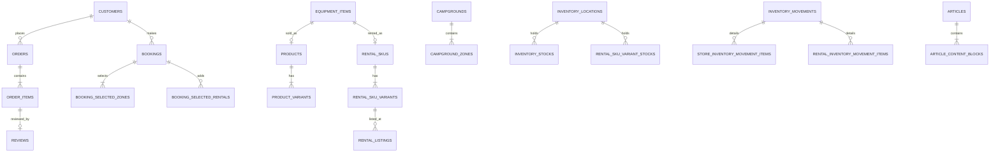

# Yuruicamp 資料庫結構導覽

> 來源：`docs/schema_copy.sql`（P7 驗證後快照）。本文件由 `tools/database-validation/generate-schema-guide.ps1` 產生；欄位描述以名稱與 DDL 約束解讀，業務規則以 SQL 為最終準則。

## 先說結論

- **資料庫**：PostgreSQL。證據包含 `pg_catalog`、`plpgsql`、`jsonb`、`timestamp with time zone`、`generate_series` 與 PostgreSQL dump 格式。
- **Schema 定義方式**：資料庫優先（database-first）。`docs/schema_copy.sql` 是可重建新資料庫的最終快照；既有資料庫只能依 `backend/src/main/resources/db/migration/V001…V700` 的 Flyway migration 升級。
- **ORM**：後端 `pom.xml` 有 Spring Data JPA，但目前 `backend/src/main` 沒有 Java `@Entity`；`spring.jpa.hibernate.ddl-auto=validate` 只驗證結構、不讓 Hibernate 建表。因此實際 schema 來源是 Flyway SQL，不是 ORM 類別。
- **規模**：共 113 張表：public 63 張日常業務表、migration 50 張歷史遷移／稽核表。
- **關鍵觀念**：`public` 是應用程式的現行資料；`migration` 是轉換證據，P7 已設為唯讀，正常功能不可寫入。

## ERD（業務主幹）

這張圖只放主要路徑；完整、可機器查核的每一條 FK 都列在各表的「關聯」。複合 FK（例如 `(id, inventory_domain)`）刻意保留兩欄，避免商城庫存與租借庫存混用。

## 資料庫會主動做什麼？（函式與 Trigger）

- `public.get_zone_availability(...)`：按日期展開營位，扣掉會占位的預約與人工 block；遇到公休直接回傳可用量 0，且不會回傳負數。
- `trg_inventory_movements_immutable`：已過帳或取消的庫存異動不可改；過帳前必須有明細或轉換資料。
- `trg_store_inventory_movement_items_draft_only`、`trg_rental_inventory_movement_items_draft_only`、`trg_inventory_conversions_draft_only`：明細與轉換只允許在異動單仍是 `draft` 時編輯。
- `trg_product_stock_reservations_lifecycle`、`trg_rental_stock_reservations_lifecycle`：強制保留帳由 `active` 走向終態，終態不可改／不可刪，避免庫存稽核斷鏈。
- `trg_inventory_locations_protect_minimum_stock_domain`、`trg_inventory_locations_protect_rental_mapping`：已被最低庫存或營區租借對應使用的地點，不能改成不相容領域／類型。
- `trg_legacy_reviews_read_only`、`trg_legacy_review_photos_read_only`、`trg_movement_migration_map_read_only`、`trg_p7_contract_evidence_read_only`：保護遷移證據不被應用程式改寫。

## 資料如何流動

1. **商品下單**：`equipment_items`（裝備主檔）→ `products` → `product_variants`；結帳建立 `orders`、`order_items`（價格與名稱快照），再以 `product_stock_reservations` 暫保庫存。狀態改變寫入 `order_status_history`；用券寫入 `order_coupons`，回補／重扣留在 `coupon_usage_adjustments`。
2. **營區預約**：讀取 `campgrounds`、`campground_zones`、`calendar_dates`、`campground_closures`、`zone_blocks`，並呼叫 `get_zone_availability()` 算出可訂量。成立後寫 `bookings`、選取明細與 `rental_stock_reservations`；取消／完成走狀態歷程與保留帳生命週期。入住日含、退房日不含：`[check_in, check_out)`。
3. **庫存異動**：先建 `inventory_movements` 草稿與商城或租借明細；只有 `posted` 才是正式異動，資料庫 trigger 禁止事後修改。`inventory_conversions` 將商城規格以成對異動轉入租借規格。
4. **內容與評價**：文章由 `articles`、區塊、標籤、關聯商品組成。正式評論只能對 `order_items` 建立一筆 `reviews`；舊格式無法完全對應的資料保留在 `legacy_reviews`。

## 設計上值得注意的地方

- **快照不是 migration**：檔案註解已明示 `schema_copy.sql` 不能拿來升級既有資料庫；請新增更高版本的 Flyway migration。
- **交易快照是刻意去正規化**：訂單／預約明細的 `*_snapshot` 不應回頭同步主檔，否則舊訂單金額與名稱會被改寫。
- **庫存領域隔離**：商城 `product_variants` 與租借 `rental_sku_variants` 是不同規格體系；以 `inventory_domain`、複合 FK、trigger 防止混接。
- **資料庫不只存資料，也執行規則**：可用性函式、CHECK、FK、唯一鍵與 trigger 都是防線；例如異動過帳後不可改、預約關閉日可用量為零、保留帳終態不可改。
- **`migration` 不可當業務來源**：那些表是 P1–P7 的來源／對帳／隔離資料，保留是為了可追溯性，而非供畫面查詢。
- **時間與金額**：時間多用含時區 timestamp；金額用 `numeric(12,2)`／`numeric(14,2)`，不要在程式端以浮點數累加。

## 完整資料字典

欄位的「必填」依 `NOT NULL` 判斷；「預設值」直接取自 DDL；PK／UNIQUE／FK 均以快照最後的 `ALTER TABLE` 約束為準。

## A. 現行業務資料（public）

### `public.admin_users`
**用途：** 後台員工與角色。
**鍵：** PRIMARY KEY: id；UNIQUE: email
**關聯：** 無外鍵。

| 欄位 | 型別 | 必填 | 預設值 | 意義 |
| --- | --- | --- | --- | --- |
| `id` | `character varying(32)` | 是 | — | 本列的唯一識別碼。 |
| `name` | `character varying(100)` | 是 | — | 顯示名稱。 |
| `email` | `character varying(254)` | 是 | — | 電子郵件；帳號或聯絡資訊。 |
| `role` | `character varying(32)` | 是 | — | 請依表格用途與 SQL 的 CHECK／FK 約束一起解讀。 |
| `active` | `boolean` | 是 | true | 是否啟用／可使用。 |
| `created_at` | `timestamp with time zone` | 是 | now() | 建立此筆資料的時間。 |
| `updated_at` | `timestamp with time zone` | 是 | now() | 最後更新時間。 |

### `public.article_content_blocks`
**用途：** 文章內容區塊。
**鍵：** PRIMARY KEY: id；UNIQUE: article_id, sort_order
**關聯：** article_id → public.articles(id)；product_id → public.products(id)

| 欄位 | 型別 | 必填 | 預設值 | 意義 |
| --- | --- | --- | --- | --- |
| `id` | `bigint` | 是 | — | 本列的唯一識別碼。 |
| `article_id` | `character varying(32)` | 是 | — | 識別碼；是否為外鍵請看「關聯」欄。 |
| `sort_order` | `integer` | 是 | — | 排序序號（較小者通常較前）。 |
| `block_type` | `character varying(16)` | 是 | — | 請依表格用途與 SQL 的 CHECK／FK 約束一起解讀。 |
| `text_content` | `text` | 否 | — | 請依表格用途與 SQL 的 CHECK／FK 約束一起解讀。 |
| `product_id` | `character varying(32)` | 否 | — | 指向 products 的商城商品。 |

### `public.article_related_products`
**用途：** 文章關聯商品。
**鍵：** PRIMARY KEY: article_id, product_id；UNIQUE: article_id, sort_order
**關聯：** article_id → public.articles(id)；product_id → public.products(id)

| 欄位 | 型別 | 必填 | 預設值 | 意義 |
| --- | --- | --- | --- | --- |
| `article_id` | `character varying(32)` | 是 | — | 識別碼；是否為外鍵請看「關聯」欄。 |
| `product_id` | `character varying(32)` | 是 | — | 指向 products 的商城商品。 |
| `sort_order` | `integer` | 是 | — | 排序序號（較小者通常較前）。 |

### `public.article_tags`
**用途：** 文章標籤。
**鍵：** PRIMARY KEY: article_id, tag
**關聯：** article_id → public.articles(id)

| 欄位 | 型別 | 必填 | 預設值 | 意義 |
| --- | --- | --- | --- | --- |
| `article_id` | `character varying(32)` | 是 | — | 識別碼；是否為外鍵請看「關聯」欄。 |
| `tag` | `character varying(100)` | 是 | — | 請依表格用途與 SQL 的 CHECK／FK 約束一起解讀。 |

### `public.articles`
**用途：** 文章主檔。
**鍵：** PRIMARY KEY: id
**關聯：** 無外鍵。

| 欄位 | 型別 | 必填 | 預設值 | 意義 |
| --- | --- | --- | --- | --- |
| `id` | `character varying(32)` | 是 | — | 本列的唯一識別碼。 |
| `title` | `character varying(250)` | 是 | — | 請依表格用途與 SQL 的 CHECK／FK 約束一起解讀。 |
| `category` | `character varying(64)` | 是 | — | 請依表格用途與 SQL 的 CHECK／FK 約束一起解讀。 |
| `author` | `character varying(120)` | 是 | — | 請依表格用途與 SQL 的 CHECK／FK 約束一起解讀。 |
| `author_avatar_url` | `text` | 否 | — | 外部或靜態資源的網址。 |
| `published_at` | `timestamp with time zone` | 否 | — | 時間戳記。 |
| `summary` | `text` | 是 | — | 請依表格用途與 SQL 的 CHECK／FK 約束一起解讀。 |
| `cover_image_url` | `text` | 否 | — | 外部或靜態資源的網址。 |
| `reading_minutes` | `integer` | 是 | — | 請依表格用途與 SQL 的 CHECK／FK 約束一起解讀。 |
| `featured` | `boolean` | 是 | false | 請依表格用途與 SQL 的 CHECK／FK 約束一起解讀。 |
| `status` | `character varying(16)` | 是 | 'draft'::character varying | 目前生命週期或上架狀態。 |
| `created_at` | `timestamp with time zone` | 是 | now() | 建立此筆資料的時間。 |
| `updated_at` | `timestamp with time zone` | 是 | now() | 最後更新時間。 |

### `public.booking_policies`
**用途：** 預約規則的單例設定。
**鍵：** PRIMARY KEY: id
**關聯：** 無外鍵。

| 欄位 | 型別 | 必填 | 預設值 | 意義 |
| --- | --- | --- | --- | --- |
| `id` | `smallint` | 是 | — | 本列的唯一識別碼。 |
| `booking_window_days` | `integer` | 是 | — | 請依表格用途與 SQL 的 CHECK／FK 約束一起解讀。 |
| `advance_days` | `integer` | 是 | — | 請依表格用途與 SQL 的 CHECK／FK 約束一起解讀。 |
| `max_nights` | `integer` | 是 | — | 請依表格用途與 SQL 的 CHECK／FK 約束一起解讀。 |
| `timezone` | `character varying(64)` | 是 | 'Asia/Taipei'::character varying | 請依表格用途與 SQL 的 CHECK／FK 約束一起解讀。 |
| `date_boundary_hour` | `smallint` | 是 | 0 | 請依表格用途與 SQL 的 CHECK／FK 約束一起解讀。 |
| `low_availability_threshold` | `integer` | 是 | — | 請依表格用途與 SQL 的 CHECK／FK 約束一起解讀。 |
| `created_at` | `timestamp with time zone` | 是 | now() | 建立此筆資料的時間。 |
| `updated_at` | `timestamp with time zone` | 是 | now() | 最後更新時間。 |

### `public.booking_policy_availability_statuses`
**用途：** 哪些預約狀態可在可用性中顯示。
**鍵：** PRIMARY KEY: policy_id, status
**關聯：** policy_id → public.booking_policies(id)

| 欄位 | 型別 | 必填 | 預設值 | 意義 |
| --- | --- | --- | --- | --- |
| `policy_id` | `smallint` | 是 | — | 識別碼；是否為外鍵請看「關聯」欄。 |
| `status` | `character varying(24)` | 是 | — | 目前生命週期或上架狀態。 |

### `public.booking_policy_occupying_statuses`
**用途：** 哪些預約狀態會占用營位。
**鍵：** PRIMARY KEY: policy_id, status
**關聯：** policy_id → public.booking_policies(id)

| 欄位 | 型別 | 必填 | 預設值 | 意義 |
| --- | --- | --- | --- | --- |
| `policy_id` | `smallint` | 是 | — | 識別碼；是否為外鍵請看「關聯」欄。 |
| `status` | `character varying(24)` | 是 | — | 目前生命週期或上架狀態。 |

### `public.booking_selected_rentals`
**用途：** 預約加租的裝備。
**鍵：** PRIMARY KEY: id；UNIQUE: id, rental_sku_variant_id
**關聯：** booking_id → public.bookings(id)；rental_listing_id → public.rental_listings(id)；rental_sku_variant_id → public.rental_sku_variants(id)

| 欄位 | 型別 | 必填 | 預設值 | 意義 |
| --- | --- | --- | --- | --- |
| `id` | `bigint` | 是 | — | 本列的唯一識別碼。 |
| `booking_id` | `character varying(32)` | 是 | — | 指向 bookings 的預約。 |
| `rental_listing_id` | `character varying(64)` | 是 | — | 識別碼；是否為外鍵請看「關聯」欄。 |
| `rental_sku_variant_id` | `character varying(64)` | 是 | — | 識別碼；是否為外鍵請看「關聯」欄。 |
| `sku_snapshot` | `character varying(64)` | 是 | — | 交易當下複製的快照；保留歷史，不隨主檔改動。 |
| `name_snapshot` | `character varying(200)` | 是 | — | 交易當下複製的快照；保留歷史，不隨主檔改動。 |
| `specification_snapshot` | `character varying(200)` | 是 | — | 交易當下複製的快照；保留歷史，不隨主檔改動。 |
| `price_weekday_snapshot` | `numeric(12,2)` | 是 | — | 交易當下複製的快照；保留歷史，不隨主檔改動。 |
| `price_holiday_snapshot` | `numeric(12,2)` | 是 | — | 交易當下複製的快照；保留歷史，不隨主檔改動。 |
| `discount_snapshot` | `numeric(12,2)` | 是 | — | 交易當下複製的快照；保留歷史，不隨主檔改動。 |
| `quantity` | `integer` | 是 | — | 數量；限制通常要求大於 0。 |

### `public.booking_selected_zones`
**用途：** 預約選取的營位。
**鍵：** PRIMARY KEY: id
**關聯：** booking_id → public.bookings(id)；zone_id → public.campground_zones(id)

| 欄位 | 型別 | 必填 | 預設值 | 意義 |
| --- | --- | --- | --- | --- |
| `id` | `bigint` | 是 | — | 本列的唯一識別碼。 |
| `booking_id` | `character varying(32)` | 是 | — | 指向 bookings 的預約。 |
| `zone_id` | `character varying(32)` | 是 | — | 識別碼；是否為外鍵請看「關聯」欄。 |
| `zone_type_snapshot` | `character varying(64)` | 是 | — | 交易當下複製的快照；保留歷史，不隨主檔改動。 |
| `price_weekday_snapshot` | `numeric(12,2)` | 是 | — | 交易當下複製的快照；保留歷史，不隨主檔改動。 |
| `price_holiday_snapshot` | `numeric(12,2)` | 是 | — | 交易當下複製的快照；保留歷史，不隨主檔改動。 |
| `quantity` | `integer` | 是 | — | 數量；限制通常要求大於 0。 |

### `public.booking_status_history`
**用途：** 預約狀態歷程。
**鍵：** PRIMARY KEY: id
**關聯：** actor_id → public.admin_users(id)；booking_id → public.bookings(id)

| 欄位 | 型別 | 必填 | 預設值 | 意義 |
| --- | --- | --- | --- | --- |
| `id` | `bigint` | 是 | — | 本列的唯一識別碼。 |
| `booking_id` | `character varying(32)` | 是 | — | 指向 bookings 的預約。 |
| `status` | `character varying(24)` | 是 | — | 目前生命週期或上架狀態。 |
| `occurred_at` | `timestamp with time zone` | 是 | — | 事件實際發生時間。 |
| `actor_id` | `character varying(32)` | 否 | — | 執行狀態變更的後台使用者。 |
| `note` | `text` | 否 | — | 請依表格用途與 SQL 的 CHECK／FK 約束一起解讀。 |

### `public.bookings`
**用途：** 營區預約表頭與金額快照。
**鍵：** PRIMARY KEY: id
**關聯：** campground_id → public.campgrounds(id)；customer_id → public.customers(id)

| 欄位 | 型別 | 必填 | 預設值 | 意義 |
| --- | --- | --- | --- | --- |
| `id` | `character varying(32)` | 是 | — | 本列的唯一識別碼。 |
| `customer_id` | `character varying(32)` | 是 | — | 指向 customers 的會員。 |
| `campground_id` | `character varying(32)` | 是 | — | 指向 campgrounds 的營區。 |
| `campground_name_snapshot` | `character varying(150)` | 是 | — | 交易當下複製的快照；保留歷史，不隨主檔改動。 |
| `region_snapshot` | `character varying(100)` | 是 | — | 交易當下複製的快照；保留歷史，不隨主檔改動。 |
| `check_in` | `date` | 是 | — | 請依表格用途與 SQL 的 CHECK／FK 約束一起解讀。 |
| `check_out` | `date` | 是 | — | 請依表格用途與 SQL 的 CHECK／FK 約束一起解讀。 |
| `guest_count` | `integer` | 是 | — | 計數值。 |
| `weekday_count` | `integer` | 是 | — | 計數值。 |
| `holiday_count` | `integer` | 是 | — | 計數值。 |
| `zone_total` | `numeric(14,2)` | 是 | — | 彙總金額。 |
| `rental_total` | `numeric(14,2)` | 是 | — | 彙總金額。 |
| `applied_discount` | `numeric(14,2)` | 是 | — | 請依表格用途與 SQL 的 CHECK／FK 約束一起解讀。 |
| `final_amount` | `numeric(14,2)` | 是 | — | 彙總金額。 |
| `status` | `character varying(24)` | 是 | — | 目前生命週期或上架狀態。 |
| `created_at` | `timestamp with time zone` | 是 | — | 建立此筆資料的時間。 |
| `updated_at` | `timestamp with time zone` | 是 | now() | 最後更新時間。 |

### `public.branch_features`
**用途：** 門市特色文字。
**鍵：** PRIMARY KEY: branch_id, feature
**關聯：** branch_id → public.branches(id)

| 欄位 | 型別 | 必填 | 預設值 | 意義 |
| --- | --- | --- | --- | --- |
| `id` | `bigint` | 是 | — | 本列的唯一識別碼。 |
| `branch_id` | `character varying(32)` | 是 | — | 指向 branches 的門市。 |
| `feature` | `character varying(100)` | 是 | — | 請依表格用途與 SQL 的 CHECK／FK 約束一起解讀。 |

### `public.branches`
**用途：** 門市主檔。
**鍵：** PRIMARY KEY: id；UNIQUE: code
**關聯：** 無外鍵。

| 欄位 | 型別 | 必填 | 預設值 | 意義 |
| --- | --- | --- | --- | --- |
| `id` | `character varying(32)` | 是 | — | 本列的唯一識別碼。 |
| `name` | `character varying(120)` | 是 | — | 顯示名稱。 |
| `address` | `character varying(300)` | 是 | — | 請依表格用途與 SQL 的 CHECK／FK 約束一起解讀。 |
| `phone` | `character varying(32)` | 是 | — | 請依表格用途與 SQL 的 CHECK／FK 約束一起解讀。 |
| `hours` | `character varying(128)` | 否 | — | 請依表格用途與 SQL 的 CHECK／FK 約束一起解讀。 |
| `image` | `text` | 否 | — | 請依表格用途與 SQL 的 CHECK／FK 約束一起解讀。 |
| `latitude` | `numeric(10,6)` | 否 | — | 請依表格用途與 SQL 的 CHECK／FK 約束一起解讀。 |
| `longitude` | `numeric(10,6)` | 否 | — | 請依表格用途與 SQL 的 CHECK／FK 約束一起解讀。 |
| `map_query` | `text` | 否 | — | 請依表格用途與 SQL 的 CHECK／FK 約束一起解讀。 |
| `description` | `text` | 否 | — | 文字說明。 |
| `code` | `character varying(32)` | 是 | — | 人可讀、通常唯一的代碼。 |
| `business_hours` | `character varying(200)` | 是 | — | 請依表格用途與 SQL 的 CHECK／FK 約束一起解讀。 |
| `image_url` | `text` | 否 | — | 外部或靜態資源的網址。 |
| `active` | `boolean` | 是 | true | 是否啟用／可使用。 |
| `created_at` | `timestamp with time zone` | 是 | now() | 建立此筆資料的時間。 |
| `updated_at` | `timestamp with time zone` | 是 | now() | 最後更新時間。 |

### `public.brands`
**用途：** 品牌主檔。
**鍵：** PRIMARY KEY: id；UNIQUE: name
**關聯：** 無外鍵。

| 欄位 | 型別 | 必填 | 預設值 | 意義 |
| --- | --- | --- | --- | --- |
| `id` | `character varying(32)` | 是 | — | 本列的唯一識別碼。 |
| `name` | `character varying(120)` | 是 | — | 顯示名稱。 |
| `logo_url` | `text` | 否 | — | 外部或靜態資源的網址。 |
| `sort_order` | `integer` | 是 | 0 | 排序序號（較小者通常較前）。 |
| `active` | `boolean` | 是 | true | 是否啟用／可使用。 |
| `created_at` | `timestamp with time zone` | 是 | now() | 建立此筆資料的時間。 |
| `updated_at` | `timestamp with time zone` | 是 | now() | 最後更新時間。 |

### `public.calendar_dates`
**用途：** 假日判定日曆。
**鍵：** PRIMARY KEY: calendar_date
**關聯：** 無外鍵。

| 欄位 | 型別 | 必填 | 預設值 | 意義 |
| --- | --- | --- | --- | --- |
| `calendar_date` | `date` | 是 | — | 日期（不含時間）。 |
| `is_holiday` | `boolean` | 是 | — | 布林判斷旗標。 |
| `holiday_name` | `character varying(120)` | 否 | — | 請依表格用途與 SQL 的 CHECK／FK 約束一起解讀。 |
| `source_version` | `character varying(64)` | 是 | — | 請依表格用途與 SQL 的 CHECK／FK 約束一起解讀。 |
| `effective_at` | `timestamp with time zone` | 是 | — | 時間戳記。 |
| `updated_at` | `timestamp with time zone` | 是 | now() | 最後更新時間。 |

### `public.campground_closures`
**用途：** 營區關閉日期或每週公休。
**鍵：** PRIMARY KEY: id；UNIQUE: legacy_closure_id
**關聯：** campground_id → public.campgrounds(id)；created_by → public.admin_users(id)

| 欄位 | 型別 | 必填 | 預設值 | 意義 |
| --- | --- | --- | --- | --- |
| `id` | `bigint` | 是 | — | 本列的唯一識別碼。 |
| `legacy_closure_id` | `character varying(32)` | 是 | — | 識別碼；是否為外鍵請看「關聯」欄。 |
| `campground_id` | `character varying(32)` | 是 | — | 指向 campgrounds 的營區。 |
| `closure_type` | `character varying(16)` | 是 | — | 請依表格用途與 SQL 的 CHECK／FK 約束一起解讀。 |
| `start_date` | `date` | 否 | — | 日期（不含時間）。 |
| `end_date` | `date` | 否 | — | 日期（不含時間）。 |
| `weekday` | `smallint` | 否 | — | 請依表格用途與 SQL 的 CHECK／FK 約束一起解讀。 |
| `effective_from` | `date` | 否 | — | 請依表格用途與 SQL 的 CHECK／FK 約束一起解讀。 |
| `effective_to` | `date` | 否 | — | 請依表格用途與 SQL 的 CHECK／FK 約束一起解讀。 |
| `reason` | `text` | 是 | — | 操作或限制的原因。 |
| `created_by` | `character varying(32)` | 是 | — | 請依表格用途與 SQL 的 CHECK／FK 約束一起解讀。 |
| `created_at` | `timestamp with time zone` | 是 | now() | 建立此筆資料的時間。 |
| `updated_at` | `timestamp with time zone` | 是 | now() | 最後更新時間。 |

### `public.campground_environment_tags`
**用途：** 營區與環境標籤的多對多關係。
**鍵：** PRIMARY KEY: campground_id, tag_id
**關聯：** campground_id → public.campgrounds(id)；tag_id → public.environment_tags(id)

| 欄位 | 型別 | 必填 | 預設值 | 意義 |
| --- | --- | --- | --- | --- |
| `campground_id` | `character varying(32)` | 是 | — | 指向 campgrounds 的營區。 |
| `tag_id` | `bigint` | 是 | — | 識別碼；是否為外鍵請看「關聯」欄。 |

### `public.campground_facility_tags`
**用途：** 營區與設施標籤的多對多關係。
**鍵：** PRIMARY KEY: campground_id, tag_id
**關聯：** campground_id → public.campgrounds(id)；tag_id → public.facility_tags(id)

| 欄位 | 型別 | 必填 | 預設值 | 意義 |
| --- | --- | --- | --- | --- |
| `campground_id` | `character varying(32)` | 是 | — | 指向 campgrounds 的營區。 |
| `tag_id` | `bigint` | 是 | — | 識別碼；是否為外鍵請看「關聯」欄。 |

### `public.campground_rental_locations`
**用途：** 營區對應的租借庫存地點。
**鍵：** PRIMARY KEY: campground_id；UNIQUE: location_id
**關聯：** campground_id → public.campgrounds(id)；location_id → public.inventory_locations(id)

| 欄位 | 型別 | 必填 | 預設值 | 意義 |
| --- | --- | --- | --- | --- |
| `campground_id` | `character varying(32)` | 是 | — | 指向 campgrounds 的營區。 |
| `location_id` | `character varying(32)` | 是 | — | 指向 inventory_locations 的庫存地點。 |

### `public.campground_zones`
**用途：** 營區內可預約的營位類型與容量／定價。
**鍵：** PRIMARY KEY: id；UNIQUE: id, campground_id
**關聯：** campground_id → public.campgrounds(id)

| 欄位 | 型別 | 必填 | 預設值 | 意義 |
| --- | --- | --- | --- | --- |
| `id` | `character varying(32)` | 是 | — | 本列的唯一識別碼。 |
| `campground_id` | `character varying(32)` | 是 | — | 指向 campgrounds 的營區。 |
| `type` | `character varying(64)` | 是 | — | 請依表格用途與 SQL 的 CHECK／FK 約束一起解讀。 |
| `capacity_per_site` | `integer` | 是 | 1 | 請依表格用途與 SQL 的 CHECK／FK 約束一起解讀。 |
| `price_weekday` | `numeric(12,2)` | 是 | 0 | 請依表格用途與 SQL 的 CHECK／FK 約束一起解讀。 |
| `price_holiday` | `numeric(12,2)` | 是 | 0 | 請依表格用途與 SQL 的 CHECK／FK 約束一起解讀。 |
| `total_sites` | `integer` | 是 | 0 | 請依表格用途與 SQL 的 CHECK／FK 約束一起解讀。 |
| `active` | `boolean` | 是 | true | 是否啟用／可使用。 |
| `created_at` | `timestamp with time zone` | 是 | now() | 建立此筆資料的時間。 |
| `updated_at` | `timestamp with time zone` | 是 | now() | 最後更新時間。 |

### `public.campgrounds`
**用途：** 營區主檔。
**鍵：** PRIMARY KEY: id
**關聯：** 無外鍵。

| 欄位 | 型別 | 必填 | 預設值 | 意義 |
| --- | --- | --- | --- | --- |
| `id` | `character varying(32)` | 是 | — | 本列的唯一識別碼。 |
| `name` | `character varying(150)` | 是 | — | 顯示名稱。 |
| `region` | `character varying(100)` | 是 | — | 請依表格用途與 SQL 的 CHECK／FK 約束一起解讀。 |
| `description` | `text` | 否 | — | 文字說明。 |
| `active` | `boolean` | 是 | true | 是否啟用／可使用。 |
| `created_at` | `timestamp with time zone` | 是 | now() | 建立此筆資料的時間。 |
| `updated_at` | `timestamp with time zone` | 是 | now() | 最後更新時間。 |

### `public.coupon_usage_adjustments`
**用途：** 優惠券使用量回補／重扣稽核。
**鍵：** PRIMARY KEY: id；UNIQUE: idempotency_key
**關聯：** order_coupon_id → public.order_coupons(id)

| 欄位 | 型別 | 必填 | 預設值 | 意義 |
| --- | --- | --- | --- | --- |
| `id` | `bigint` | 是 | — | 本列的唯一識別碼。 |
| `order_coupon_id` | `bigint` | 是 | — | 識別碼；是否為外鍵請看「關聯」欄。 |
| `adjustment_type` | `character varying(16)` | 是 | — | 請依表格用途與 SQL 的 CHECK／FK 約束一起解讀。 |
| `quantity_delta` | `smallint` | 是 | — | 請依表格用途與 SQL 的 CHECK／FK 約束一起解讀。 |
| `idempotency_key` | `character varying(128)` | 是 | — | 冪等鍵：重送相同請求不應重複扣庫存／記帳。 |
| `reason` | `text` | 是 | — | 操作或限制的原因。 |
| `created_at` | `timestamp with time zone` | 是 | now() | 建立此筆資料的時間。 |

### `public.coupons`
**用途：** 優惠券主檔。
**鍵：** PRIMARY KEY: id；UNIQUE: code
**關聯：** 無外鍵。

| 欄位 | 型別 | 必填 | 預設值 | 意義 |
| --- | --- | --- | --- | --- |
| `id` | `bigint` | 是 | — | 本列的唯一識別碼。 |
| `code` | `character varying(64)` | 是 | — | 人可讀、通常唯一的代碼。 |
| `name` | `character varying(120)` | 是 | — | 顯示名稱。 |
| `discount_type` | `character varying(16)` | 是 | — | 請依表格用途與 SQL 的 CHECK／FK 約束一起解讀。 |
| `discount_value` | `numeric(12,2)` | 是 | — | 請依表格用途與 SQL 的 CHECK／FK 約束一起解讀。 |
| `minimum_amount` | `numeric(12,2)` | 是 | 0 | 彙總金額。 |
| `issue_quantity` | `integer` | 是 | — | 請依表格用途與 SQL 的 CHECK／FK 約束一起解讀。 |
| `valid_from` | `timestamp with time zone` | 是 | — | 請依表格用途與 SQL 的 CHECK／FK 約束一起解讀。 |
| `valid_until` | `timestamp with time zone` | 是 | — | 請依表格用途與 SQL 的 CHECK／FK 約束一起解讀。 |
| `status` | `character varying(16)` | 是 | — | 目前生命週期或上架狀態。 |
| `category` | `character varying(64)` | 否 | — | 請依表格用途與 SQL 的 CHECK／FK 約束一起解讀。 |
| `created_at` | `timestamp with time zone` | 是 | now() | 建立此筆資料的時間。 |
| `updated_at` | `timestamp with time zone` | 是 | now() | 最後更新時間。 |

### `public.order_coupons`
**用途：** 訂單套用的優惠券快照。
**鍵：** PRIMARY KEY: id；UNIQUE: order_id, code_snapshot
**關聯：** coupon_id → public.coupons(id)；order_id → public.orders(id)

| 欄位 | 型別 | 必填 | 預設值 | 意義 |
| --- | --- | --- | --- | --- |
| `id` | `bigint` | 是 | — | 本列的唯一識別碼。 |
| `order_id` | `character varying(32)` | 是 | — | 指向 orders 的訂單。 |
| `coupon_id` | `bigint` | 否 | — | 識別碼；是否為外鍵請看「關聯」欄。 |
| `code_snapshot` | `character varying(64)` | 是 | — | 交易當下複製的快照；保留歷史，不隨主檔改動。 |
| `discount_type_snapshot` | `character varying(16)` | 是 | — | 交易當下複製的快照；保留歷史，不隨主檔改動。 |
| `discount_value_snapshot` | `numeric(12,2)` | 是 | — | 交易當下複製的快照；保留歷史，不隨主檔改動。 |
| `amount` | `numeric(12,2)` | 是 | — | 請依表格用途與 SQL 的 CHECK／FK 約束一起解讀。 |
| `applied_at` | `timestamp with time zone` | 是 | — | 時間戳記。 |

### `public.orders`
**用途：** 商城訂單表頭。
**鍵：** PRIMARY KEY: id
**關聯：** customer_id → public.customers(id)

| 欄位 | 型別 | 必填 | 預設值 | 意義 |
| --- | --- | --- | --- | --- |
| `id` | `character varying(32)` | 是 | — | 本列的唯一識別碼。 |
| `customer_id` | `character varying(32)` | 是 | — | 指向 customers 的會員。 |
| `buyer_name_snapshot` | `character varying(100)` | 是 | — | 交易當下複製的快照；保留歷史，不隨主檔改動。 |
| `buyer_email_snapshot` | `character varying(254)` | 是 | — | 交易當下複製的快照；保留歷史，不隨主檔改動。 |
| `recipient_name_snapshot` | `character varying(100)` | 是 | — | 交易當下複製的快照；保留歷史，不隨主檔改動。 |
| `shipping_address_snapshot` | `text` | 是 | — | 交易當下複製的快照；保留歷史，不隨主檔改動。 |
| `shipping_phone_snapshot` | `character varying(32)` | 是 | — | 交易當下複製的快照；保留歷史，不隨主檔改動。 |
| `subtotal` | `numeric(14,2)` | 是 | — | 請依表格用途與 SQL 的 CHECK／FK 約束一起解讀。 |
| `shipping_fee` | `numeric(12,2)` | 是 | — | 請依表格用途與 SQL 的 CHECK／FK 約束一起解讀。 |
| `discount` | `numeric(14,2)` | 是 | — | 折扣金額或百分比，依 type 解讀。 |
| `total` | `numeric(14,2)` | 是 | — | 請依表格用途與 SQL 的 CHECK／FK 約束一起解讀。 |
| `payment_method` | `character varying(24)` | 是 | — | 請依表格用途與 SQL 的 CHECK／FK 約束一起解讀。 |
| `payment_status` | `character varying(24)` | 是 | — | 請依表格用途與 SQL 的 CHECK／FK 約束一起解讀。 |
| `refund_status` | `character varying(24)` | 是 | 'none'::character varying | 請依表格用途與 SQL 的 CHECK／FK 約束一起解讀。 |
| `status` | `character varying(24)` | 是 | — | 目前生命週期或上架狀態。 |
| `placed_at` | `timestamp with time zone` | 是 | — | 時間戳記。 |
| `paid_at` | `timestamp with time zone` | 否 | — | 時間戳記。 |
| `created_at` | `timestamp with time zone` | 是 | now() | 建立此筆資料的時間。 |
| `updated_at` | `timestamp with time zone` | 是 | now() | 最後更新時間。 |

### `public.customer_preferences`
**用途：** 會員偏好問卷答案。
**鍵：** PRIMARY KEY: customer_id, preference_id
**關聯：** customer_id → public.customers(id)；preference_id → public.preference_options(id)

| 欄位 | 型別 | 必填 | 預設值 | 意義 |
| --- | --- | --- | --- | --- |
| `customer_id` | `character varying(32)` | 是 | — | 指向 customers 的會員。 |
| `preference_id` | `bigint` | 是 | — | 識別碼；是否為外鍵請看「關聯」欄。 |

### `public.customer_shipping_addresses`
**用途：** 會員收件地址。
**鍵：** PRIMARY KEY: id
**關聯：** customer_id → public.customers(id)

| 欄位 | 型別 | 必填 | 預設值 | 意義 |
| --- | --- | --- | --- | --- |
| `id` | `bigint` | 是 | — | 本列的唯一識別碼。 |
| `customer_id` | `character varying(32)` | 是 | — | 指向 customers 的會員。 |
| `recipient_name` | `character varying(100)` | 是 | — | 請依表格用途與 SQL 的 CHECK／FK 約束一起解讀。 |
| `postal_code` | `character varying(10)` | 是 | — | 請依表格用途與 SQL 的 CHECK／FK 約束一起解讀。 |
| `city` | `character varying(50)` | 是 | — | 請依表格用途與 SQL 的 CHECK／FK 約束一起解讀。 |
| `district` | `character varying(50)` | 是 | — | 請依表格用途與 SQL 的 CHECK／FK 約束一起解讀。 |
| `address_line` | `character varying(300)` | 是 | — | 請依表格用途與 SQL 的 CHECK／FK 約束一起解讀。 |
| `phone` | `character varying(32)` | 是 | — | 請依表格用途與 SQL 的 CHECK／FK 約束一起解讀。 |
| `is_default` | `boolean` | 是 | false | 布林判斷旗標。 |
| `created_at` | `timestamp with time zone` | 是 | now() | 建立此筆資料的時間。 |
| `updated_at` | `timestamp with time zone` | 是 | now() | 最後更新時間。 |

### `public.customer_tag_assignments`
**用途：** 會員與標籤的多對多關係。
**鍵：** PRIMARY KEY: customer_id, tag_id
**關聯：** customer_id → public.customers(id)；tag_id → public.customer_tags(id)

| 欄位 | 型別 | 必填 | 預設值 | 意義 |
| --- | --- | --- | --- | --- |
| `customer_id` | `character varying(32)` | 是 | — | 指向 customers 的會員。 |
| `tag_id` | `bigint` | 是 | — | 識別碼；是否為外鍵請看「關聯」欄。 |

### `public.customer_tags`
**用途：** 會員分群標籤。
**鍵：** PRIMARY KEY: id；UNIQUE: name
**關聯：** 無外鍵。

| 欄位 | 型別 | 必填 | 預設值 | 意義 |
| --- | --- | --- | --- | --- |
| `id` | `bigint` | 是 | — | 本列的唯一識別碼。 |
| `name` | `character varying(100)` | 是 | — | 顯示名稱。 |
| `color` | `character varying(32)` | 是 | — | 請依表格用途與 SQL 的 CHECK／FK 約束一起解讀。 |
| `sort_order` | `integer` | 是 | 0 | 排序序號（較小者通常較前）。 |
| `active` | `boolean` | 是 | true | 是否啟用／可使用。 |
| `created_at` | `timestamp with time zone` | 是 | now() | 建立此筆資料的時間。 |
| `updated_at` | `timestamp with time zone` | 是 | now() | 最後更新時間。 |

### `public.customers`
**用途：** 會員基本資料（OAuth 帳號）。
**鍵：** PRIMARY KEY: id；UNIQUE: email
**關聯：** 無外鍵。

| 欄位 | 型別 | 必填 | 預設值 | 意義 |
| --- | --- | --- | --- | --- |
| `id` | `character varying(32)` | 是 | — | 本列的唯一識別碼。 |
| `avatar` | `text` | 否 | — | 請依表格用途與 SQL 的 CHECK／FK 約束一起解讀。 |
| `name` | `character varying(100)` | 是 | — | 顯示名稱。 |
| `phone` | `character varying(32)` | 否 | — | 請依表格用途與 SQL 的 CHECK／FK 約束一起解讀。 |
| `email` | `character varying(255)` | 是 | — | 電子郵件；帳號或聯絡資訊。 |
| `birthday` | `date` | 否 | — | 請依表格用途與 SQL 的 CHECK／FK 約束一起解讀。 |
| `registered_at` | `timestamp with time zone` | 是 | — | 時間戳記。 |
| `total_spent` | `numeric(12,2)` | 是 | 0 | 請依表格用途與 SQL 的 CHECK／FK 約束一起解讀。 |
| `tier` | `character varying(32)` | 否 | — | 請依表格用途與 SQL 的 CHECK／FK 約束一起解讀。 |
| `tier_name` | `character varying(64)` | 否 | — | 請依表格用途與 SQL 的 CHECK／FK 約束一起解讀。 |
| `points` | `integer` | 是 | 0 | 請依表格用途與 SQL 的 CHECK／FK 約束一起解讀。 |
| `first_purchase_used` | `boolean` | 是 | false | 請依表格用途與 SQL 的 CHECK／FK 約束一起解讀。 |
| `preferences` | `jsonb` | 否 | — | 請依表格用途與 SQL 的 CHECK／FK 約束一起解讀。 |
| `shipping_address` | `jsonb` | 否 | — | 請依表格用途與 SQL 的 CHECK／FK 約束一起解讀。 |
| `tags` | `jsonb` | 否 | — | 請依表格用途與 SQL 的 CHECK／FK 約束一起解讀。 |
| `auth_provider` | `character varying(32)` | 是 | — | 請依表格用途與 SQL 的 CHECK／FK 約束一起解讀。 |
| `created_at` | `timestamp with time zone` | 是 | now() | 建立此筆資料的時間。 |
| `updated_at` | `timestamp with time zone` | 是 | now() | 最後更新時間。 |
| `avatar_url` | `text` | 否 | — | 外部或靜態資源的網址。 |
| `active` | `boolean` | 是 | true | 是否啟用／可使用。 |

### `public.environment_tags`
**用途：** 營區環境標籤。
**鍵：** PRIMARY KEY: id；UNIQUE: code；UNIQUE: label
**關聯：** 無外鍵。

| 欄位 | 型別 | 必填 | 預設值 | 意義 |
| --- | --- | --- | --- | --- |
| `id` | `bigint` | 是 | — | 本列的唯一識別碼。 |
| `code` | `character varying(64)` | 是 | — | 人可讀、通常唯一的代碼。 |
| `label` | `character varying(100)` | 是 | — | 請依表格用途與 SQL 的 CHECK／FK 約束一起解讀。 |
| `sort_order` | `integer` | 是 | 0 | 排序序號（較小者通常較前）。 |
| `active` | `boolean` | 是 | true | 是否啟用／可使用。 |

### `public.equipment_images`
**用途：** 裝備圖片。
**鍵：** PRIMARY KEY: item_id, sort_order
**關聯：** item_id → public.equipment_items(id)

| 欄位 | 型別 | 必填 | 預設值 | 意義 |
| --- | --- | --- | --- | --- |
| `item_id` | `character varying(32)` | 是 | — | 指向 equipment_items 的共用裝備主檔。 |
| `sort_order` | `integer` | 是 | — | 排序序號（較小者通常較前）。 |
| `url` | `text` | 是 | — | 請依表格用途與 SQL 的 CHECK／FK 約束一起解讀。 |
| `alt_text` | `character varying(200)` | 否 | — | 請依表格用途與 SQL 的 CHECK／FK 約束一起解讀。 |

### `public.equipment_interest_tags`
**用途：** 裝備興趣標籤。
**鍵：** PRIMARY KEY: item_id, tag
**關聯：** item_id → public.equipment_items(id)

| 欄位 | 型別 | 必填 | 預設值 | 意義 |
| --- | --- | --- | --- | --- |
| `item_id` | `character varying(32)` | 是 | — | 指向 equipment_items 的共用裝備主檔。 |
| `tag` | `character varying(100)` | 是 | — | 請依表格用途與 SQL 的 CHECK／FK 約束一起解讀。 |

### `public.equipment_items`
**用途：** 裝備共用主檔；商城與租借共用。
**鍵：** PRIMARY KEY: id
**關聯：** brand_id → public.brands(id)；category_id → public.product_categories(id)

| 欄位 | 型別 | 必填 | 預設值 | 意義 |
| --- | --- | --- | --- | --- |
| `id` | `character varying(32)` | 是 | — | 本列的唯一識別碼。 |
| `category_id` | `bigint` | 是 | — | 識別碼；是否為外鍵請看「關聯」欄。 |
| `brand_id` | `character varying(32)` | 是 | — | 識別碼；是否為外鍵請看「關聯」欄。 |
| `name` | `character varying(200)` | 是 | — | 顯示名稱。 |
| `main_image_url` | `text` | 否 | — | 外部或靜態資源的網址。 |
| `description` | `text` | 否 | — | 文字說明。 |
| `active` | `boolean` | 是 | true | 是否啟用／可使用。 |
| `created_at` | `timestamp with time zone` | 是 | now() | 建立此筆資料的時間。 |
| `updated_at` | `timestamp with time zone` | 是 | now() | 最後更新時間。 |

### `public.equipment_specifications`
**用途：** 裝備規格鍵值。
**鍵：** PRIMARY KEY: item_id, spec_key
**關聯：** item_id → public.equipment_items(id)

| 欄位 | 型別 | 必填 | 預設值 | 意義 |
| --- | --- | --- | --- | --- |
| `item_id` | `character varying(32)` | 是 | — | 指向 equipment_items 的共用裝備主檔。 |
| `spec_key` | `character varying(100)` | 是 | — | 請依表格用途與 SQL 的 CHECK／FK 約束一起解讀。 |
| `value` | `text` | 是 | — | 請依表格用途與 SQL 的 CHECK／FK 約束一起解讀。 |

### `public.equipment_tags`
**用途：** 裝備搜尋標籤。
**鍵：** PRIMARY KEY: item_id, tag
**關聯：** item_id → public.equipment_items(id)

| 欄位 | 型別 | 必填 | 預設值 | 意義 |
| --- | --- | --- | --- | --- |
| `item_id` | `character varying(32)` | 是 | — | 指向 equipment_items 的共用裝備主檔。 |
| `tag` | `character varying(100)` | 是 | — | 請依表格用途與 SQL 的 CHECK／FK 約束一起解讀。 |

### `public.facility_tags`
**用途：** 營區設施標籤。
**鍵：** PRIMARY KEY: id；UNIQUE: code；UNIQUE: label
**關聯：** 無外鍵。

| 欄位 | 型別 | 必填 | 預設值 | 意義 |
| --- | --- | --- | --- | --- |
| `id` | `bigint` | 是 | — | 本列的唯一識別碼。 |
| `code` | `character varying(64)` | 是 | — | 人可讀、通常唯一的代碼。 |
| `label` | `character varying(100)` | 是 | — | 請依表格用途與 SQL 的 CHECK／FK 約束一起解讀。 |
| `sort_order` | `integer` | 是 | 0 | 排序序號（較小者通常較前）。 |
| `active` | `boolean` | 是 | true | 是否啟用／可使用。 |

### `public.inventory_conversions`
**用途：** 商城商品轉為租借裝備的成對異動。
**鍵：** PRIMARY KEY: id；UNIQUE: idempotency_key；UNIQUE: source_movement_id, destination_movement_id
**關聯：** destination_location_id → public.inventory_locations(id)；destination_movement_id → public.inventory_movements(id)；destination_rental_variant_id → public.rental_sku_variants(id)；source_location_id → public.inventory_locations(id)；source_movement_id → public.inventory_movements(id)；source_variant_id → public.product_variants(id)

| 欄位 | 型別 | 必填 | 預設值 | 意義 |
| --- | --- | --- | --- | --- |
| `id` | `bigint` | 是 | — | 本列的唯一識別碼。 |
| `source_movement_id` | `bigint` | 是 | — | 識別碼；是否為外鍵請看「關聯」欄。 |
| `destination_movement_id` | `bigint` | 是 | — | 識別碼；是否為外鍵請看「關聯」欄。 |
| `source_variant_id` | `character varying(64)` | 是 | — | 識別碼；是否為外鍵請看「關聯」欄。 |
| `destination_rental_variant_id` | `character varying(64)` | 是 | — | 識別碼；是否為外鍵請看「關聯」欄。 |
| `source_location_id` | `character varying(32)` | 是 | — | 識別碼；是否為外鍵請看「關聯」欄。 |
| `destination_location_id` | `character varying(32)` | 是 | — | 識別碼；是否為外鍵請看「關聯」欄。 |
| `quantity` | `integer` | 是 | — | 數量；限制通常要求大於 0。 |
| `idempotency_key` | `character varying(128)` | 是 | — | 冪等鍵：重送相同請求不應重複扣庫存／記帳。 |
| `created_at` | `timestamp with time zone` | 是 | now() | 建立此筆資料的時間。 |

### `public.inventory_locations`
**用途：** 庫存地點（商城與租借分域）。
**鍵：** PRIMARY KEY: id；UNIQUE: code；UNIQUE: id, inventory_domain
**關聯：** branch_id → public.branches(id)

| 欄位 | 型別 | 必填 | 預設值 | 意義 |
| --- | --- | --- | --- | --- |
| `id` | `character varying(32)` | 是 | — | 本列的唯一識別碼。 |
| `code` | `character varying(32)` | 是 | — | 人可讀、通常唯一的代碼。 |
| `inventory_domain` | `character varying(16)` | 是 | — | 庫存領域：store（商城）或 rental（租借）。 |
| `type` | `character varying(32)` | 是 | — | 請依表格用途與 SQL 的 CHECK／FK 約束一起解讀。 |
| `branch_id` | `character varying(32)` | 否 | — | 指向 branches 的門市。 |
| `name` | `character varying(120)` | 是 | — | 顯示名稱。 |
| `active` | `boolean` | 是 | true | 是否啟用／可使用。 |
| `created_at` | `timestamp with time zone` | 是 | now() | 建立此筆資料的時間。 |
| `updated_at` | `timestamp with time zone` | 是 | now() | 最後更新時間。 |

### `public.rental_inventory_movement_items`
**用途：** 租借庫存異動明細。
**鍵：** PRIMARY KEY: id
**關聯：** movement_id, inventory_domain → public.inventory_movements(id, inventory_domain)；rental_sku_variant_id → public.rental_sku_variants(id)

| 欄位 | 型別 | 必填 | 預設值 | 意義 |
| --- | --- | --- | --- | --- |
| `id` | `bigint` | 是 | — | 本列的唯一識別碼。 |
| `movement_id` | `bigint` | 是 | — | 識別碼；是否為外鍵請看「關聯」欄。 |
| `inventory_domain` | `character varying(16)` | 是 | 'rental'::character varying | 庫存領域：store（商城）或 rental（租借）。 |
| `rental_sku_variant_id` | `character varying(64)` | 是 | — | 識別碼；是否為外鍵請看「關聯」欄。 |
| `sku_snapshot` | `character varying(64)` | 是 | — | 交易當下複製的快照；保留歷史，不隨主檔改動。 |
| `item_name_snapshot` | `character varying(200)` | 是 | — | 交易當下複製的快照；保留歷史，不隨主檔改動。 |
| `quantity` | `integer` | 是 | — | 數量；限制通常要求大於 0。 |

### `public.store_inventory_movement_items`
**用途：** 商城庫存異動明細。
**鍵：** PRIMARY KEY: id
**關聯：** movement_id, inventory_domain → public.inventory_movements(id, inventory_domain)；variant_id → public.product_variants(id)

| 欄位 | 型別 | 必填 | 預設值 | 意義 |
| --- | --- | --- | --- | --- |
| `id` | `bigint` | 是 | — | 本列的唯一識別碼。 |
| `movement_id` | `bigint` | 是 | — | 識別碼；是否為外鍵請看「關聯」欄。 |
| `inventory_domain` | `character varying(16)` | 是 | 'store'::character varying | 庫存領域：store（商城）或 rental（租借）。 |
| `variant_id` | `character varying(64)` | 是 | — | 指向商品規格（product_variants）。 |
| `sku_snapshot` | `character varying(64)` | 是 | — | 交易當下複製的快照；保留歷史，不隨主檔改動。 |
| `item_name_snapshot` | `character varying(200)` | 是 | — | 交易當下複製的快照；保留歷史，不隨主檔改動。 |
| `quantity` | `integer` | 是 | — | 數量；限制通常要求大於 0。 |

### `public.inventory_movements`
**用途：** 庫存異動單表頭。
**鍵：** PRIMARY KEY: id；UNIQUE: id, inventory_domain；UNIQUE: movement_no
**關聯：** destination_location_id, inventory_domain → public.inventory_locations(id, inventory_domain)；employee_id → public.admin_users(id)；source_location_id, inventory_domain → public.inventory_locations(id, inventory_domain)

| 欄位 | 型別 | 必填 | 預設值 | 意義 |
| --- | --- | --- | --- | --- |
| `id` | `bigint` | 是 | — | 本列的唯一識別碼。 |
| `movement_no` | `character varying(64)` | 是 | — | 請依表格用途與 SQL 的 CHECK／FK 約束一起解讀。 |
| `legacy_movement_id` | `character varying(64)` | 否 | — | 識別碼；是否為外鍵請看「關聯」欄。 |
| `inventory_domain` | `character varying(16)` | 是 | — | 庫存領域：store（商城）或 rental（租借）。 |
| `movement_type` | `character varying(32)` | 是 | — | 請依表格用途與 SQL 的 CHECK／FK 約束一起解讀。 |
| `status` | `character varying(16)` | 是 | — | 目前生命週期或上架狀態。 |
| `source_location_id` | `character varying(32)` | 否 | — | 識別碼；是否為外鍵請看「關聯」欄。 |
| `destination_location_id` | `character varying(32)` | 否 | — | 識別碼；是否為外鍵請看「關聯」欄。 |
| `employee_id` | `character varying(32)` | 是 | — | 識別碼；是否為外鍵請看「關聯」欄。 |
| `reason` | `text` | 是 | — | 操作或限制的原因。 |
| `occurred_at` | `timestamp with time zone` | 是 | — | 事件實際發生時間。 |
| `posted_at` | `timestamp with time zone` | 否 | — | 時間戳記。 |
| `created_at` | `timestamp with time zone` | 是 | now() | 建立此筆資料的時間。 |
| `updated_at` | `timestamp with time zone` | 是 | now() | 最後更新時間。 |

### `public.inventory_stocks`
**用途：** 商城規格在地點的現有庫存。
**鍵：** PRIMARY KEY: location_id, variant_id
**關聯：** location_id → public.inventory_locations(id)；variant_id → public.product_variants(id)

| 欄位 | 型別 | 必填 | 預設值 | 意義 |
| --- | --- | --- | --- | --- |
| `location_id` | `character varying(32)` | 是 | — | 指向 inventory_locations 的庫存地點。 |
| `variant_id` | `character varying(64)` | 是 | — | 指向商品規格（product_variants）。 |
| `on_hand_quantity` | `integer` | 是 | 0 | 實際現有庫存。 |
| `updated_at` | `timestamp with time zone` | 是 | now() | 最後更新時間。 |

### `public.legacy_review_photos`
**用途：** 舊評論圖片。
**鍵：** PRIMARY KEY: legacy_review_id, sort_order
**關聯：** legacy_review_id → public.legacy_reviews(id)

| 欄位 | 型別 | 必填 | 預設值 | 意義 |
| --- | --- | --- | --- | --- |
| `legacy_review_id` | `character varying(32)` | 是 | — | 識別碼；是否為外鍵請看「關聯」欄。 |
| `sort_order` | `integer` | 是 | — | 排序序號（較小者通常較前）。 |
| `url` | `text` | 是 | — | 請依表格用途與 SQL 的 CHECK／FK 約束一起解讀。 |

### `public.legacy_reviews`
**用途：** 無法完全轉正的舊評論，只讀遷移證據。
**鍵：** PRIMARY KEY: id
**關聯：** customer_id → public.customers(id)；product_id, variant_id → public.product_variants(product_id, id)

| 欄位 | 型別 | 必填 | 預設值 | 意義 |
| --- | --- | --- | --- | --- |
| `id` | `character varying(32)` | 是 | — | 本列的唯一識別碼。 |
| `customer_id` | `character varying(32)` | 是 | — | 指向 customers 的會員。 |
| `product_id` | `character varying(32)` | 是 | — | 指向 products 的商城商品。 |
| `variant_id` | `character varying(64)` | 是 | — | 指向商品規格（product_variants）。 |
| `sku_snapshot` | `character varying(64)` | 否 | — | 交易當下複製的快照；保留歷史，不隨主檔改動。 |
| `buyer_name_snapshot` | `character varying(100)` | 否 | — | 交易當下複製的快照；保留歷史，不隨主檔改動。 |
| `buyer_avatar_snapshot` | `text` | 否 | — | 交易當下複製的快照；保留歷史，不隨主檔改動。 |
| `product_name_snapshot` | `character varying(200)` | 否 | — | 交易當下複製的快照；保留歷史，不隨主檔改動。 |
| `rating` | `smallint` | 是 | — | 請依表格用途與 SQL 的 CHECK／FK 約束一起解讀。 |
| `comment` | `text` | 否 | — | 請依表格用途與 SQL 的 CHECK／FK 約束一起解讀。 |
| `created_at` | `timestamp with time zone` | 是 | — | 建立此筆資料的時間。 |
| `legacy_reason` | `text` | 是 | — | 請依表格用途與 SQL 的 CHECK／FK 約束一起解讀。 |

### `public.order_items`
**用途：** 商城訂單品項與交易快照。
**鍵：** PRIMARY KEY: id；UNIQUE: id, variant_id
**關聯：** order_id → public.orders(id)；product_id → public.products(id)；variant_id → public.product_variants(id)

| 欄位 | 型別 | 必填 | 預設值 | 意義 |
| --- | --- | --- | --- | --- |
| `id` | `bigint` | 是 | — | 本列的唯一識別碼。 |
| `order_id` | `character varying(32)` | 是 | — | 指向 orders 的訂單。 |
| `product_id` | `character varying(32)` | 是 | — | 指向 products 的商城商品。 |
| `variant_id` | `character varying(64)` | 是 | — | 指向商品規格（product_variants）。 |
| `sku_snapshot` | `character varying(64)` | 是 | — | 交易當下複製的快照；保留歷史，不隨主檔改動。 |
| `product_name_snapshot` | `character varying(200)` | 是 | — | 交易當下複製的快照；保留歷史，不隨主檔改動。 |
| `specification_snapshot` | `character varying(200)` | 是 | — | 交易當下複製的快照；保留歷史，不隨主檔改動。 |
| `brand_name_snapshot` | `character varying(120)` | 是 | — | 交易當下複製的快照；保留歷史，不隨主檔改動。 |
| `image_url_snapshot` | `text` | 否 | — | 交易當下複製的快照；保留歷史，不隨主檔改動。 |
| `unit_price_snapshot` | `numeric(12,2)` | 是 | — | 交易當下複製的快照；保留歷史，不隨主檔改動。 |
| `quantity` | `integer` | 是 | — | 數量；限制通常要求大於 0。 |

### `public.order_status_history`
**用途：** 訂單狀態歷程。
**鍵：** PRIMARY KEY: id
**關聯：** actor_id → public.admin_users(id)；order_id → public.orders(id)

| 欄位 | 型別 | 必填 | 預設值 | 意義 |
| --- | --- | --- | --- | --- |
| `id` | `bigint` | 是 | — | 本列的唯一識別碼。 |
| `order_id` | `character varying(32)` | 是 | — | 指向 orders 的訂單。 |
| `status` | `character varying(24)` | 是 | — | 目前生命週期或上架狀態。 |
| `occurred_at` | `timestamp with time zone` | 是 | — | 事件實際發生時間。 |
| `actor_id` | `character varying(32)` | 否 | — | 執行狀態變更的後台使用者。 |
| `note` | `text` | 否 | — | 請依表格用途與 SQL 的 CHECK／FK 約束一起解讀。 |

### `public.preference_options`
**用途：** 偏好題目的可選值。
**鍵：** PRIMARY KEY: id；UNIQUE: type, code；UNIQUE: type, label
**關聯：** 無外鍵。

| 欄位 | 型別 | 必填 | 預設值 | 意義 |
| --- | --- | --- | --- | --- |
| `id` | `bigint` | 是 | — | 本列的唯一識別碼。 |
| `type` | `character varying(32)` | 是 | — | 請依表格用途與 SQL 的 CHECK／FK 約束一起解讀。 |
| `code` | `character varying(64)` | 是 | — | 人可讀、通常唯一的代碼。 |
| `label` | `character varying(100)` | 是 | — | 請依表格用途與 SQL 的 CHECK／FK 約束一起解讀。 |
| `sort_order` | `integer` | 是 | 0 | 排序序號（較小者通常較前）。 |
| `active` | `boolean` | 是 | true | 是否啟用／可使用。 |
| `created_at` | `timestamp with time zone` | 是 | now() | 建立此筆資料的時間。 |
| `updated_at` | `timestamp with time zone` | 是 | now() | 最後更新時間。 |

### `public.product_categories`
**用途：** 商品分類主檔。
**鍵：** PRIMARY KEY: id；UNIQUE: code；UNIQUE: name
**關聯：** 無外鍵。

| 欄位 | 型別 | 必填 | 預設值 | 意義 |
| --- | --- | --- | --- | --- |
| `id` | `bigint` | 是 | — | 本列的唯一識別碼。 |
| `code` | `character varying(64)` | 是 | — | 人可讀、通常唯一的代碼。 |
| `name` | `character varying(100)` | 是 | — | 顯示名稱。 |
| `sort_order` | `integer` | 是 | 0 | 排序序號（較小者通常較前）。 |
| `active` | `boolean` | 是 | true | 是否啟用／可使用。 |
| `created_at` | `timestamp with time zone` | 是 | now() | 建立此筆資料的時間。 |
| `updated_at` | `timestamp with time zone` | 是 | now() | 最後更新時間。 |

### `public.product_stock_reservations`
**用途：** 商城訂單的庫存保留帳。
**鍵：** PRIMARY KEY: id；UNIQUE: idempotency_key
**關聯：** location_id, inventory_domain → public.inventory_locations(id, inventory_domain)；order_item_id, variant_id → public.order_items(id, variant_id)

| 欄位 | 型別 | 必填 | 預設值 | 意義 |
| --- | --- | --- | --- | --- |
| `id` | `bigint` | 是 | — | 本列的唯一識別碼。 |
| `order_item_id` | `bigint` | 是 | — | 識別碼；是否為外鍵請看「關聯」欄。 |
| `variant_id` | `character varying(64)` | 是 | — | 指向商品規格（product_variants）。 |
| `location_id` | `character varying(32)` | 是 | — | 指向 inventory_locations 的庫存地點。 |
| `quantity` | `integer` | 是 | — | 數量；限制通常要求大於 0。 |
| `status` | `character varying(16)` | 是 | 'active'::character varying | 目前生命週期或上架狀態。 |
| `idempotency_key` | `character varying(128)` | 是 | — | 冪等鍵：重送相同請求不應重複扣庫存／記帳。 |
| `reserved_at` | `timestamp with time zone` | 是 | now() | 時間戳記。 |
| `expires_at` | `timestamp with time zone` | 否 | — | 時間戳記。 |
| `released_at` | `timestamp with time zone` | 否 | — | 時間戳記。 |
| `fulfilled_at` | `timestamp with time zone` | 否 | — | 時間戳記。 |
| `inventory_domain` | `character varying(16)` | 是 | 'store'::character varying | 庫存領域：store（商城）或 rental（租借）。 |

### `public.product_variants`
**用途：** 商城商品規格與 SKU。
**鍵：** PRIMARY KEY: id；UNIQUE: product_id, id；UNIQUE: sku
**關聯：** product_id → public.products(id)

| 欄位 | 型別 | 必填 | 預設值 | 意義 |
| --- | --- | --- | --- | --- |
| `id` | `character varying(64)` | 是 | — | 本列的唯一識別碼。 |
| `product_id` | `character varying(32)` | 是 | — | 指向 products 的商城商品。 |
| `sku` | `character varying(64)` | 是 | — | 庫存單位（SKU）代碼。 |
| `color` | `character varying(100)` | 否 | — | 請依表格用途與 SQL 的 CHECK／FK 約束一起解讀。 |
| `size` | `character varying(100)` | 否 | — | 請依表格用途與 SQL 的 CHECK／FK 約束一起解讀。 |
| `price` | `numeric(12,2)` | 是 | — | 金額（新台幣）；以 numeric 避免浮點誤差。 |
| `specification` | `character varying(200)` | 是 | — | 請依表格用途與 SQL 的 CHECK／FK 約束一起解讀。 |
| `status` | `character varying(16)` | 是 | 'active'::character varying | 目前生命週期或上架狀態。 |
| `created_at` | `timestamp with time zone` | 是 | now() | 建立此筆資料的時間。 |
| `updated_at` | `timestamp with time zone` | 是 | now() | 最後更新時間。 |

### `public.products`
**用途：** 可販售商城商品。
**鍵：** PRIMARY KEY: id；UNIQUE: item_id
**關聯：** item_id → public.equipment_items(id)

| 欄位 | 型別 | 必填 | 預設值 | 意義 |
| --- | --- | --- | --- | --- |
| `id` | `character varying(32)` | 是 | — | 本列的唯一識別碼。 |
| `price` | `numeric(12,2)` | 是 | 0 | 金額（新台幣）；以 numeric 避免浮點誤差。 |
| `status` | `character varying(16)` | 是 | 'active'::character varying | 目前生命週期或上架狀態。 |
| `created_at` | `timestamp with time zone` | 是 | now() | 建立此筆資料的時間。 |
| `updated_at` | `timestamp with time zone` | 是 | now() | 最後更新時間。 |
| `item_id` | `character varying(32)` | 是 | — | 指向 equipment_items 的共用裝備主檔。 |

### `public.product_variant_min_stocks`
**用途：** 商城規格最低庫存。
**鍵：** PRIMARY KEY: variant_id, location_id
**關聯：** location_id → public.inventory_locations(id)；variant_id → public.product_variants(id)

| 欄位 | 型別 | 必填 | 預設值 | 意義 |
| --- | --- | --- | --- | --- |
| `variant_id` | `character varying(64)` | 是 | — | 指向商品規格（product_variants）。 |
| `location_id` | `character varying(32)` | 是 | — | 指向 inventory_locations 的庫存地點。 |
| `minimum_quantity` | `integer` | 是 | — | 低庫存警示門檻。 |
| `updated_at` | `timestamp with time zone` | 是 | now() | 最後更新時間。 |

### `public.rental_listings`
**用途：** 營區可出租的規格、定價與文案。
**鍵：** PRIMARY KEY: id；UNIQUE: campground_id, rental_sku_variant_id
**關聯：** campground_id → public.campgrounds(id)；campground_id → public.campground_rental_locations(campground_id)；rental_sku_variant_id → public.rental_sku_variants(id)

| 欄位 | 型別 | 必填 | 預設值 | 意義 |
| --- | --- | --- | --- | --- |
| `id` | `character varying(64)` | 是 | — | 本列的唯一識別碼。 |
| `campground_id` | `character varying(32)` | 是 | — | 指向 campgrounds 的營區。 |
| `rental_sku_variant_id` | `character varying(64)` | 是 | — | 識別碼；是否為外鍵請看「關聯」欄。 |
| `price_per_day_weekday` | `numeric(12,2)` | 是 | — | 請依表格用途與 SQL 的 CHECK／FK 約束一起解讀。 |
| `price_per_day_holiday` | `numeric(12,2)` | 是 | — | 請依表格用途與 SQL 的 CHECK／FK 約束一起解讀。 |
| `discount` | `numeric(12,2)` | 是 | 0 | 折扣金額或百分比，依 type 解讀。 |
| `terrain` | `character varying(100)` | 否 | — | 請依表格用途與 SQL 的 CHECK／FK 約束一起解讀。 |
| `description` | `text` | 否 | — | 文字說明。 |
| `active` | `boolean` | 是 | true | 是否啟用／可使用。 |
| `created_at` | `timestamp with time zone` | 是 | now() | 建立此筆資料的時間。 |
| `updated_at` | `timestamp with time zone` | 是 | now() | 最後更新時間。 |

### `public.rental_sku_variant_stocks`
**用途：** 租借規格在地點的現有庫存。
**鍵：** PRIMARY KEY: location_id, rental_sku_variant_id
**關聯：** location_id → public.inventory_locations(id)；rental_sku_variant_id → public.rental_sku_variants(id)

| 欄位 | 型別 | 必填 | 預設值 | 意義 |
| --- | --- | --- | --- | --- |
| `location_id` | `character varying(32)` | 是 | — | 指向 inventory_locations 的庫存地點。 |
| `rental_sku_variant_id` | `character varying(64)` | 是 | — | 識別碼；是否為外鍵請看「關聯」欄。 |
| `on_hand_quantity` | `integer` | 是 | 0 | 實際現有庫存。 |
| `updated_at` | `timestamp with time zone` | 是 | now() | 最後更新時間。 |

### `public.rental_sku_variant_min_stocks`
**用途：** 租借規格最低庫存。
**鍵：** PRIMARY KEY: rental_sku_variant_id, location_id
**關聯：** location_id → public.inventory_locations(id)；rental_sku_variant_id → public.rental_sku_variants(id)

| 欄位 | 型別 | 必填 | 預設值 | 意義 |
| --- | --- | --- | --- | --- |
| `rental_sku_variant_id` | `character varying(64)` | 是 | — | 識別碼；是否為外鍵請看「關聯」欄。 |
| `location_id` | `character varying(32)` | 是 | — | 指向 inventory_locations 的庫存地點。 |
| `minimum_quantity` | `integer` | 是 | — | 低庫存警示門檻。 |
| `updated_at` | `timestamp with time zone` | 是 | now() | 最後更新時間。 |

### `public.rental_sku_variants`
**用途：** 可租借裝備規格與 SKU。
**鍵：** PRIMARY KEY: id；UNIQUE: rental_sku_id, id；UNIQUE: sku
**關聯：** rental_sku_id → public.rental_skus(id)

| 欄位 | 型別 | 必填 | 預設值 | 意義 |
| --- | --- | --- | --- | --- |
| `id` | `character varying(64)` | 是 | — | 本列的唯一識別碼。 |
| `rental_sku_id` | `character varying(32)` | 是 | — | 識別碼；是否為外鍵請看「關聯」欄。 |
| `sku` | `character varying(64)` | 是 | — | 庫存單位（SKU）代碼。 |
| `color` | `character varying(100)` | 否 | — | 請依表格用途與 SQL 的 CHECK／FK 約束一起解讀。 |
| `size` | `character varying(100)` | 否 | — | 請依表格用途與 SQL 的 CHECK／FK 約束一起解讀。 |
| `specification` | `character varying(200)` | 是 | — | 請依表格用途與 SQL 的 CHECK／FK 約束一起解讀。 |
| `status` | `character varying(16)` | 是 | 'active'::character varying | 目前生命週期或上架狀態。 |
| `created_at` | `timestamp with time zone` | 是 | now() | 建立此筆資料的時間。 |
| `updated_at` | `timestamp with time zone` | 是 | now() | 最後更新時間。 |

### `public.rental_skus`
**用途：** 可租借裝備群組。
**鍵：** PRIMARY KEY: id；UNIQUE: item_id
**關聯：** item_id → public.equipment_items(id)

| 欄位 | 型別 | 必填 | 預設值 | 意義 |
| --- | --- | --- | --- | --- |
| `id` | `character varying(32)` | 是 | — | 本列的唯一識別碼。 |
| `item_id` | `character varying(32)` | 是 | — | 指向 equipment_items 的共用裝備主檔。 |
| `status` | `character varying(16)` | 是 | 'active'::character varying | 目前生命週期或上架狀態。 |
| `created_at` | `timestamp with time zone` | 是 | now() | 建立此筆資料的時間。 |
| `updated_at` | `timestamp with time zone` | 是 | now() | 最後更新時間。 |

### `public.rental_stock_reservations`
**用途：** 預約租借的日期區間庫存保留帳。
**鍵：** PRIMARY KEY: id；UNIQUE: idempotency_key
**關聯：** booking_selected_rental_id, rental_sku_variant_id → public.booking_selected_rentals(id, rental_sku_variant_id)；location_id, inventory_domain → public.inventory_locations(id, inventory_domain)

| 欄位 | 型別 | 必填 | 預設值 | 意義 |
| --- | --- | --- | --- | --- |
| `id` | `bigint` | 是 | — | 本列的唯一識別碼。 |
| `booking_selected_rental_id` | `bigint` | 是 | — | 識別碼；是否為外鍵請看「關聯」欄。 |
| `rental_sku_variant_id` | `character varying(64)` | 是 | — | 識別碼；是否為外鍵請看「關聯」欄。 |
| `location_id` | `character varying(32)` | 是 | — | 指向 inventory_locations 的庫存地點。 |
| `check_in` | `date` | 是 | — | 請依表格用途與 SQL 的 CHECK／FK 約束一起解讀。 |
| `check_out` | `date` | 是 | — | 請依表格用途與 SQL 的 CHECK／FK 約束一起解讀。 |
| `quantity` | `integer` | 是 | — | 數量；限制通常要求大於 0。 |
| `status` | `character varying(16)` | 是 | 'active'::character varying | 目前生命週期或上架狀態。 |
| `idempotency_key` | `character varying(128)` | 是 | — | 冪等鍵：重送相同請求不應重複扣庫存／記帳。 |
| `reserved_at` | `timestamp with time zone` | 是 | now() | 時間戳記。 |
| `released_at` | `timestamp with time zone` | 否 | — | 時間戳記。 |
| `fulfilled_at` | `timestamp with time zone` | 否 | — | 時間戳記。 |
| `inventory_domain` | `character varying(16)` | 是 | 'rental'::character varying | 庫存領域：store（商城）或 rental（租借）。 |

### `public.review_photos`
**用途：** 正式評論圖片。
**鍵：** PRIMARY KEY: review_id, sort_order
**關聯：** review_id → public.reviews(id)

| 欄位 | 型別 | 必填 | 預設值 | 意義 |
| --- | --- | --- | --- | --- |
| `review_id` | `character varying(32)` | 是 | — | 識別碼；是否為外鍵請看「關聯」欄。 |
| `sort_order` | `integer` | 是 | — | 排序序號（較小者通常較前）。 |
| `url` | `text` | 是 | — | 請依表格用途與 SQL 的 CHECK／FK 約束一起解讀。 |

### `public.reviews`
**用途：** 已購買品項的正式評論。
**鍵：** PRIMARY KEY: id；UNIQUE: order_item_id
**關聯：** order_item_id → public.order_items(id)

| 欄位 | 型別 | 必填 | 預設值 | 意義 |
| --- | --- | --- | --- | --- |
| `id` | `character varying(32)` | 是 | — | 本列的唯一識別碼。 |
| `order_item_id` | `bigint` | 是 | — | 識別碼；是否為外鍵請看「關聯」欄。 |
| `rating` | `smallint` | 是 | — | 請依表格用途與 SQL 的 CHECK／FK 約束一起解讀。 |
| `comment` | `text` | 否 | — | 請依表格用途與 SQL 的 CHECK／FK 約束一起解讀。 |
| `created_at` | `timestamp with time zone` | 是 | now() | 建立此筆資料的時間。 |

### `public.zone_blocks`
**用途：** 特定營位、日期區間的人工保留量。
**鍵：** PRIMARY KEY: id；UNIQUE: legacy_block_id
**關聯：** campground_id, zone_id → public.campground_zones(campground_id, id)；created_by → public.admin_users(id)

| 欄位 | 型別 | 必填 | 預設值 | 意義 |
| --- | --- | --- | --- | --- |
| `id` | `bigint` | 是 | — | 本列的唯一識別碼。 |
| `legacy_block_id` | `character varying(32)` | 是 | — | 識別碼；是否為外鍵請看「關聯」欄。 |
| `campground_id` | `character varying(32)` | 是 | — | 指向 campgrounds 的營區。 |
| `zone_id` | `character varying(32)` | 是 | — | 識別碼；是否為外鍵請看「關聯」欄。 |
| `start_date` | `date` | 是 | — | 日期（不含時間）。 |
| `end_date` | `date` | 是 | — | 日期（不含時間）。 |
| `blocked_quantity` | `integer` | 是 | — | 請依表格用途與 SQL 的 CHECK／FK 約束一起解讀。 |
| `reason` | `text` | 是 | — | 操作或限制的原因。 |
| `created_by` | `character varying(32)` | 是 | — | 請依表格用途與 SQL 的 CHECK／FK 約束一起解讀。 |
| `created_at` | `timestamp with time zone` | 是 | now() | 建立此筆資料的時間。 |
| `updated_at` | `timestamp with time zone` | 是 | now() | 最後更新時間。 |

## B. 遷移與稽核資料（migration；唯讀）

### `migration.movement_migration_map`
**用途：** 歷史資料轉換、對帳、隔離或合約證據；不是現行業務資料。
**鍵：** PRIMARY KEY: legacy_movement_id, legacy_item_ordinal
**關聯：** conversion_id → public.inventory_conversions(id)；rental_item_id → public.rental_inventory_movement_items(id)；store_item_id → public.store_inventory_movement_items(id)

| 欄位 | 型別 | 必填 | 預設值 | 意義 |
| --- | --- | --- | --- | --- |
| `legacy_movement_id` | `character varying(64)` | 是 | — | 識別碼；是否為外鍵請看「關聯」欄。 |
| `legacy_item_ordinal` | `integer` | 是 | — | 請依表格用途與 SQL 的 CHECK／FK 約束一起解讀。 |
| `store_item_id` | `bigint` | 否 | — | 識別碼；是否為外鍵請看「關聯」欄。 |
| `rental_item_id` | `bigint` | 否 | — | 識別碼；是否為外鍵請看「關聯」欄。 |
| `conversion_id` | `bigint` | 否 | — | 識別碼；是否為外鍵請看「關聯」欄。 |
| `quarantine_reason` | `text` | 否 | — | 請依表格用途與 SQL 的 CHECK／FK 約束一起解讀。 |
| `created_at` | `timestamp with time zone` | 是 | now() | 建立此筆資料的時間。 |

### `migration.p1_location_aliases`
**用途：** 歷史資料轉換、對帳、隔離或合約證據；不是現行業務資料。
**鍵：** PRIMARY KEY: alias
**關聯：** location_id → public.inventory_locations(id)

| 欄位 | 型別 | 必填 | 預設值 | 意義 |
| --- | --- | --- | --- | --- |
| `alias` | `character varying(200)` | 是 | — | 請依表格用途與 SQL 的 CHECK／FK 約束一起解讀。 |
| `location_id` | `character varying(32)` | 是 | — | 指向 inventory_locations 的庫存地點。 |
| `source` | `character varying(100)` | 是 | — | 請依表格用途與 SQL 的 CHECK／FK 約束一起解讀。 |

### `migration.p1_location_quarantine`
**用途：** 歷史資料轉換、對帳、隔離或合約證據；不是現行業務資料。
**鍵：** PRIMARY KEY: source_table, source_row_id, field_name, raw_value
**關聯：** 無外鍵。

| 欄位 | 型別 | 必填 | 預設值 | 意義 |
| --- | --- | --- | --- | --- |
| `source_table` | `character varying(100)` | 是 | — | 請依表格用途與 SQL 的 CHECK／FK 約束一起解讀。 |
| `source_row_id` | `character varying(64)` | 是 | — | 識別碼；是否為外鍵請看「關聯」欄。 |
| `field_name` | `character varying(64)` | 是 | — | 請依表格用途與 SQL 的 CHECK／FK 約束一起解讀。 |
| `raw_value` | `character varying(200)` | 是 | — | 請依表格用途與 SQL 的 CHECK／FK 約束一起解讀。 |
| `reason` | `text` | 是 | — | 操作或限制的原因。 |
| `disposition_status` | `character varying(32)` | 是 | 'PENDING_REVIEW'::character varying | 請依表格用途與 SQL 的 CHECK／FK 約束一起解讀。 |
| `created_at` | `timestamp with time zone` | 是 | now() | 建立此筆資料的時間。 |

### `migration.p2_campground_tag_source`
**用途：** 歷史資料轉換、對帳、隔離或合約證據；不是現行業務資料。
**鍵：** PRIMARY KEY: campground_id
**關聯：** 無外鍵。

| 欄位 | 型別 | 必填 | 預設值 | 意義 |
| --- | --- | --- | --- | --- |
| `campground_id` | `character varying(32)` | 是 | — | 指向 campgrounds 的營區。 |
| `environment_tags` | `jsonb` | 是 | — | 請依表格用途與 SQL 的 CHECK／FK 約束一起解讀。 |
| `facility_tags` | `jsonb` | 是 | — | 請依表格用途與 SQL 的 CHECK／FK 約束一起解讀。 |

### `migration.p2_product_source`
**用途：** 歷史資料轉換、對帳、隔離或合約證據；不是現行業務資料。
**鍵：** PRIMARY KEY: product_id
**關聯：** 無外鍵。

| 欄位 | 型別 | 必填 | 預設值 | 意義 |
| --- | --- | --- | --- | --- |
| `product_id` | `character varying(32)` | 是 | — | 指向 products 的商城商品。 |
| `payload` | `jsonb` | 是 | — | 請依表格用途與 SQL 的 CHECK／FK 約束一起解讀。 |

### `migration.p3_legacy_rental_listings`
**用途：** 歷史資料轉換、對帳、隔離或合約證據；不是現行業務資料。
**鍵：** UNIQUE: campground_id, variant_id；PRIMARY KEY: id
**關聯：** campground_id → public.campgrounds(id)；product_id → public.products(id)；rental_sku_id → public.rental_skus(id)；variant_id → public.product_variants(id)

| 欄位 | 型別 | 必填 | 預設值 | 意義 |
| --- | --- | --- | --- | --- |
| `id` | `character varying(32)` | 是 | — | 本列的唯一識別碼。 |
| `rental_sku_id` | `character varying(32)` | 是 | — | 識別碼；是否為外鍵請看「關聯」欄。 |
| `product_id` | `character varying(32)` | 是 | — | 指向 products 的商城商品。 |
| `variant_id` | `character varying(64)` | 是 | — | 指向商品規格（product_variants）。 |
| `sku` | `character varying(64)` | 是 | — | 庫存單位（SKU）代碼。 |
| `campground_id` | `character varying(32)` | 是 | — | 指向 campgrounds 的營區。 |
| `name` | `character varying(200)` | 是 | — | 顯示名稱。 |
| `color` | `character varying(64)` | 否 | — | 請依表格用途與 SQL 的 CHECK／FK 約束一起解讀。 |
| `size` | `character varying(64)` | 否 | — | 請依表格用途與 SQL 的 CHECK／FK 約束一起解讀。 |
| `spec_label` | `character varying(128)` | 否 | — | 請依表格用途與 SQL 的 CHECK／FK 約束一起解讀。 |
| `image_url` | `text` | 否 | — | 外部或靜態資源的網址。 |
| `terrain_tag` | `character varying(128)` | 否 | — | 請依表格用途與 SQL 的 CHECK／FK 約束一起解讀。 |
| `description` | `text` | 否 | — | 文字說明。 |
| `price_per_day_weekday` | `numeric(12,2)` | 是 | 0 | 請依表格用途與 SQL 的 CHECK／FK 約束一起解讀。 |
| `price_per_day_holiday` | `numeric(12,2)` | 是 | 0 | 請依表格用途與 SQL 的 CHECK／FK 約束一起解讀。 |
| `discount` | `numeric(12,2)` | 是 | 0 | 折扣金額或百分比，依 type 解讀。 |
| `stock` | `integer` | 是 | 0 | 請依表格用途與 SQL 的 CHECK／FK 約束一起解讀。 |

### `migration.p3_legacy_rental_sku_variant_stocks`
**用途：** 歷史資料轉換、對帳、隔離或合約證據；不是現行業務資料。
**鍵：** PRIMARY KEY: id；UNIQUE: rental_sku_id, variant_id, campground_id
**關聯：** rental_sku_id → public.rental_skus(id)；variant_id → public.product_variants(id)

| 欄位 | 型別 | 必填 | 預設值 | 意義 |
| --- | --- | --- | --- | --- |
| `id` | `bigint` | 是 | — | 本列的唯一識別碼。 |
| `rental_sku_id` | `character varying(32)` | 是 | — | 識別碼；是否為外鍵請看「關聯」欄。 |
| `variant_id` | `character varying(64)` | 是 | — | 指向商品規格（product_variants）。 |
| `campground_id` | `character varying(32)` | 是 | — | 指向 campgrounds 的營區。 |
| `quantity` | `integer` | 是 | 0 | 數量；限制通常要求大於 0。 |

### `migration.p3_listing_source`
**用途：** 歷史資料轉換、對帳、隔離或合約證據；不是現行業務資料。
**鍵：** PRIMARY KEY: listing_id
**關聯：** 無外鍵。

| 欄位 | 型別 | 必填 | 預設值 | 意義 |
| --- | --- | --- | --- | --- |
| `listing_id` | `character varying(64)` | 是 | — | 識別碼；是否為外鍵請看「關聯」欄。 |
| `payload` | `jsonb` | 是 | — | 請依表格用途與 SQL 的 CHECK／FK 約束一起解讀。 |

### `migration.p3_rental_min_stock_source`
**用途：** 歷史資料轉換、對帳、隔離或合約證據；不是現行業務資料。
**鍵：** PRIMARY KEY: rental_sku_id, location_id
**關聯：** 無外鍵。

| 欄位 | 型別 | 必填 | 預設值 | 意義 |
| --- | --- | --- | --- | --- |
| `rental_sku_id` | `character varying(32)` | 是 | — | 識別碼；是否為外鍵請看「關聯」欄。 |
| `location_id` | `character varying(32)` | 是 | — | 指向 inventory_locations 的庫存地點。 |
| `quantity` | `integer` | 是 | — | 數量；限制通常要求大於 0。 |

### `migration.p3_rental_sku_source`
**用途：** 歷史資料轉換、對帳、隔離或合約證據；不是現行業務資料。
**鍵：** PRIMARY KEY: rental_sku_id
**關聯：** 無外鍵。

| 欄位 | 型別 | 必填 | 預設值 | 意義 |
| --- | --- | --- | --- | --- |
| `rental_sku_id` | `character varying(32)` | 是 | — | 識別碼；是否為外鍵請看「關聯」欄。 |
| `payload` | `jsonb` | 是 | — | 請依表格用途與 SQL 的 CHECK／FK 約束一起解讀。 |

### `migration.p3_rental_variant_map`
**用途：** 歷史資料轉換、對帳、隔離或合約證據；不是現行業務資料。
**鍵：** PRIMARY KEY: rental_sku_id, legacy_variant_id；UNIQUE: rental_variant_id
**關聯：** 無外鍵。

| 欄位 | 型別 | 必填 | 預設值 | 意義 |
| --- | --- | --- | --- | --- |
| `rental_sku_id` | `character varying(32)` | 是 | — | 識別碼；是否為外鍵請看「關聯」欄。 |
| `legacy_variant_id` | `character varying(64)` | 是 | — | 識別碼；是否為外鍵請看「關聯」欄。 |
| `rental_variant_id` | `character varying(64)` | 是 | — | 識別碼；是否為外鍵請看「關聯」欄。 |

### `migration.p4_action_map`
**用途：** 歷史資料轉換、對帳、隔離或合約證據；不是現行業務資料。
**鍵：** PRIMARY KEY: domain, legacy_action
**關聯：** 無外鍵。

| 欄位 | 型別 | 必填 | 預設值 | 意義 |
| --- | --- | --- | --- | --- |
| `domain` | `character varying(16)` | 是 | — | 請依表格用途與 SQL 的 CHECK／FK 約束一起解讀。 |
| `legacy_action` | `text` | 是 | — | 請依表格用途與 SQL 的 CHECK／FK 約束一起解讀。 |
| `status` | `character varying(24)` | 是 | — | 目前生命週期或上架狀態。 |
| `note_pattern` | `character varying(64)` | 否 | — | 請依表格用途與 SQL 的 CHECK／FK 約束一起解讀。 |

### `migration.p4_booking_day_count_resolution`
**用途：** 歷史資料轉換、對帳、隔離或合約證據；不是現行業務資料。
**鍵：** PRIMARY KEY: booking_id
**關聯：** 無外鍵。

| 欄位 | 型別 | 必填 | 預設值 | 意義 |
| --- | --- | --- | --- | --- |
| `booking_id` | `character varying(32)` | 是 | — | 指向 bookings 的預約。 |
| `source_weekday_count` | `integer` | 是 | — | 計數值。 |
| `source_holiday_count` | `integer` | 是 | — | 計數值。 |
| `resolved_weekday_count` | `integer` | 否 | — | 計數值。 |
| `resolved_holiday_count` | `integer` | 否 | — | 計數值。 |
| `resolution_method` | `character varying(64)` | 是 | — | 請依表格用途與 SQL 的 CHECK／FK 約束一起解讀。 |
| `disposition_status` | `character varying(24)` | 是 | — | 請依表格用途與 SQL 的 CHECK／FK 約束一起解讀。 |
| `reason` | `text` | 是 | — | 操作或限制的原因。 |

### `migration.p4_booking_source`
**用途：** 歷史資料轉換、對帳、隔離或合約證據；不是現行業務資料。
**鍵：** PRIMARY KEY: id
**關聯：** 無外鍵。

| 欄位 | 型別 | 必填 | 預設值 | 意義 |
| --- | --- | --- | --- | --- |
| `id` | `character varying(32)` | 是 | — | 本列的唯一識別碼。 |
| `payload` | `jsonb` | 是 | — | 請依表格用途與 SQL 的 CHECK／FK 約束一起解讀。 |

### `migration.p4_coupon_source`
**用途：** 歷史資料轉換、對帳、隔離或合約證據；不是現行業務資料。
**鍵：** PRIMARY KEY: code
**關聯：** 無外鍵。

| 欄位 | 型別 | 必填 | 預設值 | 意義 |
| --- | --- | --- | --- | --- |
| `code` | `character varying(64)` | 是 | — | 人可讀、通常唯一的代碼。 |
| `payload` | `jsonb` | 是 | — | 請依表格用途與 SQL 的 CHECK／FK 約束一起解讀。 |

### `migration.p4_legacy_booking_history`
**用途：** 歷史資料轉換、對帳、隔離或合約證據；不是現行業務資料。
**鍵：** PRIMARY KEY: id
**關聯：** booking_id → migration.p4_legacy_bookings(id)

| 欄位 | 型別 | 必填 | 預設值 | 意義 |
| --- | --- | --- | --- | --- |
| `id` | `bigint` | 是 | — | 本列的唯一識別碼。 |
| `booking_id` | `bigint` | 是 | — | 指向 bookings 的預約。 |
| `action` | `text` | 是 | — | 請依表格用途與 SQL 的 CHECK／FK 約束一起解讀。 |

### `migration.p4_legacy_booking_selected_rentals`
**用途：** 歷史資料轉換、對帳、隔離或合約證據；不是現行業務資料。
**鍵：** PRIMARY KEY: id
**關聯：** booking_id → migration.p4_legacy_bookings(id)；equipment_id → migration.p3_legacy_rental_listings(id)；product_id → public.products(id)；rental_sku_id → public.rental_skus(id)；variant_id → public.product_variants(id)

| 欄位 | 型別 | 必填 | 預設值 | 意義 |
| --- | --- | --- | --- | --- |
| `id` | `bigint` | 是 | — | 本列的唯一識別碼。 |
| `booking_id` | `bigint` | 是 | — | 指向 bookings 的預約。 |
| `equipment_id` | `character varying(32)` | 否 | — | 識別碼；是否為外鍵請看「關聯」欄。 |
| `rental_sku_id` | `character varying(32)` | 否 | — | 識別碼；是否為外鍵請看「關聯」欄。 |
| `product_id` | `character varying(32)` | 否 | — | 指向 products 的商城商品。 |
| `variant_id` | `character varying(64)` | 否 | — | 指向商品規格（product_variants）。 |
| `sku` | `character varying(64)` | 否 | — | 庫存單位（SKU）代碼。 |
| `name` | `character varying(200)` | 否 | — | 顯示名稱。 |
| `spec_label` | `character varying(128)` | 否 | — | 請依表格用途與 SQL 的 CHECK／FK 約束一起解讀。 |
| `quantity` | `integer` | 是 | — | 數量；限制通常要求大於 0。 |
| `subtotal` | `numeric(12,2)` | 是 | 0 | 請依表格用途與 SQL 的 CHECK／FK 約束一起解讀。 |

### `migration.p4_legacy_booking_selected_zones`
**用途：** 歷史資料轉換、對帳、隔離或合約證據；不是現行業務資料。
**鍵：** PRIMARY KEY: id
**關聯：** booking_id → migration.p4_legacy_bookings(id)；zone_id → public.campground_zones(id)

| 欄位 | 型別 | 必填 | 預設值 | 意義 |
| --- | --- | --- | --- | --- |
| `id` | `bigint` | 是 | — | 本列的唯一識別碼。 |
| `booking_id` | `bigint` | 是 | — | 指向 bookings 的預約。 |
| `zone_id` | `character varying(32)` | 是 | — | 識別碼；是否為外鍵請看「關聯」欄。 |
| `zone_type` | `character varying(64)` | 否 | — | 請依表格用途與 SQL 的 CHECK／FK 約束一起解讀。 |
| `quantity` | `integer` | 是 | — | 數量；限制通常要求大於 0。 |
| `subtotal` | `numeric(12,2)` | 是 | 0 | 請依表格用途與 SQL 的 CHECK／FK 約束一起解讀。 |

### `migration.p4_legacy_bookings`
**用途：** 歷史資料轉換、對帳、隔離或合約證據；不是現行業務資料。
**鍵：** PRIMARY KEY: id
**關聯：** campground_id → public.campgrounds(id)；customer_id → public.customers(id)

| 欄位 | 型別 | 必填 | 預設值 | 意義 |
| --- | --- | --- | --- | --- |
| `id` | `bigint` | 是 | — | 本列的唯一識別碼。 |
| `customer_id` | `character varying(32)` | 是 | — | 指向 customers 的會員。 |
| `submitted_at` | `timestamp with time zone` | 是 | now() | 時間戳記。 |
| `payment_status` | `public.payment_status` | 是 | 'unpaid'::public.payment_status | 請依表格用途與 SQL 的 CHECK／FK 約束一起解讀。 |
| `status` | `public.booking_status` | 是 | 'pending'::public.booking_status | 目前生命週期或上架狀態。 |
| `equipment_returned` | `boolean` | 是 | false | 請依表格用途與 SQL 的 CHECK／FK 約束一起解讀。 |
| `campground_id` | `character varying(32)` | 是 | — | 指向 campgrounds 的營區。 |
| `campground_name` | `character varying(200)` | 是 | — | 請依表格用途與 SQL 的 CHECK／FK 約束一起解讀。 |
| `region` | `character varying(32)` | 否 | — | 請依表格用途與 SQL 的 CHECK／FK 約束一起解讀。 |
| `check_in` | `date` | 是 | — | 請依表格用途與 SQL 的 CHECK／FK 約束一起解讀。 |
| `check_out` | `date` | 是 | — | 請依表格用途與 SQL 的 CHECK／FK 約束一起解讀。 |
| `total_days` | `integer` | 是 | — | 請依表格用途與 SQL 的 CHECK／FK 約束一起解讀。 |
| `weekday_count` | `integer` | 是 | 0 | 計數值。 |
| `holiday_count` | `integer` | 是 | 0 | 計數值。 |
| `guest_count` | `integer` | 是 | 1 | 計數值。 |
| `zone_total` | `numeric(12,2)` | 是 | 0 | 彙總金額。 |
| `rental_total` | `numeric(12,2)` | 是 | 0 | 彙總金額。 |
| `applied_discount` | `numeric(12,2)` | 是 | 0 | 請依表格用途與 SQL 的 CHECK／FK 約束一起解讀。 |
| `final_amount` | `numeric(12,2)` | 是 | 0 | 彙總金額。 |
| `customer_note` | `text` | 否 | — | 請依表格用途與 SQL 的 CHECK／FK 約束一起解讀。 |
| `seller_note` | `text` | 否 | — | 請依表格用途與 SQL 的 CHECK／FK 約束一起解讀。 |

### `migration.p4_legacy_coupons`
**用途：** 歷史資料轉換、對帳、隔離或合約證據；不是現行業務資料。
**鍵：** PRIMARY KEY: code
**關聯：** 無外鍵。

| 欄位 | 型別 | 必填 | 預設值 | 意義 |
| --- | --- | --- | --- | --- |
| `code` | `character varying(64)` | 是 | — | 人可讀、通常唯一的代碼。 |
| `discount` | `numeric(12,2)` | 是 | — | 折扣金額或百分比，依 type 解讀。 |
| `type` | `public.coupon_type` | 是 | 'fixed'::public.coupon_type | 請依表格用途與 SQL 的 CHECK／FK 約束一起解讀。 |
| `min_order` | `numeric(12,2)` | 是 | 0 | 請依表格用途與 SQL 的 CHECK／FK 約束一起解讀。 |
| `quantity` | `integer` | 是 | 0 | 數量；限制通常要求大於 0。 |
| `used` | `integer` | 是 | 0 | 請依表格用途與 SQL 的 CHECK／FK 約束一起解讀。 |
| `start_date` | `timestamp with time zone` | 否 | — | 日期（不含時間）。 |
| `end_date` | `timestamp with time zone` | 否 | — | 日期（不含時間）。 |
| `status` | `public.coupon_status` | 是 | 'active'::public.coupon_status | 目前生命週期或上架狀態。 |
| `category` | `public.coupon_category` | 是 | — | 請依表格用途與 SQL 的 CHECK／FK 約束一起解讀。 |

### `migration.p4_legacy_order_coupons`
**用途：** 歷史資料轉換、對帳、隔離或合約證據；不是現行業務資料。
**鍵：** PRIMARY KEY: id
**關聯：** coupon_code → migration.p4_legacy_coupons(code)；order_id → migration.p4_legacy_orders(id)

| 欄位 | 型別 | 必填 | 預設值 | 意義 |
| --- | --- | --- | --- | --- |
| `id` | `bigint` | 是 | — | 本列的唯一識別碼。 |
| `order_id` | `bigint` | 是 | — | 指向 orders 的訂單。 |
| `code` | `character varying(64)` | 是 | — | 人可讀、通常唯一的代碼。 |
| `type` | `public.coupon_type` | 否 | — | 請依表格用途與 SQL 的 CHECK／FK 約束一起解讀。 |
| `discount` | `numeric(12,2)` | 否 | — | 折扣金額或百分比，依 type 解讀。 |
| `amount` | `numeric(12,2)` | 否 | — | 請依表格用途與 SQL 的 CHECK／FK 約束一起解讀。 |
| `coupon_code` | `character varying(64)` | 否 | — | 請依表格用途與 SQL 的 CHECK／FK 約束一起解讀。 |

### `migration.p4_legacy_order_history`
**用途：** 歷史資料轉換、對帳、隔離或合約證據；不是現行業務資料。
**鍵：** PRIMARY KEY: id
**關聯：** order_id → migration.p4_legacy_orders(id)

| 欄位 | 型別 | 必填 | 預設值 | 意義 |
| --- | --- | --- | --- | --- |
| `id` | `bigint` | 是 | — | 本列的唯一識別碼。 |
| `order_id` | `bigint` | 是 | — | 指向 orders 的訂單。 |
| `action` | `text` | 是 | — | 請依表格用途與 SQL 的 CHECK／FK 約束一起解讀。 |

### `migration.p4_legacy_order_items`
**用途：** 歷史資料轉換、對帳、隔離或合約證據；不是現行業務資料。
**鍵：** PRIMARY KEY: id
**關聯：** order_id → migration.p4_legacy_orders(id)；product_id → public.products(id)；variant_id → public.product_variants(id)

| 欄位 | 型別 | 必填 | 預設值 | 意義 |
| --- | --- | --- | --- | --- |
| `id` | `bigint` | 是 | — | 本列的唯一識別碼。 |
| `order_id` | `bigint` | 是 | — | 指向 orders 的訂單。 |
| `product_id` | `character varying(32)` | 是 | — | 指向 products 的商城商品。 |
| `variant_id` | `character varying(64)` | 是 | — | 指向商品規格（product_variants）。 |
| `sku` | `character varying(64)` | 是 | — | 庫存單位（SKU）代碼。 |
| `name` | `character varying(200)` | 是 | — | 顯示名稱。 |
| `spec_label` | `character varying(128)` | 否 | — | 請依表格用途與 SQL 的 CHECK／FK 約束一起解讀。 |
| `color` | `character varying(64)` | 否 | — | 請依表格用途與 SQL 的 CHECK／FK 約束一起解讀。 |
| `size` | `character varying(64)` | 否 | — | 請依表格用途與 SQL 的 CHECK／FK 約束一起解讀。 |
| `brand` | `character varying(64)` | 否 | — | 請依表格用途與 SQL 的 CHECK／FK 約束一起解讀。 |
| `image` | `text` | 否 | — | 請依表格用途與 SQL 的 CHECK／FK 約束一起解讀。 |
| `price` | `numeric(12,2)` | 是 | — | 金額（新台幣）；以 numeric 避免浮點誤差。 |
| `quantity` | `integer` | 是 | — | 數量；限制通常要求大於 0。 |

### `migration.p4_legacy_orders`
**用途：** 歷史資料轉換、對帳、隔離或合約證據；不是現行業務資料。
**鍵：** PRIMARY KEY: id
**關聯：** customer_id → public.customers(id)

| 欄位 | 型別 | 必填 | 預設值 | 意義 |
| --- | --- | --- | --- | --- |
| `id` | `bigint` | 是 | — | 本列的唯一識別碼。 |
| `customer_id` | `character varying(32)` | 是 | — | 指向 customers 的會員。 |
| `buyer_name` | `character varying(100)` | 是 | — | 請依表格用途與 SQL 的 CHECK／FK 約束一起解讀。 |
| `address` | `text` | 否 | — | 請依表格用途與 SQL 的 CHECK／FK 約束一起解讀。 |
| `buyer_phone` | `character varying(32)` | 否 | — | 請依表格用途與 SQL 的 CHECK／FK 約束一起解讀。 |
| `subtotal` | `numeric(12,2)` | 是 | 0 | 請依表格用途與 SQL 的 CHECK／FK 約束一起解讀。 |
| `shipping_fee` | `numeric(12,2)` | 是 | 0 | 請依表格用途與 SQL 的 CHECK／FK 約束一起解讀。 |
| `discount` | `numeric(12,2)` | 是 | 0 | 折扣金額或百分比，依 type 解讀。 |
| `total` | `numeric(12,2)` | 是 | 0 | 請依表格用途與 SQL 的 CHECK／FK 約束一起解讀。 |
| `points` | `integer` | 是 | 0 | 請依表格用途與 SQL 的 CHECK／FK 約束一起解讀。 |
| `points_awarded` | `boolean` | 是 | false | 請依表格用途與 SQL 的 CHECK／FK 約束一起解讀。 |
| `payment` | `public.payment_method` | 否 | — | 請依表格用途與 SQL 的 CHECK／FK 約束一起解讀。 |
| `payment_status` | `public.payment_status` | 是 | 'unpaid'::public.payment_status | 請依表格用途與 SQL 的 CHECK／FK 約束一起解讀。 |
| `status` | `public.order_status` | 是 | 'unshipped'::public.order_status | 目前生命週期或上架狀態。 |
| `shipping_method` | `public.shipping_method` | 否 | — | 請依表格用途與 SQL 的 CHECK／FK 約束一起解讀。 |
| `tracking_number` | `character varying(64)` | 否 | — | 請依表格用途與 SQL 的 CHECK／FK 約束一起解讀。 |
| `delivered_at` | `timestamp with time zone` | 否 | — | 時間戳記。 |
| `reviewed` | `boolean` | 是 | false | 請依表格用途與 SQL 的 CHECK／FK 約束一起解讀。 |
| `customer_note` | `text` | 否 | — | 請依表格用途與 SQL 的 CHECK／FK 約束一起解讀。 |
| `seller_note` | `text` | 否 | — | 請依表格用途與 SQL 的 CHECK／FK 約束一起解讀。 |
| `created_at` | `timestamp with time zone` | 是 | now() | 建立此筆資料的時間。 |

### `migration.p4_order_source`
**用途：** 歷史資料轉換、對帳、隔離或合約證據；不是現行業務資料。
**鍵：** PRIMARY KEY: id
**關聯：** 無外鍵。

| 欄位 | 型別 | 必填 | 預設值 | 意義 |
| --- | --- | --- | --- | --- |
| `id` | `character varying(32)` | 是 | — | 本列的唯一識別碼。 |
| `payload` | `jsonb` | 是 | — | 請依表格用途與 SQL 的 CHECK／FK 約束一起解讀。 |

### `migration.p4_rental_price_reconciliation`
**用途：** 歷史資料轉換、對帳、隔離或合約證據；不是現行業務資料。
**鍵：** PRIMARY KEY: booking_id, rental_ordinal
**關聯：** 無外鍵。

| 欄位 | 型別 | 必填 | 預設值 | 意義 |
| --- | --- | --- | --- | --- |
| `booking_id` | `character varying(32)` | 是 | — | 指向 bookings 的預約。 |
| `rental_ordinal` | `integer` | 是 | — | 請依表格用途與 SQL 的 CHECK／FK 約束一起解讀。 |
| `rental_listing_id` | `character varying(64)` | 是 | — | 識別碼；是否為外鍵請看「關聯」欄。 |
| `official_weekday_count` | `integer` | 是 | — | 計數值。 |
| `official_holiday_count` | `integer` | 是 | — | 計數值。 |
| `current_weekday_price` | `numeric(12,2)` | 是 | — | 請依表格用途與 SQL 的 CHECK／FK 約束一起解讀。 |
| `current_holiday_price` | `numeric(12,2)` | 是 | — | 請依表格用途與 SQL 的 CHECK／FK 約束一起解讀。 |
| `current_discount` | `numeric(12,2)` | 是 | — | 請依表格用途與 SQL 的 CHECK／FK 約束一起解讀。 |
| `chosen_weekday_price` | `numeric(12,2)` | 否 | — | 請依表格用途與 SQL 的 CHECK／FK 約束一起解讀。 |
| `chosen_holiday_price` | `numeric(12,2)` | 否 | — | 請依表格用途與 SQL 的 CHECK／FK 約束一起解讀。 |
| `chosen_discount` | `numeric(12,2)` | 否 | — | 請依表格用途與 SQL 的 CHECK／FK 約束一起解讀。 |
| `stored_subtotal` | `numeric(14,2)` | 是 | — | 請依表格用途與 SQL 的 CHECK／FK 約束一起解讀。 |
| `calculated_subtotal` | `numeric(14,2)` | 是 | — | 請依表格用途與 SQL 的 CHECK／FK 約束一起解讀。 |
| `disposition_status` | `character varying(24)` | 是 | — | 請依表格用途與 SQL 的 CHECK／FK 約束一起解讀。 |
| `reason` | `text` | 是 | — | 操作或限制的原因。 |

### `migration.p4_rental_reservation_quarantine`
**用途：** 歷史資料轉換、對帳、隔離或合約證據；不是現行業務資料。
**鍵：** PRIMARY KEY: booking_id, rental_ordinal
**關聯：** 無外鍵。

| 欄位 | 型別 | 必填 | 預設值 | 意義 |
| --- | --- | --- | --- | --- |
| `booking_id` | `character varying(32)` | 是 | — | 指向 bookings 的預約。 |
| `rental_ordinal` | `integer` | 是 | — | 請依表格用途與 SQL 的 CHECK／FK 約束一起解讀。 |
| `rental_listing_id` | `character varying(64)` | 是 | — | 識別碼；是否為外鍵請看「關聯」欄。 |
| `rental_sku_variant_id` | `character varying(64)` | 是 | — | 識別碼；是否為外鍵請看「關聯」欄。 |
| `location_id` | `character varying(32)` | 是 | — | 指向 inventory_locations 的庫存地點。 |
| `check_in` | `date` | 是 | — | 請依表格用途與 SQL 的 CHECK／FK 約束一起解讀。 |
| `check_out` | `date` | 是 | — | 請依表格用途與 SQL 的 CHECK／FK 約束一起解讀。 |
| `quantity` | `integer` | 是 | — | 數量；限制通常要求大於 0。 |
| `reason_code` | `character varying(32)` | 是 | — | 請依表格用途與 SQL 的 CHECK／FK 約束一起解讀。 |
| `reason` | `text` | 是 | — | 操作或限制的原因。 |
| `disposition_status` | `character varying(24)` | 是 | — | 請依表格用途與 SQL 的 CHECK／FK 約束一起解讀。 |

### `migration.p4_snapshot_fallbacks`
**用途：** 歷史資料轉換、對帳、隔離或合約證據；不是現行業務資料。
**鍵：** PRIMARY KEY: domain, source_id, field_name
**關聯：** 無外鍵。

| 欄位 | 型別 | 必填 | 預設值 | 意義 |
| --- | --- | --- | --- | --- |
| `domain` | `character varying(16)` | 是 | — | 請依表格用途與 SQL 的 CHECK／FK 約束一起解讀。 |
| `source_id` | `character varying(32)` | 是 | — | 識別碼；是否為外鍵請看「關聯」欄。 |
| `field_name` | `character varying(64)` | 是 | — | 請依表格用途與 SQL 的 CHECK／FK 約束一起解讀。 |
| `fallback_source` | `character varying(128)` | 是 | — | 請依表格用途與 SQL 的 CHECK／FK 約束一起解讀。 |
| `reason` | `text` | 是 | — | 操作或限制的原因。 |

### `migration.p4_zone_price_reconciliation`
**用途：** 歷史資料轉換、對帳、隔離或合約證據；不是現行業務資料。
**鍵：** PRIMARY KEY: booking_id, zone_ordinal
**關聯：** 無外鍵。

| 欄位 | 型別 | 必填 | 預設值 | 意義 |
| --- | --- | --- | --- | --- |
| `booking_id` | `character varying(32)` | 是 | — | 指向 bookings 的預約。 |
| `zone_ordinal` | `integer` | 是 | — | 請依表格用途與 SQL 的 CHECK／FK 約束一起解讀。 |
| `zone_id` | `character varying(32)` | 是 | — | 識別碼；是否為外鍵請看「關聯」欄。 |
| `official_weekday_count` | `integer` | 是 | — | 計數值。 |
| `official_holiday_count` | `integer` | 是 | — | 計數值。 |
| `current_weekday_price` | `numeric(12,2)` | 是 | — | 請依表格用途與 SQL 的 CHECK／FK 約束一起解讀。 |
| `current_holiday_price` | `numeric(12,2)` | 是 | — | 請依表格用途與 SQL 的 CHECK／FK 約束一起解讀。 |
| `chosen_weekday_price` | `numeric(12,2)` | 否 | — | 請依表格用途與 SQL 的 CHECK／FK 約束一起解讀。 |
| `chosen_holiday_price` | `numeric(12,2)` | 否 | — | 請依表格用途與 SQL 的 CHECK／FK 約束一起解讀。 |
| `stored_subtotal` | `numeric(14,2)` | 是 | — | 請依表格用途與 SQL 的 CHECK／FK 約束一起解讀。 |
| `calculated_subtotal` | `numeric(14,2)` | 是 | — | 請依表格用途與 SQL 的 CHECK／FK 約束一起解讀。 |
| `disposition_status` | `character varying(24)` | 是 | — | 請依表格用途與 SQL 的 CHECK／FK 約束一起解讀。 |
| `reason` | `text` | 是 | — | 操作或限制的原因。 |

### `migration.p5_closure_source`
**用途：** 歷史資料轉換、對帳、隔離或合約證據；不是現行業務資料。
**鍵：** PRIMARY KEY: legacy_id
**關聯：** 無外鍵。

| 欄位 | 型別 | 必填 | 預設值 | 意義 |
| --- | --- | --- | --- | --- |
| `legacy_id` | `character varying(32)` | 是 | — | 識別碼；是否為外鍵請看「關聯」欄。 |
| `payload` | `jsonb` | 是 | — | 請依表格用途與 SQL 的 CHECK／FK 約束一起解讀。 |

### `migration.p5_legacy_booking_policies`
**用途：** 歷史資料轉換、對帳、隔離或合約證據；不是現行業務資料。
**鍵：** PRIMARY KEY: id
**關聯：** 無外鍵。

| 欄位 | 型別 | 必填 | 預設值 | 意義 |
| --- | --- | --- | --- | --- |
| `id` | `smallint` | 是 | — | 本列的唯一識別碼。 |
| `booking_window_days` | `integer` | 是 | 90 | 請依表格用途與 SQL 的 CHECK／FK 約束一起解讀。 |
| `min_lead_days` | `integer` | 是 | 0 | 請依表格用途與 SQL 的 CHECK／FK 約束一起解讀。 |
| `max_stay_nights` | `integer` | 是 | 7 | 請依表格用途與 SQL 的 CHECK／FK 約束一起解讀。 |
| `timezone` | `character varying(64)` | 是 | 'Asia/Taipei'::character varying | 請依表格用途與 SQL 的 CHECK／FK 約束一起解讀。 |
| `occupying_statuses` | `jsonb` | 是 | '["pending", "confirmed", "completed"]'::jsonb | 請依表格用途與 SQL 的 CHECK／FK 約束一起解讀。 |
| `date_rule` | `jsonb` | 是 | '{"checkInInclusive": true, "checkOutExclusive": true}'::jsonb | 請依表格用途與 SQL 的 CHECK／FK 約束一起解讀。 |
| `availability_status` | `jsonb` | 否 | — | 請依表格用途與 SQL 的 CHECK／FK 約束一起解讀。 |

### `migration.p5_legacy_campground_closures`
**用途：** 歷史資料轉換、對帳、隔離或合約證據；不是現行業務資料。
**鍵：** PRIMARY KEY: id
**關聯：** campground_id → public.campgrounds(id)；created_by → public.admin_users(id)

| 欄位 | 型別 | 必填 | 預設值 | 意義 |
| --- | --- | --- | --- | --- |
| `id` | `character varying(32)` | 是 | — | 本列的唯一識別碼。 |
| `campground_id` | `character varying(32)` | 是 | — | 指向 campgrounds 的營區。 |
| `type` | `public.closure_type` | 是 | — | 請依表格用途與 SQL 的 CHECK／FK 約束一起解讀。 |
| `start_date` | `date` | 否 | — | 日期（不含時間）。 |
| `end_date` | `date` | 否 | — | 日期（不含時間）。 |
| `day_of_week` | `smallint` | 否 | — | 請依表格用途與 SQL 的 CHECK／FK 約束一起解讀。 |
| `effective_from` | `date` | 否 | — | 請依表格用途與 SQL 的 CHECK／FK 約束一起解讀。 |
| `effective_to` | `date` | 否 | — | 請依表格用途與 SQL 的 CHECK／FK 約束一起解讀。 |
| `reason` | `text` | 否 | — | 操作或限制的原因。 |
| `created_by` | `character varying(64)` | 否 | — | 請依表格用途與 SQL 的 CHECK／FK 約束一起解讀。 |
| `created_at` | `timestamp with time zone` | 是 | now() | 建立此筆資料的時間。 |

### `migration.p5_legacy_min_stocks`
**用途：** 歷史資料轉換、對帳、隔離或合約證據；不是現行業務資料。
**鍵：** PRIMARY KEY: id；UNIQUE: target_type, target_id, location_key
**關聯：** 無外鍵。

| 欄位 | 型別 | 必填 | 預設值 | 意義 |
| --- | --- | --- | --- | --- |
| `id` | `bigint` | 是 | — | 本列的唯一識別碼。 |
| `target_type` | `public.min_stock_target_type` | 是 | — | 請依表格用途與 SQL 的 CHECK／FK 約束一起解讀。 |
| `target_id` | `character varying(32)` | 是 | — | 識別碼；是否為外鍵請看「關聯」欄。 |
| `location_key` | `character varying(64)` | 是 | — | 請依表格用途與 SQL 的 CHECK／FK 約束一起解讀。 |
| `min_quantity` | `integer` | 是 | 0 | 請依表格用途與 SQL 的 CHECK／FK 約束一起解讀。 |

### `migration.p5_legacy_movement_items`
**用途：** 歷史資料轉換、對帳、隔離或合約證據；不是現行業務資料。
**鍵：** PRIMARY KEY: id
**關聯：** movement_id → migration.p5_legacy_movements(id)；product_id → public.products(id)

| 欄位 | 型別 | 必填 | 預設值 | 意義 |
| --- | --- | --- | --- | --- |
| `id` | `bigint` | 是 | — | 本列的唯一識別碼。 |
| `movement_id` | `bigint` | 是 | — | 識別碼；是否為外鍵請看「關聯」欄。 |
| `product_id` | `character varying(32)` | 否 | — | 指向 products 的商城商品。 |
| `product_name` | `character varying(200)` | 是 | — | 請依表格用途與 SQL 的 CHECK／FK 約束一起解讀。 |
| `quantity` | `integer` | 是 | — | 數量；限制通常要求大於 0。 |
| `from_store` | `character varying(128)` | 否 | — | 請依表格用途與 SQL 的 CHECK／FK 約束一起解讀。 |
| `to_store` | `character varying(128)` | 否 | — | 請依表格用途與 SQL 的 CHECK／FK 約束一起解讀。 |
| `type` | `character varying(32)` | 否 | — | 請依表格用途與 SQL 的 CHECK／FK 約束一起解讀。 |

### `migration.p5_legacy_movements`
**用途：** 歷史資料轉換、對帳、隔離或合約證據；不是現行業務資料。
**鍵：** PRIMARY KEY: id
**關聯：** employee_id → public.admin_users(id)

| 欄位 | 型別 | 必填 | 預設值 | 意義 |
| --- | --- | --- | --- | --- |
| `id` | `bigint` | 是 | — | 本列的唯一識別碼。 |
| `employee_id` | `character varying(32)` | 否 | — | 識別碼；是否為外鍵請看「關聯」欄。 |
| `created_at` | `timestamp with time zone` | 是 | now() | 建立此筆資料的時間。 |

### `migration.p5_legacy_zone_blocks`
**用途：** 歷史資料轉換、對帳、隔離或合約證據；不是現行業務資料。
**鍵：** PRIMARY KEY: id
**關聯：** created_by → public.admin_users(id)；campground_id → public.campgrounds(id)；zone_id → public.campground_zones(id)

| 欄位 | 型別 | 必填 | 預設值 | 意義 |
| --- | --- | --- | --- | --- |
| `id` | `character varying(32)` | 是 | — | 本列的唯一識別碼。 |
| `campground_id` | `character varying(32)` | 是 | — | 指向 campgrounds 的營區。 |
| `zone_id` | `character varying(32)` | 是 | — | 識別碼；是否為外鍵請看「關聯」欄。 |
| `start_date` | `date` | 是 | — | 日期（不含時間）。 |
| `end_date` | `date` | 是 | — | 日期（不含時間）。 |
| `blocked_sites` | `integer` | 是 | 0 | 請依表格用途與 SQL 的 CHECK／FK 約束一起解讀。 |
| `reason` | `text` | 否 | — | 操作或限制的原因。 |
| `created_by` | `character varying(64)` | 否 | — | 請依表格用途與 SQL 的 CHECK／FK 約束一起解讀。 |
| `created_at` | `timestamp with time zone` | 是 | now() | 建立此筆資料的時間。 |

### `migration.p5_location_resolution`
**用途：** 歷史資料轉換、對帳、隔離或合約證據；不是現行業務資料。
**鍵：** PRIMARY KEY: legacy_label
**關聯：** 無外鍵。

| 欄位 | 型別 | 必填 | 預設值 | 意義 |
| --- | --- | --- | --- | --- |
| `legacy_label` | `character varying(128)` | 是 | — | 請依表格用途與 SQL 的 CHECK／FK 約束一起解讀。 |
| `location_id` | `character varying(32)` | 否 | — | 指向 inventory_locations 的庫存地點。 |
| `inventory_domain` | `character varying(16)` | 否 | — | 庫存領域：store（商城）或 rental（租借）。 |
| `legacy_code` | `character varying(32)` | 否 | — | 請依表格用途與 SQL 的 CHECK／FK 約束一起解讀。 |
| `resolution_method` | `character varying(64)` | 是 | — | 請依表格用途與 SQL 的 CHECK／FK 約束一起解讀。 |
| `evidence` | `text` | 是 | — | 請依表格用途與 SQL 的 CHECK／FK 約束一起解讀。 |
| `disposition_status` | `character varying(32)` | 是 | — | 請依表格用途與 SQL 的 CHECK／FK 約束一起解讀。 |

### `migration.p5_min_stock_source`
**用途：** 歷史資料轉換、對帳、隔離或合約證據；不是現行業務資料。
**鍵：** PRIMARY KEY: inventory_domain, target_id, location_id
**關聯：** 無外鍵。

| 欄位 | 型別 | 必填 | 預設值 | 意義 |
| --- | --- | --- | --- | --- |
| `inventory_domain` | `character varying(16)` | 是 | — | 庫存領域：store（商城）或 rental（租借）。 |
| `target_id` | `character varying(32)` | 是 | — | 識別碼；是否為外鍵請看「關聯」欄。 |
| `location_id` | `character varying(32)` | 是 | — | 指向 inventory_locations 的庫存地點。 |
| `minimum_quantity` | `integer` | 是 | — | 低庫存警示門檻。 |

### `migration.p5_movement_source`
**用途：** 歷史資料轉換、對帳、隔離或合約證據；不是現行業務資料。
**鍵：** PRIMARY KEY: legacy_movement_id
**關聯：** 無外鍵。

| 欄位 | 型別 | 必填 | 預設值 | 意義 |
| --- | --- | --- | --- | --- |
| `legacy_movement_id` | `character varying(64)` | 是 | — | 識別碼；是否為外鍵請看「關聯」欄。 |
| `payload` | `jsonb` | 是 | — | 請依表格用途與 SQL 的 CHECK／FK 約束一起解讀。 |

### `migration.p5_policy_source`
**用途：** 歷史資料轉換、對帳、隔離或合約證據；不是現行業務資料。
**鍵：** PRIMARY KEY: id
**關聯：** 無外鍵。

| 欄位 | 型別 | 必填 | 預設值 | 意義 |
| --- | --- | --- | --- | --- |
| `id` | `smallint` | 是 | — | 本列的唯一識別碼。 |
| `payload` | `jsonb` | 是 | — | 請依表格用途與 SQL 的 CHECK／FK 約束一起解讀。 |

### `migration.p5_variant_resolution`
**用途：** 歷史資料轉換、對帳、隔離或合約證據；不是現行業務資料。
**鍵：** PRIMARY KEY: legacy_movement_id, legacy_item_ordinal
**關聯：** 無外鍵。

| 欄位 | 型別 | 必填 | 預設值 | 意義 |
| --- | --- | --- | --- | --- |
| `legacy_movement_id` | `character varying(64)` | 是 | — | 識別碼；是否為外鍵請看「關聯」欄。 |
| `legacy_item_ordinal` | `integer` | 是 | — | 請依表格用途與 SQL 的 CHECK／FK 約束一起解讀。 |
| `product_id` | `character varying(32)` | 是 | — | 指向 products 的商城商品。 |
| `product_name_snapshot` | `character varying(200)` | 是 | — | 交易當下複製的快照；保留歷史，不隨主檔改動。 |
| `product_variant_id` | `character varying(64)` | 是 | — | 識別碼；是否為外鍵請看「關聯」欄。 |
| `rental_sku_variant_id` | `character varying(64)` | 否 | — | 識別碼；是否為外鍵請看「關聯」欄。 |
| `resolution_method` | `character varying(64)` | 是 | — | 請依表格用途與 SQL 的 CHECK／FK 約束一起解讀。 |
| `disposition_status` | `character varying(64)` | 是 | — | 請依表格用途與 SQL 的 CHECK／FK 約束一起解讀。 |

### `migration.p5_zone_block_source`
**用途：** 歷史資料轉換、對帳、隔離或合約證據；不是現行業務資料。
**鍵：** PRIMARY KEY: legacy_id
**關聯：** 無外鍵。

| 欄位 | 型別 | 必填 | 預設值 | 意義 |
| --- | --- | --- | --- | --- |
| `legacy_id` | `character varying(32)` | 是 | — | 識別碼；是否為外鍵請看「關聯」欄。 |
| `payload` | `jsonb` | 是 | — | 請依表格用途與 SQL 的 CHECK／FK 約束一起解讀。 |

### `migration.p6_article_source`
**用途：** 歷史資料轉換、對帳、隔離或合約證據；不是現行業務資料。
**鍵：** PRIMARY KEY: id
**關聯：** 無外鍵。

| 欄位 | 型別 | 必填 | 預設值 | 意義 |
| --- | --- | --- | --- | --- |
| `id` | `character varying(32)` | 是 | — | 本列的唯一識別碼。 |
| `payload` | `jsonb` | 是 | — | 請依表格用途與 SQL 的 CHECK／FK 約束一起解讀。 |

### `migration.p6_legacy_article_content_blocks`
**用途：** 歷史資料轉換、對帳、隔離或合約證據；不是現行業務資料。
**鍵：** PRIMARY KEY: id
**關聯：** article_id → migration.p6_legacy_articles(id)；product_id → public.products(id)

| 欄位 | 型別 | 必填 | 預設值 | 意義 |
| --- | --- | --- | --- | --- |
| `id` | `bigint` | 是 | — | 本列的唯一識別碼。 |
| `article_id` | `character varying(32)` | 是 | — | 識別碼；是否為外鍵請看「關聯」欄。 |
| `sort_order` | `integer` | 是 | 0 | 排序序號（較小者通常較前）。 |
| `type` | `public.article_block_type` | 是 | — | 請依表格用途與 SQL 的 CHECK／FK 約束一起解讀。 |
| `value` | `text` | 否 | — | 請依表格用途與 SQL 的 CHECK／FK 約束一起解讀。 |
| `product_id` | `character varying(32)` | 否 | — | 指向 products 的商城商品。 |

### `migration.p6_legacy_article_related_products`
**用途：** 歷史資料轉換、對帳、隔離或合約證據；不是現行業務資料。
**鍵：** PRIMARY KEY: article_id, product_id
**關聯：** article_id → migration.p6_legacy_articles(id)；product_id → public.products(id)

| 欄位 | 型別 | 必填 | 預設值 | 意義 |
| --- | --- | --- | --- | --- |
| `article_id` | `character varying(32)` | 是 | — | 識別碼；是否為外鍵請看「關聯」欄。 |
| `product_id` | `character varying(32)` | 是 | — | 指向 products 的商城商品。 |

### `migration.p6_legacy_articles`
**用途：** 歷史資料轉換、對帳、隔離或合約證據；不是現行業務資料。
**鍵：** PRIMARY KEY: id
**關聯：** 無外鍵。

| 欄位 | 型別 | 必填 | 預設值 | 意義 |
| --- | --- | --- | --- | --- |
| `id` | `character varying(32)` | 是 | — | 本列的唯一識別碼。 |
| `title` | `character varying(300)` | 是 | — | 請依表格用途與 SQL 的 CHECK／FK 約束一起解讀。 |
| `category` | `character varying(64)` | 否 | — | 請依表格用途與 SQL 的 CHECK／FK 約束一起解讀。 |
| `author` | `character varying(100)` | 否 | — | 請依表格用途與 SQL 的 CHECK／FK 約束一起解讀。 |
| `author_avatar` | `text` | 否 | — | 請依表格用途與 SQL 的 CHECK／FK 約束一起解讀。 |
| `published_date` | `date` | 否 | — | 日期（不含時間）。 |
| `read_time` | `integer` | 否 | — | 請依表格用途與 SQL 的 CHECK／FK 約束一起解讀。 |
| `image` | `text` | 否 | — | 請依表格用途與 SQL 的 CHECK／FK 約束一起解讀。 |
| `excerpt` | `text` | 否 | — | 請依表格用途與 SQL 的 CHECK／FK 約束一起解讀。 |
| `tags` | `jsonb` | 否 | — | 請依表格用途與 SQL 的 CHECK／FK 約束一起解讀。 |
| `is_featured` | `boolean` | 是 | false | 布林判斷旗標。 |

### `migration.p6_legacy_reviews`
**用途：** 歷史資料轉換、對帳、隔離或合約證據；不是現行業務資料。
**鍵：** PRIMARY KEY: id
**關聯：** customer_id → public.customers(id)；order_id → migration.p4_legacy_orders(id)；product_id → public.products(id)；variant_id → public.product_variants(id)

| 欄位 | 型別 | 必填 | 預設值 | 意義 |
| --- | --- | --- | --- | --- |
| `id` | `character varying(32)` | 是 | — | 本列的唯一識別碼。 |
| `customer_id` | `character varying(32)` | 是 | — | 指向 customers 的會員。 |
| `product_id` | `character varying(32)` | 是 | — | 指向 products 的商城商品。 |
| `variant_id` | `character varying(64)` | 否 | — | 指向商品規格（product_variants）。 |
| `sku` | `character varying(64)` | 否 | — | 庫存單位（SKU）代碼。 |
| `order_id` | `bigint` | 否 | — | 指向 orders 的訂單。 |
| `buyer_name` | `character varying(100)` | 否 | — | 請依表格用途與 SQL 的 CHECK／FK 約束一起解讀。 |
| `buyer_avatar` | `text` | 否 | — | 請依表格用途與 SQL 的 CHECK／FK 約束一起解讀。 |
| `product_name` | `character varying(200)` | 否 | — | 請依表格用途與 SQL 的 CHECK／FK 約束一起解讀。 |
| `rating` | `smallint` | 是 | — | 請依表格用途與 SQL 的 CHECK／FK 約束一起解讀。 |
| `comment` | `text` | 否 | — | 請依表格用途與 SQL 的 CHECK／FK 約束一起解讀。 |
| `photos` | `jsonb` | 否 | — | 請依表格用途與 SQL 的 CHECK／FK 約束一起解讀。 |
| `replied` | `boolean` | 是 | false | 請依表格用途與 SQL 的 CHECK／FK 約束一起解讀。 |
| `reply_text` | `text` | 否 | — | 請依表格用途與 SQL 的 CHECK／FK 約束一起解讀。 |
| `reply_at` | `timestamp with time zone` | 否 | — | 時間戳記。 |
| `replied_by` | `character varying(64)` | 否 | — | 請依表格用途與 SQL 的 CHECK／FK 約束一起解讀。 |
| `replied_by_name` | `character varying(100)` | 否 | — | 請依表格用途與 SQL 的 CHECK／FK 約束一起解讀。 |
| `reply_updated_at` | `timestamp with time zone` | 否 | — | 時間戳記。 |
| `created_at` | `timestamp with time zone` | 是 | now() | 建立此筆資料的時間。 |

### `migration.p6_review_resolution`
**用途：** 歷史資料轉換、對帳、隔離或合約證據；不是現行業務資料。
**鍵：** PRIMARY KEY: review_id
**關聯：** order_item_id → public.order_items(id)；review_id → migration.p6_review_source(id)

| 欄位 | 型別 | 必填 | 預設值 | 意義 |
| --- | --- | --- | --- | --- |
| `review_id` | `character varying(32)` | 是 | — | 識別碼；是否為外鍵請看「關聯」欄。 |
| `disposition` | `character varying(16)` | 是 | — | 請依表格用途與 SQL 的 CHECK／FK 約束一起解讀。 |
| `order_item_id` | `bigint` | 否 | — | 識別碼；是否為外鍵請看「關聯」欄。 |
| `resolution_method` | `character varying(64)` | 是 | — | 請依表格用途與 SQL 的 CHECK／FK 約束一起解讀。 |
| `legacy_reason` | `text` | 否 | — | 請依表格用途與 SQL 的 CHECK／FK 約束一起解讀。 |

### `migration.p6_review_source`
**用途：** 歷史資料轉換、對帳、隔離或合約證據；不是現行業務資料。
**鍵：** PRIMARY KEY: id
**關聯：** 無外鍵。

| 欄位 | 型別 | 必填 | 預設值 | 意義 |
| --- | --- | --- | --- | --- |
| `id` | `character varying(32)` | 是 | — | 本列的唯一識別碼。 |
| `payload` | `jsonb` | 是 | — | 請依表格用途與 SQL 的 CHECK／FK 約束一起解讀。 |

### `migration.p7_contract_evidence`
**用途：** 歷史資料轉換、對帳、隔離或合約證據；不是現行業務資料。
**鍵：** PRIMARY KEY: id
**關聯：** 無外鍵。

| 欄位 | 型別 | 必填 | 預設值 | 意義 |
| --- | --- | --- | --- | --- |
| `id` | `smallint` | 是 | — | 本列的唯一識別碼。 |
| `authorization_mode` | `character varying(32)` | 是 | — | 請依表格用途與 SQL 的 CHECK／FK 約束一起解讀。 |
| `authorization_reference` | `text` | 是 | — | 請依表格用途與 SQL 的 CHECK／FK 約束一起解讀。 |
| `contracted_at` | `timestamp with time zone` | 是 | — | 時間戳記。 |
| `movement_map_rows` | `integer` | 是 | — | 請依表格用途與 SQL 的 CHECK／FK 約束一起解讀。 |
| `movement_map_quarantine_rows` | `integer` | 是 | — | 請依表格用途與 SQL 的 CHECK／FK 約束一起解讀。 |
| `movement_map_md5` | `character(32)` | 是 | — | 請依表格用途與 SQL 的 CHECK／FK 約束一起解讀。 |

## 讀這份文件的實用順序

1. 先從 ERD 選一個流程（下單、預約或庫存）。
2. 讀該流程的表頭（`orders`／`bookings`／`inventory_movements`）後，再讀明細與歷程表。
3. 遇到 `*_snapshot`、複合鍵或 `inventory_domain` 時，回看本文件的注意事項與 DDL 約束。
4. 要改結構時，閱讀相對應的 Flyway migration，新增下一版 migration；不要直接改已套用檔案或快照。
