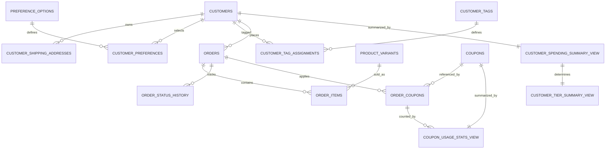
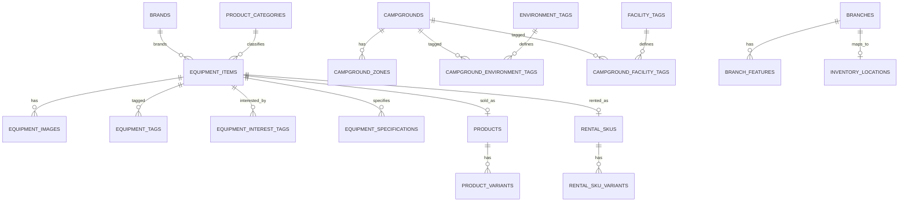
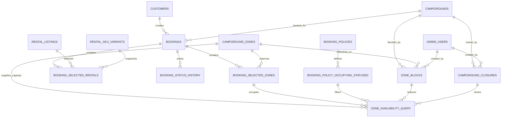
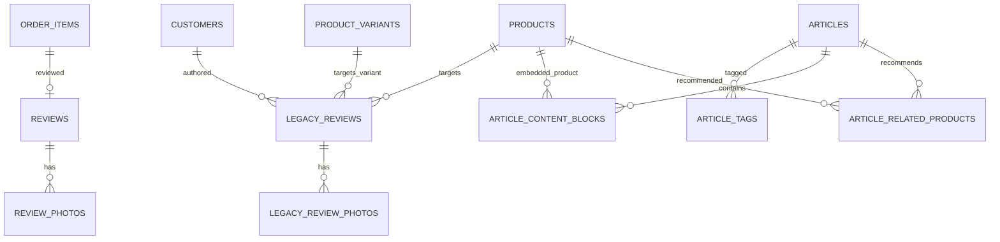
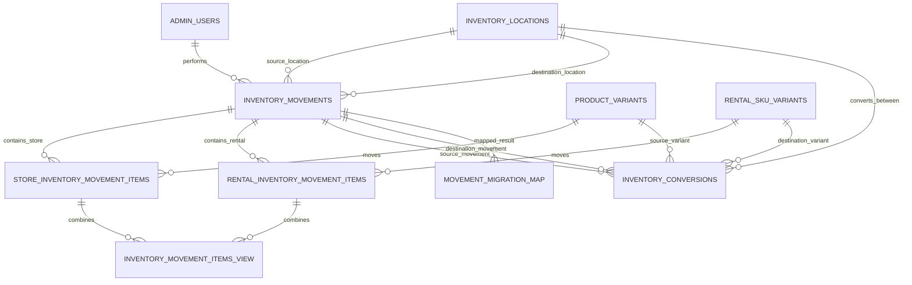

# Yuruicamp 資料庫正規化專案計畫

> 狀態：規劃稿，尚未修改正式 `DDL`、前端或 `Spring Boot`  
> 目標資料庫：`PostgreSQL`  
> 基準日期：`2026-07-13`  
> 目標產物：最終完整結構快照 `docs/schema_copy.sql` 與 `backend/src/main/resources/db/migration/` 編號 migration；兩者通過本文件定義的 `1NF`、`2NF`、`3NF`、升級路徑與資料驗證後，再評估取代 `docs/schema.sql`

## 1. 目標、範圍與非目標

本計畫把目前 `docs/schema.sql` 的資料模型整理成可實作、可遷移、可驗證的關聯式資料庫藍圖。每一個資料對象必須能判斷其主檔、關聯、交易、快照、衍生或設定角色；所有外鍵、刪除策略、索引、約束與計算來源必須明確。

本階段包含：

- 盤點現行 `30` 張資料表、`13` 個 `ENUM`、`JSONB`、快照、衍生欄位與多型關聯。
- 規劃共用裝備、商品、租借、庫位、訂單、預約、政策、評論、文章及異動模型。
- 規劃 `schema_copy.sql`、種子轉換、資料稽核、回歸契約與回復策略。
- 記錄資料庫與 `/data/**/*.json` 的對應、計算來源及欄位用途。

本階段不包含：

- 不修改 `docs/schema.sql`。
- 不實作 `Spring Boot Entity`、`Repository`、`Service` 或 `Controller`。
- 不修改前端頁面、`CSS`、`UI` 或圖片。
- 不直接改寫 `/data/**/*.json`。
- 不將 `FAQ`、`PARTNER_DATA`、`rental-guide` 納入資料庫。

## 2. 來源順位與衝突裁決

| 順位 | 來源                  | 用途                                       |
| ---: | --------------------- | ------------------------------------------ |
|    1 | `docs/schema.sql`     | 現行目標 `DDL` 與本計畫的比較基線          |
|    2 | `docs/database/*.md`  | 欄位語意、已知問題與候選修正               |
|    3 | `data/**`             | 實際輸入形狀、值域、可空性與舊資料遷移依據 |
|    4 | `docs/database-er.md` | 現行關聯與歷史定案                         |
|    5 | `plans/**`            | 假資料整合、遷移順序與既有驗證契約         |
|    6 | 前端程式              | 現行欄位讀寫、計算與相容性需求             |

若來源衝突，先保留 `docs/schema.sql` 作為「現況」，不得把候選文件當成已完成結構；目標設計則以關聯完整性、交易歷史不可變性及實際資料可遷移性裁決。任何裁決都要寫進 `P0` 決策紀錄。

已確認的衝突：

1. `docs/database/rentals.md` 已把租借庫存改成 `location_id`，但部分 `UNIQUE` 與索引仍引用不存在的 `campground_id`；目標統一使用 `location_id`。
2. `rental_listings` 的地點定案為只保存 `campground_id`，租借庫存只保存 `location_id`；兩者透過一對一的 `campground_rental_locations` 對照表連接。listing 不直接保存 `location_id` 或 `stock`，避免營區與庫位欄位彼此錯配。
3. `coupons` 現行以 `code` 為主鍵，候選文件改為數字 `id`；目標採不可變 `id` 為主鍵、`code UNIQUE` 為業務鍵，交易快照保存 `coupon_code_snapshot`。
4. 現行 `products` 與 `rental_skus` 互相引用且租借變體依賴販售變體；目標用 `equipment_items` 共用身份，販售與租借各有自己的變體。
5. 評論模型定案以 `reviews.order_item_id` 作為正式評論唯一權威關聯，不重複保存會員、訂單、商品或變體 FK。現有 `38` 筆評論只有 `REV031` 可唯一對應訂單明細，其餘 `37` 筆進入唯讀 `legacy_reviews`，不得猜測或捏造 FK。
6. `.agents/agents.md` 內的 `componenets/*` 路徑拼字不存在；實際檔案位於 `components/*`。
7. 專案目前沒有 `schema_copy.sql`；此檔是 `P0` 後才建立的實作產物。

### 2.1 決策閘門

決策狀態：

- `PROPOSED`：已有建議方案，但尚未核准。
- `APPROVED`：已核准，可以作為 DDL 與遷移依據。
- `BLOCKED`：缺少資料或業務決策，禁止執行受影響階段。
- `REJECTED`：方案不採用，必須提出替代方案。

只有狀態為 `APPROVED` 的決策，才能被後續階段使用。

| 決策 ID | 決策問題                                | 預設方案                                                                                                                                                                          | 決策期限   | 影響階段   | 未核准時禁止執行 | 狀態     |
| ------- | --------------------------------------- | --------------------------------------------------------------------------------------------------------------------------------------------------------------------------------- | ---------- | ---------- | ---------------- | -------- |
| D-001   | 會員等級代碼與門檻                      | 保留目前前端代碼 `explorer`、`guide`、`master`；等級由完成訂單總額衍生，不存入 `customers`                                                                                        | 進入 P1 前 | P1、P4、P7 | P1               | PROPOSED |
| D-002   | 是否只允許已購買會員評論                | 正式評論只允許已購買會員建立，`order_item_id` 是唯一權威關聯；`REV031` 進正式表，其餘 `37` 筆進唯讀 `legacy_reviews`                                                              | 已定案     | P4、P6、P7 | 無               | APPROVED |
| D-003   | 優惠券使用量認列時間                    | `payment_status = paid`，且訂單狀態為 `unshipped`、`shipped`、`completed` 時認列；退款或退貨是否歸還額度需另外核准                                                                | 進入 P4 前 | P4、P7     | P4               | PROPOSED |
| D-004   | 平日與假日的權威來源                    | 建立台灣日曆／假日設定表；前端計算只作顯示，交易建立時由後端重新計算                                                                                                              | 進入 P4 前 | P4、P5、P7 | P4、P5           | PROPOSED |
| D-005   | 同一庫存異動單是否能混合販售與租借商品  | 不允許混合；不保留共用 `inventory_movement_items`，拆成販售與租借兩張明細表，以固定領域與複合 FK 阻止錯配；跨領域改用 `inventory_conversions`                                     | 已定案     | P5、P6、P7 | 無               | APPROVED |
| D-006   | 營區與租借庫位的對應方式                | 新增 `campground_rental_locations`；`campground_id` 為 PK、`location_id` 為 UNIQUE。listing 只存 `campground_id`，庫存只存 `location_id`；`C001` 只存在庫位主檔                   | 進入 P3 前 | P1、P3、P5 | P3               | APPROVED |
| D-007   | 商品與租借是否共用分類                  | 共用 `product_categories`，由 `equipment_items.category_id` 引用                                                                                                                  | 進入 P2 前 | P2、P3     | P2               | PROPOSED |
| D-008   | 主檔是否允許物理刪除                    | 商品、裝備、租借、會員、營區、品牌只允許停用；有交易引用時禁止物理刪除                                                                                                            | 進入 P1 前 | P1 至 P7   | P1               | PROPOSED |
| D-009   | 是否提供賣家／官方評論回覆              | 不提供任何賣家或官方回覆功能；不建立 `review_replies`，並從目標 `reviews` 移除 `replied` 與全部 `reply_*`、`replied_*` 欄位                                                       | 已定案     | P6、P7     | 無               | APPROVED |
| D-010   | 庫存保留量的真相來源                    | 販售與租借各自建立 reservation ledger；庫存餘額表不保存 `reserved_quantity`；可用量由 active reservation 彙總，所有建立、履行、釋放須在同一 DB transaction 並使用 idempotency key | 已定案     | P2 至 P7   | 無               | APPROVED |
| D-011   | 販售保留生命週期、逾期與出貨庫位        | 購物車不保留、訂單送出建立保留、出貨轉 fulfilled、取消／逾期釋放、退貨以異動單決定入庫；仍須核准逾期時間、庫位分配、拆單與退貨檢查流程                                            | 進入 P4 前 | P4、P5、P7 | P4、P5           | BLOCKED  |
| D-012   | 文章公開作者是否關聯後台帳號            | `articles.author` 保持公開筆名文字，不關聯 `admin_users`；未來若需發布稽核，另增 `published_by` FK，不混用公開作者名稱                                                            | 已定案     | P6、P7     | 無               | APPROVED |
| D-013   | 遷移映射表是否留在正式業務 schema       | `movement_migration_map` 只用於遷移與驗收；P7 完成後封存到 migration schema，不留在正式業務 schema                                                                                | 已定案     | P5、P7     | 無               | APPROVED |
| D-014   | 完整 schema 快照與實際 migration 的責任 | `schema_copy.sql` 只作最終完整快照；實際升級由 Flyway 編號 migration 執行 expand、backfill、validate、switch、停止舊寫入與 contract；已執行 migration 永不改寫                    | 已定案     | P0 至 P7   | 無               | APPROVED |

## 3. 正規化與資料角色規則

### 3.1 判斷標籤

- `[主檔]`：描述可重複被交易引用的穩定身份，例如會員、裝備、營區、品牌。
- `[關聯]`：處理多對多或父子集合，一列只表達一個關係，例如會員標籤。
- `[交易]`：保存業務事件與狀態，例如訂單、預約、庫存異動。
- `[快照]`：交易成立時由伺服器複製的歷史顯示或對帳值；不可回寫主檔。
- `[衍生]`：可由真相資料計算的值；優先使用 `VIEW` 或查詢，不由人員手改。
- `[設定]`：系統規則與允許值，例如預約政策、分類及標籤選項。

### 3.2 `1NF`、`2NF`、`3NF` 驗收規則

- `1NF`：一欄一值；會被篩選、關聯、統計或驗證的陣列、物件與 map 必須拆表。純不可查詢的外部 payload 才能例外保留 `JSONB`，且需有型別 `CHECK`。
- `2NF`：複合鍵表的非鍵欄位必須依賴完整複合鍵；庫存量依賴「變體 + 庫位」，不可只依賴其中一側。
- `3NF`：非鍵欄位不可依賴另一非鍵欄位；例如 `tier_name` 不依賴 `tier` 存在會員列，品牌名稱不放在商品列。
- 合理快照不視為正規化違規，但名稱必須以 `_snapshot` 結尾，並記錄寫入來源與不可變規則。
- 衍生欄位若為效能而實體化，必須標示真相來源、刷新方式、負責元件與一致性稽核。

## 4. 現況資料表稽核

下表以現行 `docs/schema.sql` 為準。「缺少索引」只列外鍵或主要查詢鍵尚未有明確索引者；`PostgreSQL` 不會因建立 FK 自動建立引用端索引。

| 現行表                      | 分類與用途              | PK      | FK                                                   | UNIQUE / CHECK                                    | JSONB                                               | 快照 / 衍生 / 多型                                       | 缺少索引                                    | 依賴文件                            |
| --------------------------- | ----------------------- | ------- | ---------------------------------------------------- | ------------------------------------------------- | --------------------------------------------------- | -------------------------------------------------------- | ------------------------------------------- | ----------------------------------- |
| `customers`                 | `[主檔]` 會員           | `id`    | 無                                                   | `email` 唯一；多個數值缺非負檢查                  | `preferences`、`shipping_address`、`tags`           | `total_spent`、`tier`、`tier_name` 為衍生／傳遞相依      | `auth_provider` 視查詢需求                  | `customer.md`、`customers.json`     |
| `products`                  | `[主檔]` 販售商品       | `id`    | `rental_id`                                          | 價格缺非負檢查                                    | `interest_tags`、`images`、`specifications`、`tags` | `total_stock` 衍生；與租借循環依賴                       | `rental_id`                                 | `products.md`、`products.json`      |
| `product_variants`          | `[主檔]` 販售 SKU       | `id`    | `product_id`                                         | `(product_id, sku)`；價格缺非負檢查               | `branch_stock`                                      | 庫存 map 違反 `1NF`                                      | 無主要缺漏                                  | `product_variants.md`               |
| `campgrounds`               | `[主檔]` 可預約營區     | `id`    | 無                                                   | 名稱未定唯一策略                                  | `environment_tags`、`facility_tags`                 | 多值標籤                                                 | 無主要缺漏                                  | `booking-campground.md`             |
| `campground_zones`          | `[主檔]` 營位區         | `id`    | `campground_id`                                      | 數量、容量、價格缺非負／正數檢查                  | 無                                                  | 無                                                       | 無主要缺漏                                  | `booking-zones.md`                  |
| `rental_skus`               | `[主檔]` 租借群組       | `id`    | `product_id`                                         | 未限制一商品一租借主檔                            | 無                                                  | 重複商品名稱、品牌、分類、圖片                           | `product_id`                                | `rentals.md`                        |
| `rental_sku_variant_stocks` | `[交易]` 租借庫存餘額   | `id`    | `rental_sku_id`、`variant_id`；`campground_id` 無 FK | 三欄唯一；數量缺非負檢查                          | 無                                                  | `C001` 特例造成參照失效                                  | `rental_sku_id`、`campground_id` 單欄查詢   | `rentals.md`                        |
| `rental_listings`           | `[設定]` 租借供應與價格 | `id`    | 租借、商品、販售變體、營區                           | `(campground_id, variant_id)`；金額缺完整檢查     | 無                                                  | 顯示欄位重複；`stock` 衍生                               | `rental_sku_id`、`product_id`、`variant_id` | `rentals.md`、`camp-equipment.json` |
| `coupons`                   | `[主檔]` 優惠券         | `code`  | 無                                                   | 日期、數量、折扣缺完整檢查                        | 無                                                  | `used` 衍生                                              | `status`、有效期間依查詢需求                | `coupons.md`                        |
| `orders`                    | `[交易]` 訂單表頭       | `id`    | `customer_id`                                        | 缺金額公式及非負檢查                              | 無                                                  | 買家與地址快照未語意命名；金額為成交快照                 | 無主要缺漏                                  | `orders.md`、`snapshot-fields.md`   |
| `order_items`               | `[交易][快照]` 訂單明細 | `id`    | 訂單、商品、販售變體                                 | `quantity > 0`                                    | 無                                                  | 顯示、價格快照未以 `_snapshot` 命名                      | `product_id`、`variant_id`                  | `order_item.md`                     |
| `order_history`             | `[交易]` 訂單歷程       | `id`    | `order_id`                                           | 無狀態結構約束                                    | 無                                                  | `action` 自由文字                                        | `order_id`                                  | `orders.json`                       |
| `order_coupons`             | `[交易][快照]` 用券紀錄 | `id`    | `order_id`、`coupon_code`                            | 缺防重與非負檢查                                  | 無                                                  | 券碼、型別、折扣快照語意混淆                             | `order_id`、`coupon_code`                   | `coupons.md`                        |
| `bookings`                  | `[交易]` 預約表頭       | `id`    | 會員、營區                                           | 只有日期先後檢查                                  | 無                                                  | 營區資料與金額快照；`total_days` 衍生                    | 無主要缺漏                                  | `bookings.md`                       |
| `booking_selected_zones`    | `[交易][快照]` 預約營位 | `id`    | 預約、營位區                                         | `quantity > 0`                                    | 無                                                  | `zone_type` 快照；`subtotal` 可推導但缺價格快照          | `booking_id`、`zone_id`                     | `booking-zones.md`                  |
| `booking_selected_rentals`  | `[交易][快照]` 預約租借 | `id`    | 預約、listing、租借、商品、販售變體                  | `quantity > 0`                                    | 無                                                  | FK 過多且依賴販售；快照未命名                            | 所有 FK                                     | `bookings.md`、`rentals.md`         |
| `booking_history`           | `[交易]` 預約歷程       | `id`    | `booking_id`                                         | 無狀態結構約束                                    | 無                                                  | `action` 自由文字                                        | `booking_id`                                | `bookings.md`                       |
| `booking_policies`          | `[設定]` 預約政策       | `id`    | 無                                                   | 未真正限制單例與數值範圍                          | 三欄                                                | 規則集合違反嚴格 `1NF`                                   | 無主要缺漏                                  | `booking_policies.md`               |
| `zone_blocks`               | `[設定]` 營位停售       | `id`    | 營區、營位區；建立者無 FK                            | 缺日期、數量與營區／營位一致性檢查                | 無                                                  | 無                                                       | `campground_id`、`zone_id`、日期範圍        | `booking-zones.md`                  |
| `campground_closures`       | `[設定]` 營區公休       | `id`    | 營區；建立者無 FK                                    | 缺依 `type` 決定欄位的互斥檢查                    | 無                                                  | 無                                                       | `campground_id`、日期範圍                   | `booking-campground.md`             |
| `min_stocks`                | `[設定]` 最低庫存       | `id`    | 無                                                   | 三欄唯一；數量缺非負                              | 無                                                  | `target_type + target_id` 多型；`location_key` 自由文字  | `target_id` 無法可靠索引到目標              | `min_stocks.md`                     |
| `reviews`                   | `[交易][快照]` 評論     | `id`    | 會員、商品、變體、訂單                               | 評分檢查                                          | `photos`                                            | 多張照片；多個顯示快照未命名；現行官方回覆欄位不納入目標 | 所有 FK 與 `created_at`                     | `reviews.md`                        |
| `movements`                 | `[交易]` 異動單頭       | `id`    | `employee_id` 無 FK                                  | 無                                                | 無                                                  | 員工參照失效                                             | `employee_id`                               | `admin-movement.md`                 |
| `movement_items`            | `[交易][快照]` 異動明細 | `id`    | 異動、商品                                           | 無數量正數；商品可空                              | 無                                                  | 來源／目的庫位為文字；商品名稱快照                       | `movement_id`、`product_id`                 | `admin-movement.md`                 |
| `articles`                  | `[主檔]` 文章           | `id`    | 作者無 FK                                            | 分類、閱讀時間缺檢查                              | `tags`                                              | 作者名稱／頭像可能重複                                   | 分類、發布日；標籤若暫留需 `GIN`            | `blog-aritcle.md`                   |
| `article_content_blocks`    | `[關聯]` 文章內容區塊   | `id`    | 文章、商品                                           | 缺 `(article_id, sort_order)` 與 payload 互斥檢查 | 無                                                  | 無                                                       | `article_id`、`product_id`                  | `blog-aritcle.md`                   |
| `article_related_products`  | `[關聯]` 推薦商品       | 複合 PK | 文章、商品                                           | 複合 PK                                           | 無                                                  | 無                                                       | `product_id`                                | `blog-aritcle.md`                   |
| `brands`                    | `[主檔]` 品牌           | `id`    | 無                                                   | 名稱未唯一                                        | 無                                                  | 現行未被商品 FK 引用                                     | `sort_order` 視需求                         | `products.md`、`brands.json`        |
| `branches`                  | `[主檔]` 門市           | `id`    | 無                                                   | 座標缺範圍檢查                                    | 無                                                  | 無                                                       | 無主要缺漏                                  | `branches.md`                       |
| `branch_features`           | `[關聯]` 門市特色       | `id`    | `branch_id`                                          | 缺 `(branch_id, feature)`                         | 無                                                  | 無                                                       | `branch_id`                                 | `branches.md`                       |

## 5. 目標模型與欄位字典

### 5.1 共用主檔與會員

| 目標表                        | 分類          | 核心欄位與用途                                                                                        | 約束、刪除策略與索引                                          | JSON 對應                           |
| ----------------------------- | ------------- | ----------------------------------------------------------------------------------------------------- | ------------------------------------------------------------- | ----------------------------------- |
| `admin_users`                 | `[主檔]`      | `id`、`name`、`email`、`role`、`active`、時間欄                                                       | `email UNIQUE`；歷史引用 `ON DELETE RESTRICT`；`role` 索引    | `movement.employeeId`、`createdBy`  |
| `customers`                   | `[主檔]`      | 身份、聯絡、生日、點數、OAuth；移除 `preferences`、`shipping_address`、`tags`、`total_spent`、`tier*` | `email UNIQUE`；`points >= 0`；交易引用採 `RESTRICT` 與軟刪除 | `customers.json` 基本欄位           |
| `customer_shipping_addresses` | `[主檔]`      | 收件人、郵遞區號、縣市、區域、地址、電話、`is_default`                                                | 會員刪除 `CASCADE`；部分唯一索引保證每會員最多一個預設地址    | `shippingAddress`                   |
| `preference_options`          | `[設定]`      | `id`、`type`、`label`、排序、啟用                                                                     | `type CHECK`；`(type, label) UNIQUE`                          | `preferences.styles/equipment` 值池 |
| `customer_preferences`        | `[關聯]`      | `customer_id + preference_id`                                                                         | 複合 PK；會員 `CASCADE`、選項 `RESTRICT`；反向 FK 索引        | `preferences.*[]`                   |
| `customer_tags`               | `[設定]`      | `id`、名稱、顏色、排序、啟用                                                                          | 名稱唯一；停用代替刪除                                        | `tagColorMap`                       |
| `customer_tag_assignments`    | `[關聯]`      | `customer_id + tag_id`                                                                                | 複合 PK；兩端 FK；`tag_id` 索引                               | `customers.tags[]`                  |
| `customer_spending_summary`   | `[衍生] VIEW` | 完成且未退款訂單總額                                                                                  | 真相為 `orders`；不得人工更新                                 | `totalSpent` 相容輸出               |
| `customer_tier_summary`       | `[衍生] VIEW` | 依消費門檻輸出 `tier_code`、`tier_name`                                                               | 門檻需在 `P0` 定案；不得存回會員列                            | `tier`、`tierName` 相容輸出         |

### 5.2 裝備、商品、營區、標籤與庫存

| 目標表                                                     | 分類     | 核心欄位與用途                       | 約束、刪除策略與索引                                                                                   | JSON 對應                                         |
| ---------------------------------------------------------- | -------- | ------------------------------------ | ------------------------------------------------------------------------------------------------------ | ------------------------------------------------- |
| `brands`                                                   | `[主檔]` | 品牌身份與顯示                       | `name UNIQUE`；被引用時 `RESTRICT`                                                                     | `brands.json`、商品品牌文字                       |
| `product_categories`                                       | `[設定]` | 分類身份、名稱、排序、啟用           | `name UNIQUE`；被引用時 `RESTRICT`                                                                     | 商品／租借分類文字                                |
| `equipment_items`                                          | `[主檔]` | 共用裝備名稱、分類、品牌、主圖、描述 | `category_id`、`brand_id` FK 並建索引；以停用代替刪除                                                  | `products` 與 `rental-skus` 共用欄位              |
| `equipment_images`                                         | `[關聯]` | `item_id`、順序、URL、替代文字       | 複合 PK；父刪除 `CASCADE`；URL 非空                                                                    | `products.images[]`                               |
| `equipment_tags`                                           | `[關聯]` | 一列一個裝備標籤                     | 複合 PK；標籤查詢索引                                                                                  | `products.tags[]`                                 |
| `equipment_interest_tags`                                  | `[關聯]` | 一列一個興趣標籤                     | 複合 PK；反向索引                                                                                      | `interestTags[]`                                  |
| `equipment_specifications`                                 | `[關聯]` | `item_id`、規格鍵、值                | 複合 PK；規格鍵索引                                                                                    | `specifications` 物件                             |
| `products`                                                 | `[主檔]` | `id`、`item_id`、參考售價、狀態      | `item_id UNIQUE`；價格非負；父裝備 `RESTRICT`                                                          | `products.json` 販售欄位                          |
| `product_variants`                                         | `[主檔]` | 販售 SKU、顏色、尺寸、價格           | `sku UNIQUE`；`product_id` 索引；價格非負；父商品 `RESTRICT`                                           | `products.variants[]`                             |
| `campgrounds`                                              | `[主檔]` | 可預約營區基本資料                   | 不包含 `C001`；歷史交易存在時 `RESTRICT`                                                               | `campgrounds.json`                                |
| `campground_zones`                                         | `[主檔]` | 營位類型、容量、價格、總數           | 容量正數、價格與站數非負；`campground_id` 索引                                                         | `campgrounds.zones[]`                             |
| `environment_tags` / `facility_tags`                       | `[設定]` | 標籤代碼、名稱、排序、啟用           | 代碼與名稱唯一；停用代替刪除                                                                           | 營區兩類標籤值池                                  |
| `campground_environment_tags` / `campground_facility_tags` | `[關聯]` | 營區與標籤多對多                     | 複合 PK；標籤端反向索引                                                                                | 兩個標籤陣列                                      |
| `branches`                                                 | `[主檔]` | 門市基本資料與座標                   | 緯度、經度範圍檢查；被庫位引用時 `RESTRICT`                                                            | `branches.json`                                   |
| `branch_features`                                          | `[關聯]` | 門市的一項服務／特色                 | `(branch_id, feature) UNIQUE`；父刪除 `CASCADE`                                                        | `features[]`                                      |
| `inventory_locations`                                      | `[主檔]` | 倉庫、門市、營區、維修、報廢庫位     | `code UNIQUE`；分店可用 `branch_id`，營區租借關係改由 `campground_rental_locations` 管理；所有 FK 索引 | `main`、`branch-*`、`C001-C009`                   |
| `inventory_stocks`                                         | `[交易]` | 販售變體於庫位的實體現有量           | 複合 PK；`on_hand_quantity >= 0`；變體反向索引；不保存 `reserved_quantity`                             | `variants[].branch`                               |
| `product_stock_reservations`                               | `[交易]` | 訂單品項於庫位的販售庫存保留明細     | FK 指向訂單品項、販售變體與庫位；數量正數；idempotency key 唯一；active 查詢索引                       | 新系統交易產生，現有訂單不回填 active reservation |
| `product_variant_min_stocks`                               | `[設定]` | 販售變體於庫位的最低量               | 複合 PK；數量非負；兩端 FK                                                                             | `min-stock.store`                                 |

### 5.3 租借模型

| 目標表                          | 分類          | 核心欄位與用途                                   | 約束、刪除策略與索引                                                             | JSON 對應                        |
| ------------------------------- | ------------- | ------------------------------------------------ | -------------------------------------------------------------------------------- | -------------------------------- |
| `rental_skus`                   | `[主檔]`      | `id`、`item_id`、狀態、時間欄                    | `item_id UNIQUE`；裝備 `RESTRICT`；狀態檢查                                      | `rental-skus.json` 群組          |
| `rental_sku_variants`           | `[主檔]`      | 租借 SKU、顏色、尺寸、標籤、變體圖               | `sku UNIQUE`；`rental_sku_id` 索引；父租借 `RESTRICT`                            | `rental-skus.variants[]`         |
| `campground_rental_locations`   | `[關聯]`      | 營區與租借出貨庫位的一對一映射                   | `campground_id` 為 PK；`location_id UNIQUE`；兩端 FK 均採 `RESTRICT`             | `C002-C009` 與庫位 seed          |
| `rental_sku_variant_stocks`     | `[交易]`      | 租借變體於庫位的實體現有量                       | 複合 PK `(rental_sku_variant_id, location_id)`；現有量非負；兩個反向索引         | `variants[].camp[]`              |
| `rental_stock_reservations`     | `[交易]`      | 預約租借明細於指定日期區間的保留紀錄             | FK 指向預約租借明細、租借變體與庫位；日期區間合法；數量正數；active 區間查詢索引 | 由現有 bookings 與租借明細推導   |
| `rental_sku_variant_min_stocks` | `[設定]`      | 租借變體於庫位的最低量                           | 複合 PK；數量非負                                                                | `min-stock.rental`               |
| `rental_listings`               | `[設定]`      | 營區提供哪個租借變體、平假日價、折扣、地形、啟用 | `(campground_id, rental_sku_variant_id) UNIQUE`；金額非負；各 FK 索引            | `camp-equipment.json` 非衍生欄位 |
| `rental_listing_view`           | `[衍生] VIEW` | 組合裝備顯示、租借變體、價格與庫存               | 真相為 listing、主檔與租借庫存；唯讀                                             | `camp-equipment.json` 相容形狀   |

#### 5.3.1 營區與租借庫位定案

定案規則：

- `rental_listings` 保存「哪個營區提供哪個租借變體」，只使用 `campground_id`。
- `rental_sku_variant_stocks` 保存「租借變體實際位於哪個庫位」，只使用 `location_id`。
- `campground_rental_locations` 負責將一個可租借營區對應到一個唯一租借庫位。
- `campground_id PRIMARY KEY` 保證一個營區最多對應一個租借庫位。
- `location_id UNIQUE` 保證一個租借庫位不能同時屬於兩個營區。
- `location_id` 必須指向 `inventory_locations.type = 'campground'` 的庫位；因跨表型別不能用一般 `CHECK` 保證，`P3` migration 必須使用 constraint trigger 或等價的庫位子型別表實作，不能只依賴前端驗證。
- `C002-C009` 必須各有一筆對照；`C001` 是租借主倉，只存在 `inventory_locations`，不得進入 `campground_rental_locations`。
- listing 不保存 `location_id` 或 `stock`；API 不接受前端傳入這兩個值。

##### campground_rental_locations

```sql
CREATE TABLE campground_rental_locations (
  campground_id VARCHAR(32) PRIMARY KEY,
  location_id   VARCHAR(32) NOT NULL UNIQUE,

  CONSTRAINT fk_campground_rental_locations_campground
    FOREIGN KEY (campground_id)
    REFERENCES campgrounds(id)
    ON UPDATE CASCADE
    ON DELETE RESTRICT,

  CONSTRAINT fk_campground_rental_locations_location
    FOREIGN KEY (location_id)
    REFERENCES inventory_locations(id)
    ON UPDATE CASCADE
    ON DELETE RESTRICT
);
```

`PRIMARY KEY (campground_id)` 與 `UNIQUE (location_id)` 已分別提供索引，不得建立重複單欄索引。

##### rental_listings

```sql
CREATE TABLE rental_listings (
  id                     VARCHAR(32) PRIMARY KEY,
  rental_sku_variant_id  VARCHAR(64) NOT NULL,
  campground_id          VARCHAR(32) NOT NULL,
  terrain_tag            VARCHAR(128),
  description            TEXT,
  price_per_day_weekday  NUMERIC(12, 2) NOT NULL DEFAULT 0,
  price_per_day_holiday  NUMERIC(12, 2) NOT NULL DEFAULT 0,
  discount               NUMERIC(12, 2) NOT NULL DEFAULT 0,
  is_active              BOOLEAN NOT NULL DEFAULT TRUE,

  CONSTRAINT fk_rental_listings_variant
    FOREIGN KEY (rental_sku_variant_id)
    REFERENCES rental_sku_variants(id)
    ON UPDATE CASCADE
    ON DELETE RESTRICT,

  CONSTRAINT fk_rental_listings_campground_location
    FOREIGN KEY (campground_id)
    REFERENCES campground_rental_locations(campground_id)
    ON UPDATE CASCADE
    ON DELETE RESTRICT,

  CONSTRAINT uq_rental_listings_camp_variant
    UNIQUE (campground_id, rental_sku_variant_id),

  CONSTRAINT ck_rental_listings_prices
    CHECK (
      price_per_day_weekday >= 0
      AND price_per_day_holiday >= 0
      AND discount >= 0
    )
);

CREATE INDEX idx_rental_listings_variant
  ON rental_listings(rental_sku_variant_id);
```

`campground_id` 已由 `uq_rental_listings_camp_variant` 的左前綴提供索引，不重複建立單欄索引。

##### rental_sku_variant_stocks

```sql
CREATE TABLE rental_sku_variant_stocks (
  rental_sku_variant_id VARCHAR(64) NOT NULL,
  location_id           VARCHAR(32) NOT NULL,
  on_hand_quantity      INTEGER NOT NULL DEFAULT 0,
  updated_at            TIMESTAMPTZ NOT NULL DEFAULT NOW(),

  CONSTRAINT pk_rental_sku_variant_stocks
    PRIMARY KEY (rental_sku_variant_id, location_id),

  CONSTRAINT fk_rental_variant_stocks_variant
    FOREIGN KEY (rental_sku_variant_id)
    REFERENCES rental_sku_variants(id)
    ON UPDATE CASCADE
    ON DELETE RESTRICT,

  CONSTRAINT fk_rental_variant_stocks_location
    FOREIGN KEY (location_id)
    REFERENCES inventory_locations(id)
    ON UPDATE CASCADE
    ON DELETE RESTRICT,

  CONSTRAINT ck_rental_variant_stocks_quantity
    CHECK (on_hand_quantity >= 0)
);

CREATE INDEX idx_rental_variant_stocks_location
  ON rental_sku_variant_stocks(location_id);
```

現行 `docs/database/rentals.md` 內引用不存在 `campground_id` 的 `UNIQUE` 與索引，在實作階段必須改成上述 `(rental_sku_variant_id, location_id)`。

##### rental_listing_view

```sql
CREATE VIEW rental_listing_view AS
SELECT
  rl.id,
  rl.campground_id,
  rl.rental_sku_variant_id,
  rl.price_per_day_weekday,
  rl.price_per_day_holiday,
  rl.discount,
  crl.location_id,
  COALESCE(stock.on_hand_quantity, 0) AS stock
FROM rental_listings rl
JOIN campground_rental_locations crl
  ON crl.campground_id = rl.campground_id
LEFT JOIN rental_sku_variant_stocks stock
  ON stock.rental_sku_variant_id = rl.rental_sku_variant_id
 AND stock.location_id = crl.location_id;
```

##### Seed 與驗證要求

- 建立一個 `C001` 主倉庫位，以及 `C002-C009` 各一個營區租借庫位。
- `campground_rental_locations` 必須有 `8` 筆 `C002-C009` 對照。
- 對照表中的 `location_id` 必須全部為 `type = 'campground'`，型別錯誤筆數必須為 `0`。
- 所有 listing 必須能透過 `campground_id` 找到唯一 `location_id`。
- 所有 listing 與租借庫存的 JOIN 最多只能取得一筆庫存列。
- `rental_listing_view` 與 `camp-equipment.json` 的 listing ID、營區、租借變體、價格與實體庫存差異必須為 `0`；日期區間可用量另由 reservation 查詢驗證。
- 建立 listing 時，應用程式只接受 `campgroundId` 與 `rentalSkuVariantId`；後端自行解析庫位。
- 修改庫存時只能寫入 `rental_sku_variant_stocks`，禁止修改 listing。

##### P3 完整性驗證 SQL

所有可預約營區都必須有一個租借庫位：

```sql
SELECT c.id
FROM campgrounds c
LEFT JOIN campground_rental_locations crl
  ON crl.campground_id = c.id
WHERE crl.campground_id IS NULL;
```

通過條件：結果為 `0` 筆。

所有 listing 都必須能找到對應庫位：

```sql
SELECT rl.id
FROM rental_listings rl
LEFT JOIN campground_rental_locations crl
  ON crl.campground_id = rl.campground_id
WHERE crl.location_id IS NULL;
```

通過條件：結果為 `0` 筆。

listing 對應的租借庫存不得出現多筆：

```sql
SELECT
  rl.id,
  COUNT(stock.*) AS stock_row_count
FROM rental_listings rl
JOIN campground_rental_locations crl
  ON crl.campground_id = rl.campground_id
LEFT JOIN rental_sku_variant_stocks stock
  ON stock.rental_sku_variant_id = rl.rental_sku_variant_id
 AND stock.location_id = crl.location_id
GROUP BY rl.id
HAVING COUNT(stock.*) > 1;
```

通過條件：結果為 `0` 筆。

營區租借庫位的類型必須正確，且 `C001` 不得進入對照表：

```sql
SELECT
  crl.campground_id,
  crl.location_id,
  location.type
FROM campground_rental_locations crl
JOIN inventory_locations location
  ON location.id = crl.location_id
WHERE location.type <> 'campground'
   OR crl.campground_id = 'C001';
```

通過條件：結果為 `0` 筆。

##### API 寫入與輸出規則

- 建立 listing 時，關聯識別只接受 `campgroundId` 與 `rentalSkuVariantId`；價格、折扣、地形及說明可依 DTO 契約傳入。
- listing Request 不接受 `locationId`、`stock`、`reservedStock` 或 `availableStock`。
- 後端必須透過 `campground_rental_locations` 將 `campgroundId` 解析成唯一 `locationId`；找不到對照時拒絕建立 listing。
- 實體庫存新增與扣除只能寫入 `rental_sku_variant_stocks`；保留與釋放只能寫入 `rental_stock_reservations`，不得寫入 `rental_listings`。
- listing Response 的 `locationId` 與 `stock` 由 `rental_listing_view` 產生；`reservedStock` 與 `availableStock` 必須帶入 `checkIn/checkOut`，由日期區間 reservation 查詢產生。
- 前端傳入的庫存相關欄位即使存在，也必須被忽略或回傳 `400 Bad Request`，不得成為資料庫真相。

##### 刪除與停用規則

- 營區已有 `campground_rental_locations` 或 listing 引用時，禁止物理刪除，採 `ON DELETE RESTRICT`。
- 租借庫位已有營區對照或租借庫存時，禁止物理刪除，改用 `inventory_locations.is_active = false`。
- 租借變體已有 listing、庫存或歷史預約時，禁止物理刪除，改由租借主檔或變體狀態停用。
- `campground_rental_locations`、`rental_listings` 與 `rental_sku_variant_stocks` 之間不得使用 `ON DELETE CASCADE` 清除庫存。
- 已過帳或已被交易引用的租借庫存不得直接刪除；數量修正必須透過庫存異動紀錄完成。

##### 定案關係

```text
campgrounds
    1
    |
    1
campground_rental_locations
    |
    1
inventory_locations
    |
    N
rental_sku_variant_stocks

rental_listings
    ├─ campground_id
    └─ rental_sku_variant_id
```

#### 5.3.2 庫存保留紀錄定案

`D-010` 定案：販售與租借的 reservation ledger 必須分表。`inventory_stocks` 與 `rental_sku_variant_stocks` 只保存實體現有量，不保存 `reserved_quantity`。任何 `reservedStock` 或 `availableStock` 都是衍生值，不可由人員或前端直接寫入。

##### 共用保留狀態

```sql
CREATE TYPE stock_reservation_status AS ENUM (
  'active',
  'released',
  'fulfilled',
  'expired'
);
```

##### 販售實體庫存

```sql
CREATE TABLE inventory_stocks (
  location_id      VARCHAR(32) NOT NULL,
  variant_id       VARCHAR(64) NOT NULL,
  on_hand_quantity INTEGER NOT NULL DEFAULT 0,
  updated_at       TIMESTAMPTZ NOT NULL DEFAULT NOW(),

  CONSTRAINT pk_inventory_stocks
    PRIMARY KEY (location_id, variant_id),

  CONSTRAINT fk_inventory_stocks_location
    FOREIGN KEY (location_id)
    REFERENCES inventory_locations(id)
    ON UPDATE CASCADE
    ON DELETE RESTRICT,

  CONSTRAINT fk_inventory_stocks_variant
    FOREIGN KEY (variant_id)
    REFERENCES product_variants(id)
    ON UPDATE CASCADE
    ON DELETE RESTRICT,

  CONSTRAINT ck_inventory_stocks_on_hand
    CHECK (on_hand_quantity >= 0)
);

CREATE INDEX idx_inventory_stocks_variant
  ON inventory_stocks(variant_id);
```

##### 販售保留紀錄

`order_items` 必須先建立 `UNIQUE (id, variant_id)`，讓 reservation 使用複合 FK 保證保留的變體就是該訂單品項的變體。

```sql
CREATE TABLE product_stock_reservations (
  id              BIGSERIAL PRIMARY KEY,
  order_item_id   BIGINT NOT NULL,
  variant_id      VARCHAR(64) NOT NULL,
  location_id     VARCHAR(32) NOT NULL,
  quantity        INTEGER NOT NULL,
  status          stock_reservation_status NOT NULL DEFAULT 'active',
  idempotency_key VARCHAR(128) NOT NULL,
  reserved_at     TIMESTAMPTZ NOT NULL DEFAULT NOW(),
  expires_at      TIMESTAMPTZ,
  released_at     TIMESTAMPTZ,
  fulfilled_at    TIMESTAMPTZ,

  CONSTRAINT fk_product_reservations_order_item_variant
    FOREIGN KEY (order_item_id, variant_id)
    REFERENCES order_items(id, variant_id)
    ON UPDATE CASCADE
    ON DELETE RESTRICT,

  CONSTRAINT fk_product_reservations_location
    FOREIGN KEY (location_id)
    REFERENCES inventory_locations(id)
    ON UPDATE CASCADE
    ON DELETE RESTRICT,

  CONSTRAINT uq_product_reservations_idempotency
    UNIQUE (idempotency_key),

  CONSTRAINT ck_product_reservations_quantity
    CHECK (quantity > 0),

  CONSTRAINT ck_product_reservations_expiry
    CHECK (expires_at IS NULL OR expires_at > reserved_at),

  CONSTRAINT ck_product_reservations_terminal_time
    CHECK (
      (status = 'active' AND released_at IS NULL AND fulfilled_at IS NULL)
      OR (status IN ('released', 'expired') AND released_at IS NOT NULL AND fulfilled_at IS NULL)
      OR (status = 'fulfilled' AND fulfilled_at IS NOT NULL)
    )
);

CREATE INDEX idx_product_reservations_order_item
  ON product_stock_reservations(order_item_id);

CREATE INDEX idx_product_reservations_active_lookup
  ON product_stock_reservations(variant_id, location_id)
  WHERE status = 'active';
```

一個 `order_item_id` 可以分配到多個 `location_id`，因此出貨庫位不直接放在 `order_items`。同一請求重送時必須使用同一個 `idempotency_key`，避免重複保留。

販售可售量：

```sql
SELECT
  stock.variant_id,
  stock.location_id,
  stock.on_hand_quantity,
  COALESCE(SUM(reservation.quantity) FILTER (
    WHERE reservation.status = 'active'
  ), 0) AS reserved_quantity,
  stock.on_hand_quantity
    - COALESCE(SUM(reservation.quantity) FILTER (
        WHERE reservation.status = 'active'
      ), 0) AS available_quantity
FROM inventory_stocks stock
LEFT JOIN product_stock_reservations reservation
  ON reservation.variant_id = stock.variant_id
 AND reservation.location_id = stock.location_id
GROUP BY stock.variant_id, stock.location_id, stock.on_hand_quantity;
```

##### 租借保留紀錄

`booking_selected_rentals` 必須先建立 `UNIQUE (id, rental_sku_variant_id)`，讓 reservation 使用複合 FK 保證保留的租借變體就是該預約租借明細的變體。

```sql
CREATE TABLE rental_stock_reservations (
  id                         BIGSERIAL PRIMARY KEY,
  booking_selected_rental_id BIGINT NOT NULL,
  rental_sku_variant_id      VARCHAR(64) NOT NULL,
  location_id                VARCHAR(32) NOT NULL,
  check_in                   DATE NOT NULL,
  check_out                  DATE NOT NULL,
  quantity                   INTEGER NOT NULL,
  status                     stock_reservation_status NOT NULL DEFAULT 'active',
  idempotency_key            VARCHAR(128) NOT NULL,
  reserved_at                TIMESTAMPTZ NOT NULL DEFAULT NOW(),
  released_at                TIMESTAMPTZ,
  fulfilled_at               TIMESTAMPTZ,

  CONSTRAINT fk_rental_reservations_booking_item_variant
    FOREIGN KEY (booking_selected_rental_id, rental_sku_variant_id)
    REFERENCES booking_selected_rentals(id, rental_sku_variant_id)
    ON UPDATE CASCADE
    ON DELETE RESTRICT,

  CONSTRAINT fk_rental_reservations_location
    FOREIGN KEY (location_id)
    REFERENCES inventory_locations(id)
    ON UPDATE CASCADE
    ON DELETE RESTRICT,

  CONSTRAINT uq_rental_reservations_idempotency
    UNIQUE (idempotency_key),

  CONSTRAINT ck_rental_reservations_dates
    CHECK (check_out > check_in),

  CONSTRAINT ck_rental_reservations_quantity
    CHECK (quantity > 0),

  CONSTRAINT ck_rental_reservations_no_expired
    CHECK (status <> 'expired'),

  CONSTRAINT ck_rental_reservations_terminal_time
    CHECK (
      (status = 'active' AND released_at IS NULL AND fulfilled_at IS NULL)
      OR (status IN ('released', 'expired') AND released_at IS NOT NULL AND fulfilled_at IS NULL)
      OR (status = 'fulfilled' AND fulfilled_at IS NOT NULL)
    )
);

CREATE INDEX idx_rental_reservations_booking_item
  ON rental_stock_reservations(booking_selected_rental_id);

CREATE INDEX idx_rental_reservations_active_lookup
  ON rental_stock_reservations(
    rental_sku_variant_id,
    location_id,
    check_in,
    check_out
  )
  WHERE status = 'active';
```

指定日期區間的租借可用量必須使用半開區間 `[check_in, check_out)` 判斷重疊：

```sql
SELECT
  stock.on_hand_quantity
    - COALESCE(SUM(reservation.quantity), 0) AS available_quantity
FROM rental_sku_variant_stocks stock
LEFT JOIN rental_stock_reservations reservation
  ON reservation.rental_sku_variant_id = stock.rental_sku_variant_id
 AND reservation.location_id = stock.location_id
 AND reservation.status = 'active'
 AND reservation.check_in < :requested_check_out
 AND reservation.check_out > :requested_check_in
WHERE stock.rental_sku_variant_id = :rental_sku_variant_id
  AND stock.location_id = :location_id
GROUP BY stock.on_hand_quantity;
```

##### 建立、履行與釋放規則

- 放入購物車不建立 reservation。
- 預約正式送出時建立 `rental_stock_reservations`；`pending`、`confirmed` 佔用，`cancelled` 轉 `released`，`completed` 轉 `fulfilled` 並保留歷史。
- 販售訂單正式送出時建立 `product_stock_reservations`；`unshipped` 佔用，`shipped` 在同一交易中扣除 `on_hand_quantity` 並轉 `fulfilled`，`cancelled` 或逾期轉 `released/expired`。
- `returned` 不得直接增加可售量；可再次販售、待檢查、損壞商品分別透過庫存異動進入一般、repair／inspection、damaged 庫位。
- 販售訂單的保留期限、出貨庫位選擇、是否允許拆分多庫位與退貨檢查流程仍屬 `D-011`，未核准前不得執行 `P4`、`P5`。

##### 併發與重複請求

建立 reservation 時，`Spring Boot` 必須在同一個 DB transaction 中：

1. 以 `SELECT ... FOR UPDATE` 鎖定對應庫存列。
2. 重新計算 active reservation 與可用量。
3. 可用量不足時整筆失敗，不得部分寫入。
4. 寫入 reservation；重複請求使用相同 `idempotency_key`，不得重複保留。
5. 履行、取消、逾期與釋放亦須在同一 transaction 更新庫存與 reservation 狀態。

##### 舊資料遷移

- 租借資料可由 booking、租借明細、營區、`check_in/check_out` 與狀態建立歷史 reservation；`pending/confirmed` 回填 active、`completed` 回填 fulfilled、`cancelled` 回填 released。
- 現有販售訂單缺少出貨庫位、保留時間、逾期時間與拆分資訊，不能可靠回填 reservation；既有訂單視為歷史資料，不建立 active `product_stock_reservations`。
- 新系統切換後建立的訂單才開始寫入販售 reservation ledger。

### 5.4 訂單、優惠券與預約交易

| 目標表                     | 分類           | 核心欄位與用途                                                                     | 約束、刪除策略與索引                                                                           | JSON 對應                                           |
| -------------------------- | -------------- | ---------------------------------------------------------------------------------- | ---------------------------------------------------------------------------------------------- | --------------------------------------------------- |
| `orders`                   | `[交易][快照]` | 會員 FK、買家／配送快照、成交金額、付款與訂單狀態                                  | 客戶 `RESTRICT`；金額非負；`total = GREATEST(subtotal + shipping_fee - discount, 0)`；查詢索引 | `orders.json` 表頭                                  |
| `order_items`              | `[交易][快照]` | 訂單 FK、商品與變體 FK、SKU／名稱／規格／品牌／圖／單價快照、數量                  | 訂單 `CASCADE`；主檔 `RESTRICT`；數量正數；`(order_id, variant_id)` 視允許合併策略唯一         | `orders.items[]`                                    |
| `order_status_history`     | `[交易]`       | 訂單、狀態、發生時間、操作者、備註                                                 | 訂單 `CASCADE`；狀態用 `ENUM`；時間索引                                                        | `orders.history[]`                                  |
| `coupons`                  | `[主檔]`       | 不可變 `id`、可變券碼、類型、門檻、發行量、有效期、狀態、分類                      | `code UNIQUE`；金額／數量／日期檢查                                                            | `coupons.json`，移除 `used`                         |
| `order_coupons`            | `[交易][快照]` | 訂單、可空 coupon FK、券碼／類型／面額快照、實際折抵                               | 訂單 `CASCADE`；券刪除 `SET NULL`；防重與非負檢查；FK 索引                                     | 訂單用券快照                                        |
| `coupon_usage_stats`       | `[衍生] VIEW`  | 已使用與剩餘數量                                                                   | 真相為有效訂單的 `order_coupons`                                                               | `coupons.used` 相容輸出                             |
| `bookings`                 | `[交易][快照]` | 會員、營區、營區名稱／地區快照、日期、人數、成交金額、狀態                         | 日期、人數、日數分類、金額公式檢查；主要查詢複合索引                                           | `camp-bookings.json` 表頭、`bookingInfo`、`summary` |
| `booking_selected_zones`   | `[交易][快照]` | 預約、營位區、區型快照、平假日價格快照、數量                                       | 預約 `CASCADE`；營位 `RESTRICT`；數量正數、價格非負；FK 索引                                   | `selectedZones[]`                                   |
| `booking_selected_rentals` | `[交易][快照]` | 預約、listing、租借變體、裝備、SKU／名稱／規格快照、平假日單價快照、折扣快照、數量 | 預約 `CASCADE`；主檔 `RESTRICT`；金額非負；所有 FK 索引                                        | `selectedRentals[]`                                 |
| `booking_status_history`   | `[交易]`       | 預約、狀態、發生時間、操作者、備註                                                 | 預約 `CASCADE`；狀態結構化；時間索引                                                           | `history[]`                                         |

交易金額計算來源：

- 訂單明細小計：`unit_price_snapshot * quantity`。
- `orders.subtotal`：所有訂單明細小計總和。
- `orders.discount`：所有 `order_coupons.amount` 總和。
- `orders.total`：`GREATEST(subtotal + shipping_fee - discount, 0)`。
- 營位明細：`(weekday_count * price_weekday_snapshot + holiday_count * price_holiday_snapshot) * quantity`。
- 租借明細：`GREATEST(weekday_count * price_weekday_snapshot + holiday_count * price_holiday_snapshot - discount_snapshot, 0) * quantity`。
- `bookings.zone_total`、`rental_total`、`applied_discount`、`final_amount` 是成交快照，但只能由單一交易服務計算後寫入；資料庫以 `CHECK` 與稽核查詢驗證。
- `total_days` 不存，查詢時由 `check_out - check_in` 取得；`weekday_count + holiday_count` 必須等於日期差。

### 5.5 政策、可用性、評論、文章與異動

| 目標表                              | 分類           | 核心欄位與用途                                                         | 約束、刪除策略與索引                                                                                             | JSON 對應                      |
| ----------------------------------- | -------------- | ---------------------------------------------------------------------- | ---------------------------------------------------------------------------------------------------------------- | ------------------------------ |
| `booking_policies`                  | `[設定]`       | 單例 `id = 1`、預約窗口、提前日、最多夜、時區、日期邊界、低量門檻      | 數值範圍與單例檢查                                                                                               | `booking-policy.json`          |
| `booking_policy_occupying_statuses` | `[關聯][設定]` | 政策與佔用狀態                                                         | 複合 PK；政策刪除 `CASCADE`                                                                                      | `occupyingStatuses[]`          |
| `zone_blocks`                       | `[設定]`       | 營位區、日期範圍、封鎖數、原因、建立者                                 | 用 `(campground_id, zone_id)` 複合 FK 保證同營區；日期與非負檢查；日期索引                                       | `zone-blocks.json`             |
| `campground_closures`               | `[設定]`       | 營區、關閉類型、日期或星期規則、原因、建立者                           | `date_range/weekly` payload 互斥 `CHECK`；星期 `0-6`；日期索引                                                   | `campground-closures.json`     |
| `zone_availability`                 | `[衍生] 查詢`  | 每晚總站數減有效預約與 block；closure 命中為零                         | 不建立日曆矩陣真相表；併發鎖定由未來 `Spring Boot` 交易處理                                                      | `booking-availability.js` 契約 |
| `reviews`                           | `[交易]`       | `order_item_id`、評分、評論內容、建立時間                              | `order_item_id NOT NULL UNIQUE`；訂單明細 `RESTRICT`；不重複保存會員、訂單、商品、變體或顯示快照；無官方回覆欄位 | `REV031`                       |
| `review_photos`                     | `[關聯]`       | 正式評論、排序、URL                                                    | 複合 PK；正式評論刪除 `CASCADE`                                                                                  | 正式評論 `photos[]`            |
| `legacy_reviews`                    | `[交易][快照]` | 無可靠訂單明細的舊評論、商品／會員 FK、舊顯示快照、隔離原因            | 唯讀；商品與變體使用複合 FK；不包含官方回覆欄位                                                                  | 其餘 `37` 筆舊評論             |
| `legacy_review_photos`              | `[關聯]`       | 舊評論、排序、URL                                                      | 複合 PK；舊評論刪除 `CASCADE`                                                                                    | 舊評論 `photos[]`              |
| `inventory_movements`               | `[交易]`       | 單號、庫存領域、類型、狀態、來源／目的庫位、員工、原因、發生／過帳時間 | `(id, inventory_domain) UNIQUE`；庫位與領域一致；單號唯一；所有 FK 索引                                          | `movement.json` 表頭           |
| `store_inventory_movement_items`    | `[交易][快照]` | 販售異動單、販售變體、SKU／品名快照、數量                              | 固定 `inventory_domain = store`；複合 FK 到單頭；販售變體 FK；數量正數                                           | 販售領域 `movement.items[]`    |
| `rental_inventory_movement_items`   | `[交易][快照]` | 租借異動單、租借變體、SKU／品名快照、數量                              | 固定 `inventory_domain = rental`；複合 FK 到單頭；租借變體 FK；數量正數                                          | 租借領域 `movement.items[]`    |
| `inventory_movement_items_view`     | `[衍生] VIEW`  | 統一販售與租借異動明細查詢                                             | 唯讀 `UNION ALL`；禁止作為寫入目標                                                                               | 後台相容清單                   |
| `inventory_conversions`             | `[交易]`       | 販售與租借庫存領域轉換，以及兩張已過帳異動單的關聯                     | 來源販售變體、目的租借變體、來源／目的庫位與數量皆必填；同一 transaction 過帳                                    | 商店到營區的舊調撥             |
| `movement_migration_map`            | `[設定][遷移]` | 每筆舊異動明細的新明細、conversion 或隔離結果                          | 每筆舊明細必須恰有一個遷移結果或 `quarantine_reason`；P7 後封存至 migration schema                               | `movement.json` 遷移報告       |
| `articles`                          | `[主檔]`       | 標題、分類、公開作者筆名、發布資料、摘要、精選                         | `author` 不關聯 `admin_users`；未來稽核另增 `published_by` FK；閱讀時間非負；發布日索引                          | `articles.json`                |
| `article_tags`                      | `[關聯]`       | 文章的一個標籤                                                         | 複合 PK；標籤反向索引                                                                                            | `articles.tags[]`              |
| `article_content_blocks`            | `[關聯]`       | 文章、順序、類型、文字或商品                                           | `(article_id, sort_order) UNIQUE`；文字／商品 payload 互斥 `CHECK`；FK 索引                                      | `content[]`                    |
| `article_related_products`          | `[關聯]`       | 文章與推薦商品                                                         | 複合 PK；商品反向索引                                                                                            | `relatedProducts[]`            |

#### 5.5.1 評論關聯與官方回覆定案

正式評論以 `reviews.order_item_id` 作為唯一權威關聯。`reviews` 不重複保存 `customer_id`、`order_id`、`product_id`、`variant_id`、`sku`、`buyer_name`、`buyer_avatar` 或 `product_name`。

權威關聯固定為：

```text
reviews.order_item_id
    └─ order_items.id
         ├─ order_items.order_id
         ├─ order_items.product_id
         ├─ order_items.variant_id
         ├─ order_items 商品快照
         └─ orders.customer_id
```

會員、訂單、商品、變體及顯示快照必須透過 `order_item_id` JOIN 取得。建立評論時不得接受前端分別傳入上述關聯或顯示欄位，避免同一筆評論保存互相矛盾的 FK。

專案不提供官方或賣家回覆評論功能，目標模型必須移除 `replied`、`reply_text`、`reply_at`、`replied_by`、`replied_by_name`、`reply_updated_at`，且不得建立 `review_replies`、官方回覆 API、官方回覆 DTO 或後台回覆操作。現行 `reviews.json` 的上述回覆資料筆數均為 `0`，遷移時不回填。

##### reviews

```sql
CREATE TABLE reviews (
  id            VARCHAR(32) PRIMARY KEY,
  order_item_id BIGINT NOT NULL,
  rating        SMALLINT NOT NULL,
  comment       TEXT,
  created_at    TIMESTAMPTZ NOT NULL DEFAULT NOW(),

  CONSTRAINT fk_reviews_order_item
    FOREIGN KEY (order_item_id)
    REFERENCES order_items(id)
    ON UPDATE CASCADE
    ON DELETE RESTRICT,

  CONSTRAINT uq_reviews_order_item
    UNIQUE (order_item_id),

  CONSTRAINT ck_reviews_rating
    CHECK (rating BETWEEN 1 AND 5)
);

CREATE INDEX idx_reviews_created_at
  ON reviews(created_at);
```

`uq_reviews_order_item` 已提供 `order_item_id` 索引，不得重複建立同欄索引。同一訂單明細即使 `quantity > 1`，仍只允許建立一筆評論。訂單明細已有評論時禁止物理刪除。

##### review_photos

```sql
CREATE TABLE review_photos (
  review_id  VARCHAR(32) NOT NULL,
  sort_order INTEGER NOT NULL,
  url        TEXT NOT NULL,

  CONSTRAINT pk_review_photos
    PRIMARY KEY (review_id, sort_order),

  CONSTRAINT fk_review_photos_review
    FOREIGN KEY (review_id)
    REFERENCES reviews(id)
    ON UPDATE CASCADE
    ON DELETE CASCADE,

  CONSTRAINT ck_review_photos_url
    CHECK (BTRIM(url) <> '')
);
```

照片是評論的純子資料，因此可以隨評論使用 `ON DELETE CASCADE`。

##### 舊評論遷移

現有 `38` 筆評論中，只有 `REV031` 具有 `orderId` 且可唯一對應訂單明細；其餘 `37` 筆缺少 `orderId`。模糊對應與重複評論目標數量均為 `0`。

遷移規則：

- `REV031` 遷移到正式 `reviews`。
- 其餘 `37` 筆遷移到唯讀 `legacy_reviews`，不得捏造 `order_item_id`。
- 舊評論可繼續公開顯示，但 API 必須輸出 `verifiedPurchase = false`。
- 正式評論由訂單明細關係輸出 `verifiedPurchase = true`。
- 不允許透過正式評論 API 新增、修改或刪除 `legacy_reviews`。
- `legacy_reviews` 與 `legacy_review_photos` 不得包含任何官方回覆欄位。

為讓舊評論的商品與變體仍受關聯完整性保護，先補上：

```sql
ALTER TABLE product_variants
  ADD CONSTRAINT uq_product_variants_product_id_id
  UNIQUE (product_id, id);
```

```sql
CREATE TABLE legacy_reviews (
  id                    VARCHAR(32) PRIMARY KEY,
  customer_id           VARCHAR(32) NOT NULL,
  product_id            VARCHAR(32) NOT NULL,
  variant_id            VARCHAR(64) NOT NULL,
  sku_snapshot          VARCHAR(64),
  buyer_name_snapshot   VARCHAR(100),
  buyer_avatar_snapshot TEXT,
  product_name_snapshot VARCHAR(200),
  rating                SMALLINT NOT NULL,
  comment               TEXT,
  created_at            TIMESTAMPTZ NOT NULL,
  legacy_reason         TEXT NOT NULL,

  CONSTRAINT fk_legacy_reviews_customer
    FOREIGN KEY (customer_id)
    REFERENCES customers(id)
    ON UPDATE CASCADE
    ON DELETE RESTRICT,

  CONSTRAINT fk_legacy_reviews_product_variant
    FOREIGN KEY (product_id, variant_id)
    REFERENCES product_variants(product_id, id)
    ON UPDATE CASCADE
    ON DELETE RESTRICT,

  CONSTRAINT ck_legacy_reviews_rating
    CHECK (rating BETWEEN 1 AND 5),

  CONSTRAINT ck_legacy_reviews_reason
    CHECK (BTRIM(legacy_reason) <> '')
);

CREATE INDEX idx_legacy_reviews_customer
  ON legacy_reviews(customer_id);

CREATE INDEX idx_legacy_reviews_product_variant
  ON legacy_reviews(product_id, variant_id);
```

```sql
CREATE TABLE legacy_review_photos (
  legacy_review_id VARCHAR(32) NOT NULL,
  sort_order       INTEGER NOT NULL,
  url              TEXT NOT NULL,

  CONSTRAINT pk_legacy_review_photos
    PRIMARY KEY (legacy_review_id, sort_order),

  CONSTRAINT fk_legacy_review_photos_review
    FOREIGN KEY (legacy_review_id)
    REFERENCES legacy_reviews(id)
    ON UPDATE CASCADE
    ON DELETE CASCADE,

  CONSTRAINT ck_legacy_review_photos_url
    CHECK (BTRIM(url) <> '')
);
```

##### 評論 API 契約

建立正式評論的 Request 只接受：

```json
{
  "orderItemId": 123,
  "rating": 5,
  "comment": "商品很好用",
  "photos": []
}
```

禁止接受 `customerId`、`orderId`、`productId`、`variantId`、`sku`、`buyerName`、`buyerAvatar`、`productName`、`replied` 或任何 `reply*`、`replied*` 欄位。

後端必須驗證：

1. `orderItemId` 存在。
2. 訂單屬於目前登入會員。
3. 訂單符合評論資格。
4. 同一 `orderItemId` 尚未建立評論。
5. `rating` 介於 `1-5`。
6. 照片符合核准的數量與格式限制。

##### 評論驗證 SQL

正式評論必須全部有有效訂單明細：

```sql
SELECT review.id
FROM reviews review
LEFT JOIN order_items item
  ON item.id = review.order_item_id
WHERE item.id IS NULL;
```

通過條件：結果為 `0` 筆。

同一訂單明細不得有多筆評論：

```sql
SELECT order_item_id, COUNT(*)
FROM reviews
GROUP BY order_item_id
HAVING COUNT(*) > 1;
```

通過條件：結果為 `0` 筆。

目標評論表不得存在官方回覆欄位：

```sql
SELECT table_name, column_name
FROM information_schema.columns
WHERE table_name IN ('reviews', 'legacy_reviews')
  AND (
    column_name = 'replied'
    OR column_name LIKE 'reply_%'
    OR column_name LIKE 'replied_%'
  );
```

通過條件：結果為 `0` 筆。

舊評論必須全部有隔離原因：

```sql
SELECT id
FROM legacy_reviews
WHERE BTRIM(legacy_reason) = '';
```

通過條件：結果為 `0` 筆。

#### 5.5.2 庫存異動領域與明細分表定案

不保留 `inventory_movement_items`，也不採用 `product_variant_id` 與 `rental_sku_variant_id` 的互斥雙 FK。正式模型拆成 `store_inventory_movement_items` 與 `rental_inventory_movement_items`，一張 `inventory_movements` 只能屬於一個 `inventory_domain`。

販售異動只引用 `product_variants`，租借異動只引用 `rental_sku_variants`。單頭的 `(id, inventory_domain)` 與明細固定領域組成複合 FK，使資料庫不依賴 trigger 就能拒絕販售明細掛到租借單頭或租借明細掛到販售單頭。

##### 庫位領域前置約束

每個正式庫位必須屬於一個庫存領域。P5 migration 必須讓 `inventory_locations` 具備 `inventory_domain`，並提供可被異動單複合 FK 引用的唯一鍵：

```sql
CREATE TYPE inventory_domain AS ENUM (
  'store',
  'rental'
);

ALTER TABLE inventory_locations
  ADD COLUMN inventory_domain inventory_domain;

ALTER TABLE inventory_locations
  ADD CONSTRAINT uq_inventory_locations_id_domain
  UNIQUE (id, inventory_domain);
```

完成舊庫位映射並確認沒有空值後，才執行：

```sql
ALTER TABLE inventory_locations
  ALTER COLUMN inventory_domain SET NOT NULL;
```

商店主倉與門市屬於 `store`；租借主倉與營區租借庫位屬於 `rental`。維修、損壞或報廢庫位也必須明確指定其服務領域，不得以名稱猜測。

##### inventory_movements

```sql
CREATE TYPE inventory_movement_status AS ENUM (
  'draft',
  'posted',
  'cancelled'
);

CREATE TYPE inventory_movement_type AS ENUM (
  'receipt',
  'transfer',
  'adjustment_in',
  'adjustment_out',
  'write_off',
  'return'
);

CREATE TABLE inventory_movements (
  id                      BIGSERIAL PRIMARY KEY,
  movement_no             VARCHAR(64) NOT NULL UNIQUE,
  inventory_domain        inventory_domain NOT NULL,
  type                    inventory_movement_type NOT NULL,
  status                  inventory_movement_status NOT NULL DEFAULT 'draft',
  source_location_id      VARCHAR(32),
  destination_location_id VARCHAR(32),
  employee_id             VARCHAR(32) NOT NULL,
  reason                  TEXT,
  note                    TEXT,
  legacy_movement_id      BIGINT,
  occurred_at             TIMESTAMPTZ NOT NULL DEFAULT NOW(),
  posted_at               TIMESTAMPTZ,
  created_at              TIMESTAMPTZ NOT NULL DEFAULT NOW(),

  CONSTRAINT uq_inventory_movements_id_domain
    UNIQUE (id, inventory_domain),

  CONSTRAINT fk_inventory_movements_source_location
    FOREIGN KEY (source_location_id, inventory_domain)
    REFERENCES inventory_locations(id, inventory_domain)
    ON UPDATE CASCADE
    ON DELETE RESTRICT,

  CONSTRAINT fk_inventory_movements_destination_location
    FOREIGN KEY (destination_location_id, inventory_domain)
    REFERENCES inventory_locations(id, inventory_domain)
    ON UPDATE CASCADE
    ON DELETE RESTRICT,

  CONSTRAINT fk_inventory_movements_employee
    FOREIGN KEY (employee_id)
    REFERENCES admin_users(id)
    ON UPDATE CASCADE
    ON DELETE RESTRICT,

  CONSTRAINT ck_inventory_movements_locations
    CHECK (
      source_location_id IS NULL
      OR destination_location_id IS NULL
      OR source_location_id <> destination_location_id
    ),

  CONSTRAINT ck_inventory_movements_posted_at
    CHECK (
      (status = 'posted' AND posted_at IS NOT NULL)
      OR
      (status <> 'posted' AND posted_at IS NULL)
    )
);

CREATE INDEX idx_inventory_movements_source_location
  ON inventory_movements(source_location_id);

CREATE INDEX idx_inventory_movements_destination_location
  ON inventory_movements(destination_location_id);

CREATE INDEX idx_inventory_movements_employee
  ON inventory_movements(employee_id);

CREATE INDEX idx_inventory_movements_legacy
  ON inventory_movements(legacy_movement_id);
```

`receipt`、`adjustment_in` 的來源庫位可以是 `NULL`；`write_off`、`adjustment_out` 的目的庫位可以是 `NULL`；`transfer` 必須同時具有不同的來源與目的庫位。完整 type payload 規則須在 P5 migration 以 `CHECK` 或核准的 constraint trigger 實作。

##### store_inventory_movement_items

```sql
CREATE TABLE store_inventory_movement_items (
  id                    BIGSERIAL PRIMARY KEY,
  movement_id           BIGINT NOT NULL,
  inventory_domain      inventory_domain NOT NULL DEFAULT 'store',
  product_variant_id    VARCHAR(64) NOT NULL,
  sku_snapshot          VARCHAR(64) NOT NULL,
  product_name_snapshot VARCHAR(200) NOT NULL,
  quantity              INTEGER NOT NULL,
  note                  TEXT,

  CONSTRAINT ck_store_movement_item_domain
    CHECK (inventory_domain = 'store'),

  CONSTRAINT fk_store_movement_item_header
    FOREIGN KEY (movement_id, inventory_domain)
    REFERENCES inventory_movements(id, inventory_domain)
    ON UPDATE CASCADE
    ON DELETE CASCADE,

  CONSTRAINT fk_store_movement_item_variant
    FOREIGN KEY (product_variant_id)
    REFERENCES product_variants(id)
    ON UPDATE CASCADE
    ON DELETE RESTRICT,

  CONSTRAINT uq_store_movement_item_variant
    UNIQUE (movement_id, product_variant_id),

  CONSTRAINT ck_store_movement_item_quantity
    CHECK (quantity > 0)
);

CREATE INDEX idx_store_movement_items_variant
  ON store_inventory_movement_items(product_variant_id);
```

##### rental_inventory_movement_items

```sql
CREATE TABLE rental_inventory_movement_items (
  id                    BIGSERIAL PRIMARY KEY,
  movement_id           BIGINT NOT NULL,
  inventory_domain      inventory_domain NOT NULL DEFAULT 'rental',
  rental_sku_variant_id VARCHAR(64) NOT NULL,
  sku_snapshot          VARCHAR(64) NOT NULL,
  item_name_snapshot    VARCHAR(200) NOT NULL,
  quantity              INTEGER NOT NULL,
  note                  TEXT,

  CONSTRAINT ck_rental_movement_item_domain
    CHECK (inventory_domain = 'rental'),

  CONSTRAINT fk_rental_movement_item_header
    FOREIGN KEY (movement_id, inventory_domain)
    REFERENCES inventory_movements(id, inventory_domain)
    ON UPDATE CASCADE
    ON DELETE CASCADE,

  CONSTRAINT fk_rental_movement_item_variant
    FOREIGN KEY (rental_sku_variant_id)
    REFERENCES rental_sku_variants(id)
    ON UPDATE CASCADE
    ON DELETE RESTRICT,

  CONSTRAINT uq_rental_movement_item_variant
    UNIQUE (movement_id, rental_sku_variant_id),

  CONSTRAINT ck_rental_movement_item_quantity
    CHECK (quantity > 0)
);

CREATE INDEX idx_rental_movement_items_variant
  ON rental_inventory_movement_items(rental_sku_variant_id);
```

明細對單頭使用 `ON DELETE CASCADE` 只允許清除尚未過帳的 draft。`posted` 單頭與明細不得修改或刪除，必須由資料庫 trigger 或權限策略阻止；修正已過帳資料只能建立反向異動。

##### inventory_movement_items_view

```sql
CREATE VIEW inventory_movement_items_view AS
SELECT
  id,
  movement_id,
  'store'::inventory_domain AS inventory_domain,
  product_variant_id AS variant_id,
  sku_snapshot,
  product_name_snapshot AS item_name_snapshot,
  quantity,
  note
FROM store_inventory_movement_items

UNION ALL

SELECT
  id,
  movement_id,
  'rental'::inventory_domain AS inventory_domain,
  rental_sku_variant_id AS variant_id,
  sku_snapshot,
  item_name_snapshot,
  quantity,
  note
FROM rental_inventory_movement_items;
```

此 View 只供後台統一查詢，不得作為寫入目標。後端必須依 `inventory_domain` 選擇正確明細表。

##### 跨領域庫存轉換

商店庫位移往租借主倉或營區時，來源是販售變體、目的則是租借變體，不能視為同一領域的普通 transfer。這類資料必須使用獨立 `inventory_conversions`，至少保存：

- `product_variant_id`
- `rental_sku_variant_id`
- `source_location_id`
- `destination_location_id`
- `quantity`
- `employee_id`
- `status`
- `occurred_at`
- `posted_at`
- `source_movement_id`
- `destination_movement_id`

conversion 過帳必須在同一 PostgreSQL transaction 中完成：

1. 鎖定並扣除販售庫存。
2. 建立並過帳販售轉出異動。
3. 鎖定並增加租借庫存。
4. 建立並過帳租借轉入異動。
5. 將兩張異動單連到同一筆 conversion。

任一步驟失敗時整筆 rollback，不得只完成其中一個領域。

##### 現有資料基線與遷移

目前 `movement.json` 有 `100` 張異動單、`141` 筆明細。`141` 筆都有 `productId`，但全部缺少 `variantId` 與 `sku`；至少 `23` 張舊單同時包含販售與租借領域明細，至少 `25` 筆明細有明確的商店庫位到營區庫位移動，且部分舊營區名稱與目前 `campgrounds.json` 不一致。

遷移前必須完成：

1. 依 `productId`、包含規格的 `productName` 與正式變體資料建立唯一變體映射；無法唯一判斷者進隔離表，禁止選擇第一個變體。
2. 將商店主倉、租借主倉、三間門市、舊營區名稱轉成正式 `inventory_locations.id`。
3. `進貨` 不是實體來源庫位，轉為 `source_location_id = NULL`；`損耗` 不是目的庫位，轉為 `destination_location_id = NULL`。
4. 同時包含販售與租借明細的舊單拆成兩張正式異動單，並共同保存原 `legacy_movement_id`、員工、時間與備註。
5. 商店到營區的舊資料必須逐筆判定為真正領域轉換、錯誤庫位名稱，或僅位置移動；完成分類前不得自動遷移。
6. 每筆舊明細必須在 `movement_migration_map` 中指向販售明細、租借明細、conversion 或隔離原因其中之一。

##### 過帳規則

- `draft` 可以修改與刪除明細。
- `posted` 不得修改或刪除。
- `cancelled` 不更新庫存。
- 已過帳資料修正只能建立反向異動。
- 同一 `movement_no` 不得重複過帳。
- 庫存扣除／增加、reservation ledger 更新與異動過帳必須在同一 transaction。

##### 庫存異動驗證 SQL

販售單不得有租借明細：

```sql
SELECT movement.id
FROM inventory_movements movement
JOIN rental_inventory_movement_items item
  ON item.movement_id = movement.id
WHERE movement.inventory_domain <> 'rental';
```

通過條件：結果為 `0` 筆。

租借單不得有販售明細：

```sql
SELECT movement.id
FROM inventory_movements movement
JOIN store_inventory_movement_items item
  ON item.movement_id = movement.id
WHERE movement.inventory_domain <> 'store';
```

通過條件：結果為 `0` 筆。

每筆舊明細必須完成遷移或隔離：

```sql
SELECT legacy_item_id
FROM movement_migration_map
WHERE store_item_id IS NULL
  AND rental_item_id IS NULL
  AND conversion_id IS NULL
  AND quarantine_reason IS NULL;
```

通過條件：結果為 `0` 筆。

已過帳異動不得缺少過帳時間：

```sql
SELECT id
FROM inventory_movements
WHERE status = 'posted'
  AND posted_at IS NULL;
```

通過條件：結果為 `0` 筆。

最終定案：不保留 `inventory_movement_items`，不採用互斥雙 FK；改用販售與租借兩張明細表；一張正式異動單只能有一個 `inventory_domain`；以複合 FK 阻止領域錯配；跨領域互轉使用 `inventory_conversions`；現有混合異動單必須拆分；缺少變體或庫位對應的舊資料必須隔離，不得猜測。

### 5.6 可執行 DDL 欄位字典

本節是產生 `docs/schema_copy.sql` 的唯一結構來源。

執行者不得自行推測欄位型別、可空性、預設值、約束名稱、索引或刪除策略。
若本節仍標示 `TBD`，相關資料表不得進入實作階段。

每張資料表必須包含：

1. 資料表責任與分類
2. 完整欄位定義
3. PK、FK、UNIQUE、CHECK
4. 索引定義
5. 舊資料欄位映射
6. 快照或衍生來源
7. 寫入權威
8. 刪除與更新策略
9. 所屬實作階段
10. 驗證方式

#### products

##### 資料表責任

| 項目       | 定義                                         |
| ---------- | -------------------------------------------- |
| 分類       | `[主檔]`                                     |
| 用途       | 保存販售商品資料，不保存共用裝備顯示欄位     |
| 寫入權威   | 商品管理服務                                 |
| 舊資料來源 | `data/catalog/products.json`                 |
| 所屬階段   | `P2`                                         |
| 刪除策略   | 原則上不物理刪除，改用 `status = inactive`   |
| 相容輸出   | 商品查詢需 JOIN `equipment_items` 組回舊 DTO |

##### 欄位字典

| 欄位         | PostgreSQL 型別  | NULL | DEFAULT    | 分類     | 用途             | 舊欄位來源          | 快照／衍生來源 |
| ------------ | ---------------- | ---: | ---------- | -------- | ---------------- | ------------------- | -------------- |
| `id`         | `VARCHAR(32)`    |   否 | 無         | PK       | 販售商品 ID      | `products[].id`     | 無             |
| `item_id`    | `VARCHAR(32)`    |   否 | 無         | FK       | 對應共用裝備主檔 | 由商品遷移映射產生  | 無             |
| `price`      | `NUMERIC(12, 2)` |   否 | `0`        | 業務欄位 | 商品參考售價     | `products[].price`  | 無             |
| `status`     | `product_status` |   否 | `'active'` | 狀態     | 商品上下架狀態   | `products[].status` | 無             |
| `created_at` | `TIMESTAMPTZ`    |   否 | `NOW()`    | 稽核     | 建立時間         | 無                  | 遷移時產生     |
| `updated_at` | `TIMESTAMPTZ`    |   否 | `NOW()`    | 稽核     | 最後更新時間     | 無                  | 寫入時更新     |

| `product_name_snapshot` | `VARCHAR(200)` | 否 | 無 | `[快照]` | 建立訂單時由 `equipment_items.name` 複製，之後不可同步更新 |

| `total_stock` | 不存實體欄位 | `[衍生]` | 由 `SUM(inventory_stocks.on_hand_quantity)` 計算，透過 View 提供 |

##### View 定義

```sql
CREATE VIEW product_stock_summary AS
SELECT
  pv.product_id,
  COALESCE(SUM(stock.on_hand_quantity), 0) AS total_stock
FROM product_variants pv
LEFT JOIN inventory_stocks stock
  ON stock.variant_id = pv.id
GROUP BY pv.product_id;
```

##### 約束

| 約束名稱                         | 類型   | 定義                                                                                        | 原因                           |
| -------------------------------- | ------ | ------------------------------------------------------------------------------------------- | ------------------------------ |
| `pk_products`                    | PK     | `PRIMARY KEY (id)`                                                                          | 商品唯一識別                   |
| `fk_products_item`               | FK     | `FOREIGN KEY (item_id) REFERENCES equipment_items(id) ON UPDATE CASCADE ON DELETE RESTRICT` | 禁止刪除仍被販售商品引用的裝備 |
| `uq_products_item`               | UNIQUE | `UNIQUE (item_id)`                                                                          | 一個裝備最多對應一個販售商品   |
| `ck_products_price_non_negative` | CHECK  | `CHECK (price >= 0)`                                                                        | 禁止負數售價                   |

刪除策略:
FOREIGN KEY (order_id)
REFERENCES orders(id)
ON UPDATE CASCADE
ON DELETE CASCADE

##### 索引

| 索引名稱              | 定義                                   | 用途             | 是否已被約束涵蓋 |
| --------------------- | -------------------------------------- | ---------------- | ---------------: |
| `uq_products_item`    | `UNIQUE (item_id)`                     | 裝備反查販售商品 |               是 |
| `idx_products_status` | `CREATE INDEX ... ON products(status)` | 商品上下架篩選   |               否 |

| `idx_order_items_product_id` | `CREATE INDEX ... ON order_items(product_id)` |
| `idx_order_items_variant_id` | `CREATE INDEX ... ON order_items(variant_id)` |

不得重複建立已由 PK 或 UNIQUE 提供的索引。

##### 舊資料映射

| 舊欄位                | 新欄位／新表                        | 轉換方式                              | 移除條件               |
| --------------------- | ----------------------------------- | ------------------------------------- | ---------------------- |
| `products.id`         | `products.id`                       | 原值保留                              | 新舊筆數及 ID 完全一致 |
| `products.name`       | `equipment_items.name`              | 依商品 ID 建立裝備映射                | 相容 DTO 驗證通過      |
| `products.category`   | `equipment_items.category_id`       | 先建立分類主檔再換成 FK               | 無未映射分類           |
| `products.brand`      | `equipment_items.brand_id`          | 以品牌名稱對照 `brands`               | 無未映射品牌           |
| `products.totalStock` | `product_stock_summary.total_stock` | 由庫存明細加總                        | 新舊加總一致           |
| `products.rentalId`   | 移除                                | 改由共同 `item_id` 建立販售／租借關係 | 租借映射驗證通過       |

##### 驗證條件

- `products.id` 不可重複或遺失。
- 每個 `products.item_id` 必須存在於 `equipment_items`。
- `price < 0` 的資料筆數必須為 `0`。
- 商品與裝備必須維持一對一。
- 相容查詢輸出的名稱、品牌、分類與舊 JSON 一致。

## 6. 目標 ER 圖

目標 ER 圖依領域拆成六張，避免單一圖過度擁擠。實體表之間的連線表示 FK 關係；名稱以 `_VIEW` 或 `_QUERY` 結尾者是衍生 view／query，連線僅表示資料依賴。跨領域表可在不同圖中重複出現。

### 6.1 會員與商城交易



定案重點：

- `customer_spending_summary`、`customer_tier_summary`、`coupon_usage_stats` 是 view，不是寫入表。
- `order_status_history` 正式取代自由文字 `order_history.action`。
- 會員地址、偏好與標籤關係完整顯示。

### 6.2 裝備、商品、營區與標籤



定案重點：

- 販售與租借共用 `equipment_items`，商品與租借各有自己的 SKU 變體。
- 裝備與營區的多值標籤全部拆表。
- `branches` 與庫位是可選一對一關係。

### 6.3 販售與租借庫存

```mermaid
erDiagram
  INVENTORY_LOCATIONS ||--o{ INVENTORY_STOCKS : stores
  PRODUCT_VARIANTS ||--o{ INVENTORY_STOCKS : stocked

  ORDER_ITEMS ||--o{ PRODUCT_STOCK_RESERVATIONS : allocates
  PRODUCT_VARIANTS ||--o{ PRODUCT_STOCK_RESERVATIONS : reserves
  INVENTORY_LOCATIONS ||--o{ PRODUCT_STOCK_RESERVATIONS : reserved_at

  PRODUCT_VARIANTS ||--o{ PRODUCT_VARIANT_MIN_STOCKS : has_threshold
  INVENTORY_LOCATIONS ||--o{ PRODUCT_VARIANT_MIN_STOCKS : threshold_at

  CAMPGROUNDS ||--o| CAMPGROUND_RENTAL_LOCATIONS : assigned
  INVENTORY_LOCATIONS ||--o| CAMPGROUND_RENTAL_LOCATIONS : maps

  RENTAL_SKU_VARIANTS ||--o{ RENTAL_SKU_VARIANT_STOCKS : stocked
  INVENTORY_LOCATIONS ||--o{ RENTAL_SKU_VARIANT_STOCKS : stores

  CAMPGROUNDS ||--o{ RENTAL_LISTINGS : offers
  RENTAL_SKU_VARIANTS ||--o{ RENTAL_LISTINGS : listed

  BOOKING_SELECTED_RENTALS ||--o{ RENTAL_STOCK_RESERVATIONS : allocates
  RENTAL_SKU_VARIANTS ||--o{ RENTAL_STOCK_RESERVATIONS : reserves
  INVENTORY_LOCATIONS ||--o{ RENTAL_STOCK_RESERVATIONS : reserved_at

  RENTAL_SKU_VARIANTS ||--o{ RENTAL_SKU_VARIANT_MIN_STOCKS : has_threshold
  INVENTORY_LOCATIONS ||--o{ RENTAL_SKU_VARIANT_MIN_STOCKS : threshold_at

  RENTAL_LISTINGS ||--|| RENTAL_LISTING_VIEW : rendered_by
  RENTAL_SKU_VARIANT_STOCKS ||--o{ RENTAL_LISTING_VIEW : supplies_stock
```



定案重點：

- `inventory_stocks` 與 `rental_sku_variant_stocks` 只保存實體庫存。
- 販售與租借 reservation 分表。
- 販售最低庫存與租借最低庫存分表，完全移除多型 `min_stocks`。
- `rental_listing_view` 只提供 listing 與實體庫存；指定日期的可用量由 reservation 查詢計算。

### 6.4 預約、政策與可用性



定案重點：

- `zone_availability` 是查詢結果，不是實體日曆表。
- 可用性完整依賴 zone、有效預約、政策、block 與 closure。
- `zone_blocks` 同時關聯 campground 與 zone，使用複合 FK 保證一致。
- `booking_status_history` 正式呈現預約狀態歷程。

### 6.5 評論與文章



定案重點：

- 正式評論只關聯 `order_items`；`REV031` 進正式評論，其餘 `37` 筆進唯讀 `legacy_reviews`。
- 不存在 `review_replies` 或任何官方回覆關係。
- `articles.author` 保持公開筆名欄位，不關聯 `admin_users`；未來若需要發布帳號稽核，另加 `published_by`，不混用公開作者名稱。

### 6.6 庫存異動與領域轉換



定案重點：

- 販售與租借異動明細分表，不使用互斥雙 FK。
- 跨販售／租借領域的操作使用 `inventory_conversions`。
- `inventory_movement_items_view` 是唯讀 `UNION ALL` view。
- `movement_migration_map` 只用於遷移與驗收；P7 完成後封存到 migration schema，不留在正式業務 schema。

## 7. 全域 FK、索引與刪除策略

1. 每個 FK 在引用端建立索引；複合 FK 建立同順序複合索引。已由複合 PK／`UNIQUE` 左前綴涵蓋者不用重複。
2. 主檔已有交易引用時採 `ON DELETE RESTRICT`，並使用 `status/is_active/deleted_at` 軟刪除。
3. 純父子內容與關聯表採 `ON DELETE CASCADE`，例如訂單明細、文章區塊、會員偏好。
4. 歷史交易有完整快照且主檔允許清除時才採 `ON DELETE SET NULL`，例如 `order_coupons.coupon_id`。
5. `admin_users` 不物理刪除，設為 inactive；稽核與異動引用採 `RESTRICT`。
6. 外鍵欄位的資料型別、長度與被引用鍵完全一致。
7. 複合一致性須由複合 FK 保證，例如 `(campground_id, zone_id)`；不可只建立兩個互不相關的單欄 FK。

## 8. 分階段執行計畫

每階段固定執行五層驗證：`DDL` 語法與約束、結構／正規化、資料轉換與 FK、業務公式與狀態、既有 JSON／前端契約回歸。

### 8.1 Schema 快照與 Flyway migration 定案

依 D-014，三種產物的責任固定如下：

- `docs/schema.sql`：現行舊結構基線。P0 記錄 checksum 後凍結，只供舊結構重建與差異比對，不再加入新設計。
- `docs/schema_copy.sql`：P1 至 P7 全部完成後的最終完整建表快照。只用於空白 PostgreSQL 建立目標結構與結構等價驗證，不得直接用於升級既有資料庫。
- `backend/src/main/resources/db/migration/`：新環境建置與既有環境升級的唯一正式 migration 來源。正式部署不得跳過 Flyway 直接執行 `schema_copy.sql`。

已執行的 migration 禁止修改內容、檔名、版本或順序；任何修正只能新增更高版本的 forward-fix migration。`flyway_schema_history` 的 checksum 不得以 `repair` 掩蓋未核准修改。

#### 8.1.1 Migration 編號

初始檔案與各階段固定使用下列版本區間：

```text
backend/src/main/resources/db/migration/
├─ V001__baseline_current_schema.sql
├─ V100__p1_expand_master_tables.sql
├─ V110__p1_backfill_master_tables.sql
├─ V120__p1_add_master_constraints.sql
├─ V200__p2_expand_product_schema.sql
├─ V210__p2_backfill_product_data.sql
├─ V220__p2_add_product_constraints.sql
├─ V300__p3_expand_rental_schema.sql
├─ V310__p3_backfill_rental_data.sql
├─ V320__p3_add_rental_constraints.sql
├─ V400__p4_expand_transaction_schema.sql
├─ V410__p4_backfill_transaction_data.sql
├─ V420__p4_add_transaction_constraints.sql
├─ V500__p5_expand_inventory_policy_schema.sql
├─ V510__p5_backfill_inventory_policy_data.sql
├─ V520__p5_add_inventory_policy_constraints.sql
├─ V600__p6_expand_review_article_schema.sql
├─ V610__p6_backfill_review_article_data.sql
├─ V620__p6_add_review_article_constraints.sql
└─ V700__p7_contract_legacy_schema.sql
```

每階段的 `x00` 用於 expand、`x10` 用於 backfill、`x20` 用於加入依賴回填結果的 `NOT NULL`、`UNIQUE`、FK 與 `CHECK`。未列出的中間版本使用下一個未使用號碼，例如 `V121`；版本一旦執行不得重新編排。移除舊結構集中在通過觀察期與 P7 門檻後才執行的 `V700`，不得預先放進 expand 或 backfill migration。

`V001` 必須能在空白資料庫建立與凍結後 `docs/schema.sql` 相同的舊結構。既有非空資料庫只有在 schema inventory、物件 checksum 與 P0 基線完全一致時，才可由維運人員明確執行 `Flyway baseline` 並標記版本 `1`；`baseline-on-migrate` 固定為 `false`，禁止對未知資料庫自動 baseline。

#### 8.1.2 每階段部署流程

P1 至 P6 必須依序完成：

1. **Expand**：建立新表、新欄位、索引、相容 view 與暫時映射表；不移除舊欄位，也不立即加入會被舊資料違反的必要約束。
2. **Backfill**：從舊欄位或核准 JSON 來源回填。每筆來源必須有唯一成功遷移結果，或有明確原因的隔離結果；不得忽略、猜測或只取第一筆候選資料。
3. **Bridge write**：部署過渡版後端，由同一 API 在同一 DB transaction 內維持舊、新結構一致；前端不得各自呼叫兩套寫入 API。每組欄位須明定過渡期權威來源，任一側失敗時整筆回滾。
4. **Validate**：執行該階段五層驗證。未映射、孤兒 FK、重複業務鍵、新舊資料及 DTO 差異必須為 `0`，或全部具有核准的隔離／裁決紀錄。
5. **Switch read**：以 feature flag 將 API、後台與報表切換到新表或相容 view；舊結構暫時維持同步寫入，保留立即回切舊 read model 的能力。
6. **Stop legacy write**：觀察期通過後停止舊欄位寫入，並以資料庫權限、constraint trigger 或契約測試證明舊寫入次數為 `0`。
7. **Contract**：舊讀取、舊寫入與新舊差異均為 `0`，且備份還原演練成功後，才允許 `V700` 移除舊欄位、舊表、暫時 trigger 與相容 view。

過渡期的固定規則：stop legacy write 前，舊結構仍是回切與對帳權威；後端收到的單一業務命令在同一 transaction 寫入新舊兩側，任一側失敗即整筆回滾。switch read 後由新結構提供讀取，但不得因此停止舊寫入；stop legacy write 通過後，新結構才成為唯一資料真相。

每階段使用固定 feature flag 命名：`database.migration.p{n}.read-new` 控制新讀取，`database.migration.p{n}.write-legacy` 控制舊寫入。回切時先將 `read-new=false`，確認舊 read model 正常後才停止新版本部署；不得用資料庫手改代替 feature flag。

每個階段至少觀察連續 `7` 個日曆日，必須涵蓋平日與假日；若期間實際交易不足 `100` 筆，另執行至少 `100` 筆包含成功、失敗與重複請求的黃金案例。觀察期間每 `5` 分鐘執行新舊 row count、業務鍵、FK、狀態、金額與庫存 reconciliation，差異必須持續為 `0`。各階段影響矩陣仍須記錄該領域的具體權威欄位、transaction 邊界與回切查詢；缺少任一項不得進入 switch read。

#### 8.1.3 三路結構等價驗證

P7 必須建立三個獨立暫存資料庫：

```text
空白 DB
  → V001
  → 全部 Flyway migration
  → 最終結構 A

舊版 DB 與舊資料
  → 驗證 P0 基線
  → Flyway baseline version 1
  → V100 之後全部 migration
  → 最終結構 B

空白 DB
  → docs/schema_copy.sql
  → 最終結構 C
```

通過條件：`A`、`B`、`C` 的 schema、表、欄位、型別、可空性、預設值、PK、FK、`UNIQUE`、`CHECK`、索引、ENUM、sequence 與 view 定義完全一致；兩條 migration 路徑的資料驗證結果一致；`flyway_schema_history` 沒有失敗 migration 或 checksum 差異；重複啟動後端不會重複建立或回填資料；transactional migration 失敗時完整回滾。

#### 8.1.4 Flyway、JPA 與 CI 規則

`backend/src/main/resources/application.properties` 必須使用環境變數設定 datasource，並明確設定：

```properties
spring.datasource.url=${DB_URL}
spring.datasource.username=${DB_USERNAME}
spring.datasource.password=${DB_PASSWORD}
spring.flyway.enabled=true
spring.flyway.locations=classpath:db/migration
spring.flyway.default-schema=public
spring.flyway.schemas=public,migration
spring.flyway.validate-on-migrate=true
spring.flyway.validate-migration-naming=true
spring.flyway.baseline-on-migrate=false
spring.flyway.clean-disabled=true
spring.flyway.fail-on-missing-locations=true
spring.flyway.out-of-order=false
spring.flyway.execute-in-transaction=true
spring.jpa.hibernate.ddl-auto=validate
```

正式 schema 只能由 Flyway 修改，Hibernate 不得使用 `create`、`create-drop` 或 `update`。種子與 mock JSON 匯入腳本不得混入 schema migration；不可變系統參照資料如需 migration，必須使用獨立且具固定業務鍵的編號檔案。

每次新增 migration，CI 必須執行空白 DB 全量 migrate、舊基線 DB 升級、`Flyway validate`、回填資料驗證、Backend integration test，以及最終結構與 `schema_copy.sql` 的等價比對。任一項失敗即禁止部署。

#### 8.1.5 回復規則

- Expand、backfill 失敗時停止新寫入並回切舊模型；新表保留供稽核，不急於刪除。
- Switch read 失敗時由 feature flag 回切舊 read model，bridge write 繼續維持一致性。
- 已過帳交易不得以 downgrade SQL 刪除或改回舊資料，只能使用反向交易或核准的 forward-fix migration。
- `V700` 執行前必須完成資料庫備份與實際還原演練。
- Contract 後的結構問題以新版本 forward-fix migration 修正；只有災難回復才使用已驗證備份，不修改已執行的 Flyway 檔案。
- 正式環境不依賴自動產生的 down migration，也不得以 `flyway clean` 作為回復手段。

#### P0-0：恢復資料驗證工具

執行順序：

1. 從 Git 歷史尋找缺少的腳本：
   - admin/scripts/validate-data-fk.cjs
   - admin/scripts/sync-rental-listings.cjs
   - admin/scripts/fix-articles-product-ids.cjs
   - admin/scripts/normalize-phase1-data.cjs

2. 若 Git 歷史存在：
   - 讀取舊版內容。
   - 核對目前 data/\*\* 結構。
   - 確認沒有讀取已刪除的 admin/data/\*\*。
   - 通過測試後才恢復。

3. 若 Git 歷史不存在或內容已過時：
   - 依目前 data/\*\* 契約重建。
   - 所有驗證模式必須保持唯讀。
   - 發現錯誤時輸出檔案、資料 ID、欄位及原因。
   - 成功回傳 exit code 0，失敗回傳 exit code 1。

4. 修正 package.json scripts。

5. 執行所有驗證並保存基線報告。

### P0：文件與資料基線

任務：

- 建立不可變基線：`schema.sql` checksum、全部 JSON 檔案數與筆數、現行驗證輸出。
- 建立決策紀錄：ID 策略、軟刪除、時區、假日來源、會員等級門檻、評論舊資料隔離策略、庫存是否共用一張表。
- 以凍結後 `schema.sql` 初始化 `schema_copy.sql` 工作版本；後續只反映已核准的最終目標結構，P7 前不得視為部署 migration 或正式完成快照。
- 建立 `backend/src/main/resources/db/migration/`、`V001__baseline_current_schema.sql`、Flyway／JPA 安全設定及 migration 清單。
- 建立機器可讀的表／欄位／FK／索引清單及 JSON 到 SQL 映射清單。
- 完成所有目標資料表的可執行 DDL 欄位字典。
- 所有欄位必須定義型別、可空性、預設值、用途與舊資料來源。
- 所有 PK、FK、UNIQUE、CHECK 與索引必須有固定名稱。
- 所有 FK 必須定義 ON UPDATE 與 ON DELETE。
- 所有快照與衍生欄位必須定義來源及維護責任。
- 欄位字典不得存在未裁決的 TBD。

#### P0 驗證流程

1. **DDL 驗證**：執行 `psql -v ON_ERROR_STOP=1 -d yuruicamp_p0 -f docs/schema.sql`。通過條件為 exit code `0`，且 `pg_tables` 查得現行 `30` 張資料表、`pg_type` 查得 `13` 個專案 `ENUM`。
2. **結構驗證**：執行 `docs/database/validation/p0-schema-inventory.sql`，輸出表、欄位、PK、FK、`UNIQUE`、`CHECK`、索引與刪除策略。通過條件為輸出筆數與基線報告一致，且每個 FK 都能辨識其引用端索引狀態。
3. **資料驗證**：執行 `npm.cmd run validate:data`、`npm.cmd run check:listings`、`npm.cmd run check:articles`、`npm.cmd run check:normalize`。通過條件為全部 exit code `0`、錯誤筆數 `0`，執行前後 `git diff -- data` 無變更。
4. **業務規則驗證**：執行 `docs/database/validation/p0-business-baseline.sql`，記錄訂單金額差異、預約金額差異、負庫存、孤兒 ID、狀態值域與 `C001-C009` 映射。通過條件不是強制差異為零，而是每一筆差異都有資料 ID、欄位、原因與後續處置狀態，且報告 checksum 固定。
5. **回歸驗證**：執行 `npm.cmd run build` 與 `npm.cmd run smoke`，並以欄位消費清單掃描前端與後台。通過條件為命令 exit code `0`，且每個現行 JSON 欄位都有保留、相容 DTO 或明確移除方案。

#### P0 變更影響矩陣

| 舊表／欄位                 | 新表／欄位                                     | JSON 來源            | 消費端程式             | API／DTO 相容方式 | 回填方式                       | 移除條件                             | 回復方式                       |
| -------------------------- | ---------------------------------------------- | -------------------- | ---------------------- | ----------------- | ------------------------------ | ------------------------------------ | ------------------------------ |
| `docs/schema.sql` 全部物件 | 凍結基線、`V001` 與 `schema_copy.sql` 工作版本 | `data/**/*.json`     | 全部資料消費端         | 此階段不改契約    | 不回填，只建立 checksum 與清單 | `P7` 三路結構等價前不得取代原檔      | 由 checksum 驗證後重建工作版本 |
| 尚無 Flyway migration 鏈   | `backend/src/main/resources/db/migration/`     | 不適用               | Spring Boot、CI、部署  | 此階段不切換 API  | 建立 `V001` 與 P1-P7 版本配置  | 不得移除；是唯一正式 schema 升級來源 | 回復設定，不對資料庫執行 clean |
| 缺少的四個驗證腳本         | 恢復後的唯讀 `check:*` 與 `validate:data` 腳本 | 全部 JSON            | `package.json` scripts | 不影響執行期 DTO  | 由 Git 歷史恢復或依現況重建    | 新腳本通過正反向測試後才移除失效命令 | 還原 `package.json` 與腳本版本 |
| 未記錄的結構與資料差異     | `p0-*` 基線報告                                | 全部 JSON 與現行 DDL | 後續所有 migration     | 不影響 API        | 由唯讀 SQL／Node 腳本產生      | 不移除，作為全專案對帳基準           | 重新執行並比對 checksum        |

風險與回復：文件來源互相衝突。回復方式為刪除尚未採用的 `schema_copy.sql` 工作版本並以 checksum 基線重建，不改原檔。

Definition of Done：

- 四個 package.json script 目標皆有實體檔案。
- 所有驗證命令預設為唯讀。
- 寫入型腳本必須明確使用 --write。
- validate:data 執行成功並回傳 exit code 0。
- check:listings、check:articles、check:normalize 全部通過。
- 人為加入錯誤 FK 時，驗證器會回傳 exit code 1，並指出資料 ID 與欄位。
- 驗證前後執行 git diff，確認唯讀檢查沒有修改 data/\*\*。
- 所有未決策項目都有負責人、期限及阻擋階段。
- 資料基線、來源清單、欄位字典及測試指令齊全且可重現。
- 所有目標資料表都有完整欄位字典。
- 所有約束及索引都有固定名稱。
- 所有舊欄位都有新結構映射或明確移除理由。
- 所有快照與衍生值都有唯一來源。
- 所有未決問題均已裁決，不存在 TBD。
- `schema_copy.sql` 可完全依欄位字典產生，不需要執行者自行推測。
- `V001` 可在空白資料庫重建 P0 舊結構，且結構 inventory 與 `schema.sql` 基線完全一致。
- Flyway migration 目錄、版本配置、`validate-on-migrate`、停用自動 baseline、停用 clean 與 `hibernate.ddl-auto=validate` 均已定義。
- 每個 P1-P7 物件都已分配 expand、backfill、constraint 或 contract migration，不存在未歸屬 DDL。
- 未達成以上條件時，不得開始 P1。

### P1：共用主檔與基礎參照

任務：先建立 `admin_users`、品牌、分類、偏好、會員標籤、地址、庫位等被後續引用的主檔；補齊 `CHECK`、`UNIQUE`、軟刪除與 FK 索引；移除 `min_stocks` 多型地點來源的前置障礙。

#### P1 驗證流程

1. **DDL 驗證**：在空白暫存庫依序執行 `V001` 與 P1 的 `V100`、`V110`、`V120` Flyway migration，不直接執行 `schema_copy.sql`。通過條件為 exit code `0`、`Flyway validate` 通過，且重複啟動後端不會產生重複物件或重複回填。
2. **結構驗證**：執行 `p1-structure.sql`。通過條件為 `admin_users`、品牌、分類、偏好、會員標籤、地址與庫位表全部存在；缺少 PK、FK、`UNIQUE`、`CHECK`、命名約束或 FK 索引的數量皆為 `0`。
3. **資料驗證**：執行 `p1-data.sql`。通過條件為重複 email、重複業務鍵、孤兒 `employeeId/createdBy`、未映射標籤及未映射庫位數量皆為 `0`；需隔離者必須全部出現在隔離報告。
4. **業務規則驗證**：建立並刪除測試資料，驗證主檔引用採 `RESTRICT`、純關聯採 `CASCADE`、每會員最多一個預設地址，以及 branch／campground 庫位互斥。所有正向案例成功、所有非法案例被資料庫拒絕才算通過。
5. **回歸驗證**：用相容查詢組回 `customers.json`、後台人員及庫位選項的舊 DTO。通過條件為 ID、顯示名稱、地址與標籤集合逐筆一致，`npm.cmd run build` 與 `npm.cmd run smoke` exit code `0`。

#### P1 變更影響矩陣

| 舊表／欄位                                      | 新表／欄位                     | JSON 來源                            | 消費端程式                                  | API／DTO 相容方式                                   | 回填方式                       | 移除條件                          | 回復方式                        |
| ----------------------------------------------- | ------------------------------ | ------------------------------------ | ------------------------------------------- | --------------------------------------------------- | ------------------------------ | --------------------------------- | ------------------------------- |
| `movements.employee_id`、各表 `created_by` 文字 | `admin_users.id` FK            | `movement.json`、zone block、closure | 後台異動、預約設定                          | DTO 暫時仍輸出舊字串並附 `adminUserId`              | 建立員工 seed 與文字到 ID 映射 | 所有引用均有 FK 且相容 DTO 已切換 | 保留舊文字欄並回切讀取          |
| `customers.preferences/tags/shipping_address`   | 偏好、標籤、地址主檔及關聯表   | `customers.json`                     | `admin/js/customers.js`、會員中心、地址工具 | API 組回原 `preferences`、`tags`、`shippingAddress` | 展開陣列與物件後批次寫入       | 雙讀結果一致且無未映射值          | 從舊 JSONB／備份欄重建關聯表    |
| `main`、`branch-*`、`C001-C009` 文字            | `inventory_locations`          | 商品、租借、異動、最低庫存 JSON      | 商品後台、租借後台、異動頁                  | DTO 保留 location code 與顯示名稱                   | 依固定映射表建立庫位           | 所有地點字串可唯一對應            | 回切舊 location key，保留映射表 |
| `min_stocks.target_type/target_id/location_key` | 後續具體最低庫存 FK 的前置主檔 | `min-stock.json`                     | 商品與租借後台                              | P1 不切換 DTO                                       | 只建立映射與隔離清單           | P2、P3 具體最低庫存表完成後       | 不刪現行 `min_stocks`           |

風險與回復：文字值無法唯一映射。先產出隔離 CSV，不刪舊欄；交易包回滾後仍由舊欄讀取。

Definition of Done：所有後續 FK 的目標主檔已存在；孤兒值為零或全數隔離；每個 FK 有索引。

進入條件：

- D-001 必須為 APPROVED。
- D-008 必須為 APPROVED。
- P0 的驗證腳本與資料基線必須完成。
- D-014 必須為 APPROVED，且 `V001`、Flyway 安全設定與 P1 migration 配置已通過 P0 驗證。
- 任一條件未完成時，停止執行 P1，不建立或修改 DDL。

### P2：商品、營區與標籤正規化

任務：建立 `equipment_items` 與子表；商品改引用裝備；拆除商品與營區的可查詢 `JSONB`；依 D-010 建立只保存 `on_hand_quantity` 的販售庫存表；建立營區標籤主檔與關聯；`products.total_stock` 改成 view。

#### P2 驗證流程

1. **DDL 驗證**：執行 `P2` migration 建立裝備、商品子表、營區標籤關聯與販售庫存。通過條件為 exit code `0`，所有物件與 view 可建立且無循環 FK。
2. **結構驗證**：執行 `p2-structure.sql`。通過條件為 `products` 不再保存可查詢多值 JSONB 與 `branch_stock`，`inventory_stocks` 不存在 `reserved_quantity`，裝備子表符合複合鍵依賴，每個 FK 有索引，`product_stock_summary` 欄位型別符合 DTO 契約。
3. **資料驗證**：執行 `p2-data.sql`。通過條件為商品、變體、圖片、標籤、興趣標籤、規格與營區標籤的來源筆數及目標筆數逐類一致；未映射分類、品牌及庫位為 `0`。
4. **業務規則驗證**：驗證只允許非負價格與庫存、一個裝備最多一個販售商品、同一 SKU 唯一，且 `SUM(inventory_stocks.on_hand_quantity)` 等於舊 `totalStock`。差異筆數必須為 `0`。
5. **回歸驗證**：對全部 `30` 個商品產生相容 DTO，與 `products.json` 比對名稱、分類、品牌、圖片順序、規格、標籤、變體及庫存。通過條件為結構差異 `0`，商品列表、詳情 smoke case 全部通過。

#### P2 變更影響矩陣

| 舊表／欄位                                          | 新表／欄位                        | JSON 來源                    | 消費端程式               | API／DTO 相容方式                   | 回填方式                          | 移除條件                     | 回復方式                                 |
| --------------------------------------------------- | --------------------------------- | ---------------------------- | ------------------------ | ----------------------------------- | --------------------------------- | ---------------------------- | ---------------------------------------- |
| `products.name/category/brand/image/description`    | `equipment_items` + 分類／品牌 FK | `products.json`              | 商品列表、詳情、後台商品 | JOIN 後輸出原欄位名稱               | 依商品 ID 建立不可猜測的裝備映射  | 全商品 DTO 對帳差異為 `0`    | 保留舊欄並回切查詢                       |
| `products.images/tags/interest_tags/specifications` | 裝備圖片、標籤、興趣與規格子表    | `products.json`              | 商品詳情、篩選、推薦     | 聚合成原陣列／物件 DTO              | 保留順序與 key/value 展開         | 集合及順序對帳為 `0` 差異    | 由舊 JSONB 或備份回填                    |
| `product_variants.branch_stock`                     | `inventory_stocks`                | `products.variants[].branch` | 商品後台、分析、庫存顯示 | 聚合成原 branch map                 | 依變體與庫位映射逐列回填          | 全部庫存加總一致且寫入已切換 | 回切舊 map，保留新表不寫                 |
| 尚無販售保留明細                                    | `product_stock_reservations`      | 新系統訂單交易產生           | 結帳、訂單、庫存服務     | 不直接暴露 ledger；只輸出衍生可售量 | 既有訂單不建立 active reservation | D-011 核准且 P4 交易測試通過 | 停止建立新 reservation，回切舊可售量邏輯 |
| `products.total_stock`                              | `product_stock_summary` view      | 衍生自變體庫存               | 商品列表、分析           | DTO 欄位仍名為 `totalStock`         | 不回填，由 view 計算              | 所有消費端改讀 view／API     | 回切舊欄但禁止雙方同時寫入               |
| `campgrounds.environment_tags/facility_tags`        | 標籤主檔與營區關聯表              | `campgrounds.json`           | 營區列表、篩選           | 聚合回原陣列                        | 依標籤值池展開                    | 所有標籤映射完成             | 從舊 JSONB 重建                          |

風險與回復：同名裝備錯誤合併。只以明確 ID 映射，不以名稱自動合併；保留舊欄到雙讀驗證完成。

Definition of Done：商品區符合 `1NF-3NF`；無 `branch_stock`；所有商品顯示欄位可由 view／查詢重組。

進入條件：

- P1 必須完成。
- D-007 必須為 APPROVED。
- D-010 必須為 APPROVED。
- 商品、品牌及分類文字值的映射報告必須完成。

### P3：租借模型

任務：販售與租借變體分離；建立 `campground_rental_locations`；遷移 `rental_skus`、`rental_sku_variants`、只保存 `on_hand_quantity` 的租借庫存與 listing；移除商品／販售變體依賴及 listing 的 `location_id`、`stock`；依 D-010 預留日期區間 reservation ledger；拆出租借最低庫存。

#### P3 驗證流程

1. **DDL 驗證**：執行 `P3` migration 建立租借變體、`campground_rental_locations`、庫存、最低庫存、listing 與相容 view。通過條件為 exit code `0`，且不存在指向販售 `product_variants` 的新租借 FK。
2. **結構驗證**：執行 `p3-structure.sql`。通過條件為 `campground_rental_locations.campground_id` 是 PK、`location_id` 是 UNIQUE，且有 constraint trigger 或等價子型別 FK 保證 location 類型為 `campground`；`rental_sku_variant_stocks` 不存在 `reserved_quantity`；租借 SKU、租借變體、庫位庫存及 listing 的 PK、FK、`UNIQUE`、非負 `CHECK` 與索引完整；listing 實體表不存在 `location_id` 或 `stock` 欄位。
3. **資料驗證**：執行 `p3-data.sql`。通過條件為 `C002-C009` 各有且只有一筆營區租借庫位對照，`C001` 不在對照表；每個舊租借變體恰有一個新 ID，`C001-C009` 每個變體的數量逐筆一致，未映射 listing、裝備、租借變體或庫位數量皆為 `0`。
4. **業務規則驗證**：建立只賣不租、只租不賣、又賣又租三種案例；驗證 listing 只能引用已有租借庫位對照的營區、價格非負、同一營區與租借變體不可重複、實體庫存只從租借庫存表取得。所有合法案例可建立，重複營區對照、重複庫位對照、無對照 listing 與負庫存均被拒絕。
5. **回歸驗證**：由 `rental_listing_view` 產生全部 listing DTO，與 `camp-equipment.json` 比對 ID、租借 SKU、規格、營區、價格及 stock。通過條件為差異 `0`，且唯讀 `check:listings` 不修改 JSON。

#### P3 變更影響矩陣

| 舊表／欄位                                | 新表／欄位                             | JSON 來源                           | 消費端程式                       | API／DTO 相容方式                            | 回填方式                                      | 移除條件                           | 回復方式                         |
| ----------------------------------------- | -------------------------------------- | ----------------------------------- | -------------------------------- | -------------------------------------------- | --------------------------------------------- | ---------------------------------- | -------------------------------- |
| `rental_skus.product_id` 與重複顯示欄位   | `rental_skus.item_id`                  | `rental-skus.json`、`products.json` | 租借後台、商品後台               | JOIN `equipment_items` 輸出舊欄位            | 使用明確商品／租借映射                        | 所有租借 SKU 有唯一 item           | 回切舊 product 關聯              |
| 租借引用 `product_variants`               | `rental_sku_variants`                  | `rental-skus.variants[]`            | 預約租借、後台庫存               | DTO 保留舊 `variantId/sku`，內部使用新 ID    | 保存 `legacy_variant_id -> rental_variant_id` | 歷史與新交易全部可解析新 ID        | 由映射表回切舊 ID                |
| listing 的營區與庫存地點缺少強制映射      | `campground_rental_locations`          | `C002-C009`、庫位 seed              | 租借 API、預約 API、後台庫存     | API 仍接受 `campgroundId`，後端解析 location | 建立 `8` 筆營區與租借庫位一對一映射           | 每個 listing 可解析唯一 location   | 回切既有 campground 對庫存規則   |
| `rental_sku_variant_stocks.campground_id` | `(rental_sku_variant_id, location_id)` | `variants[].camp[]`                 | 租借庫存、可租數量               | location code 聚合回 campground key          | 依 P1 庫位映射逐列回填                        | `C001-C009` 對帳差異為 `0`         | 回切舊表並停止新表寫入           |
| 尚無日期區間租借保留明細                  | `rental_stock_reservations`            | `camp-bookings.json`                | 預約、租借可用量                 | API 依 `checkIn/checkOut` 輸出衍生可用量     | P4 依 booking、明細、營區、日期與狀態回填     | 全部預約 reservation 可重建        | 停止新 ledger 寫入並回切舊可用量 |
| `rental_listings.stock` 與重複顯示欄位    | listing 設定 + `rental_listing_view`   | `camp-equipment.json`               | `camp-rental.js`、後台、預約 API | view 組回完整舊 DTO                          | 設定欄位回填，stock 即時計算                  | view 對帳差異為 `0` 且寫入端已切換 | 回切舊 listing 資料來源          |
| 多型 `min_stocks` 租借資料                | `rental_sku_variant_min_stocks`        | `min-stock.json`                    | 租借後台                         | API 維持最低庫存數字                         | 依租借變體與庫位展開                          | 無未映射 target/location           | 保留舊表到 P7 contract 階段      |

風險與回復：舊 `product_variant` 同時被販售與租借引用。保留映射表 `legacy_variant_id -> rental_variant_id`，回滾時恢復 view 指向舊結構。

Definition of Done：

- 只租不賣、只賣不租、又賣又租三種情境都可建立。
- 租借實體庫存只有 `rental_sku_variant_stocks` 一個寫入真相，保留狀態只有 `rental_stock_reservations` 一個寫入真相。
- `rental_listings` 不保存 `location_id` 或 `stock`。
- `C002-C009` 缺少租借庫位對照的查詢結果為 `0` 筆。
- `C001` 出現在 `campground_rental_locations` 的查詢結果為 `0` 筆。
- listing 無法解析租借庫位的查詢結果為 `0` 筆。
- listing 對應多筆租借庫存的查詢結果為 `0` 筆。
- 對照至非 `campground` 類型庫位的查詢結果為 `0` 筆。
- `rental_listing_view` 與 `camp-equipment.json` 的 listing、營區、租借變體、價格與實體庫存差異為 `0`；日期區間可用量由 reservation 黃金案例另外驗證。
- listing API 不接受庫存寫入欄位，庫存只能透過正式庫存操作流程修改。
- 營區、庫位與租借變體的 `RESTRICT`／停用規則已通過正反向測試。

進入條件：

- P1、P2 必須完成。
- D-006 必須為 APPROVED。
- D-010 必須為 APPROVED。
- 所有 C001 至 C009 都有明確的庫位映射。

### P4：訂單、優惠券與預約交易

任務：快照欄位加 `_snapshot`；訂單與預約金額定義公式；優惠券使用量改 view；營位明細保存價格快照；租借明細改引用租借變體；歷程 action 結構化；依 D-010 建立 `product_stock_reservations` 與 `rental_stock_reservations`，並依 D-011 定義販售訂單的 `cancelled` 狀態、逾期、出貨庫位、拆分與退貨流程。

#### P4 驗證流程

1. **DDL 驗證**：執行 `P4` migration 建立快照欄位、交易明細、用券紀錄、狀態歷程、兩張 reservation ledger 及相容 view。通過條件為 exit code `0`，所有交易 FK、快照欄位型別、reservation 約束與刪除策略符合欄位字典。
2. **結構驗證**：執行 `p4-structure.sql`。通過條件為所有顯示／對帳快照以 `_snapshot` 命名；庫存餘額表均不存在 `reserved_quantity`；兩張 reservation 表都有 idempotency 唯一鍵、active 查詢索引及真實 FK；所有交易 FK 有索引。
3. **資料驗證**：執行 `p4-data.sql`。通過條件為訂單、訂單明細、用券、預約、營位、租借及歷程的來源與目標筆數一致；租借 reservation 可由全部現有 booking 重建；既有販售訂單 active reservation 筆數為 `0`；孤兒 FK、缺失必要快照、非法狀態與未隔離差異皆為 `0`。
4. **業務規則驗證**：逐筆驗證交易金額；測試購物車不保留、正式送出建立保留、重複 idempotency key 不重複保留、取消／逾期釋放、出貨履行與租借日期區間重疊。通過條件為偽造金額無效、可用量不為負、所有 reservation 狀態與父交易狀態一致。
5. **回歸驗證**：將 SQL 資料組回 `orders.json` 與 `camp-bookings.json` DTO，執行結帳、會員訂單、預約結帳、後台訂單與分析 smoke cases。通過條件為黃金 DTO 差異 `0`，build 與 smoke exit code `0`。

#### P4 變更影響矩陣

| 舊表／欄位                                          | 新表／欄位                                                | JSON 來源                       | 消費端程式                             | API／DTO 相容方式                              | 回填方式                                                   | 移除條件                        | 回復方式                           |
| --------------------------------------------------- | --------------------------------------------------------- | ------------------------------- | -------------------------------------- | ---------------------------------------------- | ---------------------------------------------------------- | ------------------------------- | ---------------------------------- |
| `order_items.sku/name/spec_label/brand/image/price` | 對應 `_snapshot` 欄位                                     | `orders.items[]`                | 結帳、會員中心、後台訂單               | Response DTO 暫時輸出舊 camelCase 名稱         | 原值一對一改名回填                                         | 新舊 DTO 對帳為 `0`             | 相容 view 將新欄位映回舊名         |
| `coupons.used`、舊 `order_coupons`                  | `order_coupons` + `coupon_usage_stats`                    | `coupons.json`、訂單用券資料    | 優惠券頁、結帳、會員中心               | `used` 由 view 輸出                            | 依訂單券快照建立使用紀錄                                   | 認列規則已核准且統計一致        | 回切舊 used 欄，不刪新紀錄         |
| `booking_selected_zones.subtotal`                   | 平假日價格快照 + 衍生 subtotal                            | `camp-bookings.selectedZones[]` | booking cart、checkout、後台、會員中心 | DTO 繼續輸出 subtotal                          | 以既有 subtotal 與營區價格交叉回填，差異進隔離             | 所有歷史價格差異已裁決          | 相容 view 讀舊 subtotal            |
| 租借明細的商品／販售變體 FK                         | listing、租借變體、裝備 FK 與價格快照                     | `selectedRentals[]`             | 預約流程與分析                         | DTO 保留 `productId/variantId` 過渡欄位        | 依 P3 映射表回填                                           | 全部歷史明細可解析或隔離        | 回切舊 FK 與舊 DTO                 |
| `order_history/booking_history.action`              | 結構化狀態歷程 + 備註                                     | 兩類 `history[]`                | 會員中心、後台                         | DTO 將狀態與備註組回顯示文字                   | 以核准映射轉換，未知 action 隔離                           | 未知 action 為 `0` 或已核准保留 | 保留原 action 備份欄／表           |
| 庫存表內的 `reserved_quantity` 或無保留明細         | `product_stock_reservations`、`rental_stock_reservations` | orders、camp-bookings、新交易   | 結帳、預約、庫存服務                   | DTO 只輸出依 ledger 計算的 reserved／available | 租借依 booking 回填；既有販售訂單不回填 active reservation | D-010、D-011 與併發測試通過     | 停止新 ledger 寫入並回切舊庫存算法 |

風險與回復：歷史金額本來就不一致。不得靜默修正，產出差異報告並由業務裁決；切換採雙寫與 feature flag，失敗即回舊讀模型。

Definition of Done：所有歷史欄位可判斷為 FK、快照或業務值；公式稽核零未裁決差異；交易刪除策略經測試。

進入條件：

- P1 至 P3 必須完成。
- D-002、D-003、D-004、D-010、D-011 必須為 APPROVED。
- 歷史訂單與預約金額差異報告必須完成。

### P5：政策、可用性與庫存規則

任務：拆預約政策 JSON；補 zone block／closure 互斥約束；依 D-005 建立單一領域的庫存異動單頭、販售／租借兩張明細表、唯讀統一 view、庫位領域約束與跨領域 `inventory_conversions`；建立舊異動變體／庫位映射、混合單拆分、跨領域分類與隔離流程；完成過帳規則與最低庫存；實作 D-010 reservation ledger 的鎖定、建立、履行、取消、逾期、釋放與稽核規則；定義可用性查詢與鎖定邊界。

#### P5 驗證流程

1. **DDL 驗證**：執行 `P5` migration 建立政策關聯、closure／block 約束、`inventory_domain`、`inventory_movements`、`store_inventory_movement_items`、`rental_inventory_movement_items`、唯讀 `inventory_movement_items_view`、`inventory_conversions`、`movement_migration_map` 與最低庫存規則。通過條件為 exit code `0`，全部物件、互斥 payload `CHECK`、FK、索引與狀態型別可成功建立，且實體表 `inventory_movement_items` 不存在。
2. **結構驗證**：執行 `p5-structure.sql`。通過條件為 booking policy 不再保存可查詢規則 JSONB；zone／campground 複合一致性可由 FK 保證；`inventory_movements` 具有 `UNIQUE (id, inventory_domain)`；兩張異動明細各有固定領域 `CHECK` 與 `(movement_id, inventory_domain)` 複合 FK；`inventory_locations` 具有非空領域與 `UNIQUE (id, inventory_domain)`；來源與目的庫位以複合 FK 限制同領域；reservation 的狀態、時間與 idempotency 約束完整；缺失索引數量為 `0`。
3. **資料驗證**：執行 `p5-data.sql`。通過條件為政策值逐欄一致、closure／block 筆數一致；舊 `100` 張異動單全部有遷移結果；舊 `141` 筆明細各自且只會對應販售明細、租借明細、conversion 或具原因的隔離紀錄；至少 `23` 張混合單依領域正確拆分；至少 `25` 筆商店到營區明細均已完成人工分類；來源與目的庫位、最低庫存 target 全部有效；猜測變體、未映射舊營區名稱、負實體庫存、負可用量、reservation 孤兒及父交易狀態不一致皆為 `0`。
4. **業務規則驗證**：使用固定黃金案例測試 `[check_in, check_out)`、重疊租借區間、購物車不保留、訂單／預約送出、取消、逾期、出貨、完成、退貨、進貨、同領域移轉、損耗、重複過帳與跨領域 conversion。通過條件為 SQL 結果逐案等於預期；販售明細掛租借單、租借明細掛販售單及異動單引用不同領域庫位均被資料庫拒絕；`draft` 可修改、`posted` 不可修改或刪除、`cancelled` 不更新庫存；重複請求不重複保留或過帳；庫存不足或 conversion 任一步失敗時整筆 transaction 回滾；異動前後庫存守恆。
5. **回歸驗證**：比較 SQL 可用性查詢與 `booking-availability.js` 黃金資料，並由 `inventory_movement_items_view` 重組舊異動 DTO，執行預約日曆、後台庫存、異動列表／詳情與分析 smoke cases。測試資料至少包含 `8` 個營區、全部 zone、跨平假日區間、兩種 closure／block，以及販售、租借、混合舊單拆分與跨領域轉換案例；結果差異必須為 `0`。

#### P5 變更影響矩陣

| 舊表／欄位                             | 新表／欄位                                                          | JSON 來源                  | 消費端程式                             | API／DTO 相容方式                                      | 回填方式                                                                           | 移除條件                                 | 回復方式                                                 |
| -------------------------------------- | ------------------------------------------------------------------- | -------------------------- | -------------------------------------- | ------------------------------------------------------ | ---------------------------------------------------------------------------------- | ---------------------------------------- | -------------------------------------------------------- |
| `booking_policies` 三個 JSONB          | 政策標量欄位 + occupying status 關聯                                | `booking-policy.json`      | `booking-availability.js`、Booking API | 聚合回原 policy JSON                                   | 拆解 JSON 欄位與陣列                                                               | 新舊 policy DTO 完全一致                 | 從原 JSONB 重建關聯                                      |
| `zone_blocks` 單欄 FK 與自由 createdBy | 複合營區／zone FK + admin FK                                        | `zone-blocks.json`         | 預約可用性、後台日曆                   | DTO 欄位名稱不變                                       | 依 zone 與 admin 映射回填                                                          | 錯配與孤兒數為 `0`                       | 回切原表讀取                                             |
| `campground_closures` 鬆散 payload     | type 對應的互斥欄位約束                                             | `campground-closures.json` | 預約可用性、後台日曆                   | DTO 保持 date range／weekly 形狀                       | 原值回填，非法資料隔離                                                             | 所有案例通過互斥規則                     | 保留原表與相容 view                                      |
| `movements` 單頭與混合領域品項         | 單一 `inventory_domain` 的 `inventory_movements`                    | `movement.json`            | `admin/js/movement.js`、商品與租借後台 | DTO 保留舊單號並標示領域；混合舊單輸出拆分關聯         | 至少 `23` 張混合舊單拆成 `store`／`rental` 單並保存 `legacy_movement_id`           | `100` 張舊單全部可追溯，未處理數為 `0`   | 保留舊單唯讀；停止新寫入，不逆刪已過帳資料               |
| 共用 `movement_items.productId`        | `store_inventory_movement_items`、`rental_inventory_movement_items` | `movement.json`            | 異動列表／詳情、庫存與分析             | 由 `inventory_movement_items_view` 提供統一唯讀 DTO    | 依明確映射回填 `product_variant_id` 或 `rental_sku_variant_id`；不可唯一判斷者隔離 | `141` 筆各有且只有一種遷移或隔離結果     | 由 `movement_migration_map` 對回舊明細，保留舊資料唯讀   |
| from/to 舊文字與非實體「進貨／損耗」   | 具 `inventory_domain` 的 `inventory_locations` 與單頭複合 FK        | `movement.json`            | 異動頁、商品與租借庫存                 | DTO 將 location JOIN 為舊顯示字串；非實體端輸出 `null` | 依 P1 庫位表映射；進貨來源、損耗目的依 type 轉為 `NULL`                            | 未映射或跨領域庫位引用為 `0`             | 保留文字映射與舊欄，只回切讀取                           |
| 商店庫位到營區庫位的跨領域明細         | `inventory_conversions` + 販售轉出／租借轉入兩張異動單              | `movement.json`            | 異動頁、庫存服務與稽核                 | API 以一筆 conversion 顯示兩側異動，不對 view 寫入     | 至少 `25` 筆逐筆人工分類；核准者於同一 transaction 建立兩側異動                    | 未分類跨領域明細為 `0`，兩側數量完全一致 | transaction 失敗整筆回滾；已過帳者以反向 conversion 修正 |
| 多型 `min_stocks`                      | 販售／租借具體最低庫存表                                            | `min-stock.json`           | 商品與租借後台                         | API 聚合成舊 store／rental 結構                        | 依 target 與 location 展開                                                         | 未映射 target 為 `0`                     | 保留舊表到 P7 contract 階段                              |
| 無可稽核的保留量來源                   | reservation ledger + 衍生可用量查詢                                 | 新訂單、既有與新預約       | 訂單、預約、庫存與排程服務             | API 不接受手動 reserved 值                             | 租借可回填；歷史販售不建立 active reservation                                      | 生命週期、逾期、庫位與退貨規則全數核准   | 停止 reservation 寫入並依備份回切                        |

風險與回復：舊異動缺少 `variantId`／`sku`、混合領域、舊營區名稱漂移，以及併發超賣、重複保留與重複過帳。不得以商品第一個變體或名稱相似度自動猜測；未唯一映射者進隔離表。DB 提供領域複合 FK、唯一 idempotency key 與鎖定資料，原子交易與重試由 `Spring Boot` 執行；過帳採不可逆事件加反向異動／conversion，不直接刪紀錄。回復時停止新異動與 reservation 寫入，保留舊表、`movement_migration_map`、conversion 與 ledger 稽核資料，切回舊唯讀模型，不以刪除紀錄回復庫存。

Definition of Done：

- 不存在實體表 `inventory_movement_items` 或互斥雙 FK；販售與租借明細只存在於各自的具體表。
- 一張正式異動單只屬於一個 `inventory_domain`，跨領域明細與庫位錯配測試全部被資料庫拒絕。
- 舊 `100` 張異動單與 `141` 筆明細全部遷移或具原因隔離；未處理、重複處理及猜測變體數量皆為 `0`。
- 至少 `23` 張混合舊單完成拆分，至少 `25` 筆商店到營區明細完成分類；未分類數量為 `0`。
- 跨領域庫存轉換只經 `inventory_conversions`，販售扣除、兩側異動、租借增加與 conversion 狀態在同一 transaction 完成或全部回滾。
- `draft`、`posted`、`cancelled` 的修改、刪除與庫存效果符合規則；同一異動不可重複過帳。
- 非法政策、負庫存與負可用量被拒絕；同一請求不可重複保留；reservation 可由交易資料稽核。
- `inventory_movement_items_view` 與可用性查詢產生的 DTO，分別與舊異動 DTO 及既有 JS 黃金資料完全一致。

進入條件：

- P4 必須完成。
- D-004、D-005、D-010、D-011 必須為 APPROVED。
- 販售保留期限、出貨庫位選擇、拆分規則、`cancelled` 狀態與退貨檢查流程必須完成定義。

### P6：評論、文章與後台異動

任務：依 D-002 將正式評論改成只保存權威 `order_item_id`，移除可推導的會員、訂單、商品、變體及顯示欄位；將 `REV031` 遷移到正式 `reviews`，其餘 `37` 筆遷移到唯讀 `legacy_reviews`；評論照片拆表；依 D-009 移除全部官方回覆欄位且不建立 `review_replies`；依 D-012 保留 `articles.author` 為公開筆名且不關聯 `admin_users`；文章標籤拆表、內容 payload 加互斥約束；驗證後台與報表已改讀 P5 的 `inventory_movement_items_view`，不再依賴共用明細實體表或僅有 `productId` 的舊資料形狀。

#### P6 驗證流程

1. **DDL 驗證**：執行 `P6` migration 建立正式評論、正式評論照片、唯讀舊評論、舊評論照片、文章標籤及內容 payload 約束。通過條件為 exit code `0`，所有新 FK 與唯一索引可建立，且不存在官方回覆欄位或 `review_replies`。
2. **結構驗證**：執行 `p6-structure.sql`。通過條件為正式 `reviews` 只以 `order_item_id` 作為權威關聯，不存在可推導的會員、訂單、商品、變體或顯示欄位；照片及文章標籤符合 `1NF`；文章區塊順序唯一、text／heading／product payload 互斥；缺失 FK 索引數量為 `0`。
3. **資料驗證**：執行 `p6-data.sql`。通過條件為 `REV031` 唯一進入正式 `reviews`，其餘 `37` 筆全部進入 `legacy_reviews`，模糊對應、重複正式評論目標、缺失隔離原因與未遷移評論均為 `0`；照片 URL、文章標籤、內容區塊及推薦商品筆數與來源一致。
4. **業務規則驗證**：測試同一訂單明細只能評論一次、未購買評論依決策被拒絕、評論 schema 與 API 不接受任何賣家／官方回覆 payload、文章相同 sort order 被拒絕，以及各 block type 的合法／非法 payload。預期成功與拒絕案例必須全數符合。
5. **回歸驗證**：組回 reviews 與 articles 目標 DTO，並由 P5 的 `inventory_movement_items_view` 產生後台異動 DTO；執行評論列表／新增、部落格列表／詳情／內嵌商品、異動列表／詳情／分析 smoke cases。通過條件為評論 DTO 不含 `replied` 或任何 `reply*` 欄位、異動消費端不讀取共用明細實體表、全部黃金 DTO 差異為 `0`，所有頁面 smoke case 通過。

#### P6 變更影響矩陣

| 舊表／欄位                                                      | 新表／欄位                                        | JSON 來源                     | 消費端程式         | API／DTO 相容方式                                    | 回填方式                        | 移除條件                       | 回復方式                                      |
| --------------------------------------------------------------- | ------------------------------------------------- | ----------------------------- | ------------------ | ---------------------------------------------------- | ------------------------------- | ------------------------------ | --------------------------------------------- |
| `reviews.customer_id/order_id/product_id/variant_id` 與顯示欄位 | 正式 `reviews.order_item_id`；其餘經訂單明細 JOIN | `reviews.json`、`orders.json` | 會員評價、評論列表 | DTO 可輸出 JOIN 結果，但資料庫不重複保存             | `REV031` 依唯一訂單明細回填     | 正式評論可推導欄位數量為 `0`   | 回復 migration 還原舊欄位結構                 |
| 無法對應訂單明細的舊評論                                        | 唯讀 `legacy_reviews` 與 `legacy_review_photos`   | `reviews.json`                | 評論列表           | 輸出 `verifiedPurchase = false`，不開放正式寫入 API  | `37` 筆依原 FK 與快照遷移       | 未遷移或無隔離原因數量為 `0`   | 由原始 JSON 重新建立唯讀舊資料                |
| `reviews.photos` JSONB                                          | `review_photos`                                   | `reviews.json`                | 評論列表與詳情     | 聚合成原 photos 陣列                                 | 依原順序逐列展開                | URL 與順序對帳為 `0` 差異      | 由舊 JSONB 重建                               |
| `reviews.replied`、全部 `reply_*` 與 `replied_*` 欄位           | 移除，不建立 `review_replies`                     | `reviews.json`                | 評論列表、後台評論 | API／DTO 不接受也不輸出官方回覆欄位                  | 現有回覆資料確認為 `0` 後不回填 | D-009 已核准且契約測試通過     | 回復 migration 只還原欄位結構，不恢復回覆功能 |
| `articles.tags` JSONB                                           | `article_tags`                                    | `articles.json`               | blog 列表與篩選    | 聚合回 tags 陣列                                     | 逐標籤展開                      | 集合對帳差異為 `0`             | 從舊 JSONB 重建                               |
| 鬆散 `article_content_blocks`                                   | 唯一順序與 payload 約束                           | `articles.content[]`          | blog detail        | DTO 維持原 block 結構                                | 依陣列順序回填 sort order       | 無重複順序與非法 payload       | 回切舊內容表／備份                            |
| 共用異動明細與僅有 `productId` 的舊 DTO                         | P5 `inventory_movement_items_view`                | `movement.json`               | 後台異動與分析     | view 統一輸出 `inventoryDomain`、variant、快照與庫位 | P5 已完成映射、拆單與隔離       | 消費端直接讀舊實體表數量為 `0` | feature flag 回切舊唯讀 DTO，不恢復新寫入     |

風險與回復：現有 `37` 筆評論缺少 `orderId`，不得猜測關聯；以唯讀 `legacy_reviews` 保留顯示，正式表只遷移可唯一對應的 `REV031`。回復時由原始 JSON 重建舊評論，不把舊評論塞回正式 `reviews`；文章 JSON 可由舊結構重建。

Definition of Done：

- 正式評論全部透過 `order_item_id` 關聯，有效訂單明細缺漏為 `0`。
- 正式 `reviews` 不保存可推導的會員、訂單、商品、變體或顯示欄位。
- 同一 `order_item_id` 多筆評論的數量為 `0`。
- `REV031` 已遷移至正式評論；其餘 `37` 筆已遷移至唯讀 `legacy_reviews`。
- 舊評論未遷移、缺少 `legacy_reason` 或模糊對應的數量為 `0`。
- 正式與舊評論照片筆數、順序及 URL 與來源一致。
- 不存在 `review_replies`、`replied` 或任何 `reply_*`、`replied_*` 欄位。
- 評論 API 與 DTO 不接受或輸出官方回覆資料，前端及後台不存在官方回覆操作。
- 文章無非法內容區塊；異動單具完整操作者、領域、變體與庫位稽核鏈。
- 後台異動與分析消費端全部改讀 API／`inventory_movement_items_view`，直接依賴舊共用明細表或 `productId`-only 形狀的數量為 `0`。

進入條件：

- D-002、D-005、D-009、D-012 必須為 APPROVED。
- 舊評論隔離清單與異動庫位映射必須完成。

### P7：正式驗收與維護

任務：整庫重建、全量 seed、資料對帳、效能與回歸；驗證既定 Flyway migration 鏈、完成三路結構等價比對、備份／還原手冊、資料修復腳本與維護責任；完成 feature flag 切換、停止舊寫入與 contract 演練；驗收完成後將 `movement_migration_map` 封存到 migration schema，並從正式業務 schema 移除。

#### P7 驗證流程

1. **DDL 驗證**：分別建立結構 A、B、C：空白 DB 由 `V001` 套用全部 Flyway migration；符合 P0 checksum 的舊版 DB 先明確 baseline version `1` 再套用 `V100` 之後 migration；另一空白 DB 只執行最終 `schema_copy.sql`。通過條件為每次 exit code `0`、`Flyway validate` 通過、沒有手工 SQL 步驟，且三者結構完全一致。
2. **結構驗證**：執行全域 `validate_schema.sql`。通過條件為缺少 PK、FK、`UNIQUE`、`CHECK`、固定名稱、FK 索引及刪除策略的數量皆為 `0`；未核准 JSONB、多型 ID、舊欄位與暫存相容物件皆為 `0`；正式業務 schema 中不存在 `movement_migration_map`，migration schema 的封存表仍可唯讀查核。
3. **資料驗證**：執行全量 seed、`validate_seed.sql`、`validate_financials.sql` 與 `validate_inventory.sql`。通過條件為孤兒 FK、重複業務鍵、未隔離非法值、未核准金額差異、負庫存及庫存守恆差異全部為 `0`，來源與目標筆數報告簽核。
4. **業務規則驗證**：執行訂單、優惠券、預約、可用性、庫存、評論與刪除策略的完整案例集。通過條件為全部案例通過；主要查詢以與正式環境相同或更大的種子量執行 `EXPLAIN (ANALYZE, BUFFERS)`，不得出現未核准的全表掃描，且各查詢須低於事先記錄的時間門檻。
5. **回歸驗證**：執行 `npm.cmd run validate:data`、`npm.cmd run build`、`npm.cmd run smoke` 與完整 browser smoke，並完成備份還原後再跑一次。通過條件為全部 exit code `0`、DTO 黃金檔差異 `0`、還原後資料 checksum 與切換前一致。

#### P7 變更影響矩陣

| 舊表／欄位                        | 新表／欄位                                   | JSON 來源       | 消費端程式       | API／DTO 相容方式                   | 回填方式                                           | 移除條件                                                    | 回復方式                                   |
| --------------------------------- | -------------------------------------------- | --------------- | ---------------- | ----------------------------------- | -------------------------------------------------- | ----------------------------------------------------------- | ------------------------------------------ |
| `docs/schema.sql`                 | 已驗收 `schema_copy.sql` 與 Flyway migration | 全部 JSON       | 全系統           | 最終 DTO 契約版本化                 | 依 `V001` 與 P1-P7 migration 重建                  | A／B／C 三路結構等價且所有驗收與簽核通過                    | feature flag 回切或使用已演練的 DB 備份    |
| P1-P6 舊欄位與備份欄              | 正規化目標欄位                               | 全部 JSON       | 全部前後台消費端 | 相容 view／雙讀於 contract 階段移除 | 先 expand、backfill、validate、switch，再 contract | 至少一個核准觀察期無舊讀寫且回歸全綠                        | 觀察期內重新啟用相容 view 與舊讀模型       |
| `movement_migration_map` 與隔離表 | migration schema 的唯讀稽核封存              | 各領域來源 JSON | 維運工具         | 不對外提供 DTO                      | 完成簽核後封存，並從正式業務 schema 移除           | 隔離筆數為 `0` 或每筆均有裁決；正式業務 schema 同名表為 `0` | 從 migration schema 或備份 schema 還原     |
| JSON mock 寫入流程                | PostgreSQL 真相 + API                        | 全部 JSON       | 全部執行期程式   | API 回傳維持核准契約                | 最終 seed 僅供初始化                               | 正式讀寫已切換且 browser smoke 通過                         | feature flag 回切唯讀 mock，禁止兩邊同時寫 |
| 舊 schema 與相容 view             | 正式目標 schema                              | 不適用          | API 與報表       | API 版本或 view 提供過渡            | 不回填                                             | 使用統計證明無舊消費端且備份可還原                          | 在觀察期內由 migration 重建相容 view       |

風險與回復：切換後才發現契約漏欄或 contract 過早。採 feature flag、bridge write、相容 view、只讀窗口與已驗證備份；contract 前回切舊 read model，contract 後使用 forward-fix migration 或災難備份還原，不修改已執行 migration、不手工改正式表，也不執行 `flyway clean`。

Definition of Done：驗收報告簽核；A／B／C 三路結構完全一致；`flyway_schema_history` 無失敗或 checksum 差異；空白與舊基線環境皆可一鍵升級；舊欄位讀取、寫入、新舊資料差異與 DTO 黃金檔差異均為 `0`；feature flag 回切、備份還原及 forward-fix 演練成功；監控、索引與維護手冊完成；`movement_migration_map` 已依 D-013 封存且正式業務 schema 無同名表；原 schema 只有在全部門檻通過後才可被取代。

進入條件：

- D-001 至 D-014 全部為 APPROVED。
- P0 至 P6 的 Definition of Done 全部通過。
- 不得存在未裁決的資料差異。

## 9. PostgreSQL 與 Spring Boot 責任邊界

`PostgreSQL` 負責：資料型別、表、FK、索引、`UNIQUE`、`CHECK`、view、seed、migration、備份還原、批次匯入、資料修復，以及能直接保證的結構完整性。

未來 `Spring Boot` 負責：一般 CRUD、授權與資料範圍、訂單／預約流程、從主檔建立可信快照、價格與日數重算、以 `SELECT ... FOR UPDATE` 鎖定庫存、建立／履行／釋放 reservation、處理 idempotency、扣除／恢復實體庫存、避免超賣、複雜查詢 DTO 與報表。前端送來的金額、名稱、庫存、`reservedQuantity`、`availableQuantity` 與資格不可直接成為資料庫真相。

## 10. 建議驗證腳本與查詢

實作階段至少新增：

- `validate_schema.sql`：列出缺 FK 索引、無效約束、非預期 `JSONB`、多型欄位與未命名快照。
- `validate_seed.sql`：孤兒 FK、重複業務鍵、空字串、非法值域與隔離筆數。
- `validate_financials.sql`：訂單與預約明細／表頭金額差異。
- `validate_inventory.sql`：負實體庫存、負可用量、reservation 孤兒、父交易與 reservation 狀態不一致、重複 idempotency key、listing 與租借庫存差異、日期區間重疊計算及異動守恆。
- `validate_contract.mjs`：將 SQL 查詢結果組回目前 JSON DTO，與黃金資料比較。

現行基線命令：

```powershell
npm.cmd run validate:data
npm.cmd run sync:listings
npm.cmd run build
npm.cmd run smoke
```

## 11. 中途分析發現的問題

1. 現行 `schema.sql` 共有 `30` 張表，但只有少數 FK 有明確索引；需以自動稽核避免漏補。
2. `customers.json` 的等級值與 `computeTier`／文件門檻存在命名漂移風險，例如資料可見 `explorer`，文件候選使用 `camper`；必須在 `P0` 定案。
3. 前端仍直接讀寫 `customer.totalSpent`、`totalStock`、`branch`、預約 `summary` 與租借 `stock`；DB 正規化後必須以相容 DTO 或 view 過渡。
4. 前端後台的 `fromStore/toStore` 是顯示字串，不能直接作庫位 FK seed；需要代碼映射與隔離清單。
5. 現行評論建立流程可能只送 `productId` 而缺 `variantId/order_item_id`；新約束上線前必須先補 API 契約。
6. `order_history` 與 `booking_history` 的自由文字 action 無法可靠統計狀態；目標應保存結構化狀態，文字只作備註或快照。
7. `C001` 是租借主倉卻不屬於 `campgrounds`，證明庫存地點不能再直接使用 `campground_id`；統一庫位主檔是前置必要條件。
8. `schema_copy.sql` 尚不存在，因此不能直接宣稱已符合正規化；必須依本計畫逐階段建立與驗證。

## 12. 決策紀錄與未決問題

- 裝備分類是否同時服務販售與租借，或兩者需要不同分類集合。
- 會員等級正式代碼、門檻及是否要建立 `membership_tiers` 設定表。
- 商品／租借主檔是否允許物理刪除；本計畫預設只停用。
- 優惠券用量以「已付款」、「未取消」或「完成」何時認列。
- 台灣假日資料的權威來源與版本更新責任。
- 訂單同一變體是否合併成一行，這會影響 `order_items` 的唯一鍵。
- 販售 reservation 的逾期時間是 `30` 分鐘、`24` 小時或其他期限，以及由哪個排程負責轉為 `expired`。
- 販售出貨庫位採固定主倉、自動分配或後台人工分配，以及一個訂單品項是否允許拆分多庫位。
- `order_status` 必須新增 `cancelled`，並定義取消、付款、出貨與 reservation 狀態轉換的合法順序。
- 退貨商品需定義可再次販售、待檢查、維修與損壞的判斷責任及目標庫位，不得只依 `returned` 自動入庫。

### D-001：會員等級

- 現況：資料使用 `explorer`、`guide`、`master`，部分文件使用 `camper`。
- 建議：保留目前實際資料與前端使用的代碼。
- 需要確認：正式門檻與完成訂單認列規則。
- 狀態：PROPOSED。
- 阻擋：P1。

### D-002：評論資格

- 最終決策：正式評論只允許已購買會員建立，`reviews.order_item_id` 是唯一權威關聯。
- 目標結構：正式 `reviews` 不保存 `customer_id`、`order_id`、`product_id`、`variant_id`、`sku`、買家或商品顯示快照；全部透過訂單明細與訂單 JOIN 取得。
- 現況資料：共 `38` 筆；只有 `REV031` 有 `orderId` 且可唯一對應訂單明細，其餘 `37` 筆缺少 `orderId`；模糊對應與重複目標均為 `0`。
- 遷移：`REV031` 進正式 `reviews`；其餘 `37` 筆進唯讀 `legacy_reviews`，不捏造 `order_item_id`，公開輸出時標示 `verifiedPurchase = false`。
- API：建立評論只接受 `orderItemId`、`rating`、`comment` 與 `photos`；會員、訂單、商品、變體及顯示資料由後端關聯取得。
- 狀態：APPROVED。
- 影響：P4、P6、P7。

### D-005：庫存異動領域與明細分表

- 最終決策：同一張正式庫存異動單不得混合販售與租借品項；不保留共用實體表 `inventory_movement_items`，也不採用互斥雙 FK。
- 單頭：`inventory_movements.inventory_domain` 必須為 `store` 或 `rental`，並建立 `UNIQUE (id, inventory_domain)`；一張單只屬於一個領域。
- 明細：販售使用 `store_inventory_movement_items.product_variant_id`，租借使用 `rental_inventory_movement_items.rental_sku_variant_id`；兩張表各以固定領域 `CHECK` 及 `(movement_id, inventory_domain)` 複合 FK 引用單頭。
- 庫位：`inventory_locations.inventory_domain` 必填並建立 `UNIQUE (id, inventory_domain)`；單頭的來源與目的庫位以複合 FK 保證與異動領域一致。「進貨」與「損耗」不是實體庫位，分別將來源或目的保存為 `NULL`。
- 查詢：跨領域統一清單只使用唯讀 `inventory_movement_items_view`；正式寫入由後端依 `inventory_domain` 選擇具體明細表，不得對 view 寫入。
- 跨領域轉換：販售庫存轉成租借庫存時建立 `inventory_conversions`，連結販售轉出與租借轉入異動；扣除販售庫存、建立兩側異動、增加租借庫存及更新 conversion 必須在同一 `PostgreSQL` transaction 完成。
- 過帳：`draft` 可修改與刪除明細；`posted` 不可修改或刪除；`cancelled` 不更新庫存；已過帳錯誤只能用反向異動或反向 conversion 修正；同一 `movement_no` 不得重複過帳。
- 現況資料：`movement.json` 有 `100` 張異動單與 `141` 筆明細；全部明細只有 `productId`，沒有 `variantId` 或 `sku`；至少 `23` 張舊單混合販售與租借領域，至少 `25` 筆明細由商店庫位移往營區庫位，且部分舊營區名稱與目前主檔不一致。
- 遷移：建立 `movement_migration_map`；每筆舊明細必須唯一映射到販售變體、租借變體、conversion 或具原因的隔離紀錄。不得以商品第一個變體或名稱相似度猜測。混合舊單拆成 `store` 與 `rental` 兩張單並保存 `legacy_movement_id`；跨領域舊明細需人工分類後才可遷移。P7 驗收完成後將映射表封存到 migration schema，正式業務 schema 不保留此表。
- 驗收：跨領域明細、錯誤領域庫位、未遷移、重複遷移、未分類 conversion、缺少 `posted_at` 的已過帳異動及無原因隔離數量皆為 `0`。
- 狀態：APPROVED。
- 影響：P5、P6、P7。

### D-009：賣家／官方評論回覆

- 最終決策：不提供賣家或官方回覆評論的功能。
- 目標結構：不建立 `review_replies`；`reviews` 不包含 `replied`、`reply_text`、`reply_at`、`replied_by`、`replied_by_name`、`reply_updated_at`。
- API／DTO：不得接受或輸出任何官方回覆欄位。
- 遷移：目前 `reviews.json` 的官方回覆資料筆數為 `0`；P6 直接移除舊欄位，不進行回覆資料回填。
- 狀態：APPROVED。
- 影響：P6、P7。

### D-010：庫存 reservation ledger

- 最終決策：販售與租借保留紀錄分表，分別使用 `product_stock_reservations` 與 `rental_stock_reservations`。
- 庫存真相：`inventory_stocks` 與 `rental_sku_variant_stocks` 只保存 `on_hand_quantity`，不保存 `reserved_quantity`。
- 販售可用量：`on_hand_quantity - SUM(active product_stock_reservations.quantity)`。
- 租借可用量：依 `[check_in, check_out)` 重疊區間，從 `on_hand_quantity` 扣除 active `rental_stock_reservations.quantity`。
- 交易要求：建立、履行、取消、逾期與釋放必須在同一 DB transaction 中鎖定庫存列、重新計算可用量並寫入；庫存不足時整筆失敗。
- 重複請求：兩張 ledger 都必須有唯一 `idempotency_key`。
- 舊資料：租借 reservation 可由 booking、明細、日期、營區與狀態回填；現有販售訂單因缺少庫位及保留時間，只作歷史資料，不建立 active reservation。
- 狀態：APPROVED。
- 影響：P2、P3、P4、P5、P7。

### D-011：販售保留生命週期與履行

- 預設流程：購物車不保留；訂單正式送出建立 active reservation；出貨時扣除實體庫存並轉 fulfilled；取消或逾期轉 released／expired；退貨以庫存異動決定實際入庫位置。
- 狀態對應：`unshipped` 佔用、`shipped` 與 `completed` 已履行、`cancelled` 釋放、`returned` 不自動增加可售量。
- 尚缺決策：保留期限、出貨庫位選擇、是否允許同一品項拆分多庫位、退貨檢查責任與不同結果的目標庫位。
- 必要 schema：`order_status` 新增 `cancelled`；若採自動逾期，`product_stock_reservations.expires_at` 必填並指定排程責任。
- 狀態：BLOCKED。
- 阻擋：P4、P5。

### D-012：文章公開作者與發布稽核

- 最終決策：`articles.author` 保存對外顯示的公開筆名文字，不關聯 `admin_users`。
- 欄位責任：公開作者名稱與後台實際發布帳號分離，不以作者筆名承擔帳號稽核責任。
- 未來擴充：若需要追蹤發布帳號，另增可為空的 `published_by` FK 指向 `admin_users`，不得改用 `author` 作 FK。
- 狀態：APPROVED。
- 影響：P6、P7。

### D-013：異動遷移映射表生命週期

- 最終決策：`movement_migration_map` 只供舊異動遷移、資料對帳與 P7 驗收使用，不是正式業務模型的一部分。
- 封存方式：P7 驗收及簽核完成後，將映射表連同必要索引、註解與 checksum 封存到 migration schema，設為唯讀。
- 正式 schema：封存完成後，正式業務 schema 中不得存在 `movement_migration_map`，執行期 API 與 DTO 也不得依賴它。
- 回復：需要追查或重做遷移時，從 migration schema 唯讀查核；只有依回復程序核准後才能由備份重建。
- 狀態：APPROVED。
- 影響：P5、P7。

### D-014：Schema 快照與 Flyway migration 執行策略

- 最終決策：`docs/schema_copy.sql` 只保存 P1 至 P7 完成後的最終完整建表快照；實際新環境建置與既有資料庫升級只允許使用 `backend/src/main/resources/db/migration/` 的 Flyway 編號 migration。
- 舊基線：`docs/schema.sql` 於 P0 記錄 checksum 後凍結；`V001__baseline_current_schema.sql` 必須能在空白資料庫建立相同舊結構。既有非空資料庫只有在結構與 P0 基線完全一致時，才可人工 baseline version `1`。
- 版本規則：P1 至 P6 分別使用 `x00` expand、`x10` backfill、`x20` constraint；P7 使用 `V700` contract。已執行 migration 不得修改、改名、重新排序或以 `repair` 掩蓋 checksum 差異，修正只能新增較高版本。
- 部署流程：每階段依序執行 expand、backfill、bridge write、validate、switch read、stop legacy write、contract；相容期由同一後端 API 在同一 DB transaction 維持新舊寫入一致，前端不得自行雙寫。stop legacy write 前舊結構是回切權威，之後新結構才是唯一資料真相。
- Feature flag 與觀察期：固定使用 `database.migration.p{n}.read-new` 與 `database.migration.p{n}.write-legacy`；至少觀察連續 `7` 日且涵蓋平假日，實際交易不足 `100` 筆時補足 `100` 筆黃金案例；每 `5` 分鐘執行 reconciliation，差異必須持續為 `0`。
- 切換門檻：未映射、孤兒 FK、重複業務鍵、新舊資料差異與 DTO 差異須為 `0` 或全數有核准裁決；未定義 feature flag、回切方式、觀察期及 bridge write 權威來源時不得切換讀取。
- Contract 門檻：舊讀取與舊寫入次數、新舊資料差異、DTO 黃金檔差異均為 `0`，且備份還原與回切演練成功後，才可執行 `V700` 移除舊結構。
- 驗收：由 `V001` 全量 migrate 的結構 A、由舊資料庫 baseline 後升級的結構 B，以及由 `schema_copy.sql` 建立的結構 C，其 schema、表、欄位、型別、可空性、預設值、PK、FK、`UNIQUE`、`CHECK`、索引、ENUM、sequence 與 view 必須完全一致。
- JPA 與安全設定：Flyway 啟用 validate、禁止自動 baseline、禁止 clean；Hibernate 固定 `ddl-auto=validate`，不得自動建立或更新正式 schema。
- 回復：contract 前透過 feature flag 回切舊 read model並停止新寫入；已過帳交易只用反向交易；contract 後只使用較高版本 forward-fix migration，災難時才使用已驗證備份，不提供自動 down migration。
- 狀態：APPROVED。
- 影響：P0 至 P7。

## 13. 下一步建議

先執行 `P0`，不要直接開始改正式 DDL。第一個實作批次應凍結 `docs/schema.sql` checksum、初始化 `docs/schema_copy.sql` 工作版本、建立 `V001`、Flyway 安全設定、資料基線報告與決策紀錄；待未決問題完成裁決後，再依 `P1 -> P2 -> P3` 的依賴順序建立主檔、裝備與庫位，最後才遷移交易表。每一階段必須經過 expand、backfill、bridge write、validate、switch read 與停止舊寫入，且不得在缺少資料對帳、觀察期與回復演練時執行 contract。
