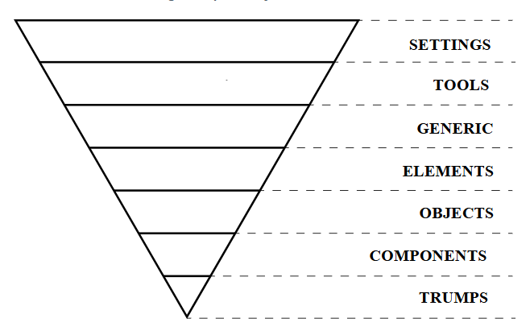
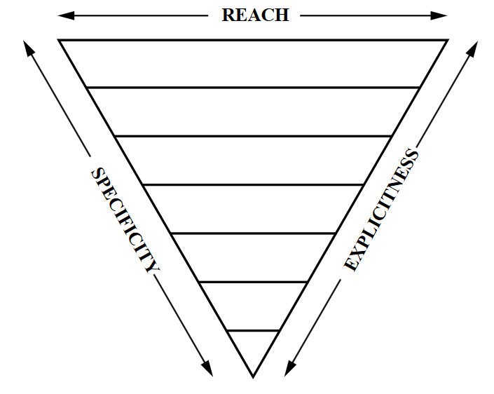

# ITCSS (Inverted Triangle CSS) 架構規範

通用樣式規則放在最前面，覆蓋規則放在最後，按照優先順序排列成一個倒三角形。
* 由上至下，七個層級:
    - `settings` > 配置顏色、字體、大小等各種參數的變數配置。
    - `tools` > 全球通用的 mixin 和函數。
    - `generic` > CSS 重設和規範化規則，為您的樣式奠定基礎。
    - `elements` >  原生 HTML 元素的樣式規則。
    - `objects` > 用於佈局或結構化元素的樣式規則。
    - `components`(元件) >  UI元件的樣式規則。
    - `trumps`(核心覆寫) > 輔助或實用規則，透過調整和覆寫現有規則來微調物件或元件。
    
* 三種特性的覆蓋範圍 (越上面影響越多):
    - Reach (影響範圍) : 影響多少html 元素越多越上層。
    - Specificity (權重) : 選擇器權重越低越上層。
        原生標籤 > class > id > !important
    - Explicitness (具體意圖) : 模糊、通用 (上層)，明確、專一 (下層)
    

## 載入順序

```scss
@use 'settings/settings';
@use 'generic/generic';
@use 'elements/elements';
@use 'objects/objects';
@use 'components/components';
@use 'pages/pages';
```

## 分層責任 (由上至下 ITCSS排列)

* settings (全站共用顏色、尺寸樣式表)
* generic (覆蓋預設樣式)
    - `reset.scss` <html>、<body>、、<button>、`*` 的覆蓋
* elements (html 原始標籤通用樣式)
* objects (「 共用 」佈局樣式) 
* components (`主站`共用元件)
    * /widgets 資料夾 (`全站`共用元件)
        - `footer.scss` 頁腳樣式，套用至buyer, booking。
        - `floating-action.scss` 套用至右下角的Line 客服、top up 按鈕。
        - `header.scss` 目前只套用buyer
    - `button.scss` 定義共用按鈕「 基本樣式 」。
    - `modal.scss` modal 對話窗內容樣式。
        - modal 背景遮罩、Title、Body、關閉按鈕等等。
    - `auth-modal.scss` 
        - 登入/註冊/喜好問卷樣式
    - `drawer.scss` (抽屜動畫)
        - modal 滑動動畫控制、控制顯示/隱藏、透明度控制
    - `offcanvas.scss` 補充導覽列連結樣式
    - `cart-drawer.scss` 
        - 購物車全部樣式 + 購物車滑動動畫
* pages (根據「 頁面 」特別設計的樣式)


## 新增樣式規則

- 新增頁面樣式時放在 `css/pages/_頁面.scss`，並從 `css/pages/_pages.scss` 以 `@use` 載入。
- 頁面樣式需盡量用頁面根 class 限定範圍，例如 `.homePage`、`.productsPage`、`.checkoutPage`。
- 原生元素的全站基底與互動狀態放在 `elements`，例如 `body`、`a`、`a:hover`、`a:focus-visible`。
- 可跨頁重用的 UI 才放進 `components`，避免讓 components 混入單一頁面規則。
- 新增色彩、間距、圓角、陰影時，優先使用 `--yui-*` token；需要新 token 時先補在 `settings`。
- 原生元素基礎樣式需放在 `css/elements/`。
- 大量重複佈局需放在 `css/objects/`。
- Components 層的共用元件應直接使用 `--yui-*` token，避免依賴其他 partial 先宣告的 Sass 變數。
- Components 層目前不保留 Sass `$...` alias；若需要新 token，先回到 `settings` 定義 runtime custom property。

## 樣式歸層判斷表

| 新增 selector 或規則 | 放置層級 | 判斷理由 |
| --- | --- | --- |
| `:root`、全站 `--yui-*` token | `settings` | 只提供設計設定或 runtime token，不直接描述元件外觀。 |
| `*`、`*::before`、reset、normalize | `generic` | 用來消除瀏覽器預設差異，權重應低於所有專案樣式。 |
| `body`、`a`、`button`、`img`、`a:hover` | `elements` | 直接套用原生 HTML 元素，沒有綁定 component class。 |
| `.container`、`.stack`、`.cluster`、`.grid` | `objects` | 只管理寬度、排列、節奏與結構，不放品牌顏色或元件狀態。 |
| `.btn`、`.modal`、`.drawer`、`.siteHeader`、`.siteFooter` | `components` | 可跨頁重用，具備明確 UI 語意與互動狀態。 |
| `.homePage`、`.productsPage`、`.checkoutPage` 底下的區塊 | `pages` | 只服務單一頁面流程或單一頁面的視覺組合。 |

## 尚未處理

- `booking/css/*.css` 與 `admin/css/admin.css` 仍是獨立 CSS 系統，後續可再拆成各自的 ITCSS entry。
- `css/pages/*.scss` 仍保留頁面局部 Sass alias，用來讓大型頁面 partial 維持可讀性；後續若要收斂，可逐頁改成直接使用 `--yui-*`。
