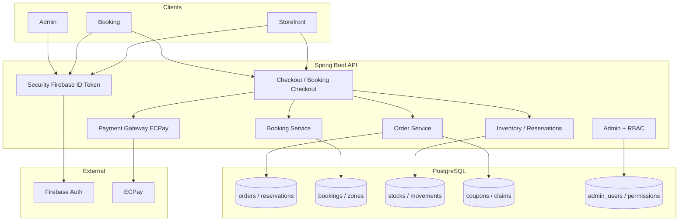

# Yuruicamp Java 後端架構建議書

| 欄位 | 內容 |
|------|------|
| **文件狀態** | Active（Schema + 線 A 骨架已落地；業務 API 進行中） |
| **版本** | 1.1 |
| **日期** | 2026-07-20 |
| **認證定案** | **全程 Firebase ID Token**（後端**不**簽發自家 JWT） |
| **鎖定技術** | Spring Boot 4.1.0、Java 25、PostgreSQL 16 |
| **關聯文件** | [`docs/latest_schema.sql`](../docs/latest_schema.sql)、[`docs/api/README.md`](../docs/api/README.md)（P0+P1 契約）、[`plans/backend-implementation-checklist.md`](./backend-implementation-checklist.md)、[`docs/database-schema-guide.md`](../docs/database-schema-guide.md)、[`plans/data-integration-spec.md`](./data-integration-spec.md)、[`plans/frontend-root-absolute-path-and-api-contract-spec.md`](./frontend-root-absolute-path-and-api-contract-spec.md)、[`docs/database-documents/`](../docs/database-documents/) |

> **本文件邊界**：只談分層、技術選型、資料流向、API 規範與 Design Pattern。**不含**可執行的實作程式碼。  
> **Schema 真相來源**：開發期維持整檔重建 `docs/latest_schema.sql`；之後再引入 Flyway。

---

## 0. 一句話結論

採用 **單一 Maven 模組 + 依業務領域分 package 的分層架構（Controller → Application Service → Domain → Repository）**，以 **Spring Boot 4.1.0 / JPA / Security** 為核心；認證走 **Firebase ID Token（Admin SDK 驗證；後端不簽 JWT）**；金流走 **綠界 ECPay（商城可 COD）**；庫存與營位在 **進結帳時** 以 **待付款訂單／預約 + 保留帳 + 交易內悲觀鎖** 嚴格防超賣，逾時 **15 分鐘** 釋放。

---

## 1. 已確認的產品與工程決策

| # | 決策 |
|---|------|
| 1 | MVP：商城、營區預約、租借（綁預約）、後台；文章／評價可延後；**三種優惠券皆做** |
| 2 | 規模：小型正式站（百～千級日活）；本機 Docker Postgres → 之後 GCP |
| 3 | 會員：Firebase OAuth（Google / Facebook / LINE）→ 前端帶 **Firebase ID Token**；後端只驗證、**不簽自家 JWT** |
| 4 | 後台：Firebase Google；`admin_users.firebase_uid`；email 白名單 + `active`；細 RBAC 用既有 permission 表（骨架後做） |
| 5 | 公開讀／登入寫／後台 RBAC；基本個資保護（軟刪、敏感欄位不進 log） |
| 6 | 金流：**全部由 ECPay**；商城保留 **COD（不走 ECPay，履約後標 paid）**；**預約必須線上付** |
| 7 | 購物車／預約背包 **不鎖庫存**；進結帳驗證並鎖定；N = **15 分鐘**（商城與預約相同） |
| 8 | 金額：**以後端重算為準**；前端 `number` 僅顯示 |
| 9 | 假日：`calendar_dates` 可後台設定；Mock 週五六僅參考 |
| 10 | 業務規則主要在 **Service**；DB 做約束／既有 Trigger |
| 11 | REST + JSON、對齊現有契約、部分 RPC、OpenAPI、統一錯誤、分頁 |
| 12 | 單一 Maven 模組、package 分領域；關鍵交易整合測試 + ADR + README |
| 13 | 進結帳策略：**D1.A** — 建立待付款草稿訂單／預約 + 保留帳 |

---

## 2. 建議技術棧與套件

### 2.1 核心（已在 `backend/pom.xml` 的基礎上補強）

| 類別 | 建議 | 理由 |
|------|------|------|
| Runtime | **Spring Boot 4.1.0** + **Java 25** | 專案已鎖定 |
| Web | `spring-boot-starter-webmvc` | REST API |
| ORM | **Spring Data JPA** + Hibernate | 團隊熟悉；`ddl-auto=validate` 對齊 database-first |
| DB Driver | PostgreSQL JDBC | 既有 Docker Postgres 16 |
| Validation | `spring-boot-starter-validation` | DTO 輸入驗證 |
| Security | `spring-boot-starter-security` + Bearer **Firebase ID Token** filter | 後台／會員依路徑解析 principal；不自簽 JWT |
| Firebase | **Firebase Admin SDK** | 只驗證 ID Token |
| API 文件 | **springdoc-openapi** 3.x（OpenAPI 3 + Swagger UI） | 前後端契約 |
| 對應／組裝 | **MapStruct** | Entity ↔ DTO |
| JSON | Jackson（Boot 內建） | 金額用字串／`BigDecimal` 序列化策略 |
| 排程 | **Spring `@Scheduled`**（MVP） | 逾時釋放保留帳／取消未付款預約 |
| 測試 | `spring-boot-starter-*-test` + Testcontainers（Postgres） | 下單／預約／庫存整合測試 |
| 觀測（可後補） | Micrometer + 結構化 log（JSON） | 上 GCP 後接 Cloud Logging |

### 2.2 刻意不在 MVP 引入的東西

| 項目 | 原因 |
|------|------|
| Flyway／Liquibase | 開發期整檔重建；上線穩定後再引入 |
| Redis | 百～千 DAU 單機 Postgres + 排程即可；之後再談快取／分散式鎖 |
| Kafka／訊息佇列 | 複雜度過高；ECPay webhook 以同步 + 冪等表處理 |
| 微服務拆分 | 單一模組 package 分界即可 |
| QueryDSL／MyBatis | 團隊熟 JPA；複雜報表可後補原生 SQL／View |
| 本機磁碟當正式圖床 | MVP 用 `/assets`；上 GCP 再接 Cloud Storage |

### 2.3 外部整合

| 整合 | 作法摘要 |
|------|----------|
| **Firebase Auth** | 前端登入 → 取得 Firebase ID Token → `POST /api/auth/firebase/session`（upsert／綁定）→ 後續請求 `Authorization: Bearer <Firebase ID Token>` |
| **綠界 ECPay** | 建立待付款單後取得付款 URL；**NotifyURL（Webhook）為付款真相**；ReturnURL 只負責導頁 |
| **GCP（後續）** | Cloud Run 或 GCE 跑 JVM；Cloud SQL Postgres；Artifact Registry；Secret Manager；靜態前端可放 Cloud Storage + CDN |

### 2.4 圖片／檔案（分階段）

| 階段 | 策略 |
|------|------|
| MVP | DB／API 只存 `/assets/...` 或完整 URL；不實作上傳 |
| 上 GCP 後 | `POST /api/admin/uploads` → **Cloud Storage**；回傳公開／簽名 URL |

---

## 3. 系統分層與目錄架構

### 3.1 分層職責（由外到內）

```text
HTTP Request
    ↓
Controller          參數綁定、權限註解、呼叫 Application Service、回傳統一 Envelope
    ↓
Application Service 用例編排、@Transactional、呼叫多個 Domain／Repository／外部 Gateway
    ↓
Domain Service      純業務規則（狀態機、金額重算、券資格、可用性規則）— 盡量無 Spring 依賴
    ↓
Repository (JPA)    持久化；必要時原生 SQL 呼叫 DB 函式（如 get_zone_availability）
    ↓
PostgreSQL          CHECK／FK／Trigger；不承擔完整業務狀態機
```

**原則（給新手）：**

- Controller **不寫**庫存鎖、金流、狀態轉換。
- Service **不直接**拼 HTML／不依賴前端 localStorage 語意。
- Repository **不判斷**「這張券能不能用」這類業務。
- DB Trigger 已有的（領券容量、禁止硬刪會員等）**尊重**，Service 不要重複打架。

### 3.2 建議 package 結構（單一 Maven 模組）

```text
com.yuruicamp.backend
├── BackendApplication.java
├── config/                 # Security、OpenAPI、Jackson、CORS、Scheduling
├── common/                 # 統一錯誤、分頁、Money、Idempotency、時區工具
│   ├── api/                # ApiResponse、ErrorCode、PageResponse
│   ├── exception/          # BusinessException、GlobalExceptionHandler
│   └── security/           # JwtService、FirebaseTokenVerifier、SecurityFilters
├── auth/                   # 會員／後台登入換 token
├── catalog/                # 商品、規格、品牌、分類（公開讀 + 後台寫）
├── cart/                   # （可選）伺服端購物車；MVP 可仍用前端 localStorage
├── checkout/               # 進結帳、待付款單、保留帳協調
├── order/                  # 訂單、履約狀態、COD、歷史
├── coupon/                 # 券主檔、領取、結帳消耗
├── booking/                # 營區、可用性、預約、租借加購
├── inventory/              # 庫位、異動、轉換、保留帳釋放排程
├── payment/                # ECPay Gateway、Webhook、冪等
├── customer/               # 會員、地址、軟刪／停權
├── admin/                  # 管理員、RBAC、後台專用 API
├── content/                # 文章等（可延後空 package）
├── review/                 # 評價（可延後）
└── calendar/               # calendar_dates 假日維護
```

每個領域內部建議固定子結構：

```text
{domain}/
├── api/                    # XxxController、Request/Response DTO
├── application/            # XxxApplicationService（用例）
├── domain/                 # 狀態機、規則、Domain Service
├── infrastructure/         # JpaRepository、Entity、ECPay/Firebase Adapter
└── package-info.java       # （可選）領域說明註解
```

### 3.3 Design Pattern 應用（精簡、可維護）

| Pattern | 用在哪 | 為什麼 |
|---------|--------|--------|
| **分層架構** | 全系統 | 新手好找程式、改一邊不易牽動全部 |
| **Application Service（用例）** | 下單、進結帳、預約、過帳 | 一個公開方法 = 一個業務故事 |
| **Repository** | 所有持久化 | 隔離 JPA 細節 |
| **Gateway / Adapter** | Firebase、ECPay | 外部系統可替換、可 Mock 測試 |
| **Strategy** | 付款方式（ECPay 子通道 vs COD） | 商城／預約共用介面、行為不同 |
| **State Machine（文件化 + Service 方法）** | `order_status`、`booking_status`、保留帳 status | 禁止任意 PATCH 狀態字串 |
| **Idempotency Key** | 建單、Webhook、保留帳 | 防重複提交與重複通知 |
| **DTO + Mapper** | API 邊界 | 不直接曝露 Entity／快照欄位混亂 |
| **Read Model 優先 View** | 列表／詳情 | 對齊 schema 既有 View（如 `sellable_product_variants`） |

**不建議 MVP 上 DDD 聚合根滿天飛或六邊形全套**——用「分層 + 領域 package」已足夠擴充。

---

## 4. 跨切關注點

### 4.1 認證與授權

```text
會員流程
  Firebase 登入
      → POST /api/auth/firebase/session  { idToken }
      → Firebase Admin（或 dev stub）驗證 ID Token
      → upsert customers（綁定 firebase_uid）
      → 回傳 profile（不發 JWT）
      → 前端後續：Authorization: Bearer <Firebase ID Token>

後台流程
  Google（Firebase）登入
      → POST /api/admin/auth/firebase/session  { idToken }
      → email 必須已存在於 admin_users（白名單）
      → 若 firebase_uid 為 NULL：首次綁定
      → 若 active=false：拒絕
      → 回傳 profile（不發 JWT）
      → 細 RBAC：每次請求從 DB 計算（骨架 A 僅白名單 + active）
```

**後台帳號生命週期（已定案）：**

| 狀態 | `active` | `firebase_uid` | 意義 |
|------|----------|----------------|------|
| 已建立、待首次登入 | `true` | `NULL` | 管理者用 email 建好；可登入綁定 |
| 已綁定使用中 | `true` | 有值 | 正常 |
| 停用 | `false` | 可保留 | **僅**表示停用，不表示「待綁定」 |

### 4.2 金額與時區

| 項目 | 規範 |
|------|------|
| DB | `numeric(12,2)` / `numeric(14,2)`；`timestamptz` |
| Java | **一律 `BigDecimal`**；禁止 `double` 做金額 |
| API JSON | 金額用**字串**（如 `"1234.50"`）；日期 `YYYY-MM-DD`；時間戳 ISO-8601 |
| 結帳 | **後端依 DB 單價重算**；忽略前端傳入的 total／discount（可當對照，不符則 409） |
| 日曆日 | 業務「哪一天」以 **`Asia/Taipei`**；假日讀 `calendar_dates` |
| 存儲 | UTC（timestamptz） |

### 4.3 個資與 Log

- 會員軟刪：走 DB 函式／狀態（`deleted` + `deleted_at`），禁止硬刪。
- Log **不輸出**：完整電話、地址、Firebase token、ECPay 金鑰、信用卡相關欄位。
- 管理操作寫入既有 `*_history` 表（actor_id）。

### 4.4 併發與鎖定（防超賣）

| 時機 | 行為 |
|------|------|
| 加購物車／預約背包 | **只讀**可用量；不寫保留帳 |
| 進結帳（Prepare） | 單一 `@Transactional`：`SELECT … FOR UPDATE` 庫存列 → 建待付款訂單／預約 + 明細 + 保留帳（`expires_at = now+15m`） |
| 付款成功／COD 履約 | 保留帳 `fulfilled`；狀態前進 |
| 逾時排程 | 每分鐘掃 `expires_at`；`expired`／預約 `cancelled` + 釋放 |

> **說明**：這是「保留帳 + 悲觀鎖」，不是 Entity `@Version` 樂觀鎖。樂觀鎖可另用於後台編輯商品主檔，但不是防超賣主力。

### 4.5 與 DB 函式／Trigger 的分工

| 放 DB | 放 Service |
|-------|------------|
| FK／CHECK、領券容量 Trigger、禁止硬刪會員、`get_zone_availability`、鎖位容量驗證 | 訂單／預約狀態機、ECPay、RBAC、金額重算、券資格、進結帳編排、庫存過帳不可變規則 |

---

## 5. 關鍵業務資料流

### 5.1 商城：進結帳 → 付款／COD

```text
[購物車 localStorage]
        │ 使用者按「前往結帳」
        ▼
POST /api/checkout/sessions（或 /api/orders/prepare）
  - 驗證登入
  - 依 variantId 讀 DB 價格與可售量（FOR UPDATE）
  - 驗券（三種）：birthday / firstPurchase / promotion
  - 建立 orders（payment_status=unpaid）+ order_items（快照）
  - 建立 product_stock_reservations（active, expires_at=+15m）
  - 回傳：orderId、金額明細（後端重算）、expiresAt、（若非 COD）ECPay 導向資訊
        │
        ├─ payment_method = COD
        │     → 不呼叫 ECPay；待出貨／完成履約後再標 paid
        │
        └─ 線上付（ECPay）
              → 導向綠界
              → NotifyURL：驗簽、冪等、paid、保留帳 fulfilled、寫 order_event_history
              → 逾時：排程 expired + 訂單 cancelled（規則另定）
```

**草稿訂單與 NOT NULL 快照（D1.A）：**

- 進結帳時若地址未填：允許以會員預設地址或明確佔位字串建立，並用 API 標示 `checkoutStep`。
- 使用者在結帳頁 PATCH 收件資料後，才允許「送出付款／確認 COD」。
- 金額欄位**永遠**以後端計算結果寫入，不信任前端 total。

### 5.2 預約＋租借（綁在一起）

```text
[預約背包 localStorage]
        │ 前往結帳
        ▼
POST /api/booking/checkout/sessions
  - 查 get_zone_availability / 對等查詢；FOR UPDATE 相關占用
  - 建 bookings(status=pending) + booking_selected_zones +（可選）booking_selected_rentals
  - 建 rental_stock_reservations（有租借時）
  - 營位占用：pending 計入 occupying_statuses
  - 必須線上付 → 只走 ECPay（無 COD）
  - expires +15m → 自動 cancelled + 釋放
  - 付款成功 → confirmed
```

### 5.3 優惠券（後端真相）

對齊 [`orders-and-coupons.md`](../docs/database-documents/orders-and-coupons/orders-and-coupons.md) 與 [`data-integration-spec.md`](./data-integration-spec.md)：

| category | 規則摘要 |
|----------|----------|
| `birthday` | 當月生日可領／可用 |
| `firstPurchase` | `first_purchase_used = false` |
| `promotion` | 活動碼；結帳輸入 |

結帳同一交易：`coupon_claims` → `consumed` + `order_coupons` 快照；取消訂單**不退回** claimed（依現有文件）。

### 5.4 後台庫存異動

- `draft` → `posted` / `cancelled`；**posted 後不可改**（Service 強制）。
- store → rental 轉換僅允許文件規定方向。
- 每次異動記錄 `employee_id`。

---

## 6. 前後端 API 互動規範

### 6.1 總則

| 項目 | 規範 |
|------|------|
| Base URL | `http://localhost:8080/api`（對齊 `AppConfig.API_BASE_URL`） |
| 格式 | JSON；`Content-Type: application/json` |
| 認證 | `Authorization: Bearer <Firebase ID Token>` |
| 文件 | `/swagger-ui` + `/v3/api-docs`（springdoc） |
| 冪等 | 建立 Checkout 必填 body `idempotencyKey`；以會員為範圍唯一並保存請求 SHA-256 指紋。Webhook 另依 Payment 契約處理。 |
| 命名 | URL 用 kebab-case 資源；JSON 欄位建議 **camelCase** 對齊前端；DB 維持 snake_case |

### 6.2 統一回應 Envelope

**成功：**

```json
{
  "success": true,
  "data": { },
  "meta": {
    "page": 0,
    "size": 20,
    "totalElements": 100,
    "totalPages": 5,
    "sort": "createdAt,desc"
  }
}
```

列表一定帶 `meta`；單筆可省略 `meta` 或為 `null`。

**失敗：**

```json
{
  "success": false,
  "error": {
    "code": "STOCK_INSUFFICIENT",
    "message": "部分商品庫存不足",
    "details": [
      { "field": "items[0].variantId", "reason": "available=2, requested=3" }
    ]
  }
}
```

| HTTP | 典型 code |
|------|-----------|
| 400 | `VALIDATION_ERROR` |
| 401 | `UNAUTHORIZED` |
| 403 | `FORBIDDEN` / `ADMIN_INACTIVE` |
| 404 | `NOT_FOUND` |
| 409 | `STOCK_INSUFFICIENT` / `COUPON_INVALID` / `CHECKOUT_EXPIRED` / `VERSION_CONFLICT` |
| 422 | `BUSINESS_RULE_VIOLATION` |
| 500 | `INTERNAL_ERROR`（不回堆疊給前端） |

### 6.3 分頁／排序／篩選

| 參數 | 說明 |
|------|------|
| `page` | 從 0 起算 |
| `size` | 預設 20；上限 100 |
| `sort` | `field,asc\|desc`；僅允許白名單欄位 |
| 篩選 | 各資源自訂 query（如 `status`、`region`） |

### 6.4 路徑對照（與現有前端對齊並補齊 checkout）

#### 公開／會員（對齊 `window.API`）

| 前端方法 | REST |
|----------|------|
| `API.products.getAll` | `GET /api/products` |
| `API.products.getById` | `GET /api/products/{id}` |
| `API.orders.getByCustomerId` | `GET /api/orders?customerId=me` 或 `/api/me/orders` |
| `API.orders.create` | **改為**走 checkout 流程（見下），避免直接信任前端金額 |
| `API.coupons.getAll` | `GET /api/coupons`（可領列表另開 `/api/me/coupons`） |
| `API.articles.*` | `GET /api/articles`（可延後） |
| `API.branches.getAll` | `GET /api/branches` |

#### Checkout（新增，對齊 D1.A）

| 用途 | REST |
|------|------|
| 進結帳鎖庫存 | `POST /api/checkout/sessions` |
| 更新收件／付款方式 | `PATCH /api/checkout/sessions/{orderId}` |
| 確認 COD | `POST /api/checkout/sessions/{orderId}/confirm-cod` |
| 取得／刷新 ECPay 表單 | `POST /api/checkout/sessions/{orderId}/ecpay` |
| 取消結帳（釋放） | `POST /api/checkout/sessions/{orderId}/cancel` |

#### 預約（對齊 `BookingAPI`；建議統一加 `/api` 前綴）

| 前端方法 | REST |
|----------|------|
| `getCampgrounds` | `GET /api/booking/campgrounds` |
| `getCampgroundById` | `GET /api/booking/campgrounds/{id}` |
| `getEquipment` | `GET /api/booking/equipment?campgroundId=` |
| `getAvailability` | `GET /api/booking/availability` 或 `POST /api/booking/check-availability`（RPC） |
| `createBooking` | **改為** `POST /api/booking/checkout/sessions` |
| `getBookings` | `GET /api/booking/bookings`（會員僅自己的） |
| `getPolicy` | `GET /api/booking/policy` |

> 前端目前部分路徑為 `/booking/...`（相對 `API_BASE_URL`）。接線時建議統一為 `/api/booking/...`，並同步改 `booking-api.js` 的 `restPath`。

#### 後台（對齊 `AdminAPI`，base `/api/admin`）

沿用既有方法路徑，例如：

- `GET/POST /api/admin/customers`、`PATCH /api/admin/customers/{id}`
- `GET /api/admin/orders`、`PATCH .../ship`、`.../complete`
- `GET/PATCH /api/admin/bookings`
- `GET/POST/PUT /api/admin/products`
- `GET/POST /api/admin/inventory-movements`
- `GET/POST/... /api/admin/coupons`
- `GET/POST/... /api/admin/campground-closures`
- 新增：`POST /api/admin/users`（用 email 建管理員）、權限 CRUD、`GET/PUT /api/admin/calendar-dates`

所有 `/api/admin/**` 需有效 Firebase ID Token + 白名單 admin（細 `section.view` / `section.edit` 於後續切片）。

#### 金流回呼

| 用途 | REST |
|------|------|
| ECPay Notify | `POST /api/payments/ecpay/notify`（**免**使用者 Token；驗綠界簽章） |
| ECPay Return | `GET/POST /api/payments/ecpay/return`（導回前端成功／失敗頁） |

### 6.5 前端切換真後端（既有機制）

1. `frontend/storefront/js/config.js`：`USE_MOCK_API = false`，`API_BASE_URL = 'http://localhost:8080/api'`
2. `AdminAPI.configure({ useBackend: true, baseUrl: 'http://localhost:8080/api/admin' })`
3. 結帳金額 UI 改綁後端回傳的 `data.pricing`
4. 所有寫入 API 帶 Firebase ID Token（`Authorization: Bearer`）

---

## 7. Schema 演進（開發期可整檔重建）

> **狀態（2026-07-20）**：Phase 1–4、6 已落地於 [`docs/latest_schema.sql`](../docs/latest_schema.sql)。  
> 追蹤清單：[`plans/backend-schema-change-checklist.md`](./backend-schema-change-checklist.md)。

| 變更 | 狀態 | 說明 |
|------|------|------|
| `customers.firebase_uid` | 已落地 | UNIQUE NULLS DISTINCT；綁定後由 Service 管 |
| `admin_users.firebase_uid` | 已落地 | UNIQUE NULLS DISTINCT；首次 Google 綁定 |
| `payment_method` ENUM | 已落地 | `ecpay-credit` / `ecpay-atm` / `ecpay-cvs` / `ecpay-other` / `cod` |
| `bookings` 付款欄位 | 已落地 | `payment_method`／`payment_status`／`paid_at`；禁止 COD |
| `orders`／`bookings.checkout_expires_at` | 已落地 | 待付款逾時（約 15 分鐘） |
| `payment_notifications` | 已落地 | ECPay webhook 冪等 |

**不在 MVP 必做**：獨立 `checkout_sessions` 表（已選 D1.A，用待付款 `orders`／`bookings` 承擔）。

---

## 8. 模組開發優先順序（建議）

```text
P0  基礎：config、common、Security、Firebase ID Token、OpenAPI、錯誤格式（線 A 已落地）
P0  catalog 公開讀 + customer session upsert（session 已有；B-1／B-2 + [`docs/api/product-api-contract.md`](../docs/api/product-api-contract.md)）

P0  checkout + order + inventory reservation + 逾時排程
P0  payment（ECPay）+ COD 路徑
P1  booking checkout（營位 + 租借）+ availability
P1  coupon 三種規則
P1  admin auth + RBAC + 訂單／預約／商品／庫存異動
P2  calendar_dates 維護 API
P2  文章／評價
P3  GCP 部署、Cloud Storage 上傳、Cloud SQL
```

---

## 9. 測試與文件交付（DoD 工程面）

| 交付物 | 內容 |
|--------|------|
| 整合測試 | 至少：進結帳鎖庫存、超賣衝突、15 分逾期釋放、券消耗、ECPay webhook 冪等、預約占用與取消 |
| OpenAPI | CI 或 README 連到 Swagger UI |
| ADR（建議檔名） | `docs/adr/0001-layered-monolith.md`、`0002-firebase-own-jwt.md`、`0003-checkout-hold-15m.md`、`0004-ecpay-cod.md` |
| README | 後端啟動、`.env`、對接前端開關、ECPay／Firebase 沙箱變數（不含密鑰進 Git） |

---

## 10. ADR 摘要（決策紀錄精簡版）

### ADR-001：單一 Maven 模組 + 領域 package

- **決定**：不拆多模組／微服務。  
- **原因**：團隊規模、MVP 速度、交易跨商城／預約／庫存需要同進程 `@Transactional`。

### ADR-002：全程 Firebase ID Token（不自簽 JWT）— 2026-07-20 修訂

- **決定**：模式 B — 前端只帶 Firebase ID Token；後端用 Admin SDK 驗證；**不**簽發自家 JWT。  
- **原因**：Firebase 已負責發／刷新 Token；減少自管簽章與 TTL；RBAC／白名單改由每次請求查 DB。  
- **取代**：原「Firebase → 自家 JWT」方案作廢。

### ADR-003：進結帳才保留（D1.A）+ 15 分鐘

- **決定**：購物車不鎖；Prepare 建待付款單 + 保留帳。  
- **原因**：避免加車占庫；schema 保留帳需綁 `order_items`／預約明細。

### ADR-004：ECPay 為線上付唯一通道；COD 僅商城

- **決定**：預約強制 ECPay；COD 建立 unpaid、履約後 paid。  
- **原因**：產品規則；schema ENUM 需同步調整。

### ADR-005：金額以後端為準

- **決定**：`BigDecimal` + API 字串；前端 number 僅顯示。  
- **原因**：浮點與竄改風險。

### ADR-006：Database-first，開發期整檔重建

- **決定**：Hibernate `validate`；稍後再 Flyway。  
- **原因**：與現有 Docker／文件流程一致。

---

## 11. 上 GCP 時再討論的清單（D8）

目前不必定案，建議之後單獨開一輪：

1. **運算**：Cloud Run（容器）vs GCE  
2. **資料庫**：Cloud SQL for PostgreSQL（連線、私有 IP、備份）  
3. **密鑰**：Secret Manager（Firebase、ECPay、DB）  
4. **前端託管**：Firebase Hosting / Cloud Storage + Cloud CDN  
5. **網域**：`www` + `api` 子網域 → CORS（Bearer Firebase Token 在 header）  
 
6. **圖檔**：Cloud Storage bucket + IAM  
7. **觀測**：Cloud Logging / Error Reporting / Uptime  

---

## 12. 仍可之後細化、但不阻擋開工的項目

以下**不需再阻塞**架構開工；實作前用 checklist 即可：

| 項目 | 預設假設 |
|------|----------|
| 草稿訂單佔位字串格式 | Service 常數；結帳完成前禁止出貨 |
| ECPay 子通道與 ENUM 精確值列表 | 實作 ECPay 時對照綠界文件一次定稿並改 schema |
| 逾期後訂單狀態 | `cancelled` + `payment_status=unpaid` + 保留帳 `expired` |
| Firebase Token TTL／Refresh | 由 Firebase 客戶端 SDK 管理 |
| 購物車是否上雲端 | MVP 維持前端 localStorage |

若你希望下一輪只釐清「ENUM 精確字串」或「GCP 部署草圖」，可以指定主題再討論。

---

## 13. Definition of Done（本節點）

| 條件 | 狀態 |
|------|------|
| 透過提問釐清核心需求 | ✅ 已完成（兩輪 + D1–D8） |
| 技術棧與套件及理由 | ✅ 本文件 §2 |
| 目錄架構與模組分層 | ✅ 本文件 §3 |
| 前後端 API 標準化規範 | ✅ 本文件 §6 |
| 不含實作程式碼 | ✅ |

---

## 附錄 A — 資料流總覽（Mermaid）



---

## 附錄 B — 給新手的閱讀順序

1. 本文件 §0–§3（架構長相）  
2. [`docs/database-schema-guide.md`](../docs/database-schema-guide.md)  
3. [`docs/database-documents/orders-and-coupons/orders-and-coupons.md`](../docs/database-documents/orders-and-coupons/orders-and-coupons.md)  
4. [`docs/database-documents/inventory/stock-reservations.md`](../docs/database-documents/inventory/stock-reservations.md)  
5. [`docs/database-documents/bookings/bookings.md`](../docs/database-documents/bookings/bookings.md)  
6. [`frontend/admin/js/admin-api.js`](../frontend/admin/js/admin-api.js)（後台路徑契約）  
7. 再開始寫 P0 程式
